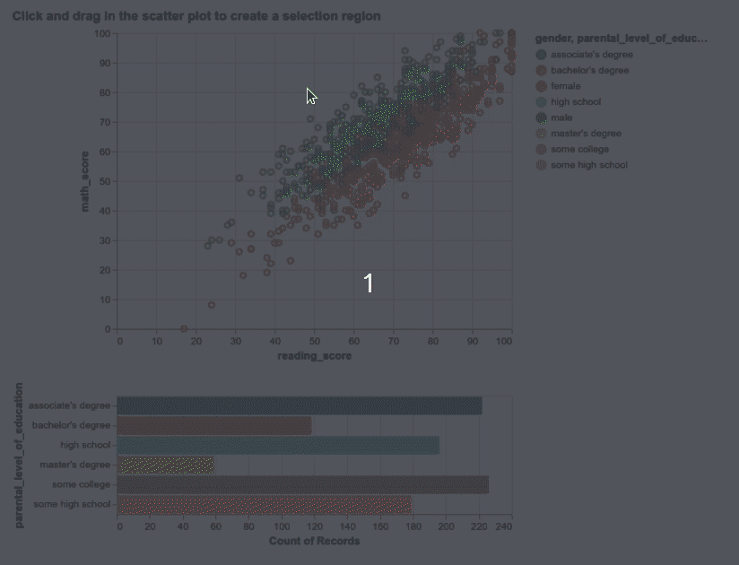
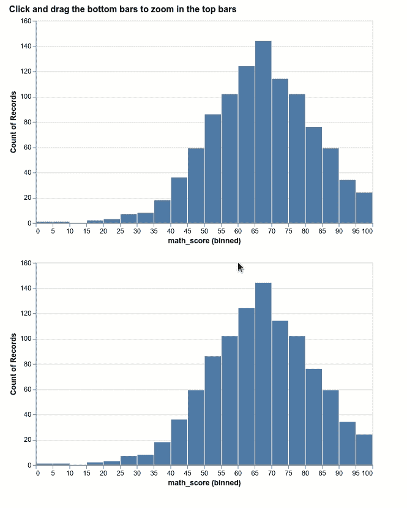
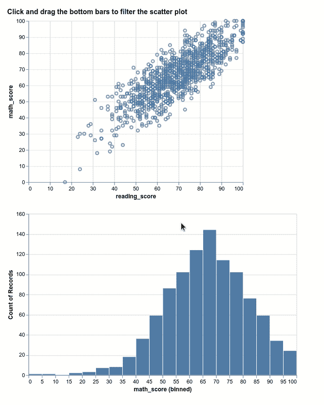
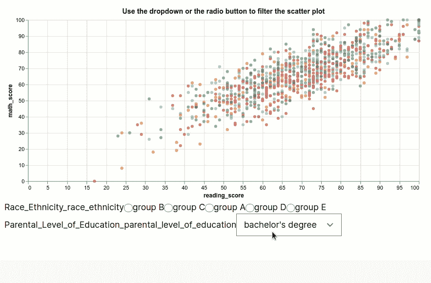

# 如何使用 Altair 创建多个图之间的绑定和条件

> 原文：<https://towardsdatascience.com/how-to-create-bindings-and-conditions-between-multiple-plots-using-altair-4e4fe907de37?source=collection_archive---------16----------------------->

## 使用绘图绑定从不同角度理解数据

# 动机

你有没有像下面这样和另一个剧情互动的时候，希望看到一个剧情发生变化？这就是牛郎星派上用场的时候。



作者 GIF

上图是用 Altair 创建的。如果你不了解 Altair， [Altair](https://altair-viz.github.io/) 是一个基于 Vega 和 Vega-Lite 的 Python 统计可视化库。在我的上一篇文章中，我展示了 Altair [如何允许您使用简洁的可视化语法来快速构建统计图形](/how-to-create-interactive-and-elegant-plot-with-altair-8dd87a890f2a)。

在本文中，我将展示如何使用 Altair 在多个图之间创建绑定和条件。

# 开始

要安装 Altair，请键入:

```
pip install altair
```

我们将使用 Altair 来研究从 Kaggle 上发布的学生考试成绩数据下载的 CSV 文件。

酷！现在我们有了数据，让我们用 Altair 可视化它。

# 使用间隔选择来过滤条形图

## 创建间隔选择

我们将创建一个使用区间选择来过滤条形图内容的图表。首先创建一个散点图，它允许我们通过单击和拖动来选择特定的时间间隔。

尝试单击并拖动上面的图表。您应该只看到所选区域内的点的颜色被突出显示！

产生上面输出的代码:

解释:

*   `brush = alt.selection(type="interval")`:创建区间选择对象
*   `encode`:指定 x 轴和 y 轴显示的列
*   `color=alt.condition(brush, “gender:N”, alt.value(“lightgray”)`:如果点在选择的区间内，用`gender`给这些点着色，否则用`lightgray`给这些点着色。
*   `tooltip`:悬停在某点上时显示的信息
*   `add_selection(brush)`:将区间选择应用于图表
*   `Q`指定定量(数值数据)，`N`指定名义(分类数据)

如果你想了解更多关于 Altair 的基本语法，请参考本文。

## 使条形图响应间隔选择

现在我们已经创建了区间选择，让我们将它连接到另一个条形图。

尝试单击并拖动散点图。当选择不同的间隔时，您应该会看到条形图的分布发生变化！

产生上面这个情节的代码:

解释:

*   `x="count(parental_level_of_education):Q"`:对`parental_level_of_education`栏中每个值的计数。
*   `color=alt.Color(“parental_level_of_education:N”)`:根据`parental_level_of_education`给条形应用颜色
*   `transform_filter(brush)`:根据选择的间隔过滤数据

# 我还可以用牛郎星做什么？

使用 Altair 的绑定功能，您可以做许多很酷的事情来使您的情节更加清晰，例如:

## 放大直方图

有时，您可能希望放大直方图，以获得直方图的更细粒度视图。这可以用 Altair 来完成。



作者 GIF

你可以在这里自己摆弄图表:

创建上述地块的代码:

## 仅显示直方图中突出显示的点

您可能还希望通过查看哪些点落在直方图的选定区间来理解直方图。牛郎星也可以做到这一点:



作者 GIF

你可以在这里自己摆弄图表:

创建上述地块的代码:

## 基于下拉栏和单选按钮过滤数据点

您也可以使用 Altair 将多个过滤器应用到您的数据点，如下所示:



作者 GIF

你可以在这里玩剧情:

上图的代码:

希望上面的代码没有吓到你！上面的许多代码行显示了我们在第一部分已经学到的内容。一些之前没有提到的新牛郎星天体:

*   `alt.selection_single`:允许用户一次只选择一个选项
*   `alt.binding_select`:创建下拉栏
*   `alt.binding_radio`:创建一个单选按钮

# 结论

恭喜你！您刚刚学习了如何使用 Altair 绑定多个情节！能够在多个图之间建立联系将使您的数据分析更加清晰。另外，你也可以用这些情节打动你的观众！

随意发挥，并在这里叉这篇文章的源代码:

<https://github.com/khuyentran1401/Data-science/blob/master/visualization/altair/altair_advanced.ipynb>  

我喜欢写一些基本的数据科学概念，并尝试不同的算法和数据科学工具。你可以在 LinkedIn 和 Twitter 上与我联系。

如果你想查看我写的所有文章的代码，请点击这里。在 Medium 上关注我，了解我的最新数据科学文章，例如:

</i-scraped-more-than-1k-top-machine-learning-github-profiles-and-this-is-what-i-found-1ab4fb0c0474>  </top-6-python-libraries-for-visualization-which-one-to-use-fe43381cd658>  </introduction-to-yellowbrick-a-python-library-to-explain-the-prediction-of-your-machine-learning-d63ecee10ecc>  </how-to-create-mathematical-animations-like-3blue1brown-using-python-f571fb9da3d1> 