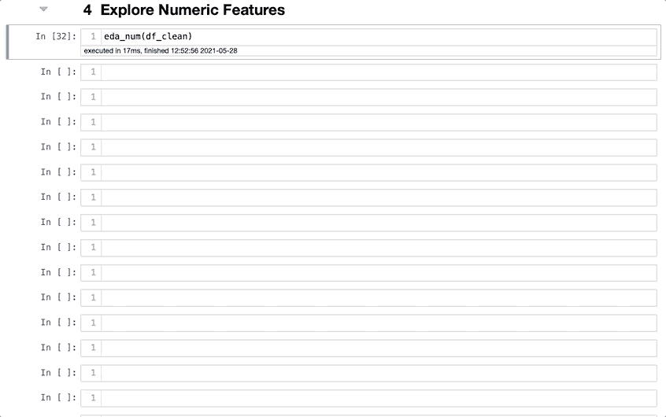
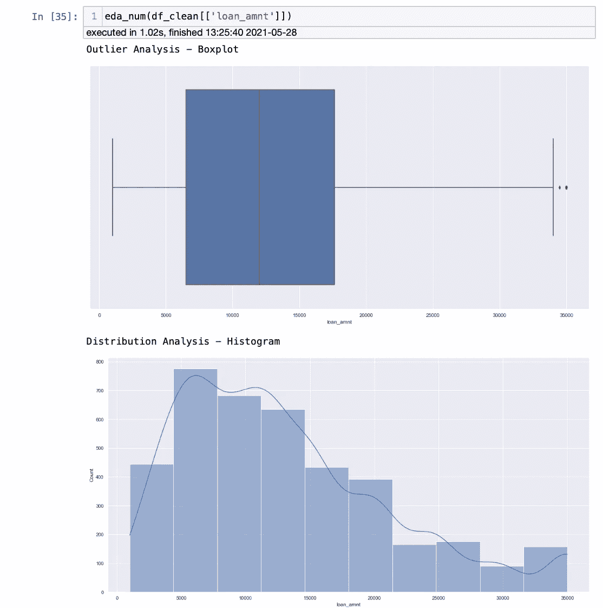
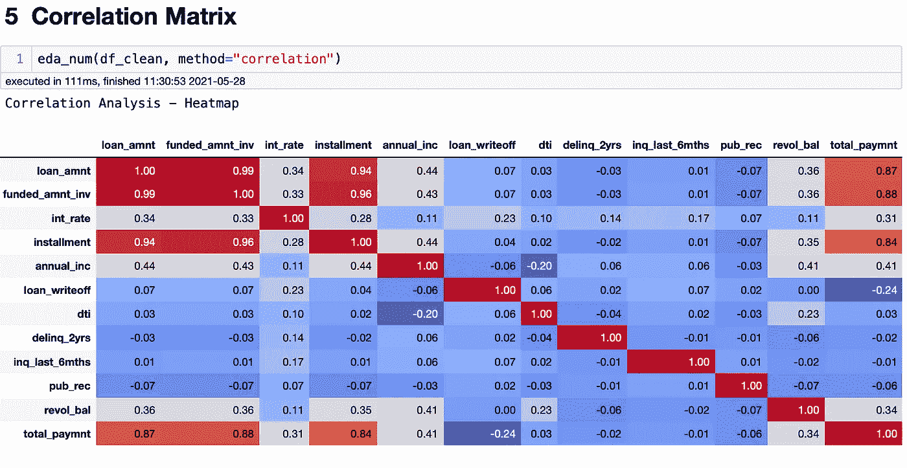
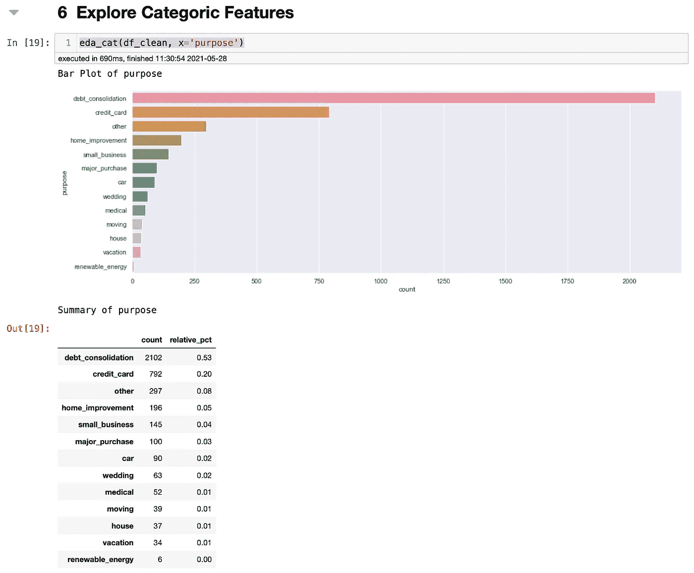
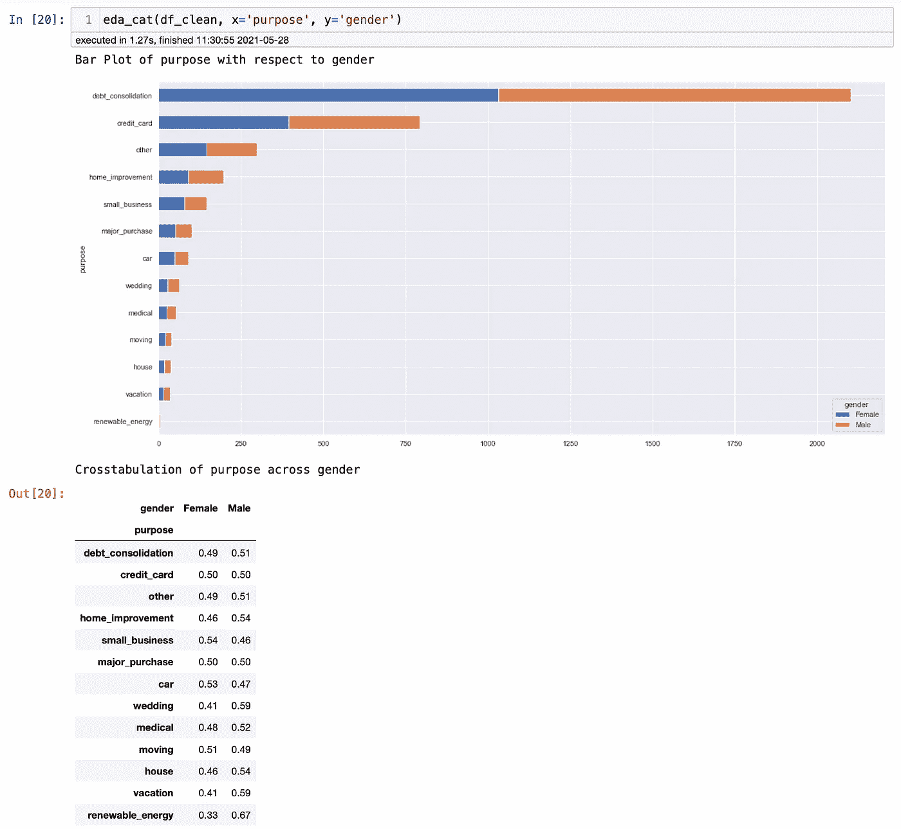
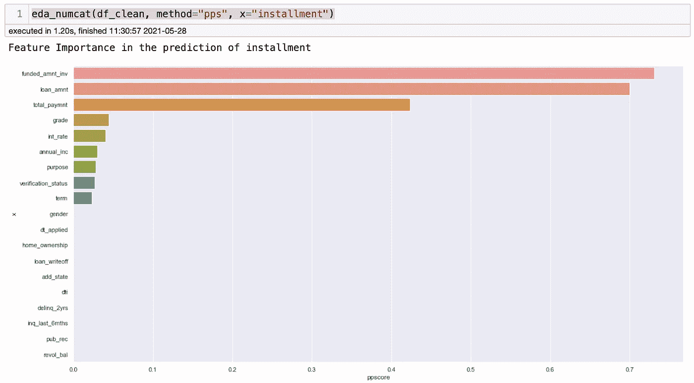
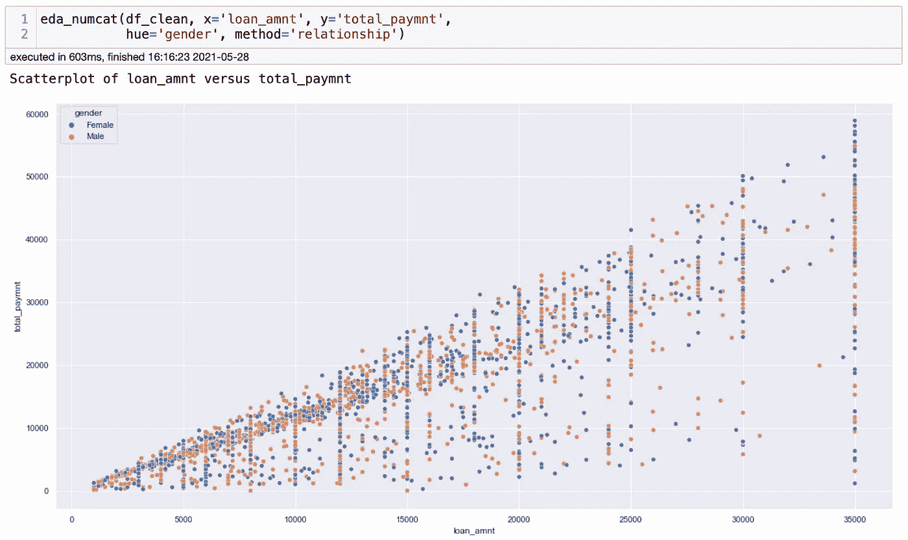
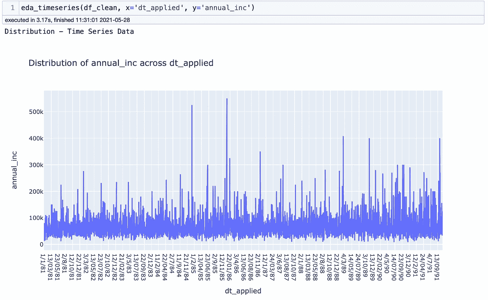
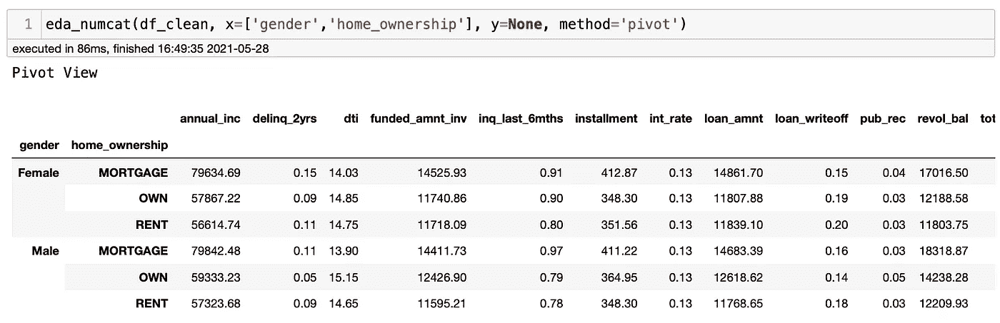

# 如何用一行代码在 Python 中创建数据可视化

> 原文：<https://towardsdatascience.com/how-to-create-data-visualizations-in-python-with-one-line-of-code-8cda1044fe69?source=collection_archive---------8----------------------->

## 大蟒

## 了解如何使用 QuickDA 通过一行代码创建数据可视化


照片由[安德烈斯·艾尔顿](https://www.pexels.com/@andres-ayrton?utm_content=attributionCopyText&utm_medium=referral&utm_source=pexels)从[佩克斯](https://www.pexels.com/photo/contemporary-black-man-in-casual-outfit-with-laptop-6578438/?utm_content=attributionCopyText&utm_medium=referral&utm_source=pexels)拍摄

大家都听说过一句话*一张* *图片胜过千言万语。这句话之所以如此广为人知，是因为它是真的。有些东西只有我们的眼睛才能捕捉到。这就是为什么数据可视化对于任何项目或报告都是必不可少的一步。一个不熟悉数据集的人可以很容易地让我们了解它。但是，创建数据可视化可能很耗时，有时，您可能想快速浏览一下数据集。幸运的是，我们有 QuickDA，一个可以解决这个问题的库。*

我曾经写过如何使用 QuickDA 高效地执行探索性数据分析，结果非常好。请查看博客[节省时间使用这个库](/save-hours-of-work-doing-a-complete-eda-with-a-few-lines-of-code-45de2e60f257)的几行代码完成一个完整的 EDA，以获得更多关于使用它进行 EDA 的信息。你不会失望的。现在让我们看看如何使用 QuickDA 来创建第一个可视化。

# 装置

要安装 QuickDA，请转到您的终端并粘贴`pip install quickda`。就这么简单。您现在可以使用它了。你可以在我的 [GitHub](https://github.com/ismael-araujo/Testing-Libraries/tree/main/QuickEDA) 上找到我用于 QuickDA 的笔记本。

现在让我们导入我们需要的所有东西。

```
**# Importing libraries**
from quickda.explore_data import *
from quickda.clean_data import *
from quickda.explore_numeric import *
from quickda.explore_categoric import *
from quickda.explore_numeric_categoric import *
from quickda.explore_time_series import *
```

# 为数字特征创建可视化效果

正如我在标题中提到的，您可以用一行代码创建可视化，我将向您证明这一点。有几种方法可以做到这一点，我们将逐一检查。第一个是为数字数据创建多种可视化。代码如下:

```
eda_num(**data**)
```



作者图片

瞧。如你所见，用一行代码，我创建了多个数据可视化。QuickDA 为每个要素创建箱线图和直方图。这再容易不过了。缺点是有时我们不知道为每个特性开发什么样的可视化。通常，只有一两个数据可视化可以完成这项工作。幸运的是，QuickDA 能够使用以下代码为选定的数据创建可视化效果:

```
eda_num(**data**[['**column_1**', '**columns_2**', '**column_n**']])
```



作者图片

因为 QuickDA 不能解释熊猫系列，所以使用双括号是很重要的。

**相关矩阵**

需要相关矩阵？没问题。您可以输入以下代码并检查要素的相关性。

```
eda_num(**data**, method="**correlation**")
```



作者图片

我不喜欢 QuickDA 的相关矩阵的风格，但它确实有用。我们可以很容易地看到哪些特征是高度相关的红色。轻松微风！

# 为分类要素创建可视化效果

现在，让我们看看如何为分类特征创建一些可视化效果。对于这一个，你需要选择你想要研究的特征。

```
eda_cat(**data**, x='**column_name**')
```



作者图片

我们可以看到，QuickDA 为 purpose 特性创建了一个漂亮的可视化效果，显示了每个值的计数和一个带有数字描述的表格。很酷，对吧？现在，假设您想要查看每个性别的数据分布情况。你也可以这样做，只需增加一个 y 值。

```
eda_cat(**data**, x='**column_name**', y='**column_name**')
```



作者图片

# 特征重要性

QuickDA 可以做的另一件很酷的事情是，我们可以快速获得特征的重要性，以及这些特征如何预测特定的目标。这对机器学习来说很方便，它会帮助你消除不相关的特征。

```
eda_numcat(**data**, method='pps', x='**target_feature**')
```



作者图片

# 相互关系

QuickDA 可以轻松地创建关联可视化。通常，使用 Matplotlib 可以很容易地创建关联可视化，但是如果有其他的方法也很好。

```
eda_numcat(**data**, x='**x_value**', y='**y_value**', 
 hue='**color_setup**', method='**relationship**')
```



作者图片

# **时间序列**

时间序列可视化也可以很容易地完成。有趣的是，QuickDA 使用不同的可视化库，如 Matplotlib、Seaborn 和 Plotly Express。例如，对于时间序列，使用 Plotly Express。我不确定原因，但我相信他们会根据自己的目标选择最好看的可视化效果。



作者图片

# **数据透视表**

最后但并非最不重要的是，QuickDA 有一个很酷的特性，它不完全是数据可视化，但它非常酷。这使得轻松创建数据透视表成为可能。如果您一直在工作或学习数据分析，您已经知道数据透视表的重要性。现在，你可以有一个在你的管道。

```
eda_numcat(**data**, x=['**column_1**, **column_2**'], y=**None**, method=**'pivot'**)
```



作者图片

# **结论**

QuickDA 太酷了，我不得不写了两篇博客来介绍我们可以用它做的一些很酷的事情。我们可以做的还有很多，我强烈建议您用您的数据集来尝试一下，我相信您会看到 QuickDA 有多么强大。你可以在这个博客和这个笔记本中找到更多的代码。

享受它，让我知道你在使用 QuickDA 时还发现了什么。编码快乐！