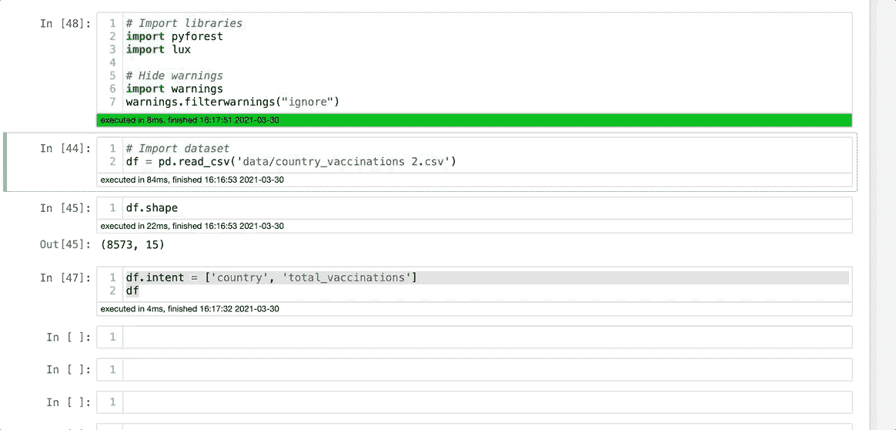
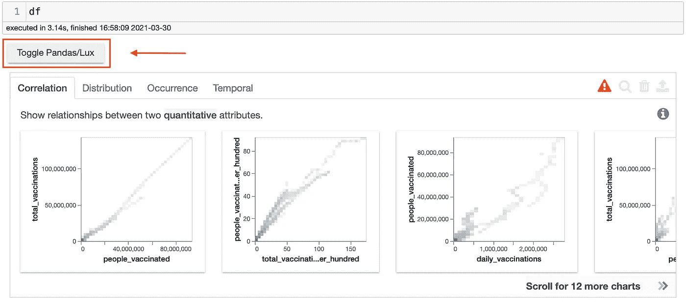
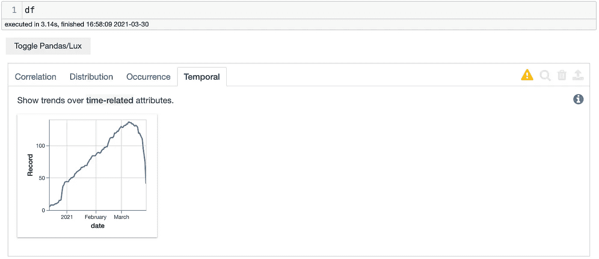
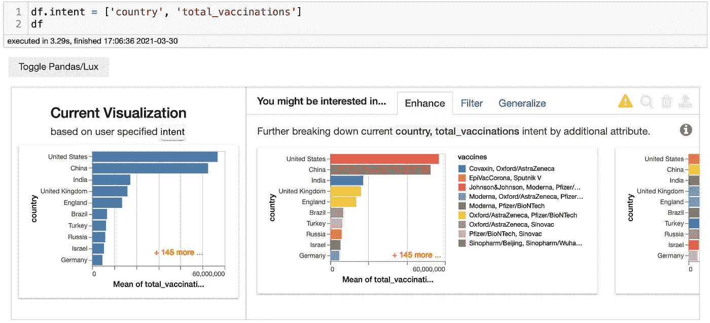
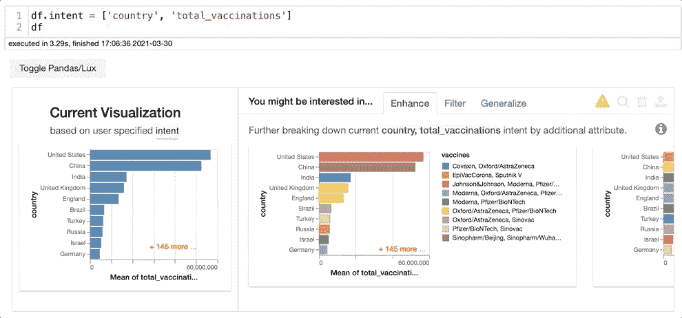
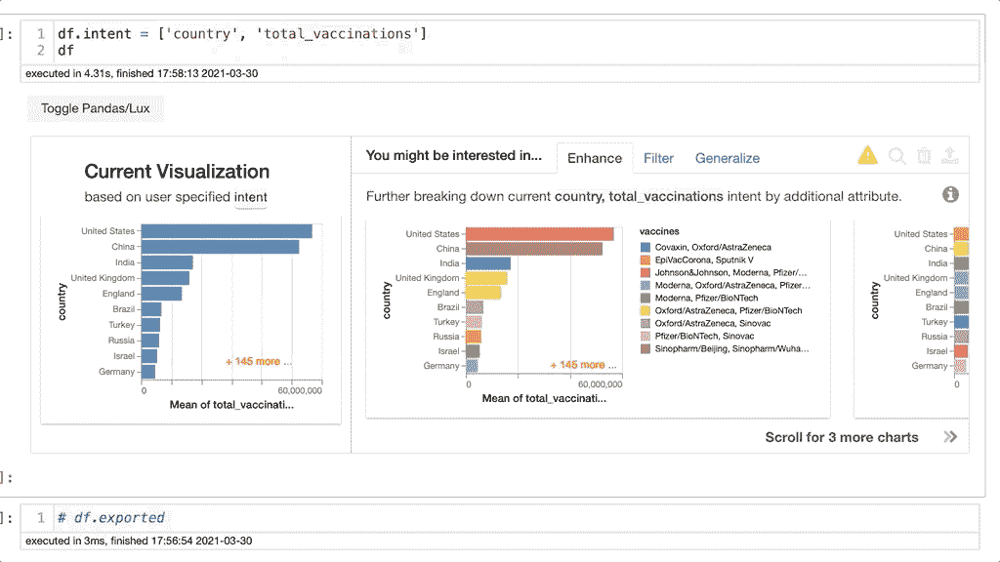
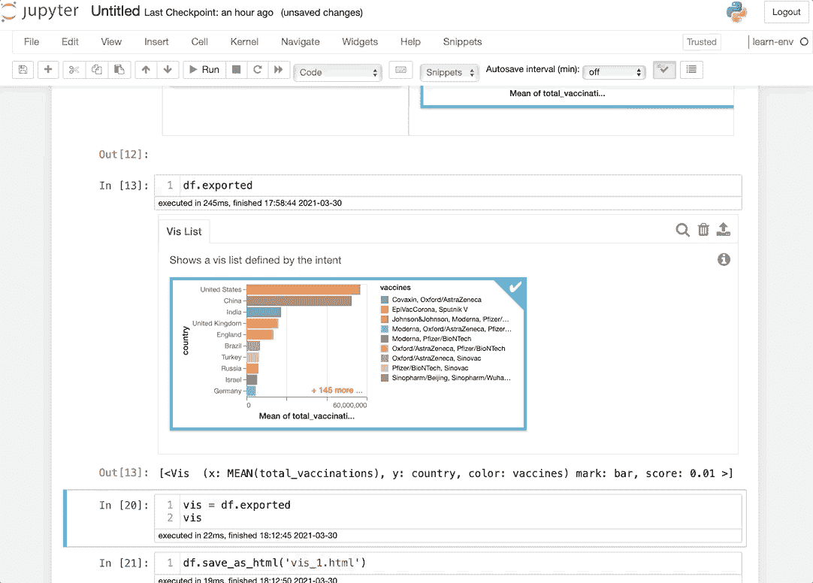
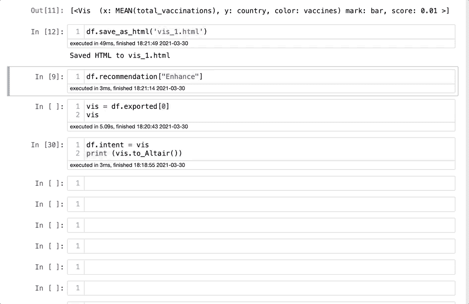
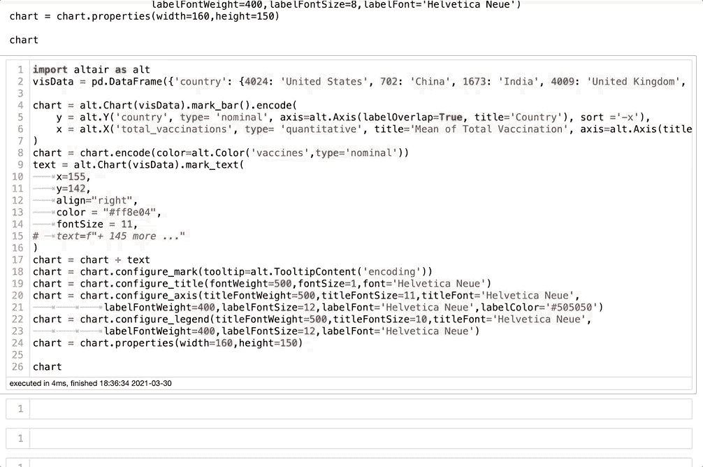
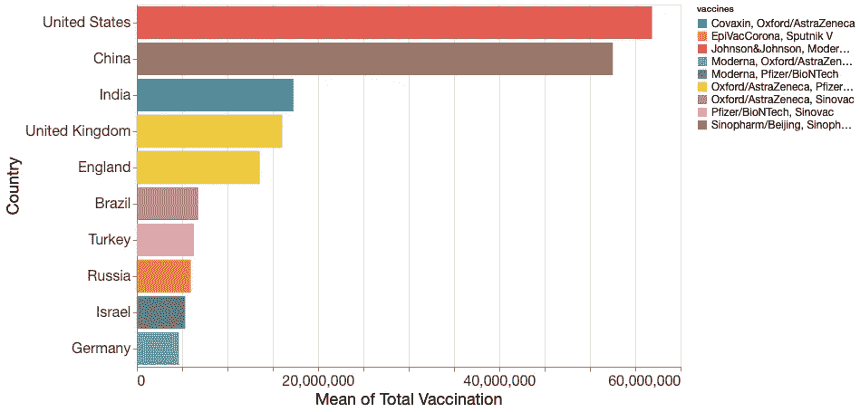

# 如何用 Python 一键创建数据可视化

> 原文：<https://towardsdatascience.com/how-to-create-data-visualizations-on-python-with-one-click-f6bafbd8de54?source=collection_archive---------7----------------------->

## 大蟒

## 了解在您的下一个数据科学项目中应该如何以及为什么使用 Lux 库


图片由戴安娜·马頔拍摄。来源: [Unsplash](https://unsplash.com/photos/Ic7SSSdK-io)

你刚刚开始你的新数据科学项目。您快速浏览了数据集，现在是进行一些探索性数据分析的时候了。你需要创造一些形象化的东西，并弄清楚你想要发现什么。您可能开始使用 Matplotlib 和 Seaborn 编写代码，这两个库很棒，但是非常耗时。如果我告诉你，你可以跳过这些步骤，用一行代码创建可视化效果，那会怎么样？这就是莱克丝的目标。

你不相信吗？让我给你演示一下，然后我们可以深入了解一下。在这里，我将为全球[疫苗接种进度数据集](https://www.kaggle.com/gpreda/covid-world-vaccination-progress)创建可视化效果:



深信不疑？那就说说吧。Lux 是一个出色的 Python API，它通过自动化数据可视化来简化数据科学项目。对于那些你不知道你在找什么的项目来说，这是很方便的。即使你知道自己在寻找什么，Lux 也可以帮助你深入了解自己的特征，这样你就可以专注于用大脑解决更复杂的问题。到本文结束时，您将能够在您的下一个项目中使用 Lux。我在 GitHub 上创建了一个[库，其中的代码用于演示目的。你可以在这里找到它](https://github.com/ismael-araujo/Testing-Libraries):

**安装**

安装 Lux 和使用它一样简单。只需在您的终端上输入 pip install lux-api，您就可以开始工作了。现在，您需要激活 Jupyter 笔记本的扩展。您可以在 Jupyter 笔记本上键入以下内容:

```
!jupyter nbextension install — py luxwidget
!jupyter nbextension enable — py luxwidget
```

你已经准备好了。现在，让我们学习如何使用它。首先，我们把`pandas`和`lux`导入笔记本，停用那些烦人的警告。

```
# Import libraries
import pandas as pd
import lux# Hide warnings
import warnings
warnings.filterwarnings(“ignore”)
```

**使用 Lux 创建可视化效果**

现在，让我们导入数据集。你可以在 Kaggle 上或者我在 GitHub 上的存储库中找到数据集。

```
# Import dataset
df = pd.read_csv('data/country_vaccinations 2.csv')
```

从现在开始，如果你输入`df`，你会在单元格下看到一个新按钮。你可以点击它，开始看到你的第一个数据可视化:



作者图片

相当容易。你可以在这里看到一些图像。根据您的数据集，它们被组织在一些类别中。在这种情况下，我们可以看到相关、分布、发生和时间。下面，你可以看到我点击了时态数据，我们可以看到一个时间序列可视化。



您也可以使用`df.intent = ['column_1', 'column_2']`来比较特征。这是莱克丝开始展示其潜力的地方。让我们更深入地探讨一下这个选项:



作者图片

在这种情况下，我将比较列`country`和`total_vaccinations`。Lux 编辑列并根据我们拥有的数据集创建新的特征。例如，我们可以在下面看到 Lux 创建了一个显示一周中每天疫苗接种量的可视化。



作者图片

太棒了，你刚刚发现了一个你有兴趣探索更多的可视化。您可以单击图像，并将图像导出到名为 exported 的变量中。你可以在下面看到一个例子。您可以看到 Lux 包含了用于 X 和 Y 变量的内容。



您可以将可视化保存到另一个变量中，并在需要时随时访问它。Lux 的另一个非常酷的事情是，你可以将文件导出为 HTML 文件，并与其他人共享，而不必共享数据集或 Jupyter 笔记本。多酷啊。



还可以使用`df.recommendation['Enhance']`来了解 Lux 对每个变量使用了哪些变量。您可以使用`Matplotlib`和`Seaborn`创建可视化效果。另一件很酷的事情是，你可以像处理 Python 列表一样，将可视化分割开来，专注于你最喜欢的可视化。



这一切都很好，但是如果您想为演示文稿或报告编辑其中一个可视化效果，该怎么办呢？那也很容易。我们需要将可视化变量添加到`df.intent`并键入`print(vis.to_Altair())`，并将代码复制并粘贴到另一个单元格中。现在，您可以进行自己的编辑。记住 Lux 使用的是`Altair`库。一旦你有了代码，这是非常简单的。我学会了如何使用`Shift + Tab`进行一些基本的编辑，找到可以编辑字段的地方。然后，您可以导出 JPG PNG 格式的可视化内容，甚至可以查看 JSON 代码。



这是最终的结果:



**结论**

Lux 是一个易于使用的 API，可以在项目开始时为您节省一些时间。它可以让您深入了解数据集，并决定您应该对您的项目做出什么决定。Matplotlib 和 Seaborn 仍然是可靠的工具，我不认为 Lux 能够很快取代它们。但是，您可以将 Lux 添加到您的 EDA 流程中，并确保您考虑了数据集的每个关键方面。你也可以查看他们的文档[这里](https://lux-api.readthedocs.io/en/latest/index.html)了解更多信息。

感谢您的阅读，如果您有任何问题，请告诉我。