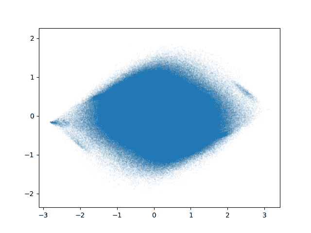
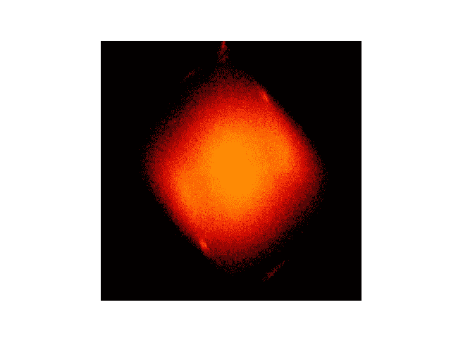

# 如何在 python 中使用大量数据创建快速准确的散点图

> 原文：<https://towardsdatascience.com/how-to-create-fast-and-accurate-scatter-plots-with-lots-of-data-in-python-a1d3f578e551?source=collection_archive---------4----------------------->

## [提示和技巧](https://towardsdatascience.com/tagged/tips-and-tricks)

## 无需反复试验，在数毫秒内创建包含数亿个样本的散点图。

散点图是非常基本且容易创建的——至少我是这样认为的。最近，我不得不可视化一个有数亿个数据点的数据集。如果你是 Python 开发者，你会立即导入`matplotlib`并开始。但事实证明，有更好、更快、更直观的方法来创建散点图。

`matplotlib`有什么问题？嗯，`matplotlib`是一个很棒的 Python 库，绝对是数据科学必读的一部分。但是`matplotlib`也是一个巨大的多面手，在某些情况下可能表现欠佳。这是其中之一。

假设我们有一个数组`X`，它的形状是`(1_000_000, 2)`。每列代表一个轴。所以，任何一行都是坐标。

```
import matplotlib.pylot as pltplt.scatter(X[:, 0], X[:, 1])
plt.show()
```


用 matplotlib 创建的散点图。运行时间含保存:6.4s. *图片作者*。

这就产生了一个散点图，但我们不知道点是否重叠，也不知道一个区域的强度。我们可以通过设置`s`和`alpha`参数来解决这个问题。第一个参数控制每个点的大小，后者赋予它不透明度。我们想要大小和不透明度，让我们能够区分不同的点。这就是试错的开始。随着数据量的增加，这个过程会变得越来越痛苦。

```
import matplotlib.pylot as pltplt.scatter(X[:, 0], X[:, 1], s=1, alpha=0.1)
plt.show()
```



用 matplotlib 创建的散点图。左上:alpha = 0.1 右上:s = 0.1 alpha = 0.1 左下:s = 1 alpha = 0.1 右下:s=1。运行时间含保存:7.29s，1.15s，1.45s，1.39s*图片作者*。

# datashader —解决方案？

`datashader`是一个可视化大型数据集的优秀库。主要的改进来自光栅化过程:`matplotlib`将为每个数据点创建一个圆，然后，当你显示数据时，它将必须计算出每个点在画布上占据的像素。通常，每个点将占据多个像素。相反，`datashader`会把你的 2D 空间分成`width`水平仓和`height`垂直仓。然后，它只检查每个样本占用哪个箱。如果这个过程对你来说听起来很熟悉，那是因为这就是你创建直方图的方式。在这种情况下，是具有等宽仓的 2D 直方图。您创建的直方图已经与您的图像具有相同的形状。所以剩下的就是应用色彩映射表了。我很喜欢`colorcet`库中的`fire`。你就完了。注意`datashader`只接受`DataFrame`作为输入(无论是`pandas`、`dask`还是其他)，你的数据必须存储为`float32`。

我们需要额外的软件包:

```
pip install datashader, colorcet, pandas
```

这就是代码:

```
import datashader as ds
import pandas as pd
import colorcet as cc
import matplotlib.pyplot as pltdf = pd.DataFrame(data=X, columns=["x", "y"])  # create a DF from arraycvs = ds.Canvas(plot_width=500, plot_height=500)  # auto range or provide the `bounds` argument
agg = cvs.points(df, 'x', 'y')  # this is the histogram
img = ds.tf.set_background(ds.tf.shade(agg, how="log", cmap=cc.fire), "black").to_pil()  # create a rasterized imageplt.imshow(img)
plt.axis('off')
plt.show()
```


用 datashader 创建的散点图。运行时间包括保存:0.69 秒*作者图片*。

点不能再部分重叠，因为你正在创建一个直方图，色彩映射表将处理你以前的不透明问题。您可以决定如何标准化数据(使用`how`参数)。这里我们将其设置为对数，但通常我会建议保留默认值，使用更复杂的方法。

现在让我们在图中添加一个颜色条。啊！怎么会？我们现在只有直方图和光栅图像。我们可以用`matplotlib`显示图像，但没有色彩映射表的信息。可能会有一些黑客攻击，但是说实话:这只不过是一个肮脏的黑客攻击，可能会带来很多混乱。所以，`datashader`很棒，很快，也很容易使用——但是它也有代价:没有颜色条，没有交互式绘图(也就是说，没有允许缩放、旋转等的 GUI)。).不过，它在创建外部图形方面确实很出色。所以，试试吧！尤其是在处理地理定位数据时。

# 更快的解决方案…还有彩条！

动态图对我来说并不重要，但我真的需要颜色条。所以，我继续编写了我自己的解决方案。其实真的很简单。最初，我用`numpy`计算 2D 直方图，然后让`matplotlib`处理阴影。但是`numpy.histogram2d`太慢了，这就是我换成`fast_histogram`的原因。我再次使用`colorcet.fire`地图，但是通过`cc.cm`字典访问它以兼容`matplotlib`。另外，我提供了`norm`参数来使用对数色图。要知道`vmin=0`是无效的，因为没有定义零的对数。这也是为什么所有的 0 值都被映射到所谓的`bad`颜色。因此，只需将`bad`颜色设置为最小值的颜色(或者你想要的任何背景颜色)。

我们需要额外的软件包:

```
pip install fast-histogram colorcet
```

并运行代码:

```
import colorcet as cc
import matplotlib.colors as colors
import matplotlib.pyplot as plt
from fast_histogram import histogram2dcmap = cc.cm["fire"].copy()
cmap.set_bad(cmap.get_under())  # set the color for 0bounds = [[X[:, 0].min(), X[:, 0].max()], [X[:, 1].min(), X[:, 1].max()]]
h = histogram2d(X[:, 0], X[:, 1], range=bounds, bins=500)plt.imshow(h, norm=colors.LogNorm(vmin=1, vmax=h.max()), cmap=cmap)
plt.axis('off')
plt.show()
```



使用 fast_histogram 和自定义阴影创建的散点图。运行时间包括保存:0.13 秒*图片作者*。

注意，由于`fast_histogram`输出数据的方式，创建的散点图是旋转的。

要显示颜色条，只需在`plt.show()`前添加`plt.colorbar()`。


用 fast_histogram、自定义阴影和颜色条创建的散点图！*作者图片*。

链接:

[](https://github.com/astrofrog/fast-histogram) [## GitHub-astro frog/Fast-histogram:Python 中的快速 1D 和 2D 直方图函数

### 有时，您只想用规则的条柱计算简单的 1D 或 2D 直方图。很快。不废话。Numpy 的直方图…

github.com](https://github.com/astrofrog/fast-histogram) [](https://github.com/holoviz/datashader) [## GitHub - holoviz/datashader:快速准确地渲染哪怕是最大的数据。

### 构建状态覆盖最新开发版本最新发布文档支持 Datashader 是一个数据栅格化管道，用于…

github.com](https://github.com/holoviz/datashader) [](https://colorcet.holoviz.org/) [## colorcet 1.0.0 文档

### Colorcet 是一个感知精确的 256 色色图集，用于 Python 绘图程序，如…

colorcet.holoviz.org](https://colorcet.holoviz.org/)