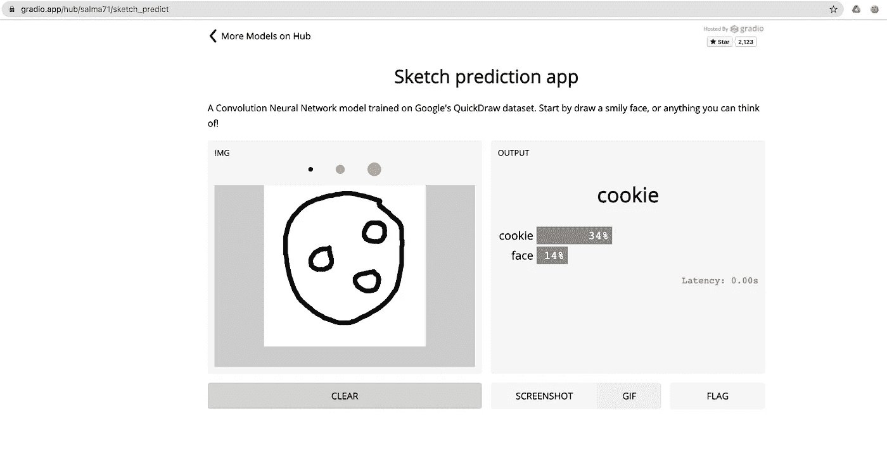

# 如何以最简单的方式创建机器学习界面

> 原文：<https://towardsdatascience.com/how-to-create-machine-learning-uis-the-easy-way-7e97e26b3797?source=collection_archive---------15----------------------->

## 我如何为一个复杂的草图识别模型构建一个很棒的 UI


草图预测应用—作者图片

最终部署的应用程序—作者的视频

# 介绍

数据科学家擅长创建代表和预测现实世界数据的模型，但实际上将机器学习模型投入使用更多的是一门艺术而不是科学。部署需要软件工程和开发运维中常见的技能。 [Venturebeat](https://venturebeat.com/2019/07/19/why-do-87-of-data-science-projects-never-make-it-into-production/) 指出，87%的数据科学项目从未投入生产，而 [redapt](https://www.redapt.com/blog/why-90-of-machine-learning-models-never-make-it-to-production#:~:text=During%20a%20panel%20at%20last,actually%20make%20it%20into%20production.) 指出是 90%。两者都强调了决定成功和失败的一个重要因素是团队的协作和迭代。

机器学习模型的目标是解决一个问题，只有通过用户界面才能解决这个问题。

因此，开发和部署用户界面是建模的一个重要步骤。缩小构建和部署模型之间的差距是我们如何确保拥有一个健壮的模型。

在这篇文章中，我将演示一些简单的步骤来给你的机器学习模型带来活力。我将为草图识别模型构建一个 UI。它将包括一个供用户绘制的画板输入，以及一个对草图进行实时分类的标签输出，所有这些都被部署到一个任何人都可以使用的实时链接中。那么，我们开始吧。

# 先决条件

本教程假设您熟悉在 TensorFlow 和 Keras 中构建 ANN 模型。对于本教程，我们将使用来自 [AI 实验 Github](https://github.com/trekhleb/machine-learning-experiments/blob/master/experiments/sketch_recognition_mlp/sketch_recognition_mlp.ipynb) repo 的训练模型来构建与 Gradio 的接口。

此外，如果你需要复习 gradio，你可以看看我以前的教程，一步一步地指导你如何建立一个 Gradio 帐户。此外，您可以点击查看 gradio 网站[上的入门指南。](https://gradio.app/getting_started)

[](/build-an-awesome-ui-for-your-machine-learning-models-7fab52ecdd86) [## 为你的机器学习模型建立一个令人敬畏的用户界面

### 一步一步的指南，快速建立一个伟大的用户界面的 PDF 格式的有声读物转换器，包括部署步骤。

towardsdatascience.com](/build-an-awesome-ui-for-your-machine-learning-models-7fab52ecdd86) 

在本教程中，我们将使用`tensorflow version 1.x`如果您想使用最新版本的`tensorflow 2.x`，您需要相应地重新培训该模型。但是，步骤应该是相同的。

> 与本教程相关的笔记本托管在 [Github 这里](https://github.com/salma71/sketch_predict)，如果你愿意跟随的话。

# 安装所需的库

您需要使用`pip install gradio`命令安装 gradio。

然后，我们需要导入 gradio 以及 TensorFlow。之后，我们将使用`tf.keras`模块中的“load_model”功能将预训练的模型加载到 colab 笔记本中。

```
!pip install gradio -q%tensorflow_version 1.x
```

此外，我们需要获取与每个绘图相关联的标签；为此，我们将从 google creative lab 公共存储库中导入它们。

以. txt 格式存储的绘图类别，我们需要将它们解码成`utf-8`格式，并通过在`\n`字符上拆分来转换成列表。

```
import gradio as gr
import tensorflow as tf
import urllib.request
cnn_model = tf.keras.models.load_model("/content/cnn.h5")labels = urllib.request.urlopen(
"https://raw.githubusercontent.com/googlecreativelab/quickdraw-dataset/master/categories.txt")labels = labels.read()
labels = labels.decode('utf-8').split("\n")[:-1]
```

> 我们对列表中的最后一个元素进行了切片，因为它是拆分过程产生的空字符串。

# 声明预测函数

Gradio 接口包括三个主要组件:

1.可调用函数—在我们的例子中是` predict_shape()'

2.输入组件—可调用函数的参数

3.输出组件-应用可调用函数后的输入。

因此，在接下来的几行中，我们定义了`predict_shape()`方法，并将绘图作为输入图像传递。之后，对上传的模型调用 predict 方法来获得预测。

> `predict_shape()`在这里返回所有标签及其预测分数，标签的输出组件中的 gradio 有一个默认为 3 的`num_top_classes`

```
def predict_shape(img):
   img = tf.math.divide(img, 255)
   preds = cnn_model.predict(img.reshape(-1, 28, 28, 1))[0]
   return {label: float(pred) for label, pred in zip(labels, preds)}
```

# 定义输入和输出组件

Gradio 有各种各样的组件可供您选择，以满足您的应用需求——点击此处查看完整的库组件。

[](https://www.gradio.app/docs#i_image) [## 格拉迪欧

### 使用“gradio.Interface()”函数使用 Gradio 创建接口。参数为…生成用户界面

www.gradio.app](https://www.gradio.app/docs#i_image) 

对于这个应用程序，我们将使用图像组件，并将源设置为“canvas”以获得一个画板界面。此外，我们将画布的大小设置为 28x 28 像素。

我们将选择标签作为输出组件，并将只显示预测中最高的两个类。

```
output = gr.outputs.Label(num_top_classes=2)
input = gr.inputs.Image(
                  image_mode='L', 
                  source='canvas', 
                  shape=(28, 28), 
                  invert_colors=True, 
                  tool= 'select')
```

# 设置界面

呈现之前准备好的组件的最后一步是通过接口函数。您需要做的就是将可调用的函数、输入和输出传递给`Interface()`，然后调用`launch()`来呈现应用程序。

Gradio 的一个很好的特性是，您可以向呈现的界面添加 HTML 标记元素，因此它可以作为一个独立的 web 应用程序运行。在接口方法中，我为呈现的应用程序传递了标题和描述。

> 如果您在 google colab 上，您需要在`launch()`方法内将 debug 设置为 True，以便在 colab 内呈现。

```
title="Sketch prediction app"description="A Convolution Neural Network model trained on Google's QuickDraw dataset." \
" Start by draw a smily face, or anything you can think of!"
```

> 请注意:根据文档，您需要将 capture_session 标志设置为 True，因为模型最初是使用 TensorFlow 1.x 训练的。

```
gr.Interface(fn = predict_shape, inputs = input, 
             outputs = output, live = True,
             title=title, description = description,     
             capture_session=True).launch(debug=True)
```


工作梯度界面—图片由作者提供

厉害！我们现在有一个很好的界面。

# 部署接口以获得持久链接

在之前的一篇文章中，我向您展示了 Gradio 如何使用 Flask 和 Docker 构建应用程序后端的整个生命周期。

直到这一步，你有一个 24 小时工作的可共享链接，如果你想保持链接，你需要在 [Gradio 主机](https://www.gradio.app/introducing-hosted)上托管应用程序，在那里你可以上传接口并获得一个永久链接。

[](https://www.gradio.app/introducing-hosted) [## Gradio -介绍托管

### 为您的机器学习模型部署接口的最简单方法。我们建立 Gradio 是为了成为最快的分享方式…

www.gradio.app](https://www.gradio.app/introducing-hosted) 

步骤很简单，您只需要:

1.Github 项目回购，应该包括 requirements.txt 文件

2.Gradio 帐户(与 GitHub 的电子邮件相同)

就是这样！


部署屏幕—作者提供的图片

该界面可能需要几分钟来构建映像后端要求。


可能需要几分钟[https://gradio.app/g/salma71/sketch_predict](https://gradio.app/g/salma71/sketch_predict)—图片由作者提供

然后可以在已部署的链接中找到已部署的接口。您可能会收到一封确认接口已成功部署的电子邮件—您可以在这里检查已部署的接口[。](https://gradio.app/g/salma71/sketch_predict)

[](https://gradio.app/g/salma71/sketch_predict) [## 预测草图

### 在 Google 的 QuickDraw 数据集上训练的卷积神经网络模型。

gradio.app](https://gradio.app/g/salma71/sketch_predict) 

# 在集线器上显示

通过将应用程序托管在 Hub 上，您可以将模型向前推进一步。你所需要做的就是指定标题、描述和一个缩略图，一切都准备好了。


在 Gradio Hub 上显示应用程序—图片由作者提供



[https://gradio.app/hub/salma71/sketch_predict](https://gradio.app/hub/salma71/sketch_predict)—作者图片

# 谢谢大家！

我希望这篇文章能让你对 Gradio 库有一个全面的了解。如有疑问，请写在下方评论区；我很乐意帮忙。

鼓励我的最好方式是在[**Medium**](https://medium.com/@salmaeng71)[**LinkedIn**](https://www.linkedin.com/in/salma-elshahawy/)**或 [**Github**](https://github.com/salma71) **上跟随我。**感谢阅读！**

# **参考**

1.  **[Github 回购](https://github.com/salma71/sketch_predict)**
2.  **[Gradio 文档](https://www.gradio.app/docs)**
3.  **[为你的机器学习模型建立一个令人敬畏的用户界面](/build-an-awesome-ui-for-your-machine-learning-models-7fab52ecdd86)**
4.  **[在几秒钟内部署一个机器学习模型](https://abidlabs.medium.com/deploy-a-machine-learning-model-in-seconds-56c400ecc0b3)**