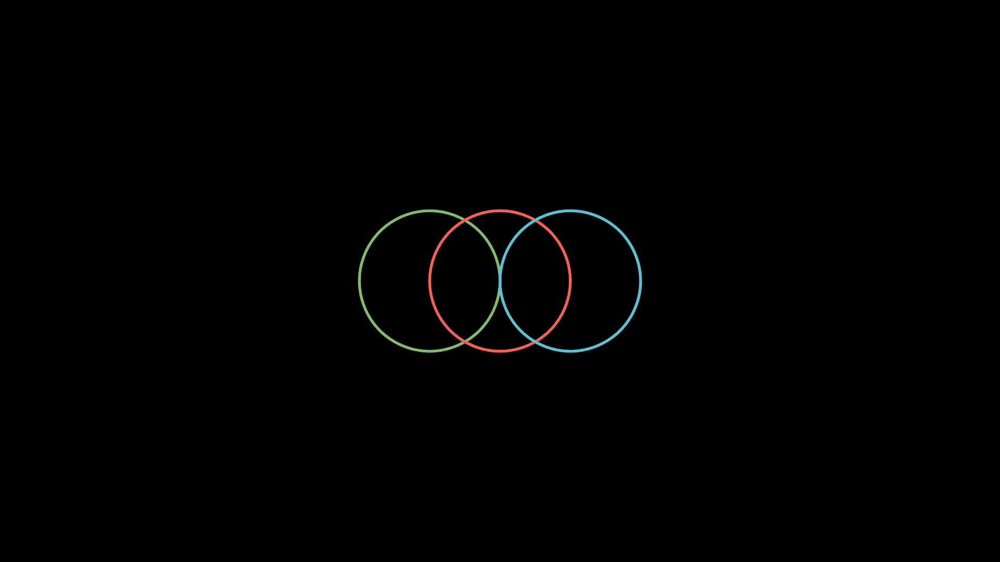

# 如何使用 Python 创建类似 3Blue1Brown 的数学动画

> 原文：<https://towardsdatascience.com/how-to-create-mathematical-animations-like-3blue1brown-using-python-f571fb9da3d1?source=collection_archive---------0----------------------->

## 利用您的 Python 技能创建美丽的数学动画

# 动机

你是否曾经纠结于机器学习算法的数学概念，并将 3Blue1Brown 作为学习资源？3Blue1Brown 是著名的数学 YouTube 频道，由格兰特·桑德森(Grant Sanderson)创建。很多人喜欢 3Blue1Brown 是因为 Grant 的精彩讲解和下面这样很酷的动画。

[由 3Blue1Brown 制作的视频](https://www.youtube.com/watch?v=O85OWBJ2ayo)

如果您可以了解他是如何创建这些动画的，这样您就可以创建类似的动画来向您的队友、经理或追随者解释一些数据科学概念，这不是很酷吗？

幸运的是，Grant 开发了一个名为 manim 的 Python 包，可以让你使用 Python 创建数学动画或图片。在这篇文章中，你将学习如何使用 manim 创建如下数学动画。


作者 GIF

# 什么是曼尼姆？

Manim 是一个精确动画引擎，设计用于创建解释性数学视频。注意，manim 有两个版本。一个是由 Grant 创建的[，另一个是由 Manim 社区](https://github.com/3b1b/manim)派生和维护的[。](https://github.com/ManimCommunity/manim)

由于 Manim 社区维护的版本比 Grant 的版本更新更频繁，测试更好，所以我们将使用 Manim 社区维护的版本。

要安装软件包的依赖项，请访问[文档](https://docs.manim.community/en/stable/installation.html)。安装完依赖项后，键入:

```
pip install manim==0.9.0
```

# 开始

## 创建一个从中心开始增长的蓝色方块

我们将创建一个从中心开始增长的蓝色正方形。创建动画的代码在从`Scene`派生的类的`construct`方法中。

将上面的脚本另存为`start.py`。现在运行下面的命令为脚本生成一个视频。

```
$ manim -p -ql start.py PointMovingOnShapes
```

并且一个名为`PointMovingOnShapes.mp4`的视频会保存在你的本地目录下。您应该会看到类似下面的内容！


作者 GIF

上述选项的解释:

*   `-p`:视频生成完成后播放
*   `-ql`:生成低质量视频

要生成高质量的视频，请使用`-qh`。

要创建一个 GIF 而不是视频，添加`-i`到命令中，如下所示:

```
$ manim -p -ql -i start.py PointMovingOnShapes
```

## 把正方形变成圆形

单独创建一个正方形并不那么有趣。让我们把这个正方形变成一个圆形。


作者 GIF

创建上述动画的代码:

点击查看形状的完整列表[。](https://docs.manim.community/en/stable/reference/manim.mobject.geometry.html#module-manim.mobject.geometry)

# 自定义 Manim

如果不希望背景是黑色的，可以像下面这样变成灰色:


作者 GIF

通过使用`config.background_color`

在这里找到定制 manim [的其他方法。](https://docs.manim.community/en/stable/tutorials/configuration.html)

# 我还能拿曼尼姆怎么办？

## 用一个移动的框架写出数学方程

您还可以创建一个动画，用如下所示的移动帧编写数学方程:


作者 GIF

或者一步一步地写下如何解方程:


作者 GIF

## 移动和变焦照相机

您还可以调整相机，并使用从`MovingCameraScene`对象继承的类来选择放大方程的哪一部分。


作者 GIF

## 图表

您还可以使用 manim 来创建一个注释图，如下所示:


作者 GIF

如果你想得到一个场景最后一帧的图像，添加`-s`到命令中:

```
manim -p -qh -s more.py Graph
```

您也可以通过设置`animate=True`来设置轴的过程

```
$ manim -p -qh more.py Graph
```


作者 GIF

## 一起移动对象

您也可以使用`VGroup`将不同的 Manim 对象分组，并像下面这样一起移动它们:



作者 GIF

## 跟踪路径

你也可以使用`TracedPath`创建一个移动物体的轨迹，如下图所示:


作者 GIF

# 概述

恭喜你！您刚刚学习了如何使用 manim 以及它能做什么。概括地说，manim 提供了 3 种对象:

*   [移动对象](https://docs.manim.community/en/stable/reference.html#mobjects):可以在屏幕上显示的对象，如`Circle`、`Square`、`Matrix`、`Angle`等
*   [场景](https://docs.manim.community/en/stable/reference.html#scenes):用于`Scene`、`MovingCameraScene`等动画的画布
*   [动画](https://docs.manim.community/en/stable/reference.html#animations):应用于`Write`、`Create`、`GrowFromCenter`、`Transform`等物体的动画

有这么多的人可以做，我不能在这里涵盖。最好的学习方法是通过实践，所以我鼓励你尝试本文中的例子，并查看 [manim 的教程](https://docs.manim.community/en/stable/tutorials.html)。

本文的源代码可以在这里找到:

  

我喜欢写一些基本的数据科学概念，并尝试不同的算法和数据科学工具。你可以通过 [LinkedIn](https://www.linkedin.com/in/khuyen-tran-1ab926151/) 和 [Twitter](https://twitter.com/KhuyenTran16) 与我联系。

如果你想查看我写的所有文章的代码，请点击这里。在 Medium 上关注我，了解我的最新数据科学文章，例如:

</pywebio-write-interactive-web-app-in-script-way-using-python-14f50155af4e>  </introduction-to-yellowbrick-a-python-library-to-explain-the-prediction-of-your-machine-learning-d63ecee10ecc>  </top-6-python-libraries-for-visualization-which-one-to-use-fe43381cd658>  </how-to-create-interactive-and-elegant-plot-with-altair-8dd87a890f2a> 