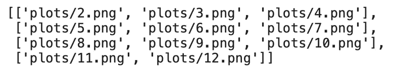

# 如何使用 Python 创建 PDF 报告——基本指南

> 原文：<https://towardsdatascience.com/how-to-create-pdf-reports-with-python-the-essential-guide-c08dd3ebf2ee?source=collection_archive---------1----------------------->

## 在 10 分钟或更短时间内创建具有漂亮可视化效果的 PDF 报告

杰西·G-C 在 [Unsplash](https://unsplash.com/?utm_source=unsplash&utm_medium=referral&utm_content=creditCopyText) 上的照片

报告无处不在，因此任何技术专业人员都必须知道如何创建它们。这是一项乏味且耗时的任务，这使得它成为 Python 自动化的完美候选。

无论您是数据科学家还是软件开发人员，都可以从自动报告生成中受益。例如，数据科学家可能会使用报告来显示机器学习模型的性能或解释。

本文将教您如何制作基于数据可视化的报告，并将它们保存为 pdf。更准确地说，您将学习如何将多个数据可视化(虚拟销售数据)合并到一个 PDF 文件中。

最棒的是——这比你想象的要简单！

这篇文章的结构如下:

*   数据生成
*   数据可视化
*   创建 PDF 页面结构
*   创建 PDF 报告
*   结论

你可以在这里下载源代码为[的笔记本。](https://github.com/daradecic/BDS-articles/blob/main/004_PDF_Reports_with_Python.ipynb)

# 数据生成

没有数据就没有报告。这就是为什么您必须首先生成一些——稍后再详细介绍。

让我们从进口开始。你将需要很多东西——但是`FPDF`库可能是唯一未知的。简而言之，它用于创建 pdf，稍后您将使用它。请参考下面的导入代码片段:

接下来我们生成一些假数据。其思想是声明一个函数，该函数返回给定月份的虚拟销售数据的数据帧。它通过构建整个月的日期范围，然后将销售额作为给定范围内的随机整数来分配。

您可以使用`calendar`库来获取任意年/月组合的最后一天。以下是完整的代码片段:

对`generate_sales_data(month=3)`的调用产生了 2020 年 3 月的 31 个数据点。下面是前几行的样子:

图 1 —生成数据的样本(作者提供的图片)

就这样——您现在有了一个生成虚拟销售数据的函数。接下来我们来看看如何可视化。

# 数据可视化

您的下一个任务是创建一个函数，将之前创建的数据集可视化为一个线图。当您处理时间序列数据时，这是最合适的可视化类型。

下面是数据可视化的函数和一个调用示例:

简而言之——创建数据可视化、设置标题、摆弄字体——没什么特别的。可视化结果不会显示给用户，而是保存在机器上。稍后您会看到这有多么强大。

示例调用将保存 2020 年 12 月的数据可视化。它看起来是这样的:

图片 2—2020 年 12 月的销售图(图片由作者提供)

这就是你的视觉化功能。在创建 PDF 文档之前，只剩下一个步骤，那就是保存所有的可视化并定义报告页面结构。

# 创建 PDF 页面结构

现在的任务是创建一个执行以下操作的函数:

*   为图表创建文件夹—如果存在，则删除并重新创建
*   保存 2020 年除一月之外的每个月的数据可视化，以便您可以看到如何在每页上使用不同数量的元素(也可以随意包含一月)
*   从可视化效果创建 PDF 矩阵，这是一个二维矩阵，其中一行代表 PDF 报告中的一个页面

下面是该函数的代码片段:

可能有很多东西需要消化，所以一行一行地看一遍。这些评论应该会有所帮助。排序背后的想法是从字符串中获取月份的整数表示—例如，从“3.png”中获取 3，并使用该值对图表进行排序。如果顺序无关紧要，请删除这一行，但月份就不是这样了。

下面是一个调用`construct()`函数的例子:

运行上述代码片段后，您应该会在笔记本中看到以下内容:

图片 3 —生成的可视化效果(作者提供的图片)

如果你想知道——这是我的机器上的`plots/`文件夹的样子(在调用了`construct()`函数之后):

图 4 — PDF 报告内容矩阵(图片由作者提供)

这就是构建 PDF 报告所需的全部内容—接下来您将学习如何完成。

# 创建 PDF 报告

这是一切汇集的地方。现在您将创建一个从`FPDF`继承而来的自定义`PDF`类。这样，所有的属性和方法在我们的类中都是可用的，如果你没有忘记在构造函数中调用`super().__init__()`的话。构造函数还将保存页面宽度和高度的值(A4 纸)。

您的`PDF`类将有几个方法:

*   `header()`–用于定义文件标题。自定义徽标放在左边(确保有一个或删除此代码行)，硬编码文本放在右边
*   `footer()`–用于定义文档页脚。它只会显示页码
*   `page_body()`–用于定义页面的外观。这将取决于每页显示的可视化效果的数量，因此位置和边距会相应地设置(您可以随意调整这些值)
*   `print_page()`–用于添加空白页并填充内容

以下是该类的完整代码片段:

现在是实例化它并从二维内容矩阵中追加页面的时候了:

上面的单元需要一些时间来执行，完成后将返回一个空字符串。这是意料之中的，因为您的报告保存在笔记本所在的文件夹中。

报告的首页应该是这样的:

图 PDF 报告的第一页(图片由作者提供)

当然，由于不同的标志和完全随机的销售数据，你的看起来会不同。

这就是如何用 Python 创建数据可视化的 PDF 报告。接下来让我们总结一下。

# 结论

今天，您已经学习了很多东西——如何为任何场合创建虚拟数据，如何将其可视化，以及如何将可视化嵌入到单个 PDF 报告中。嵌入可视化只需要最少的代码修改——主要是定位和边距。

如果你想看基于机器学习模型解释(SHAP 或莱姆)或其他与数据科学相关的东西的自动化报告创建指南，请告诉我。

感谢阅读。

*喜欢这篇文章吗？成为* [*中等会员*](https://medium.com/@radecicdario/membership) *继续无限制学习。如果你使用下面的链接，我会收到你的一部分会员费，不需要你额外付费。*

 [## 通过我的推荐链接加入 Medium-Dario rade ci

### 作为一个媒体会员，你的会员费的一部分会给你阅读的作家，你可以完全接触到每一个故事…

medium.com](https://medium.com/@radecicdario/membership) 

## [加入我的私人邮件列表，获取更多有用的见解。](https://mailchi.mp/46a3d2989d9b/bdssubscribe)

# 了解更多信息

*   [2021 年学习数据科学的前 5 本书](/top-5-books-to-learn-data-science-in-2020-f43153851f14)
*   [SHAP:如何用 Python 解释机器学习模型](/shap-how-to-interpret-machine-learning-models-with-python-2323f5af4be9)
*   [三大分类机器学习指标—一劳永逸地消除准确性](/top-3-classification-machine-learning-metrics-ditch-accuracy-once-and-for-all-923beab025a4)
*   [ROC 和 AUC——如何评估机器学习模型](/roc-and-auc-how-to-evaluate-machine-learning-models-in-no-time-fb2304c83a7f)
*   [精确召回曲线:如何轻松评估机器学习模型](/precision-recall-curves-how-to-easily-evaluate-machine-learning-models-in-no-time-435b3dd8939b)

*原载于 2021 年 1 月 18 日***。**