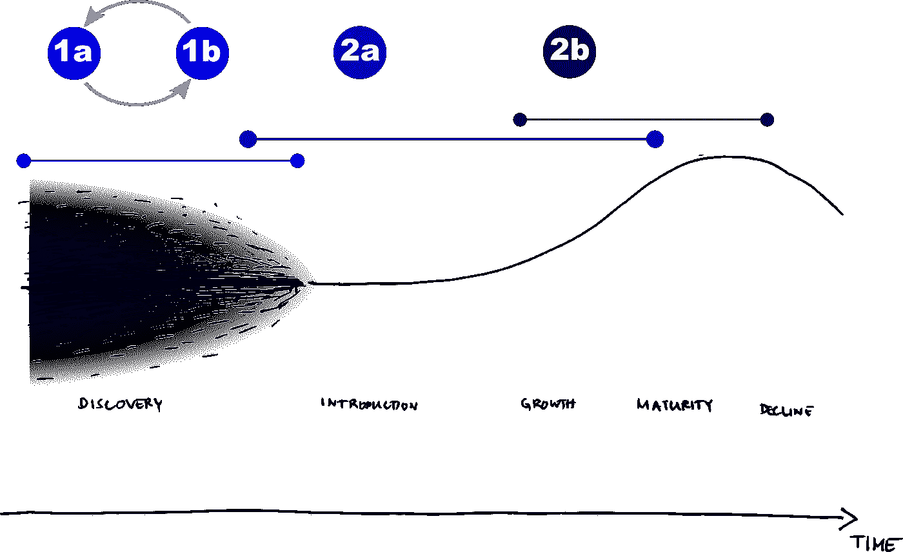

# 如何创造依赖机器学习的产品

> 原文：<https://towardsdatascience.com/how-to-create-products-that-rely-on-machine-learning-f0c7fe70cbc8?source=collection_archive---------9----------------------->

## 产品团队用机器学习来平衡特定风险并增加开发成功产品的可能性的框架

创造依赖机器学习等技术的产品，与普通产品相比，有着不同的考虑因素、风险和限制。为了在你的产品工作中取得成功，开发过程应该承认这些固有的挑战并直面它们——即使这可能不适合你的开发团队

由 [Austin Distel](https://unsplash.com/@austindistel?utm_source=medium&utm_medium=referral) 在 [Unsplash](https://unsplash.com?utm_source=medium&utm_medium=referral) 上拍摄

你真的对工作中的新项目感到兴奋。你正在与贵公司最强的工程师和科学家团队合作开发一个很酷的新产品，其核心是使用定制的机器学习方法来交付成果。具体来说，它可以是一个决定何时为零售商店重新进货并自动规划卡车运输的工具，也可以是一个新的应用程序，帮助你的客户在购买前预览你的家具在他们家中的外观，一个用于你公司生产线的自动故障检测系统或完全不同的东西。

每个人都开始为这个项目工作。大量的技术设计和开发工作。三个月来，数据科学家正在研究一种复杂的新深度学习架构，并在使其工作方面遇到了困难。工程师们已经创建了一个非常乏味的应用程序，但在模型准备好之前，他们真的不知道如何进行。与此同时，管理层在要求地位，团队中的能量，曾经因为兴奋而非常高，现在随着沮丧而下降。

经过长时间的延迟，试点产品终于推出了，然而不知何故，预期用户并没有真正拿起它。管理层不高兴，技术团队也不高兴。一些工程师和科学家感觉自己很失败，有些人甚至感觉他们在公司的地位下降了。

如果你经历过类似上述场景的事情，你并不孤单。**成功打造使用机器学习[1]作为核心技术的产品*与其他数字产品计划*不同。**指标很多:“人工智能项目”的失败率据说大大超过 50 %(尽管很难获得确切的数字)[2，3]，对许多人来说，超越试点或概念验证已被证明是一个挑战[4，5]，人工智能人才的整体保留是一个巨大的挑战[6]。虽然该技术本身在过去十年中已经从令人兴奋的发展成为相当主流的技术，许多发展改善了可访问性，但在产品人员和技术人员之间仍然没有就如何进行机器学习产品开发达成共识，尽管似乎有一些理解，即机器学习产品开发的技术要求和风险概况不同于普通的数字产品，并且需要一些调整。

**产品工作失败的一个关键原因是数据科学家和产品人员对风险没有相同的理解，并且在解决这些风险的顺序上存在分歧。**由于主要关注“核心智能”，数据科学家将直观地关注模型开发的应用研发，以探索技术可行性；这是一项耗时的探索性工作，通常以非线性方式进行。另一方面，产品领导者将更关心以对公司有益的方式创造强大和用户友好的价值主张(考虑价值、合意性和可行性以及技术可行性的组合[7])，并将希望快速迭代以探索这一点。这也是一个非线性的发现过程，只是控制旋钮和成功标准不同。通常，没有人考虑如何确保以新产品所需的速度持续获得正确质量的正确数据。

发现对用户和公司都有用的正确产品，同时不断平衡和最小化价值、合意性、可行性和可行性这四个风险总是很困难的，即使是基于熟悉技术的产品。然而，这四种高级风险对于机器学习驱动的产品有一些特殊的表现，这些表现可能不明显。这些并不能取代四大风险，它们只是四大风险中需要特别关注的关键点。这些是

*   早期在模型可行性评估上花费的时间太少:机器学习的技术可行性受到数据和技能的限制。事后改进机器学习模型，基础强的容易，基础不到位的不可能。如果你假设的模型在科学上是不可能开发出来的，那么它会扼杀你的整个产品。因此，你应该遵循#monkeyfirst 原则[8]:首先做困难的事情，如果它们是不可能的，你必须评估另一种方法是否可行，或者放弃这个产品想法。

    机器学习的限制因素是 a)你是否有持续和及时地访问正确的数据，b)你是否有开发和部署正确模型的技能，因此在产品开发的早期就必须在这些方面建立正确的信心水平。
*   **早期(在验证产品之前)在机器学习模型上花了太多时间。**改进模型性能非常耗时，但这可能是对时间的极大浪费，除非已经证实我们提供给用户的产品也通过这种努力得到了改进。因此，第一个风险是确保足够深入地评估机器学习是否可行，第二个风险是过早地过度投资，忽视用户的需求(价值和愿望的风险)。
*   不满的数据科学家。数据科学家非常喜欢研究机器学习模型，如果有选择的话，他们更喜欢研究更高级的模型，这样可以增长他们的技能和经验。另一方面，许多数据科学家在构建部署机器学习模型的系统方面不如软件工程同行强大，并且数据科学家也经常觉得他们不应该做这项工作。

    如果将上述前两种风险放在心上，数据科学家就有理由担心他们是否能够利用自己的核心竞争力。一旦产品 MVP 证明了对用户的价值，就有时间这么做了。尽管如此，这可能会导致沮丧和高流动，除非及早和适当地解决。

对期望的结果和达到目标的风险达成共识，并同意允许团队解决这些问题的开发方法是关键。技术团队经常忘记的是，预期的结果是解决重要、有价值的问题的出色用户体验——工作机器学习技术本身是不够的。事实上，处理异常以及用户如何对机器学习预测采取行动是成功的关键，但通常完全位于机器学习技术本身之外。很难对风险和挑战保持清醒的认识，尤其是在团队还在学习价值主张和技术挑战的早期。尽早就期望的用户结果和开发方法进行公开的对话，并在此之后定期检查，以在需要时进行重新评估和调整，这仍然是至关重要的。

# 基于机器学习的产品开发方法

下面的方法融合了第一手经验和其他团队的观察，试图达到良好的平衡。就像任何其他创造性的追求一样，你不应该以拥有一个完美的过程为目标，而是试图创造伟大的(“完美的”)结果，并尊重你将在过程中学习到的东西:因此，预计这有时会变得混乱，并且会犯错误。也就是说，希望下面的方法将强调最关键的风险是如何在开发过程中变化的，并希望为技术团队和产品负责人提供一些视角。

*考虑到最大的风险是产品是否会引起用户的共鸣，以及机器学习的预期用途是否可行，在发现过程中使用步骤 1a 和 1b 来解决这些风险，同时迭代出可行的解决方案。一旦达到初始牵引力，步骤 2a 和 2b 着重于改进或扩展产品。在发现阶段会测试许多不同的想法，开发会产生许多不同的结果。当一个 MVP 被开发出来的时候，过程就变得更加狭窄了。作者插图。*

这种方法实际上就是识别前面提到的哪些产品风险在哪个阶段最大，以及如何解决这些风险的一些建议。希望这能让你在开发新产品的时候走得更快，增加你的信心和成功的可能性。在探索可能使用机器学习的新产品的过程中，两个重要的风险是所提议产品的技术可行性和用户的合意性，即该产品是否以吸引人的方式解决了一个重要问题(上面强调的前两个风险)。在产品发现过程中，解决这个问题的最好方法是在速度和细节之间找到平衡点，从而确定一个吸引用户的有价值的产品，并且这个产品在技术上也是可行的。前两个步骤(1a 和 1b，见图)是关于执行适当数量的发现/开发周期，以找到我们有信心在技术上能够制造的强有力的候选产品。迭代步骤 1a 和 1b 的结果是一个最小可行产品(MVP ),我们可以从中学习。

大部分技术开发将发生在步骤 2a，这是所有关于产品的成熟。这是很多详细的机器学习优化、数据管道优化等的地方。会发生。最后，步骤 2b 是扩展更多功能的通用产品方面。

## 步骤 1a:用技术解决问题是否可行？

当产品经理提出一个想法时，技术团队的工作就是评估通过技术解决它是否可行。尽管在早期发现阶段，你不应该过早地专注于某个特定的技术解决方案，但你仍然需要树立信心，相信可以开发出技术上可行的解决方案*。否则你就不知道如何构建产品，你应该把注意力转移到另一种满足用户需求的方式上。*

*这并不是说“我们有技术，现在让我们寻找一个问题来解决”，但是即使当把用户问题放在中心位置时，团队的技术能力和问题的背景在交付解决方案的技术可行性中也起着重要作用。*

*因此，第一步的目标是在足够详细的程度上考虑潜在技术解决方案的细节，同时仍然能够保持适当的速度。具体来说，这意味着评估您的团队和您的产品建立机器学习技术来交付用户问题所需的解决方案(包括对模型性能的一些粗略了解)是否现实*，确保在进行预测时机器学习的数据可以始终如一地来源于产品，并建立可行的方法来衡量性能。**

*举一个重要的例子，无法一致地获取和清理模型运行所需的数据通常是一个巨大的挑战，因为不存在如何获取数据的途径。一个常见的原因是在静态数据集上训练的模型，当转换为产品时失败，因为没有充分考虑如何控制数据生成过程[9]。在发现阶段就考虑建立一个良好的数据生成过程的可行性是非常重要的:这不仅可以节省大量的时间、金钱和麻烦[10]，而且数据获取策略的缺乏将会停止扩展，从而在产品上市之前就扼杀你的产品。*

*机器学习模型和数据采集的可行性评估通常是通过概念的技术证明来完成的，但如何进行当然可以有所不同。无论你怎么做，都是为了在产品团队中建立信心，相信这些挑战是可以解决的。虽然在某些情况下可能会发生，但如果在这个阶段进行高级数学建模，我会感到惊讶；更确切地说，它是关于确定问题是否可以用数学建模的方式来表达，确定模型性能(准确性、提供结果的时间等)的早期信心。)是否可以通过微调达到所需的水平，以及所需的数据材料是否可以持续获得。*

## ***步骤 1b:专注于向用户证明价值主张***

*第二步是面向用户的，类似于第一步:产品发现，即确定如何塑造产品以使其对用户既有价值又有吸引力的过程。我将这两个步骤命名为 1a 和 1b，以表明它们应该被同时处理[11]。预计 1a 和 1b 将是产品与市场匹配的迭代循环。*

*目标是为用户探索价值驱动因素，以了解如何设计和构建产品。也就是说，这是确定我们相信哪些想法来开发 MVP 以与用户进行测试的过程，所有这些都是为了确定一个强有力的价值主张。一个关键问题涉及识别用户眼中机器学习的实际价值驱动因素，包括如何以一种允许用户尽可能容易地采取正确行动的方式呈现机器学习的结果。细节当然会非常依赖于上下文，但汽车导航系统提供了一个很好的例子:要想成功，这种系统需要能够通过 GPS(机器学习和优化)提供一个好的计划，及时的口头更新(解释与运动相关的结果)是成功的关键。前者需要良好的规划能力和体面的计算速度，而后者的低延迟，以不断能够评估汽车相对于计划的位置，这是有用和无用产品之间的区别。*

*在这个阶段成功的关键是能够快速评估想法是否可行，我们寻找的信号是我们是否给了用户他们真正需要的东西。结果是，现在是简单、现成的机器学习模型的时候了(或者可能是一个模仿的模型，即根本没有实际的模型！);一旦确定问题可以用机器学习来解决(步骤 1a 的问题已经解决)，就没有更多工作要做了。*

*然而，作为探索可能的价值主张的一部分，探索如何向用户呈现结果通常是相关的。也就是说，哪些指标最能向用户传达信息？结果应该如何呈现(在图表中？作为推荐动作？)以及用户是否能够交互式地探索结果(例如，在上述示例中，在汽车导航系统的地图中四处移动)。准确性和服务时间的相对重要性是什么？显示结果的正确粒度级别是什么？一个 GPS 只能引导你从一个城市到另一个城市，但没有在城市中引导你的分辨率，对大多数人来说不是特别有价值。所有这些问题都处于产品和数据科学的界面上，找到好的解决方案将决定最终产品的成败。*

## ***步骤 2a:使产品成熟:提高机器学习性能和价值交付***

*当你发现了一种既有价值、又令人满意且可行的产品时，科学和工程开发工作就可以开始提高机器学习能力了。这是详细的改进工作，其中解决方案得到强化，新的机器学习架构和模型类型得到彻底探索，边缘情况得到处理等。要明确的是，技术和用户体验的成熟适用于产品的所有方面，而不仅仅是机器学习；在接下来的内容中，我将只关注对机器学习部分特别重要的一些方面，它们是扩展和长寿的基础。*

*在这一阶段，监控和再培训策略是根据步骤 1a 中的草图制定的，以便为产品提供支持，这一领域也称为 MLOps[12–14]。大多数机器学习(以及其他类型的应用数学引擎)都会随着时间的推移而恶化，而 MLOps 可以确保我们监控性能并主动调整模型，以便它们继续为产品提供工作。没有 MLOps，机器学习模型将很快停止产生有用的结果，产品将毫无用处。产品经理应与技术团队一起在定义 MLOps 战略中发挥积极作用，以确保用户价值主张是首要关注点，关键机器学习性能指标应成为产品经理每日审查的 KPI 的一部分。*

*MLOps 的一个部分需要特别提及，因为最佳解决方案通常是通过产品设计:数据恶化。有时候，在产品上线后，一个或几个数据源开始转移。在营销情况下，这可能发生在引入之前不属于改变行为的数据集的新产品时(甚至可能是引入我们自己的产品)，这可能是新的法规(例如 GDPR)，而在其他情况下，这可能是由于物理传感器的退化、生产线图像的上下文变化(背景中的混乱)等。MLOps 将允许主动解决数据中的变化，但它不能保证机器学习模型的质量得以保持。解决这一问题的最佳方式是设计产品，使您能够控制数据生成，或者产品的定位使价值主张在模型无法运行时不会恶化。确定解决这些问题的策略是一个产品问题，应该是一个主动的选择。*

## ***步骤 2b:开发产品，但要警惕模型出错带来的意外事故***

*在讨论本节的细节之前，需要澄清机器学习模型的一些方面。作为开发过程的一部分，这些模型根据历史的、有代表性的数据进行“训练”(拟合)，以使其预测能力适合您正在处理的特定问题和数据。但是，如果在模型训练的数据域之外应用，性能通常会下降，如果数据生成过程(例如，不同的用户行为)和我们测量数据的方式(例如，使用不同的传感器读取一个数据源)发生变化，都会发生这种情况。这些方面对如何扩展机器学习驱动的产品有一些影响。*

*如果事情进展顺利，产品将在某个时候需要扩展。扩展机器学习模型的服务和操作是一项技术挑战(本身就具有挑战性)，只要它发生在相同的用户群中，但扩展到新的用户组或细分市场会带来额外的复杂性，因为数据生成过程可能会发生变化。在这种情况下，密切监控通常是一个好策略:由于机器学习模型通常用于帮助决策，并且由于新用户组的决策和/或行为可能与之前的细分市场不同，这些变化将反映在数据和性能监控中。如果有理由相信新的目标用户组具有不同的行为，或者如果数据生成过程的部分对于这个新的组是不同的，则应该预期添加这个新的组将需要调整机器学习模型本身(基本上经过步骤 1a、1b 和 2a)，而不仅仅是在这个新的段上打开现有模型的开关。以我们之前使用的 GPS 为例:将英国作为一个新的国家需要对路由引擎进行重大调整，因为所有的路由决策都会受到左侧驾驶的影响。关键的标注是让团队意识到这项重要的工作，并在正确的时间点将它考虑进去。*

*与任何产品一样，一旦我们推出了具有良好吸引力和规模的产品，“最后”一步是通过添加更多功能来继续改进产品。这包括发现、原型和用户验证的连续循环，以确定每个新功能的产品市场适应性，这在别处有很好的描述[7]。这些新功能中的一些可能是新的基于机器学习的解决方案，与核心产品没有技术关系，如果是这样，它们的开发将遵循上述步骤。这里需要注意的是，任何改变用户行为的新功能也会影响(潜在地破坏)支持传统功能的现有机器学习模型。例如，一家全球能源公司的人力资源部门对每名新员工在公司未来成功的可能性进行评分，但同时将该分数与绩效和其他变量一起使用，以确定哪些员工将获得发展机会；由于这种(可能是无意的)负面反馈循环，在加入时得分不高的人没有获得同样的机会，导致整体人才库的多样性下降和员工流动率上升。注意这些非直观的依赖关系是很重要的，同样重要的是要意识到这些依赖关系可能只存在于某些细分市场中，甚至可能会因细分市场而异。除了对风险本身的认识之外，努力测量现有模型对用户行为和性能的影响，并在引入新功能时进行受控实验，是避免意外颠覆您之前成功的最佳实践。*

# *确认*

*Simon Kiilerich Vedel(无关系)的一篇全面的评论，包括对这篇文章有重大改进的观点，得到了欣然认可( [LinkedIn 简介](https://www.linkedin.com/in/simonkv/))。*

# *参考*

*[1]我在本帖中描述的内容适用于所有使用高级数学建模作为解决问题前提的情况，并不仅限于机器学习问题(甚至适用于传统的数据科学问题)。也就是说，在数学建模、优化和相关领域也会发现类似的挑战。为了简洁起见，我将自始至终使用术语机器学习，但是读者应该记住，所讨论的主题适用范围更广。*

*[2][https://venturebeat . com/2020/12/16/the-future-of-ai-deployments-reaching-production-is-bright-in-2021/](https://venturebeat.com/2020/12/16/the-future-of-ai-deployments-reaching-production-is-bright-in-2021/)*

*[3] Irving Wladawsky-Berger:为什么一些人工智能努力成功而许多努力失败，《华尔街日报》，2020 年 1 月 24 日，[https://www . wsj . com/articles/Why-Some-AI-Efforts-success-While-Many-Fail-01579901883](https://www.wsj.com/articles/why-some-ai-efforts-succeed-while-many-fail-01579901883)*

*[4][https://www . McKinsey . com/industries/semiconductor s/our-insights/scaling-ai-in-the-sector-enable-it-lessons for the-semiconductor-device-makers](https://www.mckinsey.com/industries/semiconductors/our-insights/scaling-ai-in-the-sector-that-enables-it-lessons-for-semiconductor-device-makers)*

*[5][https://www . BCG . com/publications/2019/travel-time-push-ai-beyond-pilot-phase](https://www.bcg.com/publications/2019/travel-time-push-ai-beyond-pilot-phase)*

*[6][https://www2 . Deloitte . com/content/dam/Deloitte/us/Documents/technology-media-telecom munications/us-TMT-how-do-you-retain-your-data-scientists . pdf](https://www2.deloitte.com/content/dam/Deloitte/us/Documents/technology-media-telecommunications/us-tmt-how-do-you-retain-your-data-scientists.pdf)*

*[7]马蒂·卡甘:灵感，[https://svpg . com/Inspired-how-to-create-products-customers-love/](https://svpg.com/inspired-how-to-create-products-customers-love/)*

*[8]天文柜员:先擒猴子，2016[https://blog . x . company/先擒猴子-90fd6223e04d](https://blog.x.company/tackle-the-monkey-first-90fd6223e04d)*

*[9] Will Douglas Heaven:谷歌的医疗人工智能在实验室中非常准确。现实生活是一个不同的故事。麻省理工科技评论 2020 年 4 月 27 日，[https://www . Technology Review . com/2020/04/27/1000658/Google-medical-ai-accurate-lab-real-life-clinic-covid-diabetes-retina-disease/](https://www.technologyreview.com/2020/04/27/1000658/google-medical-ai-accurate-lab-real-life-clinic-covid-diabetes-retina-disease/)*

*[10]吴恩达:人工智能对你的企业来说不必太复杂或昂贵，《哈佛商业评论》2021 年 7 月 29 日[https://HBR . org/2021/07/AI-不必对你的企业来说太复杂或昂贵](https://hbr.org/2021/07/ai-doesnt-have-to-be-too-complicated-or-expensive-for-your-business)*

*[11]这篇文章关注的是向用户证明价值是挑战的一部分的情况，因为这是从初创公司到企业普遍面临的情况。但是，应该注意的是，有些领域的价值主张很明确，工作流程/产品开发工作旨在迎合对机器学习的依赖，例如助听器和其他嵌入式信号处理、期权定价和银行欺诈检测等。在这些情况下，步骤 1b 试图缓解的问题就不是大问题了。*

*[12]对于专家:我自由地使用术语 MLOps，因此它也包括 DataOps(相当于 DevOps 的数据)。这两者之间有着重要的差异，但就这篇博文的目的而言，它们是如何大规模运营机器学习和数据产品的同一问题的两个方面。*

*[13][https://en.wikipedia.org/wiki/MLOps](https://en.wikipedia.org/wiki/MLOps)*

*[14] Terence Tse 等人，你的人工智能项目将失败的愚蠢原因，哈佛商业评论，2020 年 1 月 8 日，[https://HBR . org/2020/06/The-Dumb-Reason-Your-AI-Project-Will-Fail](https://hbr.org/2020/06/the-dumb-reason-your-ai-project-will-fail)*