# 如何使用 LaTeX 创建出版就绪的绘图

> 原文：<https://towardsdatascience.com/how-to-create-publication-ready-plots-with-latex-4a095eb2f1bd?source=collection_archive---------0----------------------->

## [实践教程](https://towardsdatascience.com/tagged/hands-on-tutorials)

## 使用 LaTeX 启动你的绘图之旅，使用 5 种基本的绘图变化


由[艾萨克·史密斯](https://unsplash.com/@isaacmsmith?utm_source=medium&utm_medium=referral)在 [Unsplash](https://unsplash.com?utm_source=medium&utm_medium=referral) 上拍摄的照片

# 介绍

如果你曾经在科学杂志上写过一篇文章，那么你很有可能使用过乳胶模板来准备你的手稿。毕竟这是排版文档的行业标准。然而，你们中有多少人考虑过将 LaTeX 作为绘图工具？

LaTeX 基于其图形系统 PGF/TikZ 提供了一个强大的可视化库 PGFPlots。这使得直接在您的。tex 文档。它有一个简单的用户界面，即使是业余程序员也能轻松掌握。然而，我们在网上还有各种各样的绘图选项。无论是流行的数据科学编程语言，如 Python 和 R，它们拥有自己令人印象深刻的数据可视化库，还是绘图软件，如 Origin、Veusz、GraphRobot 和 Orange。大多数这样的选项还提供了处理非常大的数据集和执行复杂的数学计算的灵活性，不幸的是，PGFPlots 库没有这种灵活性。但是，如果这些缺点对您来说不构成问题，PGFPlots 库肯定会为您呈现与当今大多数其他可用选项相比质量最高的图。

然而，尽管不像其他语言/工具那样陡峭，使用 LaTeX 绘图也有自己的学习曲线。PGFPlots 确实提供了自己的综合[手册](http://pgfplots.sourceforge.net/pgfplots.pdf)，但是你需要知道在那里搜索什么才能找到你的答案！而且，很多时候，我们寻找的是抽象的想法，而不是完整的图片。这就是像 tex.stackexchange.com 这样的网站来拯救我们的地方。即便如此，在我挖到金子之前，我仍然不得不翻遍成吨的 stackexchange 帖子，经历无数次反复试验。因此，我决定写这篇文章。我希望通过研究科学出版物中可能遇到的 5 种基本绘图类型，向您介绍 LaTeX 绘图的基本知识。每个图将关注 PGFPlots 库中可用的不同类型的定制。要理解本文，您只需要对 LaTeX 有基本的了解。当然，这只是开始您的 LaTeX 绘图之旅。我希望在以后的文章中深入探讨更复杂的情节，因此可以将此视为一系列文章的背景。

所以事不宜迟，我们开始吧！

# 使用 PGFPlots 绘图

让我们从设置 LaTeX 中绘图的文档序言开始。和其他人一样。tex 文件，我们将从使用`\documentclass`命令定义我们的文档类型开始。我们还将为我们的文档添加推荐的编码包。因为我们使用 PGFPlots 绘图，所以我们将调用 PGFPlots 包。下一行中的`\pgfplotsset`命令用于为整个文档(或者，正如我们稍后将看到的，文档的一部分)定义一组特定的选项。在这种情况下，我们将整个文档的兼容性选项设置为`PGFPlots 1.9`，以确保向后兼容性。*注意:最好总是在序言中包含这一行，以避免由于版本更新而导致输出发生变化。*

```
\documentclass[12pt, a4paper]{article}
\usepackage[utf8]{inputenc}
\usepackage{pgfplots}
\pgfplotsset{compat=1.9}
```

接下来，让我们使用`\pgfplotsset`命令(名为 *myplotstyle* )为我们的绘图设置一些常见的样式规范。*注意:如果需要，我们可以在特定的安讯士环境中覆盖这些样式。*

```
\pgfplotsset{
    myplotstyle/.style={
    legend style={draw=none, font=\small},
    legend cell align=left,
    legend pos=north east,
    ylabel style={align=center, font=\bfseries\boldmath},
    xlabel style={align=center, font=\bfseries\boldmath},
    x tick label style={font=\bfseries\boldmath},
    y tick label style={font=\bfseries\boldmath},
    scaled ticks=false,
    every axis plot/.append style={thick},
    },
}
```

上述样式选项的简要描述:

1.  `legend style`、`legend cell align`、`legend pos`:用于图例造型；在这种情况下，设置一个无边框、`\small`字体、左对齐文本的图例，并放置在绘图的东北方向
2.  `xlabel style`和`ylabel style`:用于改变 x 轴和 y 轴标签样式；在这里，它们用于加粗轴标签(`\bfseries`用于文本，`\boldmath`用于数字轴标签)，并将它们对齐轴的中心
3.  `x tick label style`和`y tick label style`:用于设置轴刻度标签样式；这里，文本和数字记号标签的记号字体都设置为粗体
4.  `every axis plot./append style`:用于设置一个图内每个轴的样式；这里，图中线条和标记的粗细被设置为`thick`。*注意:这里，我使用了* `every axis plot` *选项来改变图的线宽*
5.  `scaled y ticks=false`:用于防止 PGFPlots 分解轴刻度标签的公共指数

现在，让我们定义一个简单的绘图环境，使用 *myplotstyle* 来检查它的外观！用于此目的的代码如下所示:

```
\begin{tikzpicture}
\begin{axis}[
    myplotstyle,
]
\end{axis}
\end{tikzpicture}
```

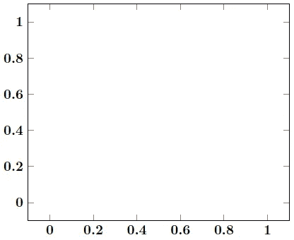

使用 **myplotstyle** 看一个简单的情节(图片由作者提供)

由于 PGFPlots 是基于 PGF/TikZ 的，所以每个情节都应该放在`\begin{tikzpicture} ... \end{tikzpicture}`给出的画面环境中。在此范围内，我们将定义一个正常的 axis 环境，并为其设置我们的首选样式。在右边，我们可以看到我们的简单坐标轴图看起来是什么样的！*注意:我在最后一个样式选项后加了一个逗号，* `*myplotstyle*` *。虽然这不是必需的，但是这是一个很好的实践。这样，您可以减少在以后引入其他样式选项时可能出现的任何潜在错误。*

接下来，让我们继续，看看如何使用数据集来创建绘图。对于较大的数据集，谨慎的做法是保存。csv 文件外部。然而，对于较小的数据集，正如我在本文中所使用的，您总是可以在。tex 文件在`\begin{document} ... \end{document}`标签之外。这可以使用以下代码来完成:

```
\begin{filecontents*}{*filename.csv*}
...
\end{filecontents*}
```

在这两种情况下，我们都可以使用下一节中描述的相同方法来添加绘图数据。

看起来我们现在都准备好继续策划了。让我们开始策划吧！

## 1.带标记的折线图

我们将创建的第一个图是一个简单的线图(在我们的例子中，有标记)。我将用于此目的的数据集如下所示。*注意:为了简洁起见，我只使用前四个月来解释；但是，我也添加了一个图形，显示了包含整个数据集时我们的图看起来会是什么样子。*

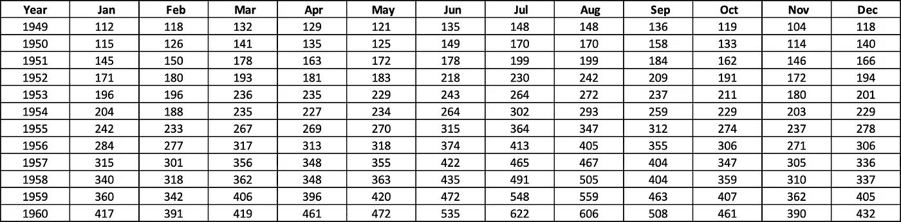

**flights.csv** (数据集由 seaborn.pydata.org 提供)

现在，让我们开始绘制数据集。绘制数据集中的列的格式如下所示:

```
\addplot+[*<options>*] table[x=*colname*,y=*colname*, col sep=*sep*] {*filename.csv*};
```

要求在每个`\addplot`命令后增加一个`;`。*注意:也可以用* `*\addplot[<options>]*` *代替* `*\addplot+[<options]*` *。两者的区别仅仅在于你是希望将你的* `*<options>*` *追加到默认的* `*cycle list*` *(选项控制线条样式)还是完全忽略* `*cycle list*` *。关于* PGFPlots *中可用的不同* `*cycle list*` *的详细信息，请参考* PGFPlots [*手册*](http://pgfplots.sourceforge.net/pgfplots.pdf) *第 4 章第 4.7.7 节。*

让我们结合到目前为止所学的知识，使用我们的数据集创建一个简单的线图。到目前为止的代码如下所示:

```
\begin{tikzpicture}
\begin{axis}[
    myplotstyle,
]
\addplot+[] table[x=year,y=Jan, col sep=comma] {Fig_lineplot.csv};
\addplot+[] table[x=year,y=Feb, col sep=comma] {Fig_lineplot.csv};
\addplot+[] table[x=year,y=Mar, col sep=comma] {Fig_lineplot.csv};
\addplot+[] table[x=year,y=Apr, col sep=comma] {Fig_lineplot.csv};
\end{axis}
\end{tikzpicture}
```

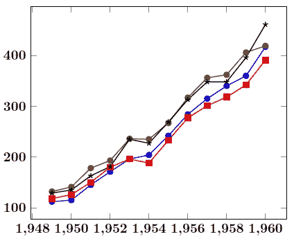

基于默认选项的初始绘图(图片由作者提供)

正如我们从左边的图中看到的，要使这个情节吸引人，还需要做大量的工作。

让我们先处理 x 轴和 y 轴标签！添加轴标签非常简单。只需在轴选项中添加`xlabel={Year}`和`ylabel={No. of passengers}`。另一个明显的样式是添加图例键。这可以通过添加`legend entries={Jan, Feb, Mar, Apr}`来实现。此外， *myplotstlye* 将图例定位在我们绘图的东北方向。从我们的图中可以看出，在这种情况下，这会阻塞图内容。因此，让我们使用`legend pos=south east`将该地块的图例移动到东南方。`legend pos`的其他选项有`south west`、`north east`和`north west`。您也可以使用选项`outer north east`在绘图外添加图例键。

在绘制的图上有一个明显的错误；每个 x 刻度标签代表一年，但显示时带有逗号分隔符。这可以通过将 x 刻度标签的数字格式更改为:

```
x tick label style={/pgf/number format/.cd, 
                    set thousands separator={}}
```

我还希望 x-tick 标签旋转 90 度，所以我也将添加`rotate=90`到 x-tick 标签样式。最终轴选项如下:

```
\begin{axis}[
    myplotstyle,
    legend pos=south east,
    legend entries={Jan, Feb, Mar, Apr},
    xlabel={Year},
    ylabel={No. of passengers},
    x tick label style={rotate=90, 
    /pgf/number format/.cd, set thousands separator={}},
   ]
}
```

让我们现在开始设计我们的线条和标记。这些风格选项将包含在`\addplot+[*<options>*]`中。让我们为线条/标记添加以下选项:

1.  `smooth`:在两点之间插值，使过渡平滑

2.`mark=`:您可以指定您喜欢的标记样式(PGFPlots [手册](http://pgfplots.sourceforge.net/pgfplots.pdf)中提供了`marks`选项的详细列表)或使用`cycle list`中的默认线条样式。在末尾添加一个`*`(比如说`triangle*`)表示标记需要填充相应的线条颜色

3.`mark options={}`:在这里，您可以指定`marker size`，是否希望`scale`标记大小、`fill`用特定颜色等。

带有选项的示例`\addplot`命令如下所示:

```
\addplot+[smooth, mark=diamond*, mark options={scale=2,fill=white}] table[x=year,y=Jan, col sep=comma] {Fig_lineplot.csv};
```

而且就是这么简单！最终的代码将如下所示:

```
\begin{tikzpicture}
\begin{axis}[
    myplotstyle,
    legend pos=south east,
    legend entries={Jan, Feb, Mar, Apr},
    xlabel={Year},
    ylabel={No. of passengers},
    x tick label style={rotate=90, /pgf/number format/.cd, set thousands separator={}},
]
\addplot+[smooth, mark=diamond*, mark options={scale=2,fill=white}] table[x=year,y=Jan, col sep=comma] {Fig_lineplot.csv};
\addplot+[smooth, mark=*, mark options={scale=1.5,fill=white}] table[x=year,y=Feb, col sep=comma] {Fig_lineplot.csv};
\addplot+[smooth,, mark=triangle*, mark options={scale=2,fill=white}] table[x=year,y=Mar, col sep=comma] {Fig_lineplot.csv};
\addplot+[smooth, mark=square*, mark options={scale=1.5,fill=white}] table[x=year,y=Apr, col sep=comma] {Fig_lineplot.csv};
\end{axis}
\end{tikzpicture}
```

这是最后的剧情结局:

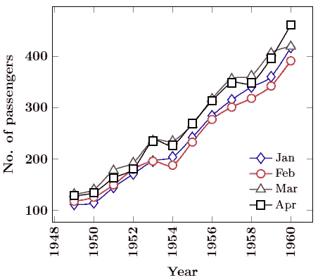

定制后的最终剧情(图片由作者提供)

使用整个数据集的示例图如下所示:

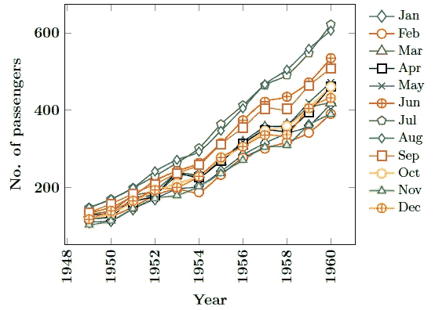

定制后所有月份的最终绘图(图片由作者提供)

## 2.对数轴图

我们要生成的下一个图是一个简单的对数图。我们将使用这个图来探索两个定制:

1.  如何使用 PGFPlots 绘制双对数或半对数图？
2.  如何使用中的列数据？csv 文件作为轴刻度标签？

用于该图的数据集如下所示。正如我们从数据集中看到的，它有两列:月份和 2020 年印度马哈拉施特拉邦相应的新冠肺炎确诊病例数。只需要绘制这些列中的一列；另一列将用作 x 轴刻度标签。那么我们如何使用 PGFPlots 来绘制呢？

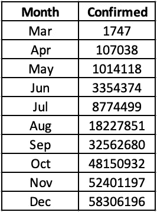

马哈拉施特拉邦 2020 年每月新冠肺炎病例(数据集由 [Kaggle](https://www.kaggle.com/imdevskp/covid19-corona-virus-india-dataset) 提供)；作者修改)

让我们首先根据目前所学的知识创建一个简单的情节:

```
\begin{tikzpicture}
\begin{axis}[
    myplotstyle,
    xlabel={Month $(2020)$},
    ylabel={No. of confirmed cases},
]
\addplot+[mark=o,mark options={scale=1.5}] table[x expr=\coordindex, y=confirmed, col sep=comma] {Fig_semilogplot.csv};
\end{axis}
\end{tikzpicture}
```

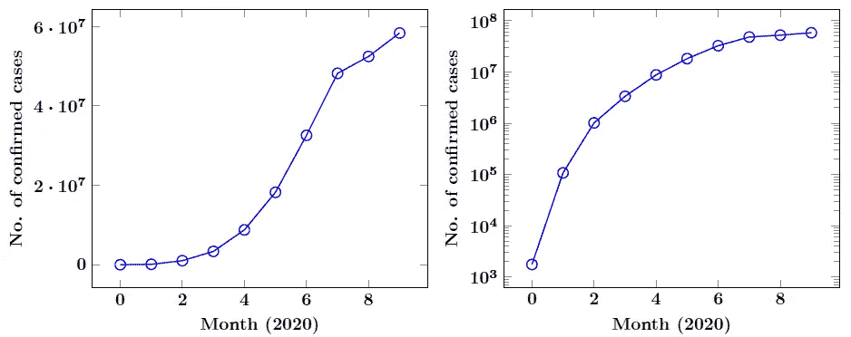

法线轴和半对数 y 轴上的初始图(图片由作者提供)

在这里，因为我们没有任何要在 x 轴上绘制的列，所以我们使用`x expr=\coordindex`来绘制相对于坐标索引的 y 轴数据。我们得到的图显示在左手边。很难从这个情节中正确地推断出疫情的行为。在这种情况下，更谨慎的做法是在双对数轴(在我们的例子中，是半对数轴)上重新排列这些信息。为了将我们的图从正态改为半对数，我们需要将轴环境从`begin{axis} ... \end{axis}`修改为`\begin{semilogyaxis} ... \end{semilogyaxis}`(因为我们只想将 y 轴修改为对数刻度)。对数轴环境的其他选项包括`semilogxaxis`和`loglogaxis`。从图中可以看出，在我们的图中使用半对数特征，我们可以更清晰地推断趋势。

但是，剧情还是有很多问题。看一下 x 轴刻度标签，我们可以看到从`x expr=\coordindex`提供的默认刻度中无法获得任何信息。控件中的月列值。csv 文件作为 x 轴刻度标签，我们将添加以下轴选项:

```
table/col sep=comma,
xticklabels from table={*filename.csv*}{*colname*}
```

首先，我们需要为我们的。csv 文件使用`table/col sep`选项。然后，我们可以使用命令`xticklabels from table`指示 PGFPlots 从表中的特定列检索 x-tick 标签。

另一个样式偏好是如何显示对数轴刻度标签。一些人喜欢用科学符号来显示它，而另一些人则喜欢数字原样显示。如果您希望将对数轴刻度标签显示为固定数字，那么您可以使用命令`log ticks with fixed point`显示所有带有固定数字符号的对数轴。因为半对数图只有一个对数轴，所以使用起来很简单。然而，如果你正在绘制一个双对数图形，并且希望只将一个对数轴修改成固定的数字符号，那么这篇关于 [stackexchange](https://tex.stackexchange.com/a/139084) 的文章可以帮到你！

我们几乎完成了我们的造型！让我们使用之前学习的命令将 x 标记旋转 90 度。此外，我们将使用`xtick`选项为我们的绘图指定刻度位置。`xtick`选项的可能值是`\empty`、`data`或`{<list of coordinates>}`。`\empty`不会产生刻度线，而`{<list of coordinates>}`会在提供的坐标上产生刻度线。因为我们是从。csv 文件，我们将使用`xtick=data`在我们的地块的每个坐标产生刻度线。在我们完成之前还有最后一个修改。由于我们使用离散数据点来绘图，我们将删除连接标记的线。为此，PGFPlots 为我们提供了可以添加到`\addplot`命令的`only marks`选项。*注意:相反，如果你想只显示没有标记的线条，你可以使用* `*no marks*` *选项。*

就是这样！我们的半对数图的最终代码将如下所示:

```
\begin{tikzpicture}
\begin{semilogyaxis}[
    myplotstyle,
    table/col sep=comma,
    xticklabels from table={Fig_loglog_lineplot.csv}{month},
    xtick=data,
    x tick label style={rotate=90},
    xlabel={Month $(2020)$},
    ylabel={No. of confirmed cases},
    log ticks with fixed point,
]
\addplot+[only marks, mark=o, mark options={scale=1.5}] table[x expr=\coordindex, y=confirmed, col sep=comma] {Fig_loglog_lineplot.csv};
\end{semilogyaxis}
\end{tikzpicture}
```

在这里，我们可以看到我们对应的情节是什么样子的:

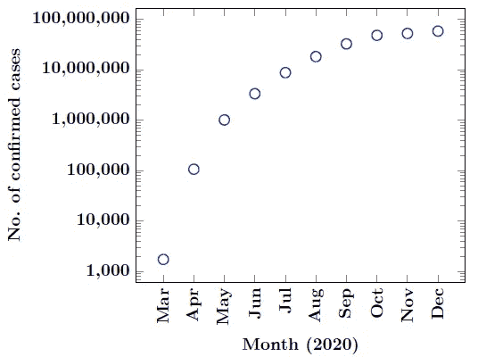

定制后的最终剧情(图片由作者提供)

## 3.多轴图

现在开始我们的下一个情节！让我们看看如何绘制第二个 y 轴。为了便于绘图，我将 seaborn (Python 绘图库)提供的 tips 数据集修改为两个独立的数据集。csv 文件(午餐时间的小费金额和晚餐时间的小费金额)。*注意:您也可以在单个。csv 文件来绘制相同的图形。*

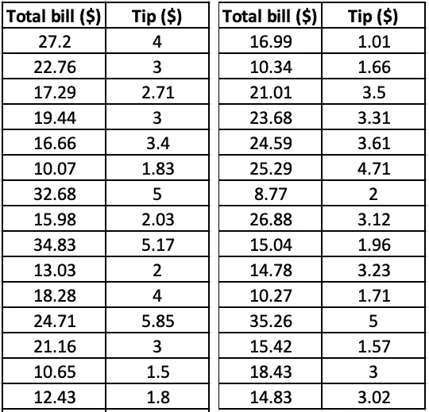

**tips.csv** (数据集由 seaborn.pydata.org 提供；作者修改)

我们将首先写下我们感兴趣的双轴环境的规格。

```
\begin{tikzpicture}%% axis 1 %%
\begin{axis}[
    myplotstyle,
    scale only axis,
    axis y line*=left,
    xlabel={Total bill $(\$)$},
    ylabel={Tips $(\$)$},
]
\addplot+[only marks, mark=*, mark options={scale=1.5, fill=white}] table[x=total_bill,y=tip, col sep=comma] {Fig_multiaxisplot_1.csv};
\end{axis}%% axis 2 %%
\begin{axis}[
    myplotstyle,
    scale only axis,
    axis y line*=right,
    axis x line=none,
    ylabel={Tips $(\$)$},
]
\addplot+[only marks, mark=triangle*, mark options={scale=1.5, fill=white}] table[x=total_bill,y=tip, col sep=comma] {Fig_multiaxisplot_2.csv};
\end{axis}
\end{tikzpicture}
```

现在，我们将两个环境相互叠加。为此，我们将在`\begin{tikzpicture}`之后立即使用`\pgfplotsset{set layers}`选项。还需要指定一些附加的样式选项:

1.  `axis y line*=left/right`:指定哪个数据集显示在哪个 y 轴上。*注:* `***` *表示轴没有箭头*
2.  `axis x line=none`:隐藏第二个图的 x 轴线
3.  `scale only axis`:强制两个 y 轴尺寸相同

合并后的代码现在看起来像这样:

```
\begin{tikzpicture}
\pgfplotsset{set layers}
%% axis 1 %%
\begin{axis}[
    myplotstyle,
    scale only axis, 
    axis y line*=left,
    xlabel={Total bill $(\$)$},
    ylabel={Tips $(\$)$},
]
\addplot+[only marks, mark=*, mark options={scale=1.5, fill=white}] table[x=total_bill,y=tip, col sep=comma] {Fig_multiaxisplot_1.csv};
\end{axis}
%% axis 2 %%
\begin{axis}[
    myplotstyle,
    scale only axis,
    axis y line*=right,
    axis x line=none,
    ylabel={Tips $(\$)$},
]
\addplot+[only marks, mark=triangle*, mark options={scale=1.5, fill=white}] table[x=total_bill,y=tip, col sep=comma] {Fig_multiaxisplot_2.csv};
\end{axis}
\end{tikzpicture}
```

基于这些规格的初始图如下所示:

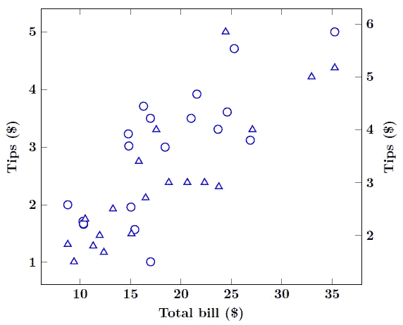

将两个轴分层后的初始图(图片由作者提供)

我们可以添加什么样式选项来使这个情节更有吸引力？让我们从使两个 y 轴限值相同开始。这可以通过为两个轴添加`ymin`和`ymax`来完成。让我们也改变左纵坐标的颜色为蓝色，右纵坐标为红色。我们通过为两个轴设置选项`y axis line style`、`y tick label style`和`ylabel style`来实现这一点。我们还将标记颜色与其对应的轴颜色进行匹配。

目前的代码是:

```
\begin{tikzpicture}
\pgfplotsset{set layers}
%% axis 1 %%
\begin{axis}[
    myplotstyle,
    scale only axis,
    axis y line*=left,
    ymin=0, ymax=7,
    y axis line style={blue},
    y tick label style={blue},
    ylabel style={blue},
    xlabel={Total bill $(\$)$},
    ylabel={Tips $(\$)$},
]
\addplot+[only marks, mark=*, mark options={scale=1.5, fill=white}] table[x=total_bill,y=tip, col sep=comma] {Fig_multiaxisplot_1.csv};
\end{axis}
%% axis 2%%
\begin{axis}[
    myplotstyle,
    scale only axis,
    axis y line*=right,
    ymin=0, ymax=7,
    axis x line=none,
    y axis line style={red},
    tick label style={red},
    ylabel style={red},
    ylabel={Tips $(\$)$},
]
\addplot+[only marks, mark=triangle*, color=red, mark options={scale=1.5, fill=white}] table[x=total_bill,y=tip, col sep=comma] {Fig_multiaxisplot_2.csv};
\end{axis}
\end{tikzpicture}
```

这就是我们的地块现在的样子:

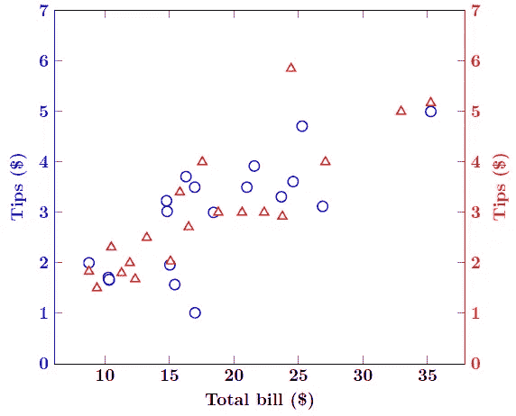

自定义 y 轴样式后的绘图(图片由作者提供)

由于我们的 y 轴标签是相同的，谨慎的做法是添加一个图例，使该图信息更加丰富。我们需要一些调整来为两个轴环境渲染一个单独的图例。为此，我使用了在 [stackexchange](https://tex.stackexchange.com/a/42752) 上提出的解决方法。我们将向第一个图添加一个标签，并使用该标签为第二个轴环境中的第一个图创建一个图例条目。最终的代码将如下所示:

```
\begin{tikzpicture}
\pgfplotsset{set layers}
\begin{axis}[
    myplotstyle,
    scale only axis,
    axis y line*=left,
    ymin=0, ymax=7,
    y axis line style={blue},
    y tick label style={blue},
    ylabel style={blue},
    xlabel={Total bill $(\$)$},
    ylabel={Tips $(\$)$},
]
\addplot+[only marks, mark=*, mark options={scale=1.5, fill=white}] table[x=total_bill,y=tip, col sep=comma] {Fig_multiaxisplot_1.csv};
\label{multiplot:plot1}
\end{axis}
\begin{axis}[
    myplotstyle,
    scale only axis,
    axis y line*=right,
    ymin=0, ymax=7,
    axis x line=none,
    y axis line style={red},
    y tick label style={red},
    ylabel style={red},
    ylabel={Tips $(\$)$},
    legend pos=south east,
]
\addlegendimage{/pgfplots/refstyle=multiplot:plot1}\addlegendentry{Tips during lunch hour}
\addplot+[only marks, mark=triangle*, color=red, mark options={scale=1.5, fill=white}] table[x=total_bill,y=tip, col sep=comma] {Fig_multiaxisplot_2.csv};
\addlegendentry{Tips during dinner hour}
\end{axis}
\end{tikzpicture}
```

从上面的代码中我们可以看到，添加图例条目的另一种方式是在`\addplot`命令后使用`\addlegendentry[*<options>*]{*text*}`。我使用了`\addlegendimage{}`命令来引用第一个图的线条样式。然后，我们将在相应的`\addplot`命令后，添加该轴环境中绘图的图例。*注意:为了保持顺序，我在第二个图的* `*\addplot*` *命令前添加了第一个图的图例。*

我们做到了！这是我们最后的情节:

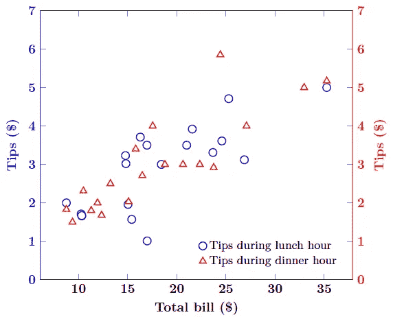

定制后的最终剧情(图片由作者提供)

## 4.均值图

我们要处理的下一个场景是如何在情节中添加文本。为此，让我们再次使用小费数据集(午餐和晚餐时间数据集的组合)来创建一个均值图。

像往常一样，让我们从利用我们目前所学的知识创建一个基本情节开始:

```
\begin{tikzpicture}
\begin{axis}[
    myplotstyle,
    xlabel={Total bill ($\$$)},
    ylabel={Tips ($\$$)},
]\addplot+[only marks, mark=square, color=red, mark options={scale=2}] table[x=total_bill,y=tip, col sep=comma] {Fig_multiaxisplot_1.csv};
\addplot+[only marks, mark=square, color=red, mark options={scale=2}] table[x=total_bill,y=tip, col sep=comma] {Fig_multiaxisplot_2.csv};
\end{axis}
\end{tikzpicture}
```

这就是我们的出发点:

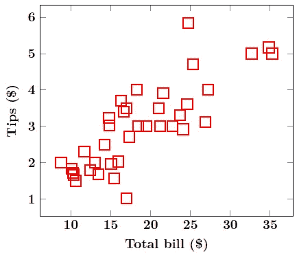

带有基本定制的初始情节(图片由作者提供)

现在，我们需要添加一条均值线和两条标准差线(`mean + 2σ`和`mean-2σ`；我已经预先计算了必要的值)。为了绘制常量值，我们可以使用格式`\addplot+[]{*constant*}`(在这种情况下，我们必须指定需要绘制直线的区域)或`\addplot+[] coordinates{*(x,y)*}`。*注意:这两个选项我都参考过了。我还指定了常量值图的区域。由于添加一个域会引起轴界限的变化，所以我又添加了*`*xmin*`*`*xmax*`*`*xtick*`*`*ytick*`*。*这是我们目前为止的代码:***

```
**\begin{tikzpicture}
\begin{axis}[
    myplotstyle,
    xlabel={Total bill ($\$$)},
    ylabel={Tips ($\$$)},
    xmin=0, xmax=40,
    xtick={5,10,15,20,25,30,35},
    ytick={1,2,3,4,5,6},
    domain=5:35,
]
\addplot+[smooth, only marks, mark=square, mark options={scale=2,fill=white}, color=red] table[x=total_bill,y=tip, col sep=comma] {Fig_multiaxisplot_1.csv};
\addplot+[smooth, only marks, mark=square, mark options={scale=2,fill=white}, color=red] table[x=total_bill,y=tip, col sep=comma] {Fig_multiaxisplot_2.csv};
\addplot+[smooth, no marks, color=black, dashdotted] {2.97};
\addplot+[smooth, no marks, color=black, solid] {0.62};
\addplot+[smooth, no marks, color=black, solid] coordinates {(5, 5.32) (35, 5.32)};
\end{axis}
\end{tikzpicture}**
```

**相应的绘图输出为:**

**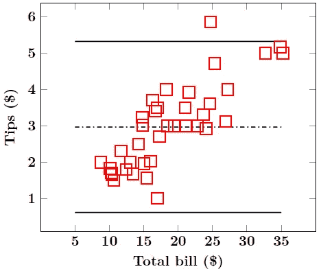**

**添加均值和标准差线后的绘图(图片由作者提供)**

**在我们为每条常量线添加描述之前，这个图是不完整的。我在这里使用的方法是在期望的位置添加一个`node`。我将基于`rel axis cs`(或者，相对轴坐标系；详见下图)。**

**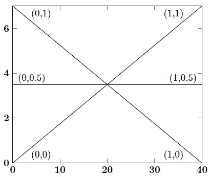**

**基于**相对轴 cs** 定位节点(图片由作者提供)**

**添加节点遵循的格式是:**

```
**\node[*<options>*] at (rel axis cs: *x,y*) {*text*};**
```

**添加文本描述后的最终代码如下所示:**

```
**\begin{tikzpicture}
\begin{axis}[
    myplotstyle,
    xlabel={Total bill ($\$$)},
    ylabel={Tips ($\$$)},
    xmin=0, xmax=40,
    xtick={5,10,15,20,25,30,35},
    ytick={1,2,3,4,5,6},
    domain=5:35,
]\addplot+[smooth, only marks, mark=square, mark options={scale=2,fill=white}, color=red] table[x=total_bill,y=tip, col sep=comma] {Fig_multiaxisplot_1.csv};
\addplot+[smooth, only marks, mark=square, mark options={scale=2,fill=white}, color=red] table[x=total_bill,y=tip, col sep=comma] {Fig_multiaxisplot_2.csv};\addplot+[smooth, no marks, color=black, dashdotted] {2.97};
\node [] at (rel axis cs: 0.2,0.51) {Mean};\addplot+[smooth, no marks, color=black, solid] coordinates {(5, 5.32) (35, 5.32)};
\node [] at (rel axis cs: 0.24,0.87) {Mean + $2\sigma$};\addplot+[smooth, no marks, color=black, solid] {0.62};
\node [] at (rel axis cs: 0.23,0.13) {Mean - $2\sigma$};\end{axis}
\end{tikzpicture}**
```

**我们的最终图如下所示:**

**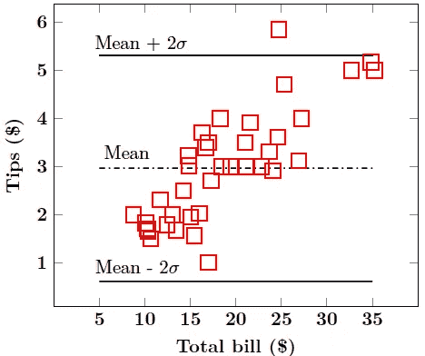**

**定制后的最终剧情(图片由作者提供)**

## **5.覆盖在图形上的绘图**

**现在，我将在本文中处理的最后一个图是覆盖在图像上的图。为此，我将使用下图。*注意:我将删除下表中提供的轴和刻度标签，代之以添加我自己的轴和刻度标签。***

**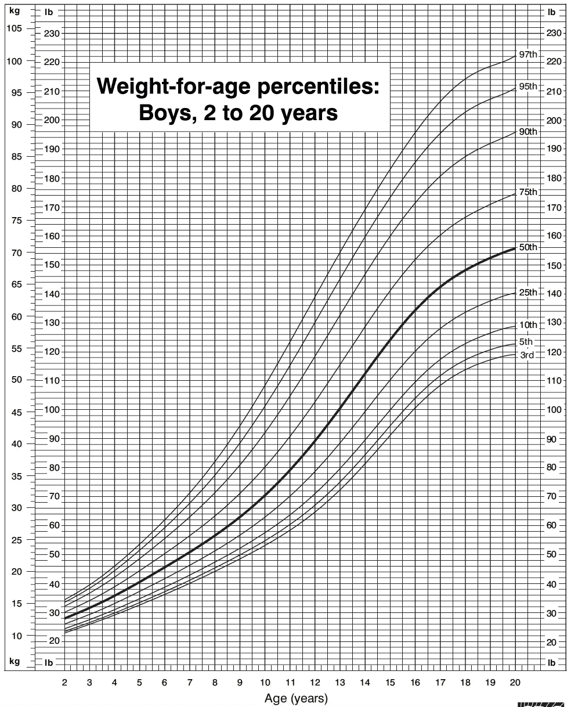**

**用于覆盖权重数据集的图像(生长图由[疾病控制和预防中心](https://www.cdc.gov/)提供——临床生长图)**

**我将在此图中使用一个虚拟的权重数据集(见下文)。**

**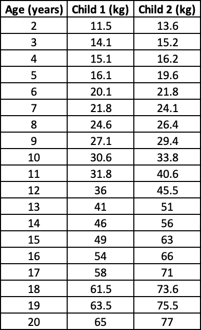**

****weights.csv** (作者创作)**

**让我们首先基于数据集创建一个简单的绘图。下面给出了到目前为止带有相应图形的代码:**

```
**\begin{tikzpicture}
\begin{axis}[
    myplotstyle,
    legend pos=south east,
    legend entries={{\large Child 1}, {\large Child 2}},
    xlabel={Age (in years)},
    ylabel={Weight (in $kg$)},
]\addplot+[only marks, mark options={scale=1.5}, mark=triangle,color=blue] table[x=age,y=weight1, col sep=comma] {Fig_overlaidplot.csv};
\addplot+[only marks, mark options={scale=1.5}, mark=square,color=red] table[x=age,y=weight2, col sep=comma] {Fig_overlaidplot.csv};
\end{axis}
\end{tikzpicture}**
```

**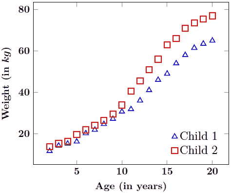**

**带有默认选项的初始绘图(图片由作者提供)**

**我们将修改一些东西，使我们的绘图和图像具有匹配的尺寸和轴刻度标签:**

1.  **我们将添加`width`和`height`选项来改变我们绘图的维度**
2.  **我们将使用`xmin`、`xmax`、`ymin`和`ymax`选项将我们的轴限制与图像对齐**
3.  **最后，我们将添加`xtick`和`ytick`选项，以使我们的绘图轴刻度标签与图像的刻度标签相匹配(我已经用公制单位指定了 y 轴的权重)**

**我们的代码组合在一起将如下所示:**

```
**\begin{tikzpicture}
\begin{axis}[
    myplotstyle,
    legend pos=south east,
    legend entries={{\large Child 1}, {\large Child 2}},
    xlabel={Age (in years)},
    ylabel={Weight (in $kg$)},
    ymin=5, ymax=105,
    ytick={10,15,20,25,30,35,40,45,50,55,60,65,70,75,80,85,90,95,100},
    xmin=2, xmax=21,
    xtick={2,3,4,5,6,7,8,9,10,11,12,13,14,15,16,17,18,19,20},
    width=13cm, height=15cm,
]\addplot+[only marks, mark options={scale=1.5}, mark=triangle,color=blue] table[x=age,y=weight1, col sep=comma] {Fig_overlaidplot.csv};
\addplot+[only marks, mark options={scale=1.5}, mark=square,color=red] table[x=age,y=weight2, col sep=comma] {Fig_overlaidplot.csv};
\end{axis}
\end{tikzpicture}**
```

**相应的曲线将会是:**

**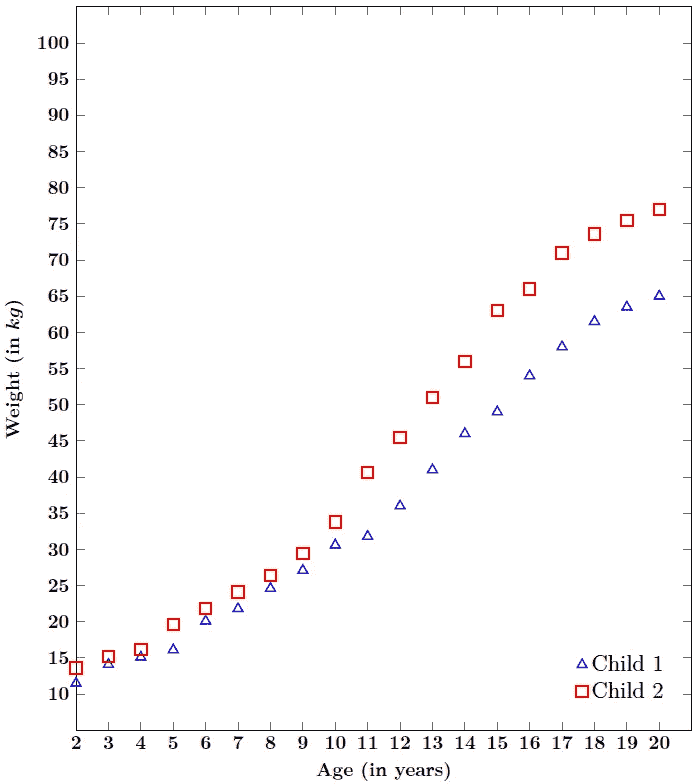**

**覆盖在生长图上的初始图(图片由作者提供)**

**现在，将图形添加到绘图中的命令是:**

```
**\addplot graphics[*<options>*] {*figure.png*};**
```

**该图背后的中心思想是在我们的绘图轴坐标内拟合图形。因此，我们必须添加带有选项`xmin`、`xmax`、`ymin`和`ymax`的`\addplot graphics`命令，以匹配主绘图的选项。我还添加了`axis on top`选项，将轴线和刻度定位在图像上。**

**而且就是这么简单！最终代码将是:**

```
**\begin{tikzpicture}
\begin{axis}[
    myplotstyle,
    legend pos=south east,
 legend entries={{\large Child 1}, {\large Child 2}},
    xlabel={Age (in years)},
    ylabel={Weight (in $kg$)},
    ymin=5, ymax=105,
    ytick={10,15,20,25,30,35,40,45,50,55,60,65,70,75,80,85,90,95,100},
    xmin=2, xmax=21,
    xtick={2,3,4,5,6,7,8,9,10,11,12,13,14,15,16,17,18,19,20},
    axis on top,
    width=13cm, height=15cm,
]\addplot+[only marks, mark options={scale=1.5}, mark=triangle,color=blue] table[x=age,y=weight1, col sep=comma] {Fig_overlaidplot.csv};
\addplot+[only marks, mark options={scale=1.5}, mark=square,color=red] table[x=age,y=weight2, col sep=comma] {Fig_overlaidplot.csv};
\addplot graphics[ymin=5, ymax=105, xmin=2, xmax=21] {Fig_comparisons.png};
\end{axis}
\end{tikzpicture}**
```

**我们的叠加图看起来会像这样:**

**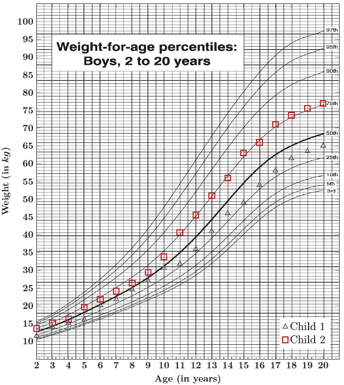**

**定制后的最终剧情(图片由作者提供)**

# **感谢阅读！:)**

**这篇文章就到此为止了！**

**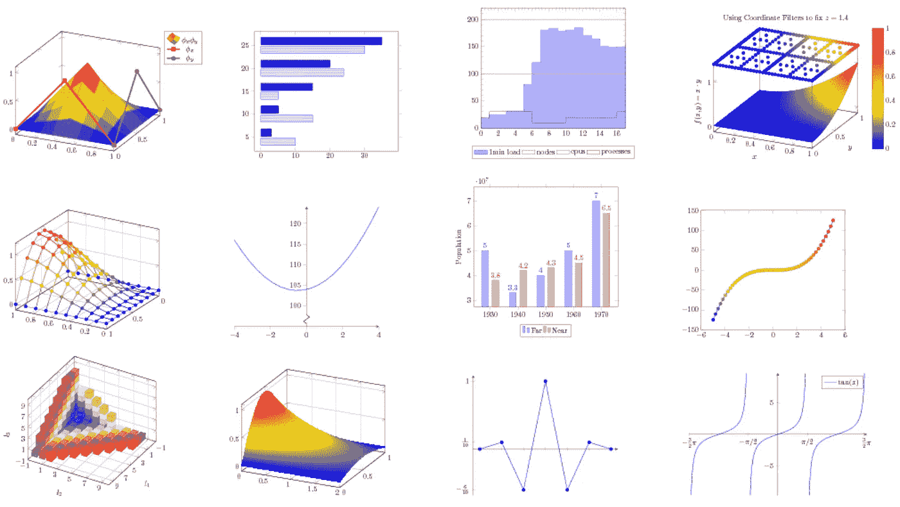**

**图片来源:[http://pgfplots.sourceforge.net/](http://pgfplots.sourceforge.net/)**

**当然，这只是 LaTeX 呈现给我们的整个范围的一小部分！对于初学者来说，用 LaTeX 绘图可能会令人望而生畏。我希望这篇文章能帮助新手不要被大量的信息淹没，并鼓励他们使用这个神奇的工具。如果这篇文章说服了你至少尝试一下用 LaTeX 绘图，我甚至会认为它是成功的！**

**快乐学习！**