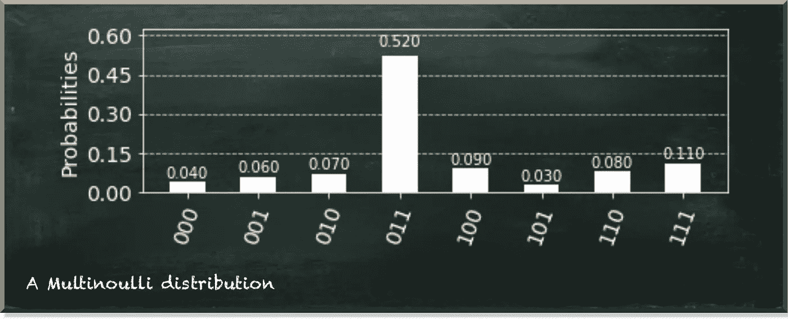
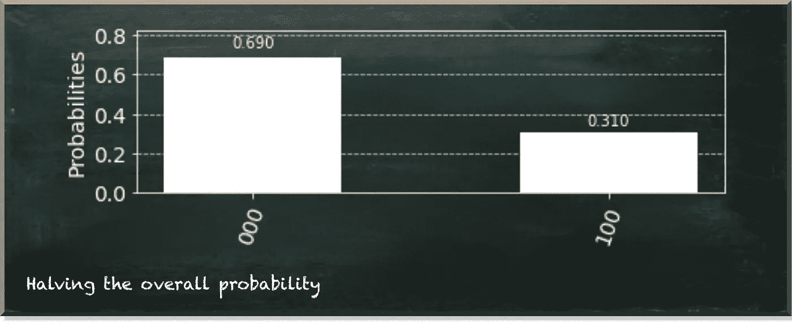
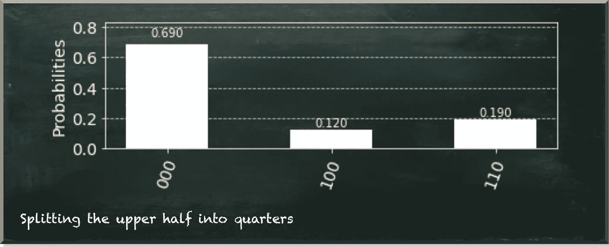
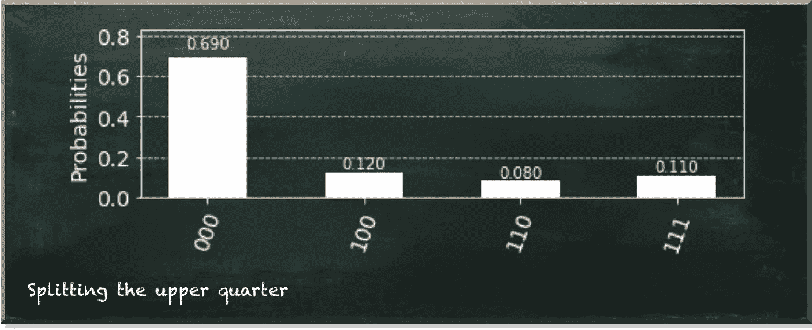
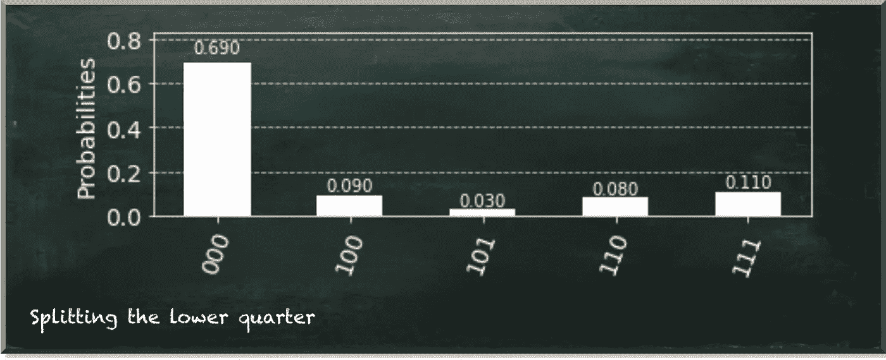
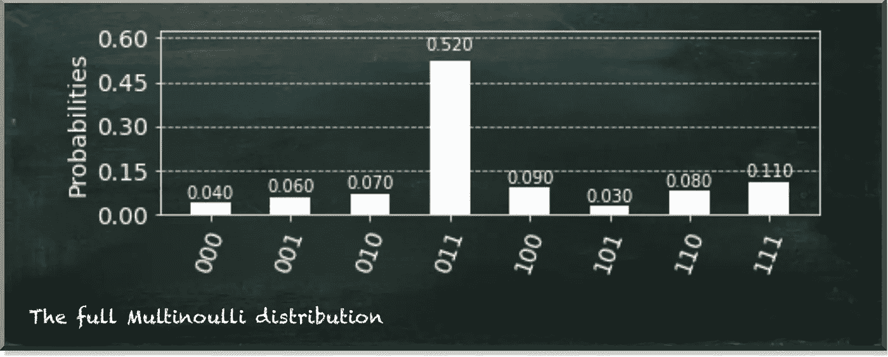

# 如何用 Qiskit 创建量子多内核分布

> 原文：<https://towardsdatascience.com/how-to-create-quantum-multinoulli-distributions-with-qiskit-cea9021f6cb9?source=collection_archive---------34----------------------->

## 实践中的量子机器学习

量子机器学习要不要入门？看看 [**动手量子机器学习用 Python**](https://www.pyqml.com/page?ref=medium_multinoulli&dest=/) **。**

概率分布在机器学习中无处不在。我们的目标是回答最简单的问题还是解决最大的问题并不重要。从技术上讲，目标总是从数据中学习一个未知的概率分布。

无论我们进行简单的回归分析还是训练深度神经网络，都无关紧要。目标总是找到某个概率分布。

而且，就算用量子机器学习算法也没关系。最终，你要寻找的答案将是概率性的。

但并不是所有的概率分布都是一样的。他们可能是非常异质的。每种类型的分布都有其特殊性，你最好知道。如果你不知道哪种分布适合你手头的问题，你就有麻烦了。

此外，如果您知道哪种分布适合您的问题，但不知道如何生成合适的分布，您的情况也不会更好。而且，你猜怎么着，用量子位生成分布本身就是一个挑战。

经典计算机有数十亿比特的内存。节省一些来存储概率分布没什么大不了的。但是量子计算机只有不到一百个量子位。我们应该考虑如何有效地表示一个概率分布。幸运的是，一个量子位不仅仅是 0 或 1。即使如果我们测量它，它只有 0 或 1，但它处于量子叠加态。这个状态包含了更多的信息。

[在之前的](/the-very-first-step-into-quantum-machine-learning-95efdf0d980c)中，我们研究了如何创建一个量子系统来重现伯努利分布。伯努利分布是所有分布中最简单的。只有两个可能的值，每个值都以一定的概率出现。这差不多就是单个量子比特叠加的含义。

假设我们的单个量子比特在|𝜓⟩=√0.7|0⟩+√0.3|1⟩.态如果你在这种状态下测量许多量子位，就会产生以下伯努利分布。

作者图片

伯努利分布回答简单的问题，你可以用“是”或“否”来回答。例如，一名乘客在泰坦尼克号沉船中幸存了吗？这是一只猫吗？这个学生通过考试了吗？

但是如果我们有多种可能的答案呢？假设我们想从著名的 MNIST 数据集中标注手写数字？显然，我们需要区分两个以上的输出值。

我们需要多个量子位来代表所有类别，因为我们测量单个量子位为 0 或 1。假设我们想要标记从 0 到 7 的数字。然后，我们有八个不同的类别。我们可以用三个量子位来编码这些可能的结果。量子位测量的每个组合代表一个数字。000 代表数字 0。001 代表 1。010 代表 2。011 代表 3，以此类推。最后，111 代表 7。

因此，我们会得到一个多内核分布，也称为分类分布。它涵盖了一个事件有多种可能结果的情况。因此，它概括了伯努利分布，该分布涵盖了两种可能结果中的一种。

作者图片

那么，假设我们有这样一个多元分布的数据。

实际问题是:“**怎样才能让一个量子电路代表这样的分布？**”

最简单的方法就是把这些概率转换成振幅，传递给量子电路的`initialize`函数。

真正的神奇发生在第 6 行。我们计算三量子位系统的初始状态。整个技巧是取每个概率的平方根，因为概率是量子态振幅的平方。

Qiskit `QuantumCircuit`的`initialize`功能将所有振幅列表作为输入参数(参见[官方 Qiskit 文档](https://qiskit.org/documentation/stubs/qiskit.circuit.QuantumCircuit.initialize.html#qiskit.circuit.QuantumCircuit.initialize))。

当我们用`'statevector_simulator'`执行这个电路时，它会再现我们指定的精确分布。

**还有别的办法吗？我们能通过使用量子门来创造多量子分布吗？**

当然了。但是，这并不简单。

我们可以使用量子门来转换量子位的状态。例如，我们可以使用`qc.ry(theta, 0)`函数将位置 0 的量子位的状态向量旋转角度`theta`。此外，我们可以使用`prob_to_angle`函数根据概率计算角度θ。更多细节请看[这篇文章](https://betterprogramming.pub/if-you-want-to-gamble-with-quantum-computing-e327c11f97e5)。

问题是，在我们的分布中，我们将单个量子位的值用于不同的值。例如，对于所有状态`['100', '101', '110', '111']`，左边的数字是 1。

所以，当我们指定量子位 3(左手边的量子位)的状态时，我们需要取所有这些状态的概率之和。

首先，我们定义我们的便利函数`prob_to_angle`并定义一个`QuantumRegister`。`QuantumRegister`是我们量子位的容器，允许我们在 Python 代码中轻松地处理单个量子位。

动作从第 9 行开始。在那里，我们将分布的值从 4 到 7 分开，计算这些状态的总和，并将我们的总概率分成两半。下图描述了迄今为止的状态。

作者图片

因此，我们只区分两类国家。高位量子位为 0 的和高位量子位为 1 的。(注意:上量子位在图中字符串的左下方。)

下一步，我们进一步将后半部分减半。我们应用相同的逻辑。我们把上量子位为 1 的状态分成四分之二。

与第一次分裂的唯一区别是我们使用的量子门。这一次，我们使用受控 RY 门而不是普通 RY 门。不同之处在于，如果控制量子位为 1，受控 RY 门仅应用概率分割。在我们的例子中，这意味着我们只拆分“100”块，而不改动“000”块。

作者图片

最后，我们还需要一个上季度的分裂。我们必须分别管理每个季度。首先，我们把上面的四分之一分成两半。现在，我们必须只触及两个上量子位为 1 的状态。因此，我们使用多控 RY 门(`qc.mcry`)。

在这一点上，`QuantumRegister`派上了用场，因为我们可以以数组的形式访问量子位。术语`qr[1:]`选择除第一个以外的所有量子位。这些是多重控制 RY 门的控制量子位。最后一个参数`qr[0]`表示目标量子位。

作者图片

我们还需要使用另一个多重控制的 RY 门来分割下面的四分之一。我们把它封装成非门，应用在中间的量子位上。这让我们可以选择中间量子位是 0 而不是 1 的状态。

到目前为止的结果表明，我们准备了一半的状态。

作者图片

我们还需要在下半部分执行相应的步骤，以生成整体分布。这是完整的源代码。

当我们看结果时，我们看到它类似于我们的多诺尔分布。

作者图片

方法很简单。我们重复地将状态分成两半，并应用相应的量子位变换。然而，这比简单地用概率初始化三个量子位要多得多。

但是在某些情况下，你不能在初始化的时候指定所有的概率。例如，如果创建一个量子贝叶斯网络，分布值可能来自其他变量。然后，您不可避免地希望能够以编程方式创建一个多内核发行版。

量子机器学习要不要入门？看看 [**动手量子机器学习用 Python**](https://www.pyqml.com/page?ref=medium_multinoulli&dest=/) **。**

在这里免费获得前三章。