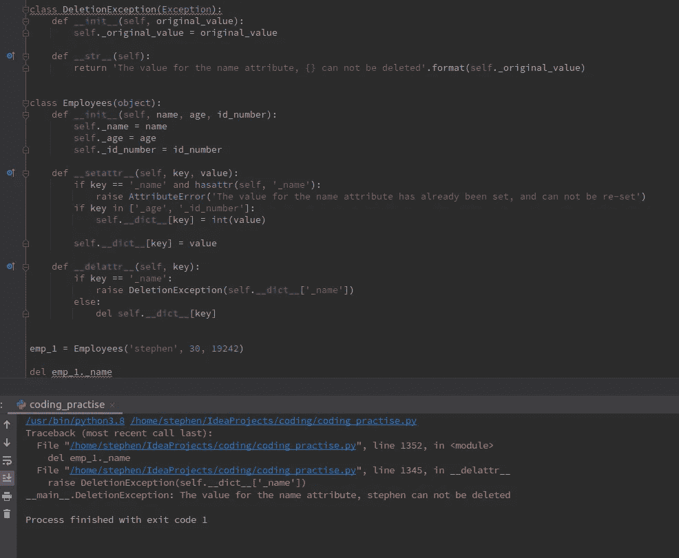

# 如何在 Python 类中创建只读和删除证明属性

> 原文：<https://towardsdatascience.com/how-to-create-read-only-and-deletion-proof-attributes-in-your-python-classes-b34cd1019c2d?source=collection_archive---------25----------------------->

## 对类中的属性施加控制

图片由 Charles Deluvio 通过 [Unsplash](https://unsplash.com/photos/IKsfuuujdqo) 提供

## 控制你的属性

本教程将演示如何在 Python 类中创建只读和防删除属性。通过这种方式，可以对您的属性应用额外的控制层，确保您的类按预期使用。虽然在 Python 中有多种方法可以创建只读和防删除属性，但使用 setattr 和 delattr dunder 方法是快速控制对象中属性的一种便捷方法。

## 示例:雇员类

设置属性一次

举例来说，假设我们正在创建一个简单的 Employee 类，它需要在对象中设置三个值。这些值将是雇员的姓名、年龄和唯一的 id 号。这些属性值将在属性中设置；并且用下划线表示，表示它们是私有属性，不打算在类外使用。

一旦设置了`__init__`方法，就有必要定义神奇的方法`__setattr__`。在这种方法中，我们可以应用一些简单的逻辑来施加强大的属性控制。在给出的例子中，当属性在对象初始化期间首先被设置时，方法将调用方法。我们可以通过应用以下逻辑来防止`_name`属性被重置。

为了实现这一点，我们可以编写一个条件，当设置一个新属性时，如果该属性等于`_name` *并且*已经有一个值，那么程序将退出并引发一个内置的`AttributeError`异常，并在标准错误(stderr)输出中显示一条定制消息。`_name`属性是在对象初始化期间设置的，因此对该属性的任何重置都会引发异常并终止程序。

我们还可以进一步控制，确保`_age`和`_id_number`属性都是整数类型。我们可以创建一个列表，并在将它们设置为整数之前检查`_age`和`_id_number`属性是否在最后。下面的 setattr 方法显示了实现这一点的代码。

**注意:**在所示的例子中，当设置一个属性时，它不是使用 setattr 魔术方法中的 object.attribute 语法来设置的，而是使用`object.__dict__[key] = value`。如果我们使用前一种方法，将会启动一个无休止的递归循环，因为 object.attribute 语法将调用 setattr 方法！

现在，让我们创建一个 Employee 对象，并检查是否已经设置了属性。如图所示，属性已经设置，并且是正确的类型。

现在，假设我们想要重新设置`_name`属性，尽管它已经被设置了。在这种情况下，会引发`AttributeError`异常，并向控制台输出一条消息，通知用户 name 属性已经被设置，并且不能被重新设置。

## 删除证明属性

为了证明我们的名称属性删除，我们可以简单地向 dunderlattr 方法添加一些逻辑。这里，我们说如果用户试图从对象中删除属性名，将会出现一个`AttributeError`异常，通知用户名称属性不能被删除。但是，我们仍然允许用户删除 Employee 对象中任何其他属性的行为。

当我们试图从 Employee，emp_1 对象中删除受保护的 name 属性时，会引发一个`AttributeError`异常。

## 奖励:自定义信息类

虽然`AttributeError`类很好地向用户解释了当用户试图删除`_name`属性时程序为什么会退出，但是通过构建一个定制的异常类，这个原因可以变得*甚至*更加明确。

我们可以编写一个自定义的`DeletionException`类，如果用户试图删除`_name`属性，这个类将被引发。当`DeletionException`类被引发时，我们还可以有效地告诉用户 name 属性当前是什么。该消息可以打印到标准错误输出中。

为此，我们创建了一个`DeletionException`类，它从基本异常类继承并接受一个参数，这里是属性的初始值。当类被实例化时，例如当它被引发时，这个值在`DeletionException`对象中被设置。当它被引发时，我们将原始的 name 属性作为唯一的参数传递给该类。这发生在`__delattr__`方法内部。

当引发时，将调用`__str__`方法并打印出一条消息，通知用户不能删除 Employees 对象中的原始 name 属性。

## 摘要

可以通过定制逻辑修改 dunder 方法 setattr 和 delattr，以保护属性并控制它们的访问。此外，可以添加定制的异常类来有效地通知用户为什么属性受到保护。