# 如何创建实时人脸检测器

> 原文：<https://towardsdatascience.com/how-to-create-real-time-face-detector-ff0e1f81925f?source=collection_archive---------1----------------------->

## 使用 Python、TensorFlow/Keras 和 OpenCV

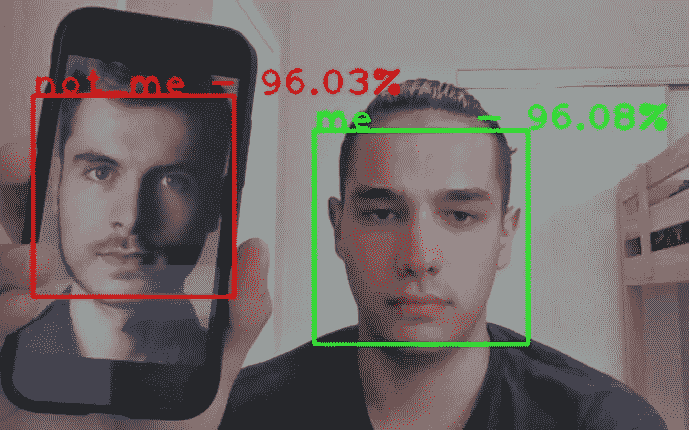

实时人脸检测器。不是我——照片由[西蒙·罗本](https://www.pexels.com/@simon-robben-55958?utm_content=attributionCopyText&utm_medium=referral&utm_source=pexels)从[派克斯](https://www.pexels.com/photo/man-in-brown-polo-shirt-614810/?utm_content=attributionCopyText&utm_medium=referral&utm_source=pexels)拍摄

在本文中，我将向您展示如何使用 Python、TensorFlow/Keras 和 OpenCV 编写实时人脸检测器。

我马上会注意到，所有代码文件都可以在[这个 repo](https://gitlab.com/Winston-90/me_not_me_detector/) 中获得。

[](https://gitlab.com/Winston-90/me_not_me_detector/) [## dmy tro Nikolai ev/me _ not _ me _ detector

### 用 Python，TensorFlow/Keras 和 OpenCV 实现实时人脸检测

gitlab.com](https://gitlab.com/Winston-90/me_not_me_detector/) 

首先，在**理论部分**我会告诉你一些对我们有用的概念(*迁移学习*和*数据扩充*)，然后我会在**实践部分**部分进行代码分析。

注意，您必须安装 *TensorFlow* 和 *OpenCV* 库来运行这段代码。你可以手动完成，或者在你下载了 repo 之后简单地运行`pip install -r requirements.txt` 命令。你也可以用 conda 命令`conda install -c conda-forge numpy, opencv, tensorflow` ***来完成。***

# 问题陈述

在这里，我想建立一个面部检测器，也可以区分我和其他人。你可以在本文末尾看到我的工作成果。

初始任务可以分为两个子任务:

1.  为人脸分类训练一个模型。
2.  调整模型，使其与作为检测器的网络摄像头一起工作。

更详细地说，该任务可以分为以下几个阶段:

1.  数据集集合。
2.  寻找迁移学习的基础模型。
3.  训练一个模特。
4.  将分类器转换为检测器。

在我开始分析这些阶段之前，我想非常简要地概述一下对我们有用的概念。

# 理论部分

在这一点上，我必须说，这个教程是不详细的，因为它可以。例如，我不会解释什么是*卷积*或者为什么在 CNN 架构中需要*池层*。当然，你需要知道这些才能理解 CNN 是如何工作的，但我认为如果我解释所有的概念，这个教程会太繁琐。另一方面，其他人已经解释了很多东西，而且做得比我好。例如，[在这里你可以读到 CNN 的概况](/a-comprehensive-guide-to-convolutional-neural-networks-the-eli5-way-3bd2b1164a53)，而[在这里——关于流行的 CNN 架构](https://www.jeremyjordan.me/convnet-architectures/)。

## 卷积神经网络

由于我们正在讨论图像识别，我们将使用 *CNN —卷积神经网络*，这种架构在这项任务中取得了最大的成功。


*典型的卷积神经网络架构。* [公共领域](https://en.wikipedia.org/wiki/File:Typical_cnn.png)

与经典神经网络(这里我指的是*FDN——前馈神经网络*)不同，在 CNN 中，神经元是:

*   首先:以矩阵(张量)的形式排列，而不是数组，
*   其次:它们只与前一层的一小部分神经元相连，因此层之间并不完全相连。

这种方法允许您显著减少网络参数的数量，并使图像的模板搜索更有效。

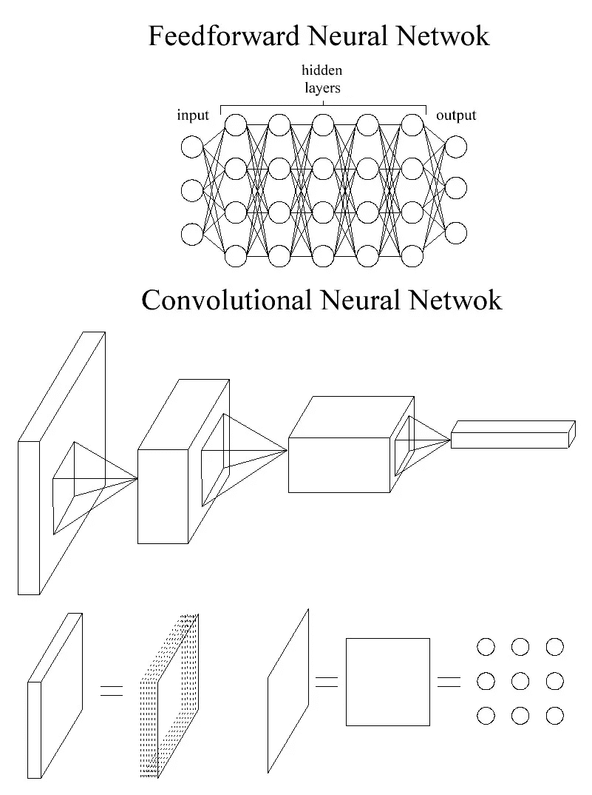

*前馈神经网络 vs 卷积神经网络*。作者图片

在这张图的底部，我想说明一下，CNN 中的层是一个*张量*(经常被画成平行六面体)。我将把张量作为矩阵序列来讲。所以这些张量中的每一个都是一系列的矩阵，像披萨盒一样一个接一个的叠在一起。反过来，矩阵只是以矩阵形式排列的神经元序列，而不是像在经典网络中那样的阵列。

## 迁移学习

迁移学习是这项任务中最重要的概念，因为从头开始构建人脸分类器非常困难(几乎不可能)。迁移学习是在自己的任务中使用预先训练好的模型的过程。

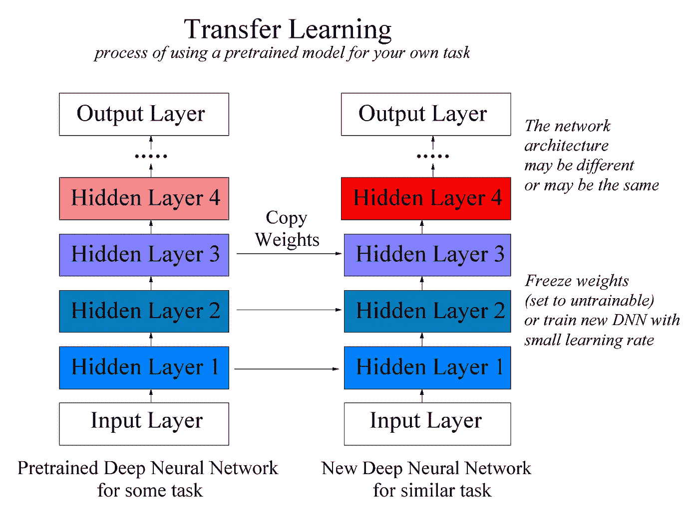

*转移学习*。作者图片

这种情况发生如下。你找到一个为类似任务训练过的模型(例如，识别 1000 类图像，就像在 *ImageNet* 中一样，而你只需要识别少数几类)。然后使用它的权重(冻结它们，这意味着它们不会改变)，并在您的小数据集上完成模型的训练。之后还可以解冻所有权重，继续用极小的学习率训练模型。

由于 CNN 架构和图像识别任务的特征，该过程变得可能(但是也可以用于不同的架构)。网络学会从一层到另一层(从输入到输出)看到模式，它们变得越来越复杂。事实证明，所有问题的一般模式大致相同，这允许我们使用预先训练的权重。

## 数据扩充

图像分类问题中的另一个重要概念是数据扩充。数据扩充是通过对原始图像应用一些变换来人为增加数据集大小的过程。例如，我们可以使用水平和垂直反射、小旋转或放大、颜色反转等等。这将显著增加数据集的大小，从而提高网络的概化能力。

[](/image-augmentation-for-deep-learning-histogram-equalization-a71387f609b2) [## 用于深度学习的图像增强

### 深度网络需要大量的训练数据来实现良好的性能。要建立一个强大的图像分类器…

towardsdatascience.com](/image-augmentation-for-deep-learning-histogram-equalization-a71387f609b2) 

在上面的例子中(文章中的第一个图像)，当偏移值很高时，有时会出现只有部分图像可见的情况。一方面，这是好的(在头部不可见的图像情况下，网络可以通过爪子和尾巴而不是通过口鼻来学习识别猫)，但如果你过度进行这样的转换，也会使网络混淆。

TensorFlow 中有多种数据扩充方法。我们可以生成图像并保存到磁盘，或者我们可以将生成器直接传送到网络。我选择了第一个选项，这样做更明确。但是这里也有两种方法:生成随机数量的图像或者生成特定图像的几个版本。您可以在`data_augmentation.ipynb`笔记本中看到这两个选项的实现。我使用了第二个选项，并专门为每张图像生成了五个转换。

# 实用部分

## 项目结构

该项目的结构如下:

```
me_not_me_detector
├───article
├───datasets
│   ├───face_dataset_test_images
│   │   ├───me      # contains TEST images for ME class
│   │   └───not_me  # contains TEST images for NOT_ME class
│   ├───face_dataset_train_aug_images (optional)
│   │   ├───me      # contains aug TRAIN images for ME class
│   │   └───not_me  # contains aug TRAIN images for NOT_ME class
│   └───face_dataset_train_images
│       ├───me      # contains TRAIN images for ME class
│       └───not_me  # contains TRAIN images for NOT_ME class
├───models
│   .gitignore
│   data_augmentation.ipynb
│   me_not_me_classifier.ipynb
│   me_not_me_classifier_model_comparison.ipynb
│   me_not_me_detector.ipynb
│   README.md
└── requirements.txt
```

先说文件夹。

*   `article`文件夹包含本教程的数据。
*   `models`文件夹包含了用于测试和进一步使用的训练模型。
*   `datasets`文件夹包含三个文件夹——用于训练集、测试集和扩充训练集(可选)。其中每一个都包含两个子文件夹，用于两个类- *me* 和 *not_me* 。在一般情况下，它包含 N 类分类问题的 N 个子文件夹。

现在我们来谈谈代码文件——jupyter 笔记本。

*   `data_augmentation.ipynb`文件从初始数据集创建一个扩充数据集，并提供关于数据集的一些信息。
*   文件包含训练和测试五个不同模型的代码。
*   `me_not_me_classifier.ipynb` file 做同样的事情，但是针对一个特定的模型。您可以将它作为构建自己的分类器的示例。
*   `me_not_me_detector.ipynb`文件使用 OpenCV 库，将分类器变成实时检测器。

其他文件用作附加文件:

*   `.gitignore`包含 git 中不会推送的文件，
*   `requirements.txt`包含了运行这些代码需要安装的库列表，等等。

## 1.数据集集合

首先，我们需要收集一个数据集。我用我的照片和我家人的照片来训练模型，但是你也可以在[其他一些人脸数据集](https://analyticsindiamag.com/10-face-datasets-to-start-facial-recognition-projects/)上训练模型。我只使用了个人照片来检查这样一个小数据集是否足以让模型显示出可接受的质量。

我从每张照片中裁剪出面部，并将它们的大小调整为 250x250(您不必这样做，因为 TensorFlow 可以为您完成)。以下是初始数据集中的一些照片示例:

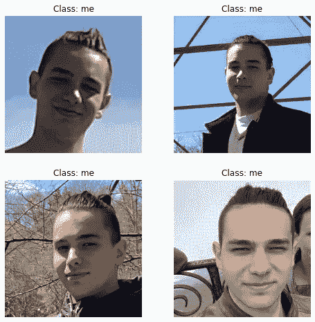

*初始数据集照片*。作者图片

我一共收集了 215 张照片，其中 82 张是*我*，133 张是*非 _ 我*。

对于测试集，我立即搁置了 20 张照片。这可以自动完成，但我是手动完成的，因为数据集太小。对于列车组，我应用了来自`data_augmentation.ipynb`笔记本的数据增强代码。因此，数据集增加了五倍！(每张照片生成五张照片)。以下是生成的照片示例:

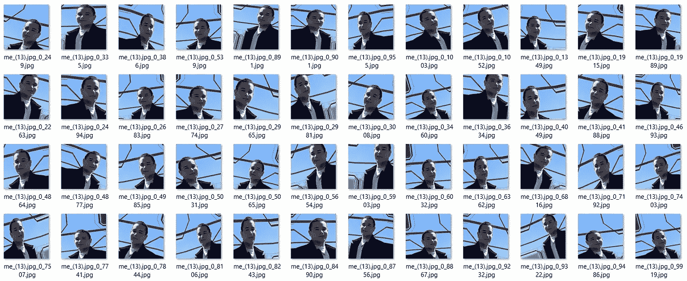

*增强照片*。作者图片

当数据集准备好时，我们可以开始训练模型。

## 2.寻找迁移学习的基本模式

这里没有什么复杂的——我只是使用了在 *ImageNet* 数据集上训练的不同模型。如果他们没有很好的准确性，那么我想我会使用类似 VGGFace 模型的东西比如这里的。但是我得到的质量足够好。我们可以用以下代码加载预训练模型:

## 3.训练模特

现在，我们必须冻结这些权重，在模型上添加一些层，并在我们的小数据集上训练模型。

正如我前面说过的，`me_not_me_classifier_model_comparison.ipynb`文件包含了不同型号的代码。你可以用它来做你自己的实验。下面的代码示例摘自`me_not_me_classifier.ipynb`。这里我们将使用 *ResNet50* 作为初始模型。

在导入库和数据集加载之后，我们完全按照上面的代码加载预训练模型。之后，我们需要恢复模型的顶部——密集的部分。请注意，这部分因型号不同而不同。要知道你需要哪些层，你可以加载带顶层和不带顶层的模型，调用 *model.summary()* 方法，看看它们有什么不同:

为了添加层，我使用了 *TensorFlow 函数 API* 。当然，你需要一些关于 TensorFlow 和 CNN 的知识，但你也可以尝试添加不同的层，获得非原创的架构。在我的例子中，我们需要一个全局平均池层和密集层。不要忘记预先冻结其他重量。

之后，我们继续配置模型。我添加了一个 *ModelCheckpoint* 对象，以便在出错时将模型保存在磁盘上，同时作为一种正则化技术，我还添加了*提前停止*。作为一种优化方法，我使用了具有标准学习率值的 Adam。我也尝试使用各种*调度技术*，但是它们没有带来多少结果。

所以现在我们可以开始训练了。结束后，你将有一个现成的模型。您可以通过`me_not_me_classifier.ipynb`文件中的*测试*部分代码来检查其功能。

## 4.将分类器转换为检测器

现在我们必须使用 *OpenCV* 库进行网络摄像头访问和人脸检测。

坦率地说，由于分类器和检测器的定义，短语“将分类器转换为检测器”是不正确的。分类器(理解为图像分类器)是一种模型，它接收图像作为输入，并在输出端给出一个可能类别的标签(在我们的例子中，是 *me* 或 *not_me* )。检测器(理解为面部检测器)是一种模型，其接收图像作为输入，并且如果该图片中存在面部，则输出面部周围的边界框的坐标。

我用这个短语来说明最终的程序(它仍然是一个分类器)现在也给出了人脸在图片中的确切位置。此外，现在它可以在照片中同时有几个人脸的情况下正确工作。

训练一个人脸检测器是一件非常困难的事情(主要是因为数据很难标注)，所以我会使用 OpenCV 提供的人脸检测器。使用起来非常简单。在下面的代码中，faces 变量是图像中所有面孔的数组。对于每个面，边界框有四个值:

*   左上角的 x-x 坐标，
*   左上角的 y-y 坐标，
*   w —边界框的宽度，
*   h-边界框的高度。

以下代码在网络摄像机图像中实时突出显示您的面部，如下图所示。

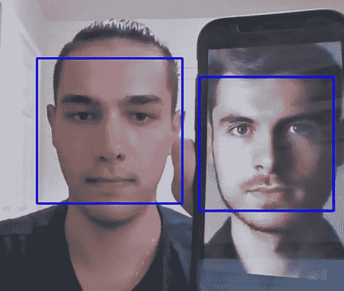

*用 OpenCV 进行人脸检测*。照片由[西蒙·罗本](https://www.pexels.com/@simon-robben-55958?utm_content=attributionCopyText&utm_medium=referral&utm_source=pexels)从[派克斯](https://www.pexels.com/photo/man-in-brown-polo-shirt-614810/?utm_content=attributionCopyText&utm_medium=referral&utm_source=pexels)拍摄

现在剩下的就是加载预先训练好的模型，将人脸所在的图像片段传递给它，并在屏幕上显示文本！事实上，在这个阶段我面临一个小困难——模型只是有时认出我。发生这种情况是因为我训练她在图像上“留有空白”，不仅仅是脸部的位置。

我可以向数据集添加不同比例的图像，但我决定诚实地这样做。为此，我编写了函数 *get_extended_image()* ，用某个系数 k 来增大裁剪后的图像的大小，k 越大，人脸周围的面积越大。为了解释这个函数的操作(或者更让你迷惑)，我给出下图(为简单起见，这里 k = 0.3。没有观察到刻度。注意，左上坐标是(0，0))。你也可以看到不同 k 参数的我的脸的剪报(根据 OpenCV，它使用 BGR 而不是 RGB，但不是调整颜色，让我们想象我是一个头像)。对于结果模型，我使用 k = 0.5。

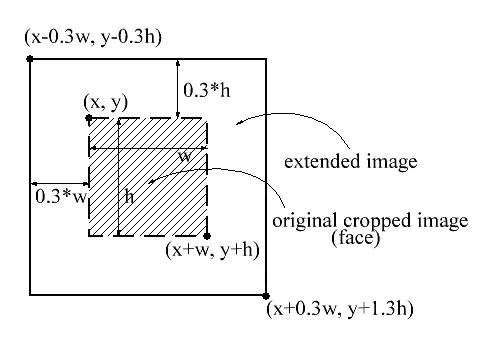

*get_extended_image()函数说明*。作者图片

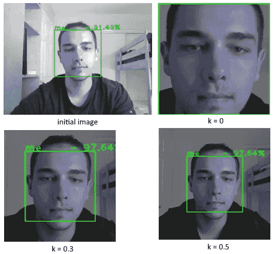

*具有不同 k 参数*的 get_extended_image()的图像。作者图片

我想指出的是，我使用了 *MobileNet* 作为基础模型。最初，我使用的是 *ResNet50* ，因为它显示的质量最好，但图像滞后了一点，而更轻的 *MobileNet* 则没有这些问题。我在一台配有 i7–10750h 和 32G 内存的电脑上测试了所有这些。

就是这样！您可以在`me_not_me_detector.ipynb`笔记本中找到完成的代码，但是注意，要使用它，您需要在`models` 文件夹中有一个模型，否则您将在*加载模型*单元格中得到一个错误。这是结果。

实时人脸检测器的视频演示

我必须说，虽然模型相当简单，但它已经很好地识别了我，例如，如果脸部的一部分被覆盖。另外，我的数据集中没有威利姆·达福的照片，所以模特以前没有见过他。

面具识别中的人脸呢——你可以看到，如果我的鼻子被完全遮住，程序就会停止识别我的脸(或者当它旋转太多的时候)。但是这在检测器侧是一个问题，因为它停止将图像传输到模型。这是因为 OpenCV 人脸检测器通常看不到戴面具的人。但我认为，如果你能收集一个大型数据集，你也可以教你的模型区分戴面具的人。

让我感到惊讶的是——当脸的下半部分被遮住时，模特比上半部分更容易认出我。你可以看到，当我戴上帽子或者用手遮住额头时，模特开始怀疑。我想这是因为在我所有的照片中，我的头都是敞开的，而且我只有一种发型。

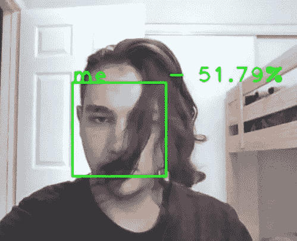

好模式！作者图片

# 结论

下面，我展示了使用或不使用数据扩充(本例中为 x5 数据扩充)的不同模型的训练结果。最佳质量(99%的验证准确性)由 *ResNet50* 显示。但正如我上面所说，我使用了基于 *MobileNet* 的模型，因为它在实时操作中表现得很好。

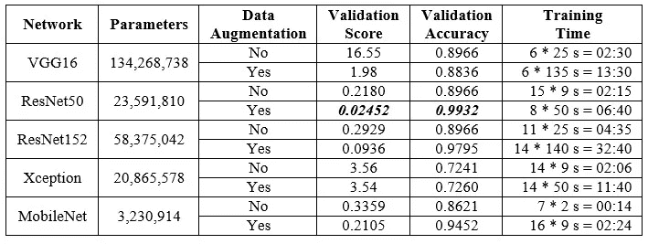

*不同车型的训练结果*。作者图片

这些结果表明，数据扩充可以显著提高模型的质量。在这种情况下，验证损失下降了 10 倍，但这是关于非常少的数据集。我试图生成更多的图像，并获得更多的准确性。该参数(数据集的系数增加，因此为每幅图像生成的增强图像的数量)可以通过*交叉验证*来选择。我在 MobileNet 中得到的最好的模型是验证损失= 0.09886，验证准确度= 0.9589，数据集增加系数= 15。

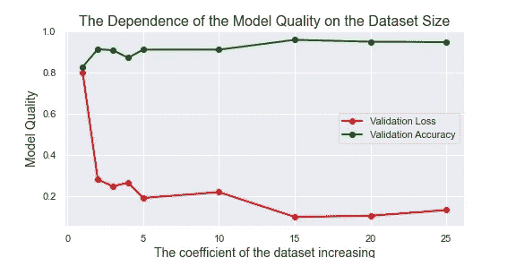

*数据集大小对 MobileNet 示例中模型质量的依赖性*。作者图片

与此同时，学习过程变得非常缓慢。有道理，数据集规模增加，学习时间也增加。您可以在下面看到训练时间对数据集大小的依赖关系图，它几乎是线性的。

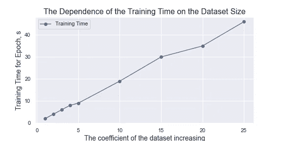

*MobileNet 示例中数据集大小对学习时间的依赖性*。作者图片

下表是上一个表的扩展版。在这里，您可以看到参数的数量、模型的深度和测试精度。请注意，图层被计为 *model.layers* 对象的数量，这并不完全正确，但给出了模型深度的概念。测试准确性没有太多的统计能力，因为我只有 20 张测试图像。

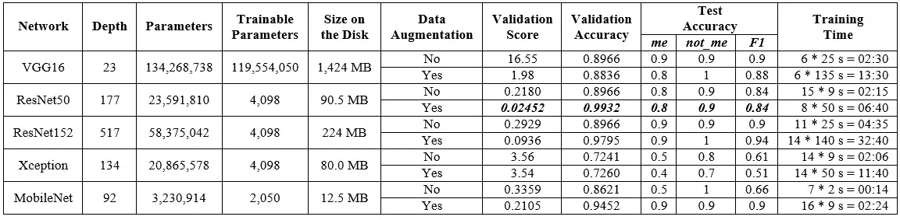

*扩展结果*。作者图片

关于 VGG 的一件事。我用两个 1024 密集层替换了两个 4096 密集层，模型显示了大致相同的结果，尽管参数数量分三次下降(从 1.34 亿下降到 4100 万，可训练值从 1.19 亿下降到 2700 万)。该型号的磁盘大小为 368 MB。

从所做的工作中，我可以得出以下结论。有些比较明显，有些不太明显:

*   你需要收集的数据集应该**尽可能的多样化**，同时**尽可能的接近真实数据**。
*   更简单的模型训练速度更快，预测速度更快，占用硬盘空间更少。更简单的模型有更少的参数，但是，同时，可以更深入。
*   **迁移学习**是一种非常强大的技术，即使只有很小的数据集，它也能让你解决你的任务。
*   **数据扩充**技术允许你显著地提高模型的质量，但是它也增加了训练时间。您可以通过交叉验证选择数据扩充系数。
*   结果很大程度上取决于随机初始化。因此，**即使是相同参数的训练过程也要运行几次**。例如，在 22 分钟和 150 个历元中，我在没有数据增强的情况下使用 ResNet50 得到的验证损失结果为 0.1334，比常规 ResNet50 好 39%。

现在我要再说一句让你更加困惑的话。

> *网络的卷积部分(上至稠密层)将原始图像转化为某个高维空间中的点(这类似于*嵌入*的概念)，稠密层再在这个空间中构建分离超平面。*

因此，最好建立一个模型来更好地定位这些点，然后您可以使用更简单的分类器。当然，构建这些表示的规则非常复杂，这就是为什么我们需要具有大量参数的深度模型。

一个能够很好地创建嵌入的网络能够解决最初没有被训练过的任务。所以，一个好的模型会把我所有的照片彼此靠近(在某个高维空间)定位，把威利姆·达福所有的照片彼此靠近定位。但同时，这两个点云的位置应该相距很远。现在，当你向网络展示另一个人的照片时，它将能够说这是*而不是 _me* ，但是除此之外，它将能够给出他最像的人或者注意到这个人不在数据集中。这是*度量学习*的变体，这里使用*三重损失*。

# 感谢您的阅读！

*   我希望这些材料对你有用。在媒体上关注我以获得更多类似的文章。
*   如果您有任何问题或意见，我将很高兴得到任何反馈。在评论中问我，或者通过 [LinkedIn](https://www.linkedin.com/in/andimid/) 或 [Twitter](https://twitter.com/dimid_ml) 联系我。
*   为了支持我作为一名作家，并获得数以千计的其他媒体文章，使用[我的推荐链接](https://medium.com/@andimid/membership)获得媒体会员资格(不收取额外费用)。