# 如何用谷歌图表和熊猫数据框创建简单的可视化

> 原文：<https://towardsdatascience.com/how-to-create-simple-visualizations-with-google-charts-and-pandas-dataframes-fa711299f0c9?source=collection_archive---------11----------------------->

## 数据可视化

## 谷歌图表能让你创造出令人愉悦的互动情节，但不能直接阅读熊猫数据。这里我们创建了一个简单的 Python Web 应用程序来结合这两种技术。

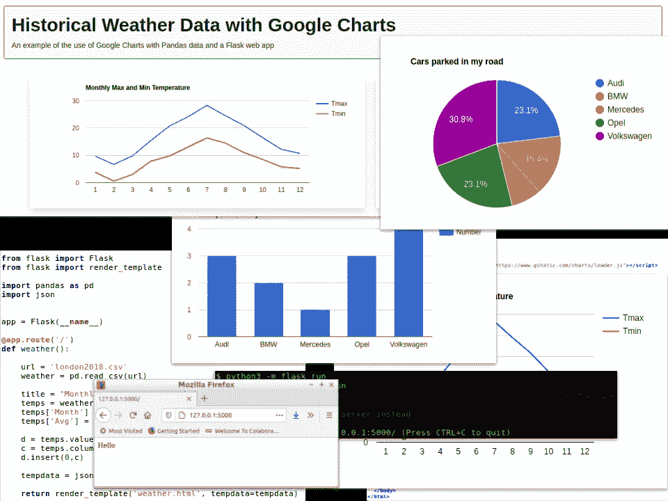

作者图片

Google Charts 已经存在很多年了，我都不记得了，所以我想我们可以有把握地认为它是一项成熟稳定的技术。

它还可以用来创建吸引人的图表和图形。

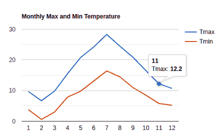

月最高和最低温度-2018 年。图片作者。

在这里，我们可以看到一个简单的交互式折线图，当您将鼠标悬停在图上的某个点上时，它会向您显示该数据点的详细信息。

我们将看看如何使用 HTML 和 Javascript 中的一些基本样板代码、Pandas dataframes 和一个简单的 Flask web 应用程序来创建这样的图表。下面，我们将开发完整的代码。(在本文的最后，我将包含一个应用程序的链接，您可以在这里看到运行中的代码，并下载代码和示例数据。)

以下是以下内容的概要:

*   *编写一个基本的 Flask 应用程序(可选)*
*   *使用样本 HTML 和 Javascript 显示图表*
*   *创建熊猫数据框架并将其转换成与谷歌图表兼容的形式*
*   *将烧瓶代码和网页放在一起作为一个应用*

## 创建并运行 Flask 应用程序

这是创建和运行 Flask 应用程序的一个非常简单的介绍。如果您已经知道如何做到这一点，那么您可以安全地跳过这一部分。

Flask 是一个 web 应用程序微框架，这意味着它是一个用于开发 web 应用程序的非常轻量级的库。创建您的第一个 Flask 应用程序很容易，但首先您需要用 pip 或 conda 安装它，例如:

```
pip3 install flask
```

接下来，打开一个新目录，用下面的代码创建一个文件 *app.py* :

```
from flask import Flask
app = Flask(__name__)
@app.route('/')
def root():
   return 'Hello'
```

代码非常简单。第一行导入烧瓶库；第二个创建一个 Flask 对象(将被运行)；剩下的部分定义了一条路线。一个路由是一个网页，或者端点，而 *@app.route* 装饰器定义了 url，在这种情况下它是根 url(即/)。下面是一个函数定义，它告诉 Flask 服务器当这个特定的端点被请求时该做什么——在这个例子中，只需返回字符串“Hello”。

现在打开终端窗口，导航到正确的目录，并键入:

```
python3 -m flask run
```

(注意:我在一个标准的 Linux 环境中使用 Python3，这里，如果你使用一个不同的环境，Python3 是默认的——例如，portable Python 或 Conda——那么你的命令可能是 *python* 而不是 *python3。*)

这将启动 Flask 服务器，结果应该是这样的:

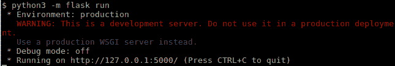

运行 Flask 应用程序-作者图片

Flask 现在正在运行您的应用程序，它可以从 url 获得， *http://127.0.0.1:5000* ，所以在浏览器的地址栏中键入它，您应该会看到类似这样的内容:

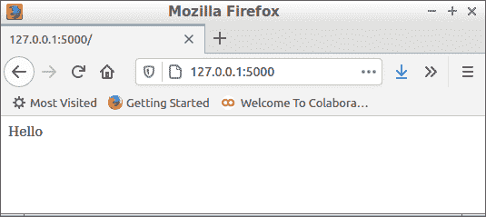

跑步烧瓶应用程序——作者图片

我们稍后将使用模板将 Flask 应用程序连接到网页，但现在，这就是我们需要了解的关于 Flask 的全部内容。

## 一个简单的谷歌图表

现在我们来看一个可以在许多不同的应用程序中重用的模板 HTML 页面。基本文件布局如下所示:

```
<!DOCTYPE html>
<html>
  <head>
    <script>
      // Script 1 — where the data gets loaded
    </script> <! — Script 2 — Load the AJAX API →
    <script src=”https://www.gstatic.com/charts/loader.js">   
    </script> <script>
      // Script 3 — Where we create and display a chart
    </script>
  </head>
  <body> <! — the div where a chart will be displayed →
    <div style=”width:600px; height:300px” id=”chart1"></div> </body>
</html>
```

这是一个简单的 HTML 文件，文件体只有一个

，文件头有 3 个脚本。是显示图表的地方，并被赋予了一个 id——我还赋予了它一个高度和宽度。id 是强制性的，尺寸不是——您可以随意改变高度和宽度，或者完全不考虑它们。

主要逻辑来自三个脚本。第一个脚本 1 是我们加载数据的地方。对于第一个示例，我将在本地创建数据，但稍后我们将从 Pandas 数据框架中加载它。第二个脚本，脚本 2，加载一个 Google Charts API，脚本 3 将使用它。和脚本 3。它本身负责创建和显示图表的主要工作。

我们马上会看到这些是如何工作的，但值得指出的是，如果你想创建自己的应用程序，你只需要修改脚本 1 和 HTML。所以只需要很少的 Javascript 编程。

脚本 2 已经定义，我们不需要修改它。

脚本 3 相当长，但是，同样，一旦我们定义了它，我们不需要改变它。这是:

```
<script>
  // Load the Visualization API and the corechart package
  google.charts.load(‘current’, {‘packages’:[‘corechart’]}); // Set a callback for when the API is loaded
  google.charts.setOnLoadCallback(drawChart);

  // This is the callback function which actually draws the chart
  function drawChart(){
    google.visualization.drawChart({
      "containerId": **containerId**,
      "dataTable": **data**,
      "chartType": **chartType**,
      "options": **options** });
  }
</script>
```

这里发生的事情是，我们从 Google 加载可视化 API，然后设置一个回调函数，该函数将在 API 完成加载时运行。回调函数是 *drawChart* 并完全按照它所说的去做。

*drawChart* 简单地从 Google API 调用另一个同名函数，并传递一些参数，我们将在稍后的脚本 1 中定义这些参数。让我们检查一下这些参数。

**containerId** 是将显示图表的< div >的 Id。

**数据**是要绘制的实际数据。

**chartType** 是我们想要的绘图类型，例如，折线图、饼图、柱形图。

**选项**可以包括图表的多个不同选项，例如标题。

我们将在脚本 1 中定义这些选项。

## 定义数据

为了获得一个有效的 web 页面，首先我们将在本地定义数据——稍后我们将从 python 应用程序导入数据。

您可以用几种不同的方式定义 Google Charts 的数据，但是对于我们的目的来说，最简单的方式是一个简单的表格。这是停在我家街道上的汽车数量和品牌表:

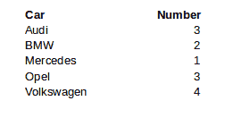

但是我们需要将其格式化为 Javascript 二维数组中的行列表。这与 Python 中的列表列表非常相似。看起来像是:

```
[
  ["Car","Number"],
  ["Audi", 3],
  ["BMW", 2],
  ["Mercedes", 1],
  ["Opel", 3],
  ["Volkswagen", 4]
]
```

列表中的第一项是列名列表，其余的是数据行。

这是脚本 1，它包含了我们之前看到的数据和选项..

```
<script>
  data = [
    ["Car","Number"],
    ["Audi", 3],
    ["BMW", 2],
    ["Mercedes", 1],
    ["Opel", 3],
    ["Volkswagen", 4]
  ]; chartType = "ColumnChart";
  containerId = "chart1";
  options = {"title":"Cars parked in my road"};
</script>
```

我们首先看到的是包含 car 表的变量*数据*。接下来是我们将要绘制的图表的类型，然后是图表将要绘制到的< div >的 id。最后，我们为图表设置选项——这里只是标题，但是根据我们想要绘制的图表类型，可能还有其他选项。稍后您将看到如何使用这些选项。

如果你把这些脚本和上面的 HTML 模板放在一起，你就有了一个工作网页。您可以在浏览器中打开它并查看结果图。

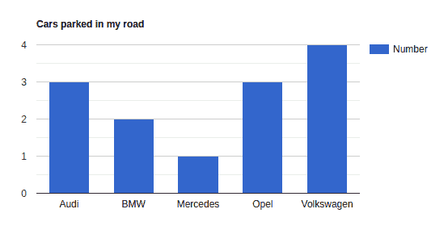

停在我的道路上的汽车柱形图-图片由作者提供

这里有一个巧妙的技巧:改变线路

```
chartType = “ColumnChart”;
```

到

```
chartType = “PieChart”;
```

保存并重新加载网页，然后…

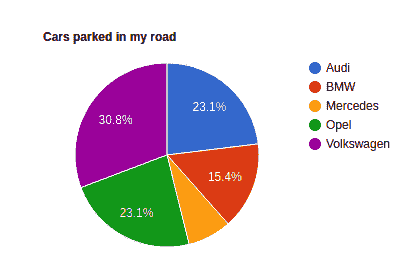

那很容易！

好的，但这只是一个简单的独立演示，实际上我们想从其他地方获取数据。这就是我们接下来要去的地方。

## 熊猫数据框到谷歌数据表

我们可以看到示例中提供的数据格式是一个列表列表。列表的第一个元素是包含列标题的列表，其余元素包含构成表格行的数据。

虽然这在概念上与熊猫数据帧没有太大的不同，但我们确实需要做一些工作来将两者转换。

让我们首先编写一些 Python 代码来加载我们的数据，并创建一个 dataframe 来表示我们想要绘制的数据。

如果你下载程序文件，你会在根目录中找到一个名为 *london2018.csv* 的文件，我们将把它加载到一个熊猫数据帧中，如下所示:

```
url = ‘london2018.csv’
weather = pd.read_csv(url)
```

数据帧看起来像这样:

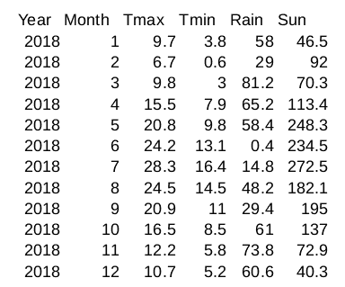

weather.csv —图片由作者提供

这是 2018 年伦敦天气统计的记录(来自英国气象局数据)。 *Tmax* 和 *Tmin* 是 2018 年各月的最高和最低气温， *Rain* 是以毫米为单位的总降雨量， *Sun* 是总日照时数。

我们将生成一个温度图表，我们只需要 *Tmax* 和 *Tmin* 以及 *Month* 列，因此我们创建了一个我们需要的数据的新数据框架，如下所示:

```
title = “Monthly Max and Min Temperature”temps = weather[[‘Month’,’Tmax’,’Tmin’]]temps[‘Month’] = temps[‘Month’].astype(str)
```

请注意，我还将*月*列转换为字符串，因为将其视为数字没有多大意义，并且我还为图表创建了一个标题。

所以现在我们有了想要的数据；我们只需要将它转换成谷歌图表将处理的形状。我们通过从图表中提取值并将它们转换成列表来实现这一点。这将为我们提供列表中的值，这正是我们在图表中需要的。一个问题是:没有包含列名。这很容易解决，我们提取列名，然后将结果列表附加到值列表的顶部。

```
d = temps.values.tolist()c = temps.columns.tolist()d.insert(0,c)
```

现在，我们将数据和标题捆绑到一个 JSON 字符串中，可以传递给 web 页面。

```
tempdata = json.dumps({'title':title,'data':d})
```

我们使用内置于 Flask 中的模板机制将数据传递给网页。像这样:

```
return render_template('weather.html', tempdata=tempdata)
```

函数 *render_template* 找到模板【weather.html*并通过将传递给它的数据插入模板来创建一个网页。*

## 整合应用程序

所以现在我们需要修改我们的 html 文件，使之成为一个模板。这意味着将 Script 1 改为将 JSON 数据加载到 Javascript 变量中的脚本，方法是在要传递的数据所在的位置放置命名的占位符。(一个宫托是一对双花括号，里面有名字。)

在我们的例子中，只有一个数据项叫做 *tempdata* 。因此，我们将脚本 1 中的代码替换为:

```
<script> tdata = JSON.parse({{tempdata|tojson|safe}});
  tempdata = tdata.data;
  temptitle = tdata.title;
  chartType = "LineChart";
  containerId = "chart1";
  options = {"title":temptitle};</script>
```

名称用双花括号{{name}}括起来，这里我们也是说数据要转换成 json，并且包含‘安全’的 HTML，也就是说，我们不希望任何特殊字符转换成转义序列。

将数据放入模板后，我们将它分配给变量 *tdata* 并从中为数据和标题设置变量。

所以我们最终得到了两个文件，如清单 1 和清单 2 所示。

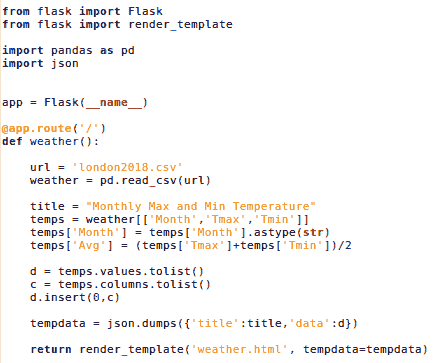

清单 1。烧瓶计划——作者图片

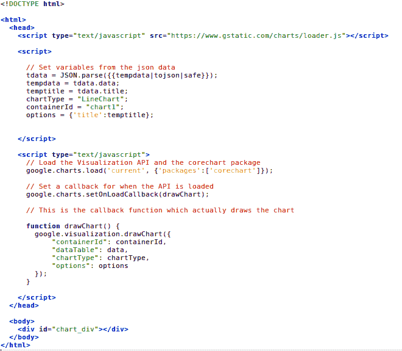

清单 2。网页——作者图片

现在这一点是**重要的**:首先，我们将 Flask app *app.py* ，其次，Flask app 希望 HTML 文件被称为*weather.html*(正如我们在清单中看到的那样)，所以确保您给它起了那个名字。最后，Flask 希望它的模板是一个名为 *templates* 的目录，该目录与 Flask 应用程序在同一个目录中。

当你运行 flask 应用程序时，你会看到下面的页面。

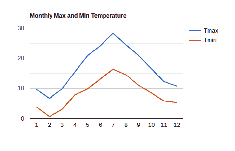

除此之外，Google Charts 还有很多其他功能，但我希望这是一个有用的介绍，可以让你用 Python 应用程序生成这些功能。感谢阅读。

## 源代码

这里下载 zip 文件[这里](http://alanjones.pythonanywhere.com/download/pandastogooglecharts.zip)看基础 app [。](http://alanjones.pythonanywhere.com/pandastogooglecharts)

当你下载完文件后，将它们解压到一个空文件夹中，用 *python -m flask run* 运行 Flask app(如上)。

## 时事通讯

我可能会进一步研究这些代码和/或就这个主题写更多的文章。如果你想了解最新的文章，请考虑在这里订阅我偶尔发布的免费时事通讯。