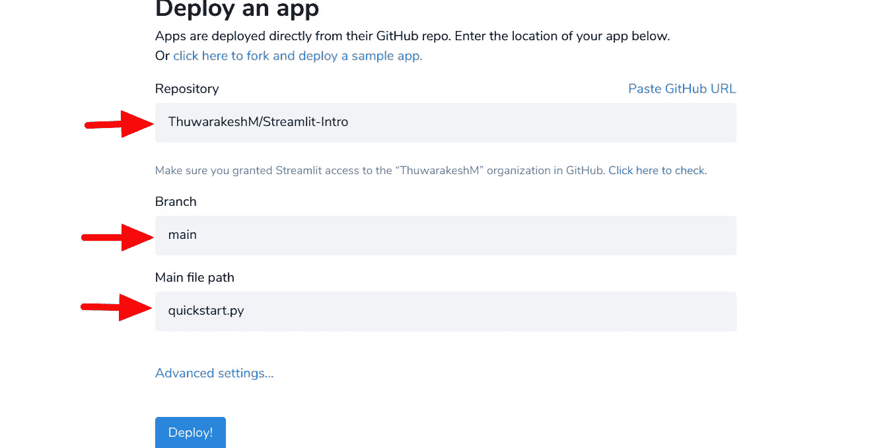

# 如何为您的数据科学项目创建出色的 Web 应用程序

> 原文：<https://towardsdatascience.com/how-to-create-stunning-web-apps-for-your-data-science-projects-c7791102134e?source=collection_archive---------7----------------------->

## 数据科学家不必学习 HTML、CSS 和 JavaScript 来构建网页。


在 [Unsplash](https://unsplash.com?utm_source=medium&utm_medium=referral) 上由[Meagan carscience](https://unsplash.com/@mcarsience_photography?utm_source=medium&utm_medium=referral)拍摄的照片

Web 开发不是数据科学家的核心能力。大多数数据科学家都懒得学习不同的技术来做这件事。这不是他们喜欢的咖啡。

然而，大多数数据科学项目也有软件开发部分。开发人员有时对问题有不同的理解，他们使用离散的技术。它经常会导致问题，并且毫无成效地消耗两个团队的宝贵时间。

此外，Tableau 和 Power BI 等可视化工具更侧重于数据探索。然而，这只是一个完整的数据科学项目的一部分。如果你需要集成一个机器学习模型，它们还远远不够完美。

[Streamlit](https://share.streamlit.io/) 允许你为你的数据科学项目开发网络应用。这个开源库的 API 完全是 python 的。因此，你不必学习任何其他网络技术来使用它。此外，它简单易学，修改灵活。

本文是对 Streamlit 的介绍。我们将构建一个交互式 web 应用程序，它接受用户输入，运行 K-means 算法，并在 web 界面中即时绘制结果。

到这篇短文的结尾，我们已经涵盖了

*   安装 Streamlit 并试水；
*   构建交互式网络应用程序；
*   使用用户输入运行 K-means 算法；
*   使用缓存提高性能，以及；
*   在云上部署它；

这里是[链接](https://share.streamlit.io/thuwarakeshm/streamlit-intro/main/quickstart.py#interactive-k-means-clustering)到部署版本。如果你想先睹为快，就去看看吧。

# 为开发建立 Streamlit。

这个非凡的工具有一个令人尴尬的简单设置，几乎所有 Python 用户都熟悉它。使用 PyPI。

```
pip install streamlit
```

也可以使用 [conda](https://docs.streamlit.io/en/stable/installation.html#set-up-your-virtual-environment) 等流行的 python 包管理器。

完成后，您可以使用安装时附带的 hello world 应用程序对其进行测试。在终端窗口中执行下面的命令来启动开发服务器。

```
streamlit hello
```

hello world 应用程序是一套出色的可视化工具，您可以使用 Streamlit 来完成。上述命令将启动一个本地开发服务器，并在默认浏览器中打开链接。您还可以在同一页面上找到源代码。此外，这个示例应用程序还提供了许多高级教程的链接，可以帮助您自学。

现在设置已经完成，让我们创建一个应用程序来与我们的机器学习模型进行交互。

# 通过 Streamlit web 应用程序使用机器学习模型。

下面的应用程序使用 Pandas、Scikit-Learn、Matplotlib、Seaborn 和 Streamlit。开始之前，请确保您已经安装了所有必需的软件包。如果没有，下面的命令将为您完成。

```
pip install pandas scikit-learn matplotlib seaborn streamlit
```

## 创建您的第一个 web 应用程序

使用以下内容创建一个名为“quickstart.py”的文件。

来自[作者](https://thuwarakesh.medium.com/)的代码片段。

上面的文件很简单。为了便于说明，我在文件中添加了一些部分。

在主应用程序部分，我们有三行代码。我们向页面添加了标题和描述。然后我们在页面上显示数据框。“st.write”功能是一个一体化的解决方案。您几乎可以将任何内容传递给这个函数，Streamlit 足够智能，可以在 UI 中显示正确的小部件。为了了解不同的 Streamlit 函数，这里有一个[备忘单](https://share.streamlit.io/daniellewisdl/streamlit-cheat-sheet/app.py)。

让我们用下面的命令运行我们的初始应用程序。

```
streamlilt run quickstart.py
```

像 hello 应用程序一样，这个命令将启动一个新的开发服务器。在您的浏览器上，您会看到以下内容。


截图来自[作者](https://thuwarakesh.medium.com/)。

恭喜你，你刚刚创建了你的第一个 web 应用程序；没有 HTML，CSS，绝对没有 JavaScript。

但这只是初步的。一个网络应用可以做很多很酷的事情。它可以与用户实时互动，并更新其内容。让我们看看我们如何能做它。

## 添加交互

在 Streamlit web 应用程序中实现互动毫不费力。Streamlit API 包含几个小部件。您可以使用它们来获取用户输入并将它的值存储在一个变量中。其余的就像任何其他 python 程序一样。

让我们添加一个复选框来切换数据集显示。毕竟，没有人开发一个 web 应用程序来查看原始数据。用以下内容替换数据框显示(第 30 行)。

来自[作者](https://thuwarakesh.medium.com/)的代码片段。

如果刷新浏览器，现在可以看到一个复选框来切换数据框显示。


截图来自[作者](https://thuwarakesh.medium.com/)。

但是应用程序中间的切换按钮并不令人满意。让我们把它移到边栏。

# 向应用程序添加边栏

又是一个轻松的动作。Streamlit API 具有侧栏属性。您在主应用程序中创建的所有小部件也可以在这个侧栏属性中使用。

使用“st.sidebar”属性创建侧栏变量。然后将我们在主应用程序部分添加的复选框分配移动到侧边栏部分。请注意，我们现在使用“st.sidebar.checkbox”而不是“st.checkbox”

来自[作者](https://thuwarakesh.medium.com/)的代码片段。

在上面的代码中，我们还向侧边栏添加了一个滑块。这个小部件将捕获用户选择的集群数量。下面是输出的样子。


截图来自[作者](https://thuwarakesh.medium.com/)。

下一步，我们将使用用户选择的聚类数运行 K 均值算法。

## 使用实时输入运行 K-Means。

用下面的代码扩展导入、助手函数和主应用程序部分。

代码片段来自[作者](https://thuwarakesh.medium.com/)。

在上面的代码中，我们创建了一个函数来运行 K-Means 算法。它将数据框和聚类数作为参数，并返回一个 Matplotlib 图。

K-Means 聚类的示例超出了本项目的范围。这是一个机器学习算法，这才是我们关心的。不过你可以参考我之前[的帖子](/running-election-campaigns-with-k-means-clustering-ecc40a91135a)描述一下。

我们使用 n_clusters 变量作为 run_forecast 函数的第二个参数，该变量捕获上一节中的滑块值。

如果你刷新页面，你会看到一个仪表板，接受用户输入，运行机器学习算法，并即时更新用户界面。


截图来自[作者](https://thuwarakesh.medium.com/)。

即使你是一个经验丰富的开发人员，这种级别的交互和与后端 ML 的集成也是一项艰巨的任务。尤其是如果你是一个不知道如何开发 web 应用的数据科学家，这可能会花费你数周的时间。

# 通过缓存提高性能。

数据科学管道中的一些任务非常耗时。然而，这种任务很少对相同的输入产生不同的结果。您可以使用 Streamlit 内置的缓存功能来存储它们的值以供将来使用。

虽然这听起来可能很复杂，但用 streamlit 做起来很简单。你的耗时任务应该是一个函数，你用 [@ts](http://twitter.com/ts) 包装它。缓存装饰器。只要输入参数是相同的，并且函数体没有被改动，Streamline 就会从缓存中获取它。

在我们构建的应用程序中，我们调用外部 URL 来下载数据。如果它是一个活动的 API，您可能不想缓存它。但在我们的情况下，它不是。因此，让我们通过用下面的代码替换该行来缓存它。

来自[作者](https://thuwarakesh.medium.com/)的代码片段。

第一次重新加载时，您可能会在浏览器上看到消息“正在处理加载数据”。但随后的再装不会有那个音符。这是因为请求是从缓存中提取的，而不是从外部 URL 下载的。

# 在互联网上部署

如果您注意到了 Streamlit 控制台，您还会看到一个网络 URL。这意味着，如果您的防火墙允许，您的应用程序可以通过内部网访问。

但是如果你想在你的网络之外分享，我们有很多选择。正如文档所说，Streamlit 应用程序可以在 Python 应用程序工作的任何地方工作。

1.  Streamlit 推荐“Streamlit 共享”选项。你可以将你的代码放在 GitHub 存储库中，并配置 Streamlit 共享来为你的应用服务。
    Streamlit 共享是免费的，但目前只接受邀请。您可以为自己申请邀请。
2.  你可以把它部署在云平台上。这里有一篇[文章](/how-to-deploy-a-streamlit-app-using-an-amazon-free-ec2-instance-416a41f69dc3)展示了如何用 AWS EC2 free 实例做到这一点。
3.  您可以[配置一个反向代理](https://discuss.streamlit.io/t/streamlit-docker-nginx-ssl-https/2195/5)。Nginx 和 Apache 之类的代理服务器可以配置为服务于应用程序，并限制特定用户的访问。

请务必阅读关于部署的 [Streamlit 社区指南](https://discuss.streamlit.io/t/streamlit-deployment-guide-wiki/5099),探索您可用的众多选项。

以下是我如何在 Streamlit Share 上部署这个教程应用程序的。再一次，Streamlit 的便利让我大吃一惊。

**第一步:将你的代码放入 GitHub 公共库。** 我已经将我的代码添加到这个 [GitHub repo](https://github.com/ThuwarakeshM/Streamlit-Intro.git) 中。我们需要确保它包含一个 requirement.txt 文件以及所有的依赖项。

**第二步:使用你的 GitHub 账号登录**[**Streamlit**](https://share.streamlit.io/)**。**

**第三步:在 Streamlit 控制台上创建一个新应用。** 从下拉列表中选择您的 git hub repo，或者在 URL 中选择 past。选择要用于部署的分支。最后，选择主文件名并单击 deploy。



作者截图。

大约一分钟后，[我的应用程序](https://share.streamlit.io/thuwarakeshm/streamlit-intro/main/quickstart.py#interactive-k-means-clustering)将在 Streamlit Share 上直播。但是部署时间可能因项目需求而异。

请注意，streamlit 共享目前只接受邀请。但我没等太久就拿到了。Streamlit 的[部署文档](https://docs.streamlit.io/en/stable/deploy_streamlit_app.html?utm_medium=email&_hsmi=129999626&_hsenc=p2ANqtz-_XkMKRkDwyEqBo00-MhMkFZrmNwXivmqVBMHHO8pEGst6yf3fAVaz_iaUAx_6kP4h-DOmIp4iaHd0QahErWMub8ethXA&utm_content=129999626&utm_source=hs_automation)包含了更多关于这方面的有用信息。

# 结论

不用说，Streamlit 解决了数据科学项目中的一个关键问题。它让数据科学家能够构建 web 应用程序，与他们的机器学习模型进行交互。

在这篇介绍性文章中，我们探讨了如何将 Streamlit 与 K-Means 聚类结合使用。虽然这是一个微不足道的应用程序，但它阐明了这项技术的核心概念。除了开发之外，我们还看到了如何在 Streamlit 中轻松管理缓存以提高性能。最后，我们讨论了部署选项。

细流远不止这些。请查看他们的[官方文档](https://docs.streamlit.io/en/stable/)，里面充满了优秀的教程。还有，他们的 [API 备忘单](https://share.streamlit.io/daniellewisdl/streamlit-cheat-sheet/app.py)有助于快速开发。

网络应用是一个很好的解决方案。但是在某些情况下，您可能不得不考虑与您的 ML 模型交互的其他方式。或许，为您的模型构建一个命令行界面会有所帮助。

[](/a-simplified-guide-to-create-clis-for-your-data-science-project-bf9bcaa26e1) [## 为您的数据科学项目创建 CLI 的简化指南

### CLI 是一种与机器学习模型交互的强大而直接的方式

towardsdatascience.com](/a-simplified-guide-to-create-clis-for-your-data-science-project-bf9bcaa26e1) 

> 谢谢你的阅读，朋友。看来你和我有许多共同的兴趣。一定要看看我的个人博客。
> 
> ***在 [LinkedIn](https://www.linkedin.com/in/thuwarakesh/) 、 [Twitter](https://twitter.com/Thuwarakesh) 、 [Medium](https://thuwarakesh.medium.com/subscribe) 上跟我打招呼*。我会为你打破僵局。**

还不是中等会员？请使用此链接 [**成为**](https://thuwarakesh.medium.com/membership) 的会员。你可以享受成千上万的有见地的文章，并支持我，因为我赚了一点佣金介绍你。