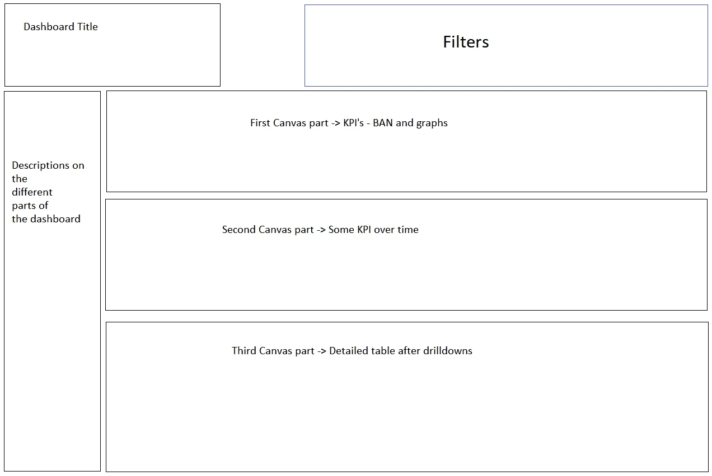
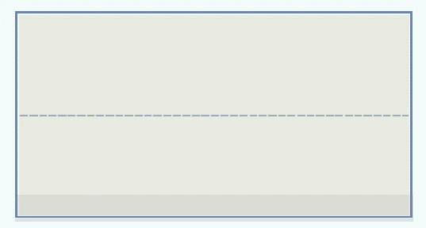

# 如何创建 Tableau(业务)仪表板并利用容器

> 原文：<https://towardsdatascience.com/how-to-create-tableau-business-dashboards-and-utilize-containers-90c0ec2b7e75?source=collection_archive---------9----------------------->

## 在本文中，我将给出如何创建业务仪表板的技巧，特别是如何利用容器。

Guillaume Bolduc 在 [Unsplash](https://unsplash.com/s/photos/containers?utm_source=unsplash&utm_medium=referral&utm_content=creditCopyText) 上拍摄的照片

(你也可以在 [**我的网站**](https://www.eliasnordlinder.com/blog/blog-post-one-r2dt9) 上找到这篇文章以及其他文章和更多有趣的东西)

本文将部分基于我这个周末从超级商店数据集创建的工作簿，它是专门为本文制作的。

仪表板也可以在 Tableau 公共配置文件中找到， [**此处**，](https://public.tableau.com/app/profile/elias.nordlinder/viz/TableauContainers-SuperstoreDataset/FullDasboard)如果您想下载它并查看容器在仪表板中的使用情况。

仪表板的最终外观如下，稍后我将剖析仪表板的每个部分。

# 如何利用 Tableau 中的容器创建业务仪表板的 10 个技巧

这篇文章将基于我在创建业务仪表板时经常使用的 10 个技巧。其中许多将针对如何使用容器。

这些不是“神圣的真理”，但它们是我在尝试了许多不同的东西后，发现对我最有效的东西，我觉得分享这些东西很好。

提示如下:

1.  画一个你想要的仪表盘的草图
2.  从一个**固定尺寸的较小仪表板**开始
3.  从一个**垂直/水平浮动容器**开始
4.  给容器着色，从“后端”容器开始，以便更容易地构建仪表板
5.  使用**转换键**移动集装箱
6.  合并容器时，将容器放在**的“正确位置”**
7.  **利用并学习如何阅读**项目层级****
8.  **使用**“均匀分布内容”**和**“固定宽度”****
9.  **使用**“空白对象”**作为各部分之间的分隔物**
10.  **从固定尺寸更改为**“范围-最小尺寸”****

## **1.如果仪表板应该是水平/垂直的，请快速勾画出您希望仪表板的外观和设计**

****

**上面仪表板的快速草图**

**如果你在开始操作仪表板之前已经决定了你想要什么和你想要它在哪里，这将是一个比以后改变它更容易的过程。**

**尝试决定**你想在哪里有仪表板的主要领域，**你想有过滤器，你想有多少可视化和类似的方面。**

**这里你还应该看看你的设计是更**“垂直”还是“水平”。**我将构建的这个仪表板有非常具体的“行”,最好构建在垂直主题上。**

## **2.从固定尺寸的较小仪表板开始**

****

**固定尺寸较小的仪表板(1000 x 800)**

**使用**较小的固定尺寸仪表板**比使用较大范围或自动仪表板更容易设置设计。**

**我通常会启动一个尺寸为 **1000 px * 800 px** 的新仪表板，并在我的笔记本电脑上进行最初的设计。**

**后来，当我以一种好的方式得到容器设计时，我换了一个更大的、范围大小的仪表板，准备用于生产环境。**

## **3.从一个垂直/水平浮动容器开始，稍后您将“修复”它**

********

**启动浮动容器**

**我总是发现使用后端浮动容器更容易，**当你完成设计后，你可以在后台“修复”它。****

**当您在第一层使用浮动容器而不是固定容器时，在内部插入新容器并让它们在正确的位置对齐似乎更容易。**

**(提示:**按下容器时按住 shift** ，如上图，不需要在下面的菜单中切换到浮动)**

## **4.对容器进行着色/重命名，并从“后端容器”开始，以便更容易地构建仪表板**

****

**着色/重命名的容器具有更好的结构**

**下面是一个例子，我已经开始建立上面的仪表板。顶部容器被重命名为“过滤器容器”,颜色为灰色。**

**画布的主垂直容器名为“画布容器”，三个画布容器以不同的方式命名和着色。**

**通过使用这种结构**,很容易找到您想要使用的容器**,并在正确的容器中插入新的容器和新的纸张。**

## **5.使用 shift 键在容器和移除的平铺容器之间移动**

******

移除平铺的容器，如果你设法“把它贴在背景中”** 

**大多数人可能都知道，可以按住 shift 键来移动容器，并将它们合并到其他容器中。**

**但是如果你也想把一个容器从后面移出(不把它转换成 UI 中的浮动容器),你可以这样做，如果你在项目层次结构中移除平铺的容器。**

## **6.合并容器时，将容器放在“正确的位置”**

************

**放下集装箱的正确方法，以便与之前的集装箱对齐**

************

**如果你有一个包含多个容器的层次结构，有时很难将新的容器放到正确的位置。有一些**有用的技巧**可以正确做到这一点。**

**a)如果您看到顶部图片中的**虚线**，这意味着新容器被放入仪表板中最外面的容器中**

**b)如果您事先在容器中有两个项目，您可以**将新项目放在中间**，它将始终放在仪表板上最外面的容器中**

**c)如果你有一个垂直的容器，**容器的底部是最困难的部分，**把它放在别的地方，然后在物品周围移动。**

**d)如果你有一个卧式容器，**容器最右边的部分是最难的部分，**把它放在别的地方，然后在物品周围移动。**

## ****7。利用并学习如何阅读项目层次结构(目录)****

****

**项目层次结构**

**项目层次结构类似于一篇较长文章中的目录，它更容易看到不同部分之间的相互关系，并获得整个**仪表板设计的概述。****

**您可以**重命名**项目层次中的所有部分，也可以直接**移除**项目，使其成为**浮动/固定**或**平均分配项目。****

**从本文中仪表板的特定层次结构中，我们可以看到:**

**仅第 1 级
- > **后端容器****

**第二级
->-**标题+过滤器**容器**-
->-**顶部画布过滤器**容器下面再往下****

**第三级
- > **滤镜容器**在“标题+滤镜”容器
- > **三个不同的容器**在“滤镜下的画布”容器内**

**我认为项目层次结构是以正确的方式构建仪表板的最佳帮助之一。**

## **8.使用**“均匀分布内容”**和**“固定宽度”****

****

**如果你想控制项目在不同显示之间切换时如何自动调整大小，那么如果你学会恰当地使用“平均分配内容”、“固定宽度”和“固定高度”，会有很大帮助。**

**我的一些规则是，我总是将**过滤器和文本框放在它们自己的容器**中，其中**固定高度**(如果在顶部)**固定宽度**(如果在右侧/左侧)。**

**这些不是在移动到更大显示时必须调整大小的仪表板项目，而是仪表板中的重要图表在不同大小之间移动时会适当调整大小。**

**如果您正确使用“平均分配内容”,当您在不同大小的显示屏之间移动时，您将不会在仪表板中有任何不必要的空白区域。**

## **9.使用**“空白对象”**作为各部分之间的分隔物**

********

**如果你想要在不同的部分之间有一些特定的线条，你可以包括“空白对象”。**

**设置分隔线的背景，然后编辑分隔线的高度，我通常设置 2 为分隔线的高度。**

****10。包括填充，使仪表板更加直观****

****

# **结论**

**有许多方法可以增强一个 Tableau 仪表板，容器在其中的许多方面发挥了很大的作用。**

**在本文中，我讨论了创建更好的 Tableau(业务)仪表板的 10 种不同方法。**

**其中最重要的是利用**项目层次**，知道如何使用**浮动与固定容器**，并知道如何**“平均分配内容”**与**“固定宽度/固定高度”**容器/仪表板项目。**

**我希望这些提示能在你阅读这篇文章的过程中对你使用 Tableau 仪表盘有所帮助。**

# **感谢您的阅读**

**非常感谢你阅读我的博客！**

**请在下面留下您对内容的看法，或者希望就您如何利用容器或构建仪表板进行讨论。**

**我很想听听其他人是如何看待这些事情的。**

**如果你喜欢阅读我的故事，并愿意支持我成为一名作家，可以考虑使用[**这个链接**](http://That’s it from my end for this blog. Thank you for reading! Let me know in the comments if you too learned something the hard way and wish your degree taught you. I would love to know more about your journey and thoughts. If you enjoy reading stories like these and want to support me as a writer, consider signing up to become a Medium member using this link (and I can earn a small commission with no extra cost to you!)) **，**注册成为一名媒介会员，我和你可以赚取一小笔佣金，不需要额外的费用。**

# **问题或询问**

**如果您有任何问题或建议，请联系我**

****领英:**[www.linkedin.com/in/elias-nordlinder](http://www.linkedin.com/in/elias-nordlinder)
邮箱:Elias.Nordlinder@gmail.com
[**网页:**](https://www.eliasnordlinder.com/blog/blog-post-one-r2dt9)eliasnordlinder.com**

**祝大家这周过得愉快**