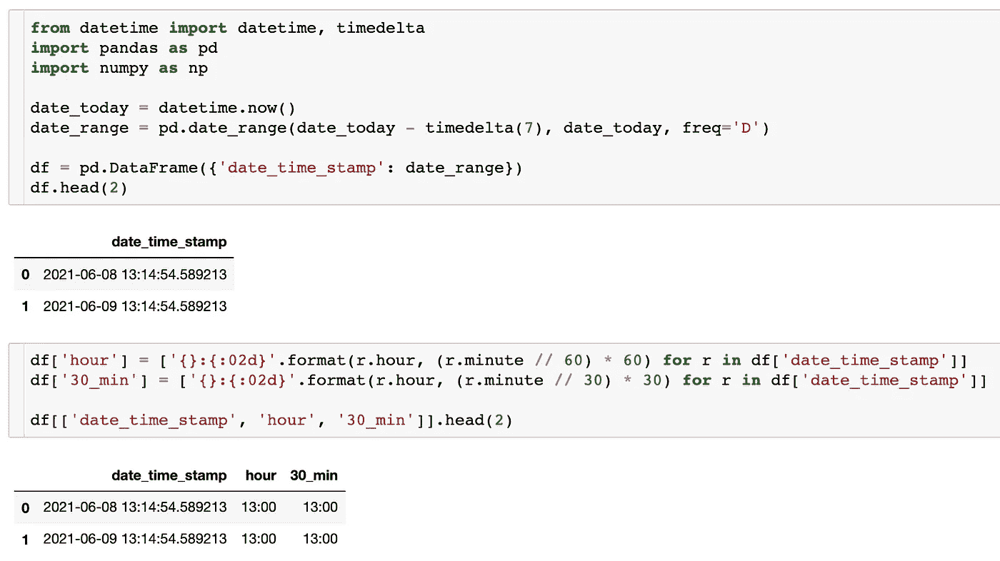
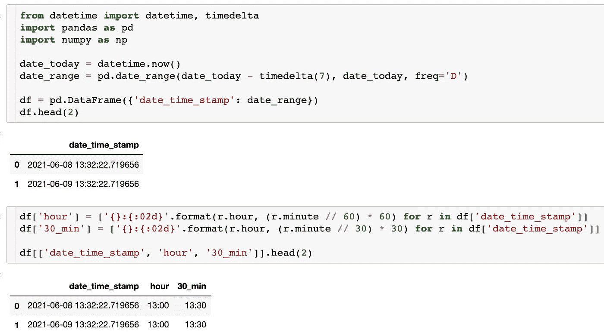

# 如何为数据科学模型创建时间要素

> 原文：<https://towardsdatascience.com/how-to-create-time-features-for-data-science-models-22b902df5115?source=collection_archive---------36----------------------->

## 为您的机器学习算法创建分类时间箱的独特方法


由[卢卡斯·布拉塞克](https://unsplash.com/@goumbik?utm_source=unsplash&utm_medium=referral&utm_content=creditCopyText)在 [Unsplash](https://unsplash.com/s/photos/time?utm_source=unsplash&utm_medium=referral&utm_content=creditCopyText) 拍摄的照片【1】。

# 目录

1.  介绍
2.  创建时间要素
3.  摘要
4.  参考

# 介绍

数据科学建模最困难的部分之一是利用时间。时间可以有多种用途。有特定于时间序列的建模，但是您也可以用不同的方式来看待时间。我们将研究这种方法，即将时间转换成一个分类变量( *s* )。虽然转换后顺序将被剥离，但时间的周期性仍将能够被您使用的机器学习算法识别。对于本例，我们将使用新兴算法 CatBoost 来正确使用这些时间特性。例如，正常情况下，订购的时间是一天中从 0 到 24 的小时数。但是，算法仍然足够智能，可以将要素视为 bin 或类别(也可以是对象或分类数据类型)，而不是数字数据类型。话虽如此，如果您想了解如何将时间戳转换为分类特征以用于数据科学建模的独特方法，请继续阅读下面的内容。

# 创建时间要素



使用的代码示例(相同时间特征值)。作者截图[2]。

下面，我们将描述用例或一般问题，以便您可以看到创建时间功能有用的示例。我们将展示这段对话的 Python 代码。最后，我们将在一些简单的代码后看看我们的特性是什么样的。对于未来的工作，您还可以通过将时间要素用作分类/对象或数值数据类型来比较模型，比较它们在精度或误差方面的变化。

> 用例

用例是预测进入餐馆的人数。尽管我们可以使用一天中的几个小时或一天中的半个小时作为数字特征，但就本文而言，我们可以使用这两个特征作为分类特征，最终将由 CatBoost 机器学习算法进行目标编码。

> 密码

```
from datetime import datetime, timedelta
import pandas as pd
import numpy as npdate_today = datetime.now()
date_range = pd.date_range(date_today — timedelta(7), date_today, freq='D')df = pd.DataFrame({'date_time_stamp': date_range})
df.head(5)
```

在上面的代码片段中，我们首先导入必要的库。接下来，我们创建从现在的*到过去七天的随机时间戳数据。然后，我们可以查看带有`df.head()`的时间戳，它们都是一个主数据帧的一部分。*

```
df['hour'] = ['{}:{:02d}'.format(r.hour, (r.minute // 60) * 60) for r in df['date_time_stamp']]
df['30_min'] = ['{}:{:02d}'.format(r.hour, (r.minute // 30) * 30) for r in df['date_time_stamp']]df[['date_time_stamp', 'hour', '30_min']].head(5)
```

在这个代码块中，我们看到我们正在创建两个时间特征。第一个是小时特性，它本质上是说— *这个非常具体的时间戳在哪个小时？*下一部分与此类似，但更细化，它说的是— *这一分钟的半小时是多少？*

例如，如果时间戳的分钟是 12:46 pm，那么`30_min`将是 12:30 ( *本质上是从 12:30 到 1:00 pm* 的一组值)

```
df.dtypes
```

在最后这段代码中，我们看到可以查看列的数据类型。第一个将返回`datetime64[ns]`，两个新计算的要素将在分类要素列表中使用，作为`object`或`categorical`数据类型。

> 这些特性在算法中是如何工作的

*   这两个要素以及您可以进一步创建的其他要素可用于 CatBoost 模型的分类要素列表中，CatBoost 模型的一部分将使用目标编码，简单来说，就是特定时间要素条柱的平均目标。



半小时/ 30 分钟示例(不同的时间特征值)。作者截图[3]。

您可以在上面的第一个屏幕截图**中看到，两个时间特性的输出具有相同的值，这是因为半小时周期仍在 30 的另一侧。如果您在 30+的日期时间尝试这样做，您将看到该值发生变化。那就是**第二张**截图不一样的地方，紧接着上图。出于用例的考虑，您最有可能期望餐厅的人数在大约`12:00`和`12:30`以及`6:00`和`6:30`(分别为*午餐和晚餐时间*)时具有最高的平均目标值，而当餐厅关门前有一股人流时，可能会有一些新的发现，也许是`9:30`。**

# 摘要

时间很重要，在开发数据科学模型时不应忽视。然而，它可能是棘手的，可以以多种方式消耗。我们创建时间特征的方式是独特的，因为我们将一个示例时间戳转换为两个分类特征。我们看到，当时间为 13:14 时，半小时功能或`30_min`与小时功能相同，但当时间为 13:32 时，则不同。当然，在数据科学模型中，时间还有更多使用方式。

> 总而言之，我们执行了以下操作:

```
* created a mock dataset* isolated a timestamp* created two features from that one timestamp* realized those two features could be used as categorical features
```

我希望你觉得我的文章既有趣又有用。如果您同意《时代》杂志的这一专题创作，请随时在下面发表评论——为什么或为什么不同意？在你的机器学习算法中，还有哪些利用时间的方式？你使用的主要技术和 Python 库是什么？

*请随时查看我的个人资料、* [*马特 Przybyla*](https://medium.com/u/abe5272eafd9?source=post_page-----22b902df5115--------------------------------) 、*等文章，也可以在 LinkedIn 上联系我。*

# 参考

[1]照片由[卢卡斯·布拉塞克](https://unsplash.com/@goumbik?utm_source=unsplash&utm_medium=referral&utm_content=creditCopyText)在[Unsplash](https://unsplash.com/s/photos/time?utm_source=unsplash&utm_medium=referral&utm_content=creditCopyText)(2017)上拍摄

[2] M.Przybyla，所用代码示例截图(*相同时间特征值*)，(2021)

[3] M.Przybyla，半小时/ 30 分钟截图示例(*不同时间特征值*)，(2021)