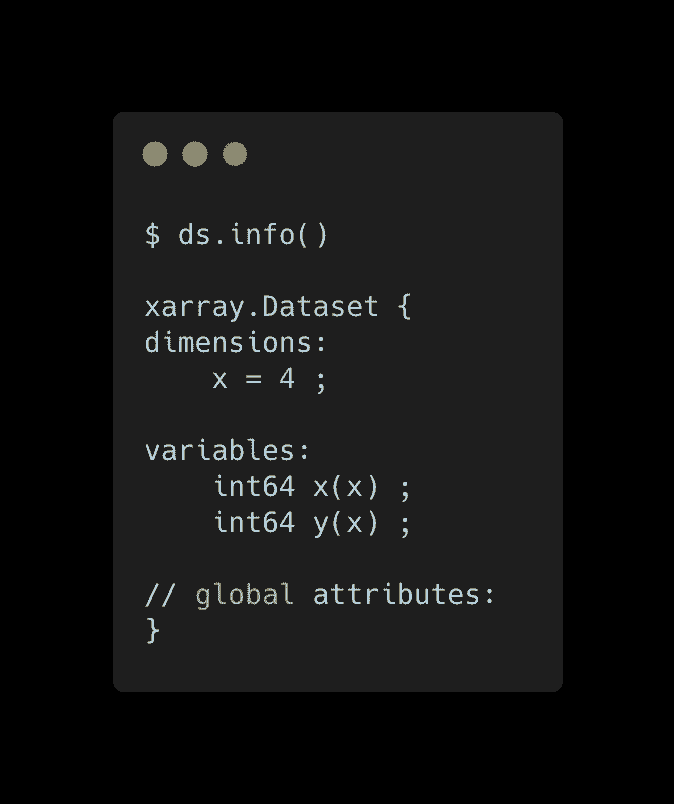
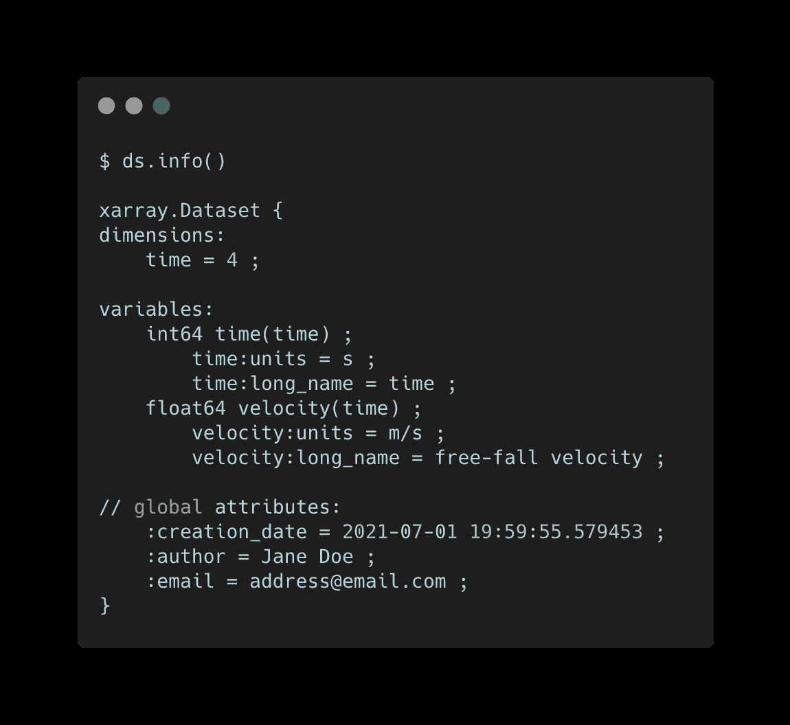
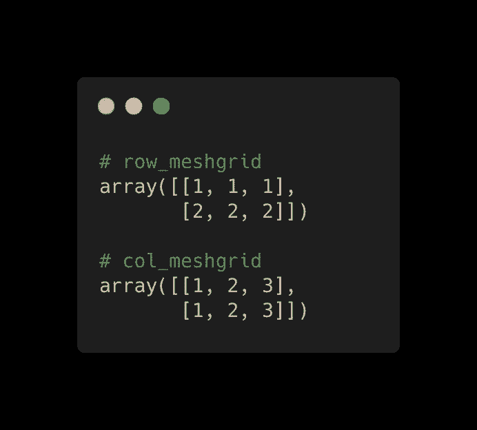

# 如何创建 Xarray 数据集

> 原文：<https://towardsdatascience.com/how-to-create-xarray-datasets-cf1859c95921?source=collection_archive---------9----------------------->

## 从头开始定义数据集


阿瑟·富兰克林在 [Unsplash](https://unsplash.com?utm_source=medium&utm_medium=referral) 上的照片

`[Xarray](https://xarray.pydata.org/en/stable/)`是一个开源的 Python 包，用于处理带标签的多维数据集。在处理地球科学界常见的 [NetCDF](https://www.unidata.ucar.edu/software/netcdf/) 格式的数据时，它是必不可少的。

用`xarray`打开 NetCDF 文件很简单。

```
ds = xr.open_dataset("/path/to/file.nc")
```

然而，创建一个可以保存到 NetCDF 文件的`xarray`对象需要更多的工作。在这篇文章中，我将回顾如何做到这一点。我将首先介绍如何将`[pandas](https://pandas.pydata.org/docs/reference/api/pandas.DataFrame.html)` [数据帧](https://pandas.pydata.org/docs/reference/api/pandas.DataFrame.html)转换为`[xarray](https://xarray.pydata.org/en/stable/generated/xarray.Dataset.html)` [数据集](https://xarray.pydata.org/en/stable/generated/xarray.Dataset.html)，然后介绍如何从头开始创建数据集。

## 目录

[1。pandas data frame to xarray dataset](#6b89)
∘[1.1 如何添加元数据和更改变量名？](#bd9f)
∘ [1.2 创建多维数据集](#83df)
∘ [1.3 如何保存我的数据？](#499f)
[2。从头开始创建 Xarray 数据集](#8e43)
∘ [2.1 具有一个坐标的数据集](#d066)
∘ [2.2 具有多个坐标的数据集](#9958)
∘ [2.3 具有坐标矩阵的数据集](#3cd5)
∘ [2.4 具有坐标向量和矩阵的数据集](#0aea)
[3 .最终想法](#019d)

# 1.熊猫数据帧到阵列数据集

从数据帧开始，您可以直接将其转换为数据集。

```
ds = df.to_xarray()
```

这可能是一个很好的起点，因为它为您创建了一个`xarray`对象。在下面的例子中，我用一个变量`y`和一个索引`x`创建了一个 dataFrame。然后我用`to_xarray()`把它变成一个`xarray`对象。

该数据集的格式还不是很好。以下是`ds.info()`输出:



作者图片

理想情况下，`info()`应该告诉你一些关于变量和整个数据集的元数据。例如，变量属性可以包括`units`，这对于温度之类的东西很重要，而全局属性可以包括原始数据源或数据集的创建者。目标是为用户提供一些数据的上下文。

在下一小节中，我们将向该数据集添加一些元数据。

对于气候和预报(cf)，元数据有一个标准的约定。关于这一点的讨论超出了本文的范围，但这里有两个资源可供感兴趣的人参考:

*   [cfconventions.org](https://cfconventions.org/)
*   [cf 惯例概述](https://cfconventions.org/Data/cf-documents/overview/viewgraphs.pdf)

请注意，这篇文章是为了说明一个概念，因此我可能会偏离常规标准。

## 1.1 如何添加元数据和更改变量名？

随着对象的创建，我们可以开始添加元数据和改变变量/坐标名称。

字典`key:value`对用于重命名变量/坐标和添加属性。下面是基本语法:

*   **重命名变量** : `ds.rename({“old_name” : “new_name”})`
*   **var 属性:** `ds[“var”].attrs = {“attribute_name”:”attribute_value”}`
*   **全局属性:**

下面的代码片段首先重命名坐标和变量，然后创建变量和全局属性。

(**注:xarray 没有熊猫那样的** `**inplace=True**` **选项。**)

下面是添加一些元数据后的`ds.info()`输出



作者图片

这是一个格式良好的数据集。用户可以很快理解这个数据集代表什么以及谁创建了它。在第 2 节中，我们将从头开始创建相同的数据集。

## **1.2 创建多维数据集**

对于多个维度，只需在`set_index()`中包含一个维度列表。然后，您可以像以前一样添加元数据和更改变量

## 1.3 如何保存我的数据？

对更改感到满意后，可以将它们保存到 NetCDF 文件中:

```
ds.to_netcdf('/save/to/this/path/file.nc')
```

在下一节中，我将从头开始创建数据集。如果您想要将一个大的`NumPy`数组或列表保存为 NetCDF，这将非常有用。

# 2.从头开始创建 Xarray 数据集

以下语法用于创建带有`xarray`的数据集:

```
ds = xr.Dataset(data_vars, coords, attrs)
```

一个完整的数据集由三个字典组成:

*   `data_vars`:关键是变量名，值是由
    `(dimensions, data, variable_attributes)`
    - `dimensions` →名称列表
    - `data` →数据可以是任意格式(`Pandas`、`Numpy`、list 等)。)
    - `variable_attributes` → **可选**属性字典
*   `coords`:定义坐标及其属性
*   `attrs` : **可选**全局属性字典

属性是可选的，但是强烈建议使用。

## 2.1 具有一个坐标的数据集

下面使用`xr.Dataset()`创建与上一个例子相同的数据集。

**data_vars** :用一维`time`定义变量`velocity`，包含`units`和`long_name`两个属性。

**坐标**:定义`time`坐标，其维度也称为时间。

**属性**:定义全局属性`creation_data`、`author`和`email`

## 2.2 具有多个坐标的数据集

如果数据是多维的，通常会有多个坐标。

在这里，我创建了一个数据集，其中变量有两个维度，`x`和`y`，以及两个坐标，`lat`和`lon`。

在前面的示例中，坐标和尺寸同名。这个例子说明它们不需要相同。

## 2.3 带坐标矩阵的数据集

在前面的例子中，每个坐标由一个矢量表示。但是，在某些情况下，将坐标表示为矩阵是有意义的。这在不规则网格上的地球系统模型中很常见。

让我们以前面的例子为例，使用`np.meshgrid()`将每个坐标转换成一个矩阵

`np.meshgrid`从坐标向量创建坐标矩阵。行网格在`cols`的长度上重复`rows`，列网格在`rows`的长度上重复`cols`。这是每个网格。



作者图片

现在让我们使用矩阵表示的坐标创建一个数据集。

这表示与以前相同的数据，唯一的区别是每个坐标表示为矩阵而不是向量。这是为了说明一个概念。在大多数情况下，将坐标表示为向量更有意义。

## 2.4 带有坐标向量和矩阵的数据集

坐标可以是矩阵和向量的混合。你只需要确保变量中的所有维度都在你的坐标中。

让我们创建一个具有三个维度的数据集， `time`、`lat`和`lon`。空间维度(`lat`、`lon`)将分别由矩阵表示，而`time`将是向量。

# 3.最后的想法

希望这有助于您创建自己的数据集并扩充现有数据集。

如果您的数据很小或者已经在熊猫数据框架中。那么使用`to_xarray()`是创建初始对象最简单的方法。在任何其他情况下，从头开始创建数据集可能更容易。

我介绍了两种表示坐标的方法:向量或矩阵。我的建议是尽可能保持坐标为向量。如果数据不在规则的网格上，通常使用矩阵来存储坐标信息。

如果创建数据集时出现错误，首先要检查的是维度。很容易将维度打乱顺序。

我的另一条建议是，尽管在创建数据集时属性是可选的，但最好总是包含它们，这样您和其他人就可以轻松地解释数据集。我更喜欢在创建数据集对象后添加属性。这是我认为提高可读性的个人喜好。

*感谢您的阅读，我很乐意帮助您解决任何问题*

[](https://lukegloege.medium.com/membership) [## 通过我的推荐链接加入 Medium—Luke Gloege 博士

### 作为一个媒体会员，你的会员费的一部分会给你阅读的作家，你可以完全接触到每一个故事…

lukegloege.medium.com](https://lukegloege.medium.com/membership)