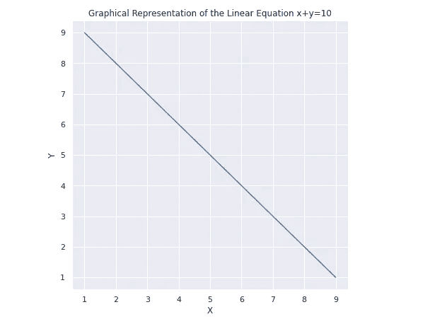
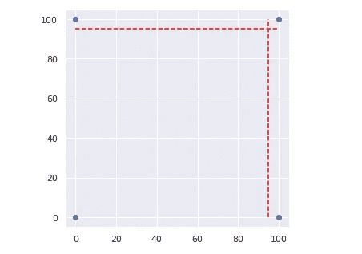
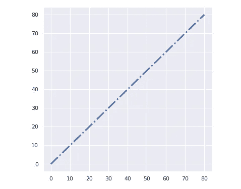
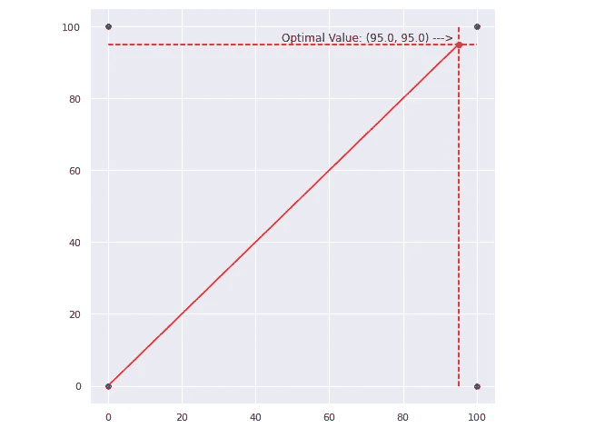

# 如何用 Python 创建第一个线性规划求解器

> 原文：<https://towardsdatascience.com/how-to-create-your-first-linear-programming-solver-in-python-284e3fe5b811?source=collection_archive---------10----------------------->

## 了解这些软件包是如何工作的，以及如何创建您的第一个求解器。


由[夏嫣·胡伊津加](https://unsplash.com/@iam_anih?utm_source=unsplash&utm_medium=referral&utm_content=creditCopyText)在 [Unsplash](https://unsplash.com/s/photos/line?utm_source=unsplash&utm_medium=referral&utm_content=creditCopyText) 拍摄的照片

## **线性编程**

线性规划(LP)是通过求解线性方程来获得问题的最优解的方法。

好吧，对你来说还是个谜？那么让我试着简化更多。

线性规划将寻找一个问题，并使用像 *x* 和*y*这样的变量将它转换成数学方程。之后，就是尝试这些变量的数字，直到你达到最佳解决方案，可能是最大或最小的可能值。

如果我给你等式 *x + y = 10* 并求 *x 的最大值，*这就是 LP 的一个好例子。

之所以称之为**线性**是因为那些类似于 *xy 的*数学表达式可以表示为空间中的一条线，这意味着如果我通过找到 *x* 和 *y* 的值来解方程，并将结果组合绘制在二维图形上，结果将是一条线。



看，是一条线！[ x + y = 10 ]。图片由作者提供。

# 解释概念

在本节中，我的意图是将线性规划应用于一个非常简单的问题，这将使我们充分理解如何将我们的问题转化为一个方程，线性解算器如何工作以及如何对它们进行编程。

*最重要的事情首先*。在编码之前，让我们回顾一些概念。

*   **目标函数**:那就是目标，你实际要解决的问题(比如利润最大化，损失最小化，空间分配最优化)。
*   **约束**:罐和斜面。在解决问题的过程中，什么会发生，什么不会发生(例如，值不能为负，容器中的最大可用空间)。
*   **变量**:问题的可变部分(如产品、价格、利润、规模)。

## 解决者（solver 的复数形式）

Python 中有几个可用的 LP 求解器包。其中有 SciPy，PuLP，CVXOPT。在本教程中，我们将使用`PuLP`。

使用 pip 安装它:

```
pip install pulp # for Jupyter Notebooks
!pip install pulp
```

## 问题是

想象一下，我们有一个 100 米乘 100 米的正方形区域，我们必须从 0 点到右上角画一条最长的 45 度对角线。但是，让我们想象一下，在距离上边距 5 米的地方有一个栅栏，在距离右边距 5 米的地方又有一个栅栏。我想知道如果我必须停在围栏上，我的 X 和 Y 的最大值是多少(我画最长线的坐标)。



问题的可视化。图片由作者提供。

就像我说的，这是一个非常简单的问题。你大概自己算出来答案是 x=95，y=95 吧？这也是我方法的一部分。既然你已经知道了答案，让我们来研究一下我们可以建立的逻辑，让计算机得到结果。

## 目标函数

如前所述，目标函数是我们的目标，是我们想要完成的，是我们试图解决的。

> 目标函数就是我们要解决的问题。

在我们的例子中，我们想要画一条对角线。你是否同意我的观点，为了在 2D 图上画一条对角线，我们所要做的就是给 X 和 Y 赋予相同的值？



(x=10，y=10)，(20，20)…。(80,80).X = Y =直线。图片由作者提供。

此外，我们希望将值加到最大值。这样，我们的目标函数就变成了 ***x + y*** 。

## 限制

在这个问题中，我们只有两个简单的约束:直线不能在栅栏之后，值不能为负。

> 约束是目标函数必须遵循的规则。

现在，为了将约束转化为数学形式，我们必须再次使用 x 和 y。让我们进行逻辑思考。如果场地是 100 x 100，我们有一个距离顶部 5 米、距离右侧 5 米的围栏，我们应该说 *x* 不能高于 100–5(*a . k . a . 95)。*这同样适用于 *y，*因为这意味着线越过了围栏。

1.  *0 ≤ x ≤ 95*
2.  0≤ y ≤ 95

## 创建求解器

下一步是使用纸浆来创建我们的解决方案，并找到最大的对角线结束坐标值。

将模块导入 Python 会话:

```
from pulp import LpMaximize, LpProblem, LpStatus, LpVariable
```

创建求解器和变量的实例。注意这里的`lowBound`参数将作为一个约束来防止负值。`upBound`参数并不那么重要，因为它会被 fence 约束覆盖，但是知道它的存在还是很好的。

```
# Create the **maximization** problem
model = LpProblem(name='Field Problem', sense=LpMaximize)# Initialize the **variables**
x = LpVariable(name="x", lowBound=0, upBound=100)
y = LpVariable(name="y", lowBound=0, upBound=100)
```

下一步是向模型添加约束。第一个元素是 LpConstraint 实例。第二个元素是您希望为该约束提供的名称。我们可以创建 x≥0 和 y≥0，但正如前面所解释的，这已经被考虑到了。

```
# **Add the constraints** to the model. Use += to append expressions to the modelmodel += (x <= 95, "margin_X") #it cannot go past the fence
model += (y <= 95, "margin_Y")
```

现在我们将目标函数添加到模型中。

```
# Objective Function
obj_func = x + y# Add Objective function to the model
model += obj_func
```

如果您想在求解之前查看刚刚创建的模型，只需调用您的模型名称。在那里你会看到它是如何从逻辑上将问题解读为数学问题的。*以 x 和 Y 小于 95* 为条件，最大化函数 x+y。

```
modelField_Problem: 
MAXIMIZE 
1*x + 1*y + 0 
SUBJECT TO 
margin_X: x <= 95  
margin_Y: y <= 95 

VARIABLES 
x <= 100 Continuous 
y <= 100 Continuous
```

求解。

```
status = model.solve()
```

打印报告。

```
print(f"status: {model.status}, {LpStatus[model.status]}")
print(f"objective: {model.objective.value()}")
for var in model.variables():
    print(f"{var.name}: {var.value()}")for name, constraint in model.constraints.items():
    print(f"{name}: {constraint.value()}")**[OUT]:**
status: 1, Optimal 
objective: 190.0 
**x: 95.0 
y: 95.0** 
margin_X: 0.0 
margin_Y: 0.0
```

不出所料， *x* 和 *y* 的最大值是 95。

```
# The field solution plot# Create a plot space
plt.figure(figsize=(8,8))# Dimensions of the field.
xlimits=[0,100,0,100]
ylimits=[0,0,100,100]# Plot field
plt.scatter(xlimits,ylimits)
# Plot line SOLUTION
plt.plot([0,x.value()], [0,y.value()], c='red')
# Plot MAX POINT
plt.scatter(x.value(),y.value(), c='red')
# Plot Fence 1
plt.vlines(95, 0,100, linestyles='--', colors='red')
# Plot Fence 2
plt.hlines(95, 0,100, linestyles='--', colors='red')# Annotations
plt.annotate(f'Optimal Value: {x.value(), y.value()} --->', xy=(47, 96));
```



解决方法。图片由作者提供。

## 在你走之前

这篇文章的目的是给你一个温和的和用户友好的 Python 线性编程的介绍。这个例子非常简单，但我们的想法是从这里开始，理解基本概念，以便能够将其应用于更复杂的问题。

如果你想深入了解，这里有一个来自 Real Python 的很好的教程。

<https://realpython.com/linear-programming-python/>  

如果这些内容对你有用，请关注我的博客。

<https://medium.com/gustavorsantos> 