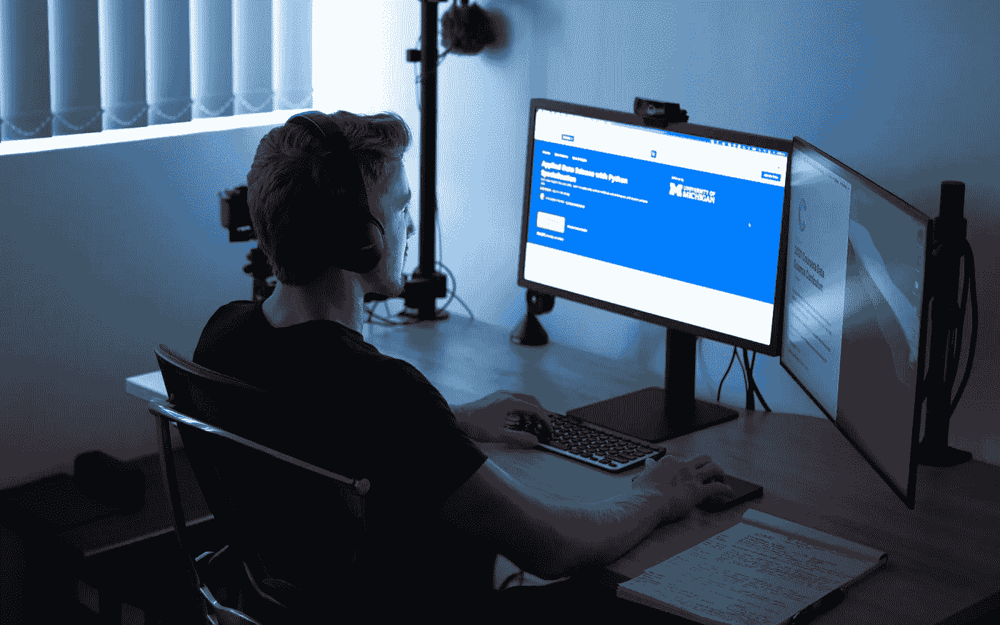
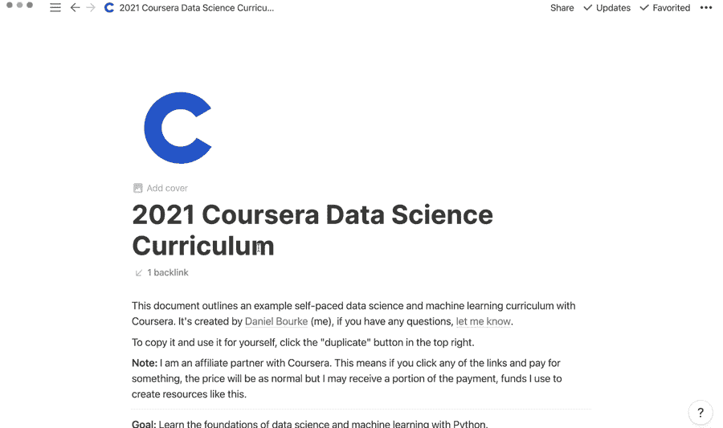

# 2021 年如何用 Coursera 创建自己的数据科学课程

> 原文：<https://towardsdatascience.com/how-to-create-your-own-data-science-curriculum-with-coursera-in-2021-36feda936ead?source=collection_archive---------15----------------------->

## 用 Python 学习数据科学和机器学习基础的初学者友好方法

作者在他的无电缆管理的工作站上紧张地工作。感谢山姆·伯克的照片。

我在苹果工作的时候，我们有一套系统。如果您的设备有问题，您可以走进办公室，告诉我们问题所在，然后我们会让您知道如何当场解决问题，或者记下您的姓名，以便我们可以为您预约与技术人员一对一的时间。

我是一名技术人员，所以一旦我完成了一个客户，我就会看着名单，然后去找下一个。

一天，一个女孩拿着她的 iPhone 进来寻求帮助。我走过去和她打招呼，注意到她在一个蓝色的应用程序中滚动。

我问她这是什么应用。

她说是 Coursera。

那是什么？我问。

这是一个你可以学习不同东西的应用程序。

真的吗？你在大学学习吗？

不再是了，我只是觉得学点东西总是好的。

她不知道，但那一句话改变了我的一生。在那之前，我只在需要的时候学习:为了工作，为了学校。当然，有时我会追随自己真正的好奇心(玩电子游戏，学习烹饪)，但她的话说明了一个事实，如果我真的想，我可以学任何我想学的东西。任何事。

有趣的是偶遇会有这种效果。

# 我自己的路

那天晚上，我回到家，搜索她告诉我的那个蓝色应用的名字。就好像我发现了一个新的世外桃源。你可以选择你想学的，明天就有课了。

什么？

在那之前，我一直在大学学习(并且失败了)。我考虑过要学什么，但是必须在特定的时间特定的地点不适合我。我 17 岁开始上大学。我只想坐在草地上看女孩。

唉，我从来没有真正使用过 Coursera，直到几年前苹果商店的女孩告诉我。

我离开了苹果公司，决定学习如何开发我正在帮助解决问题的程序。

在第四次学习编码的时候(前三次我都放弃了)，我偶然发现了机器学习。换句话说，编写代码来使用数学在数据中寻找模式。

我想，我必须学会这个。

由于我认为我已经在大学度过了足够的时间，所以我整理了一份在线课程清单，以创建我自己的[人工智能硕士学位](https://dbourke.link/aimastersdegree)。

你猜怎么着？

很多都来自那个女孩给我看的蓝色应用。

# 你自己的路

如果说 2020 有什么明确的话，那就是每个人都必须对自己的健康和教育负责。

现在是 2021 年(或者更晚，如果你在未来读到这篇文章，顺便说一句，你好)，物理采集规则仍然悬而未决，许多人(也许你)正在转向在线资源学习，而不是传统资源。

这篇文章不是关于大学和在线学习的争论。做任何适合你的事。

这篇文章演示了如何使用 Coursera 快速拼凑自己的数据科学和机器学习课程。

然而，不要误以为你可以很快地完成课程，因为工作已经结束了。

学习任何有价值的东西，尤其是网上学习，不适合胆小的人。如果你还没有，你将不得不培养一种责任感。这就是开发你自己的课程能为你做的。这会让你陷入困境。

# 数据科学和机器学习课程示例

人们总是问我，为什么不用免费资源呢？

我告诉他们，当然，你可以使用免费资源。但是我发现它们对我来说不太管用。我刚用 Coursera 的时候，他们是按月收费的。我马上就知道我要付多少钱。知道我在为某样东西付钱让我更认真地对待它。

但是你不是付了大学学费吗？

是的。但是我没有看到钱从我的账户里出来。我以为它是免费的，我以为它是神奇的。我花了 5 年时间完成了一个 3 年的学位，最终负债 35，000 美元(与其他人相比，这是一笔可观但微不足道的债务)。

现在 Coursera 有一个服务叫做 [Coursera Plus](https://dbourke.link/courseraplus) 。约 537 澳元(约 399 美元)，可全年使用世界一流的学习材料。吼吼。如果在我开始使用 Coursera 的时候就有了，我会省下一大笔钱。

具体时间到了。

大约一年前，我写了一篇名为[学习机器学习的 5 个初学者友好步骤](https://www.mrdbourke.com/5-beginner-friendly-steps-to-learn-machine-learning/)的帖子，通过在互联网上收集资源来学习机器学习的基础知识。

这篇文章的重点是让读者从对编程一无所知尽快用 Python 编程语言编写机器学习代码。

因此，为了开始 2021 年，我想我会复制这个帖子，通过 Coursera Plus 提供一些 Coursera 课程。

但是等等…这不仅仅是简单的复制。我还整理了一个[想法模板](https://dbourke.link/coursera-notion-template)，你可以用它来记录你的进展。

如果你以前从未使用过概念，在点击右上角的“复制”按钮之前，探索一下模板并点击一些东西(不要担心，你不能破坏它)，然后你将能够改变它以适应你的需要。

使用 data 和 Coursera 课程创建的数据科学课程[示例。你可以复制一份，然后点击右上角的“复制”按钮，根据自己的需要进行编辑。为什么是观念？又好玩又免费。](https://dbourke.link/coursera-notion-template)

你可以在 YouTube 上看到上面的概念模板和课程的视频演示。

现在，用一个步骤列表来减少一点互动怎么样？

> ***注:*** *如果你正在读这篇文章，并认为“哇，这听起来像是 Coursera 的广告”，你是对的。Coursera 找到我，问我是否有兴趣写一篇帖子，专门帮助学生用 Coursera 整合他们自己的课程，我说有。也就是说，把这条消息作为一个披露，如果你点击这个帖子中的链接，并支付一些东西，金额不会改变，但我会得到你支付的金额的一部分(我用来创建这样的资源的资金)。*

## 第一步:[学习如何学习专业化](https://dbourke.link/coursera-learning-how-to-learn)

**是什么:**发现并复制艺术家、数学家、音乐家等的最佳学习技巧。

**为什么它很重要:**如果你要开始自己的学习之旅，你最好学会如何学习。学会如何学习是终极元技能。因为如果你能学会如何学习，你就能学到任何东西。

我建议每个人都学习这门课程，不管他们是学习数据科学、机器学习还是粒子物理。你可以在我的博客上查看我的[完整评论文章](https://www.mrdbourke.com/an-in-depth-review-of-the-learning-how-to-learn-course-on-courserathe-ultimate-skill-learning-how-to-learn/)。

## 第二步: [Python 为大家特殊化](https://dbourke.link/coursera-python)

**是什么:**这个专业化将帮助你从零编程能力到能够编写 Python 代码。

**为什么重要:**如果你想进入数据科学和机器学习领域，很有可能你会去写 Python 代码。但是如果以前没有使用过 Python 语言，很难编写 Python 机器学习代码。所以使用这个专门化来熟悉 Python 的基本概念。

## 第三步:[用 Python 应用数据科学](https://dbourke.link/coursera-data-science-python)

**它是什么:**现在你已经掌握了一些基本的 Python 技能，是时候开始对它们进行裁剪，以便能够处理数据了。这种专门化将使您熟悉流行的 Python 数据科学库，如 pandas、matplotlib 和 scikit-learn。

**为什么重要:**因为 Python 是一种通用编程语言，你几乎可以用它做任何事情。但是好消息是，你在 Python 中为每个人学习的基础知识可以在这里使用。更具体地说，您将开始学习如何使用:*

*   [pandas](https://pandas.pydata.org/) —一个广泛的数据分析库，用于处理 Excel 电子表格中的数据(行和列)。
*   [matplotlib](https://matplotlib.org/) —一个 Python 库，用于使用您的数据创建可视化绘图。
*   [scikit-learn](https://scikit-learn.org/) —一个广泛的机器学习库，具有许多预先构建的机器学习模型和功能，用于准备和转换数据。

## 第四步:[机器学习专门化](https://dbourke.link/coursera-machine-learning-specialization)

**是什么:**如何诊断机器学习问题？是回归吗？分类？聚类？信息检索？这个专业将教你如何回答这些问题，并建立能够在数据集内学习模式的系统。

**为什么重要:**Python 专业的应用数据科学教会了你如何操作和可视化数据，现在在机器学习专业中，你将学习如何编写机器学习代码来查找数据中的模式。

## 第五步:[机器学习专用数学](https://dbourke.link/coursera-math-for-ml)

**是什么:**如果你一直想知道机器学习算法如何能够学习数据中的模式，有一个答案:数学。主要是通过线性代数和多元微积分的结合(加上一些其他的)。

机器学习数学专业将帮助您理解为许多最有效的机器学习算法提供动力的基础数学。

**重要提示:**数据是自然的压缩形式，数学可以用来发现数据中的模式，代码可以用来执行大规模的数学运算。上面的步骤主要是让你尽快编写代码。然而，随着您了解的越来越多，您可能会想要发现您正在编写的代码是如何工作的。

这个专业将带你深入机器学习算法的内部工作，并进一步加强你对你正在编写的代码的理解。

> *为什么是这些？*

在 [Coursera Plus](https://dbourke.link/courseraplus) 上有 3000 多个专业/课程。对你来说太多了。

我挑选的这些来自我自己的个人经历(我已经浏览过了)，或者因为它们的内容是世界一流的，正是你开始学习数据科学和机器学习所需要的。但话虽如此，如果有什么能激发你的兴趣，那就去做吧。

> *经历这一切需要多长时间？*

按你自己的速度走。但是如果你把所有推荐的时间表加起来，你可能会在 12-18 个月之间结束。

然而，永远不要低估速度的力量。建议的时间表适用于平均水平为*的*学生。你是普通人吗？还是你渴望学习？如果你是后者，记住，[没有速度限制](https://sive.rs/kimo)。

> *我需要 Coursera Plus 吗？*

不。你可以单独挑选任何你想要的课程。然而，如果你打算经历以上所有，Coursera Plus 提供了一个很大的折扣。

> *我试过了，不喜欢…可以退款吗？*

是的。注册 Coursera Plus 后你还有 14 天时间。

但这是我自己经历的另一件趣闻。我过去报了一个课程，害怕自己做不到。所以我给支持团队发了邮件，询问退款政策是什么。他们告诉我两个星期。

结果我没有得到退款。我完成了课程，挣扎着，错过了最后期限，但是当我从另一边出来时，我知道的比我开始时多得多。

# 基本面之后

这篇文章的主要观点是互联网让你可以创造自己的学习之旅。Coursera 是一个非凡的资源，我强烈推荐它，但它只是众多资源中的一个。

我们所说的一切都可以在 Coursera 之外学到。你甚至可以使用[概念课程](https://dbourke.link/coursera-notion-template)模板，用所有免费资源复制它，并跟踪你的进度。

假设你做了，你创建了自己的课程，不管是不是 Coursera 驱动的。你下一步应该做什么？

那个问题值得单独写一篇文章。但是最起码:分享你的作品。

写下你所学到的。用你自己的名字创建一个博客。搜索“如何用 GitHub 页面创建博客”或开始在 Medium 上写作。

不要担心别人已经写了你想写的东西。写下你所学到的东西的练习会进一步帮助你的学习。

六个月前的你会想知道什么？写下来。

关于这方面的更多信息，我推荐阅读[“像我这样的初级数据科学家如何获得经验？”](https://www.mrdbourke.com/how-can-a-beginner-data-scientist-like-me-gain-experience/)。

> *高级技能呢？*

这篇文章已经涵盖了基本原理。如果你想拓展你的知识，我会推荐所有的 deeplearning.ai 课程和所有的 fast.ai 课程。

之后，你就完成了课程。开始你自己的项目。课程教授基础知识，自我驱动的项目帮助你学习细节(无法教授的知识)。