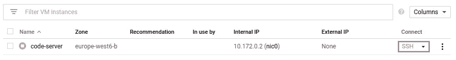
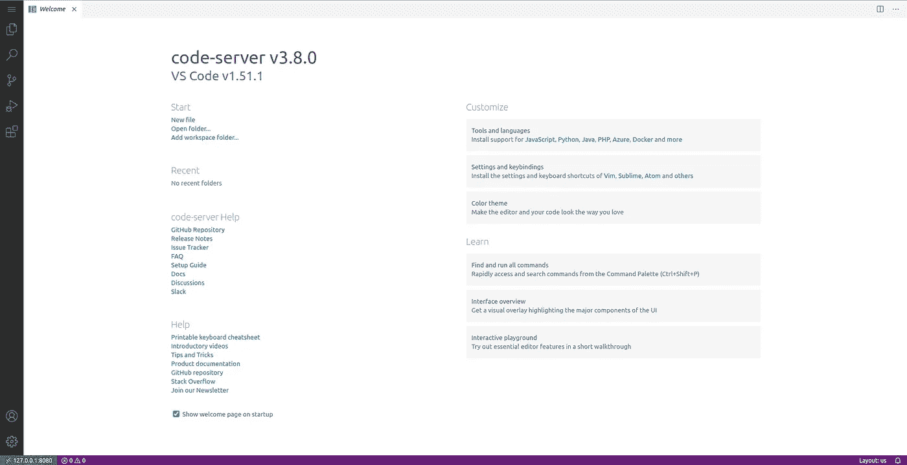

# 如何创建自己的 VS 代码服务器

> 原文：<https://towardsdatascience.com/how-to-create-your-own-vs-code-server-fa7812d308b0?source=collection_archive---------4----------------------->

## 在家工作与远程工作不同


约书亚·阿拉贡在 [Unsplash](https://unsplash.com/s/photos/code?utm_source=unsplash&utm_medium=referral&utm_content=creditCopyText) 上拍摄的照片

[Visual Studio Code](https://code.visualstudio.com/) 是一个免费的、轻量级的、跨平台的代码编辑器。它可能不像 IntelliJ Idea 或 PyCharm 那样是一个成熟的 IDE，但它是一个强大的、不受干扰的工具，拥有专门的粉丝群和蓬勃发展的生态系统。

近年来，VS Code 已经成为许多开发人员喜欢的编辑器，不管他们的背景、语言和选择的技术如何。因此，下一个合乎逻辑的步骤是尝试在任何地方运行 VS 代码。例如，我们已经看到 GitHub 如何将其集成到[代码空间](https://github.com/features/codespaces)中，在那里您可以生成一个即时开发环境，并调整您的存储库中的代码。

> 在家工作与远程工作不同。远程工作意味着在世界上的任何地方全天 24 小时工作。

然而，GitHub 代码空间的缺点是定价。目前，这项服务处于公测阶段，可以免费使用。但是 GitHub 将会在 Codespaces 正式发布时宣布价格。不幸的是，我们在相应页面上得到的细节并不令人鼓舞。没有免费层，没有小实例，整体价格虚高。

如果您可以构建自己的服务器，或者租用一个较小的实例，甚至使用 GPU 或 TPU 加速获得一个较大的实例，会怎么样？此外，在下面的故事中，我们看到了如何使用远程开发来隔离您的项目并与您的团队成员轻松协作。

[](/the-only-vs-code-extension-you-will-ever-need-e095a6d09f24) [## 你唯一需要的 VS 代码扩展

### 如果您必须安装一个 Visual Code Studio 扩展，这就是它！

towardsdatascience.com](/the-only-vs-code-extension-you-will-ever-need-e095a6d09f24) 

但是，如果您可以将 VS 代码与您的项目依赖项一起打包，创建一个真正灵活的环境，实现在世界上任何地方、任何时间工作的梦想，或者没有任何麻烦地加入新的团队成员，会怎么样呢？让我们看看如何创建自己的 VS 代码服务器！

> [学习率](https://www.dimpo.me/newsletter?utm_source=medium&utm_medium=article&utm_campaign=vs_code_server)是为那些对 AI 和 MLOps 的世界感到好奇的人准备的时事通讯。你会在每周五收到我关于最新人工智能新闻和文章的更新和想法。在这里订阅！

# 创建自己的 VS 代码服务器

在这个故事中，我们将在 GCP 上使用一个 VM，但是你应该很容易使用任何机器或 VM 提供者。

首先，在 GCP 上启动一个虚拟机，至少有 2 个 vCPU 内核、1GB 内存和 32GB 标准存储。请注意，这个低端选项在代码空间上不可用。具有这种配置的虚拟机与 Codespaces 的预算产品之间的差异是每月 4 美元(一天 8 小时，一周 5 天)。在代码空间，你要支付大约 13.5 美元，而在 GCP 大约 9.5 美元。

差别不是很大，但是使用你自己的虚拟机给了你更多的灵活性；你可以根据自己的需要精确调整它，当你需要更大马力时扩大它的规模，当你测试一个新想法时，你可以放弃。

1.  导航至侧边栏上的`Compute Engine -> VM Instances`
2.  现在单击`Create Instance`创建一个新实例
3.  根据[gcping.com](http://www.gcping.com/)选择离你最近的地区(任何地区都可以)
4.  从通用系列中启动一个`E2`系列实例
5.  将类型更改为 custom，并设置至少 2 个 vCPU 核心和 1GB RAM
6.  将`Boot Disk`更改为 Ubuntu `20.04`图像，并设置为 32GB
7.  导航到`Security -> SSH Keys`并在那里添加您的公钥*
8.  点击创建！

> *如果你不知道如何创建你的 SSH 密钥，请看 GCP 指南[这里](https://cloud.google.com/compute/docs/instances/adding-removing-ssh-keys)

您的实例将在几秒钟内准备好。点击右边的`SSH`按钮，连接到机器并安装 VS 代码服务器。



连接到虚拟机实例—按作者排序的图像

为了安装一个 VS 代码服务器，我们将通过[编码器](https://github.com/cdr/code-server)使用`code-server`。要安装它，请运行以下命令:

```
curl -fsSL https://code-server.dev/install.sh | sh
```

等待几秒钟，然后通过执行`code-server`启动服务器。VS 代码实例将开始监听`localhost`以避免向外界暴露自己。这是至关重要的，因为有人可以完全接管你的机器使用 VC 代码终端。

那么，如何连接到服务器呢？最简单的方法是使用 SSH 转发。首先，停止服务器并运行以下命令来禁用密码身份验证方法，然后重新启动服务器:

```
sed -i.bak 's/auth: password/auth: none/' ~/.config/code-server/config.yamlsudo systemctl restart code-server@$USER
```

假设您已经设置了一个项目范围的 SSH 密钥，启动您的本地终端并运行以下命令:

```
ssh -i [path/to/your/private/key] -N -L 8080:127.0.0.1:8080 [user]@<instance-ip>
```

最后，启动一个终端并导航到`[http://127.0.0.1:8080/](http://127.0.0.1:8080/)`。你现在有了自己的 VS 代码服务器！



浏览器中的 VS 代码—作者图片

如需详细文档，请访问 GitHub 上的`code-server` [文档页面。](https://github.com/cdr/code-server/blob/v3.8.0/doc/guide.md)

# 结论

Visual Studio Code 是一个免费的、轻量级的、跨平台的代码编辑器，是一个强大的、不受干扰的工具，拥有专门的粉丝群和蓬勃发展的生态系统。

将它作为一个网络应用程序来运行，可以让你在世界上的任何地方，使用任何媒介(甚至是你的 iPad)来工作。此外，您可以将其与您的项目一起打包到孤立的容器中，并创建一个无缝的入职流程。所以，继续构建你自己的 VS 代码服务器吧。

# 关于作者

我叫 [Dimitris Poulopoulos](https://www.dimpo.me/?utm_source=medium&utm_medium=article&utm_campaign=vs_code_server) ，我是一名为 [Arrikto](https://www.arrikto.com/) 工作的机器学习工程师。我曾为欧洲委员会、欧盟统计局、国际货币基金组织、欧洲央行、经合组织和宜家等主要客户设计和实施过人工智能和软件解决方案。

如果你有兴趣阅读更多关于机器学习、深度学习、数据科学和数据运算的帖子，请在 Twitter 上关注我的 [Medium](https://towardsdatascience.com/medium.com/@dpoulopoulos/follow) 、 [LinkedIn](https://www.linkedin.com/in/dpoulopoulos/) 或 [@james2pl](https://twitter.com/james2pl) 。此外，请访问我的网站上的[资源](https://www.dimpo.me/resources/?utm_source=medium&utm_medium=article&utm_campaign=vs_code_server)页面，这里有很多好书和顶级课程，开始构建您自己的数据科学课程吧！