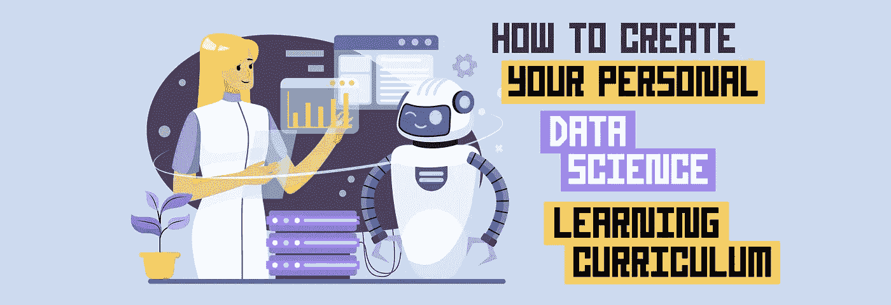
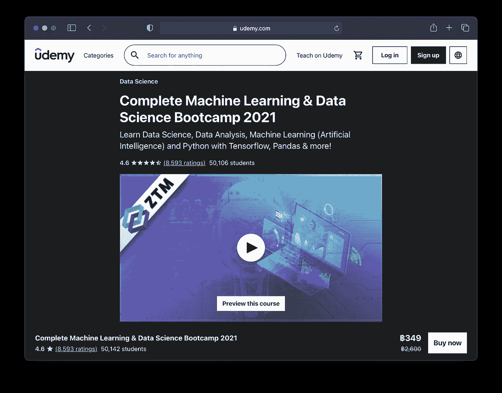

# 如何创建您的个人数据科学学习课程

> 原文：<https://towardsdatascience.com/how-to-create-your-personal-data-science-learning-curriculum-676329562331?source=collection_archive---------14----------------------->

由 [envato elements](https://1.envato.market/c/2346717/628379/4662) 的 [hoangpts](https://elements.envato.com/user/hoangpts) 使用图像创建(经许可)。

## 加上我整理的数据科学课程列表

# 1.介绍

数据科学是一个快速发展的领域，因为它为企业和行业带来了巨大的价值和数据驱动的洞察力。作为一种职业，*数据科学家*被誉为 21 世纪最性感的<https://hbr.org/2012/10/data-scientist-the-sexiest-job-of-the-21st-century>*，这也是发表在《哈佛商业评论》上的标志性文章的标题。*

*每个有抱负的数据科学家在他们的数据科学学习旅程中都会遇到的一个问题是: ***一个人到底应该如何学习数据科学？*** 这个问题的答案可能会有很大的不同，这取决于学习者可以获得的独特机会和资源。*

*您可能想知道以下问题:*

*   *我应该攻读数据科学的研究生学位吗？*
*   *我应该参加训练营以获得数据科学技能吗？*
*   *我应该找一个能指导我进入数据科学领域的导师吗？*
*   *我可以接受数据科学方面的在职培训吗？*
*   *作为一个自考的人可以自己学习数据科学吗？*

*以上问题都是有效选项。*

*在本文中，我们将重点关注后一种选择，即如何作为自学者自学数据科学。怎么会？通过设计你自己的个人学习课程。*

*让我们开始吧！*

*[如何创建你的个人数据科学学习课程](https://youtu.be/IyffPjcbWnY) @ [数据教授 YouTube 频道](https://youtube.com/dataprofessor)*

# *2.自学数据科学*

*就我个人而言，当我在 2004-2005 年作为一名生物学本科背景的博士生开始学习数据科学时，我基本上是自学的。当时，术语*数据科学*还不存在，而是使用术语*数据挖掘*和*机器学习*。*

*对我来说，我可以肯定地证明，这一旅程并不容易，道路也不清晰。我在我的一些 YouTube 视频中探索过这个故事( [*一个生物学家如何成为一个数据科学家*](https://youtu.be/IYHrZx0G12w) 和 [*成为一个数据科学家(读博士或不读博士)*](https://youtu.be/ulRPiEJRyFQ) )。长话短说，我想应用机器学习来分析和理解生物数据集。*

*了解我现在所知道的，再加上现在存在的关于数据科学的学习资源的指数增长，我可以说，这些天的学习环境对于闯入数据科学的初学者来说更加友好。*

*让我们在本文的后续部分更深入地探讨如何自学数据科学。*

# *3.创建您的个人学习课程*

*有很多关于数据科学的学习资源(我们将在本文中介绍),但并非所有这些都是通用的。正是因为这个原因，重要的是我们要弄清楚哪些话题是我们最感兴趣的，并专注于这些话题，而不是试图分散我们的精力，试图了解一切。*

*如果你想制定自己的学习计划或个人学习课程，从为什么开始。*

> *你为什么学习数据科学？*
> 
> *您打算如何使用和应用数据科学？*

*通过回答这些问题，您将能够找出您对数据科学中的哪些特定主题最感兴趣，以及哪些主题能够帮助您解决数据问题。*

*为什么为了学习而将宝贵的时间集中在学习数据科学中的琐碎主题上，而这并不能提供您需要的结果？*

*一旦明确了原因，您将能够自信地在数据科学主题的丛林中导航，并特别关注那些可以帮助您从*点 A* 到*点 B* 获得所需结果的主题。*

# *4.关于数据科学的免费学习资源*

*有大量与数据科学相关的学习资源。让我们考虑免费路线和付费路线(在下一节)。*

*先说免费的学习资源。*

## *4.1.油管（国外视频网站）*

*YouTube 通常被认为是互联网上仅次于谷歌的第二大搜索引擎。很多时候，你可以在 YouTube 上找到你想要了解的东西。尽管如此，并不是所有你想学习的主题都在一个完整的结构化课程中提供。然而，你无法打败 YouTube 上免费提供的精彩内容。*

*以下是一些 YouTube 频道，您一定要订阅其中的数据科学内容:*

*   *数据教授(是的，那是我自己的 YouTube 频道😎)*
*   *[肯吉](https://www.youtube.com/c/KenJee1)*
*   *[克里斯·纳伊克](https://www.youtube.com/user/krishnaik06)*
*   *[代码基础](https://www.youtube.com/c/codebasics)*
*   *[黄婷婷](https://www.youtube.com/c/TinaHuang1)*
*   *丹尼尔·伯克*
*   *尼古拉斯·雷诺特*

## *4.2.博客和网站*

*博客也是学习数据科学各种主题的重要资源。很多时候，你会谷歌感兴趣的特定主题，你会点击顶部的搜索结果，然后会带你到包含数据问题解决方案的网站和博客。*

*这里有一些很棒的博客和网站:*

*   *[数据教授@ Medium](https://data-professor.medium.com) (←是的那也是我自己关于 Medium 的博客😎)*
*   *[走向数据科学](https://towardsdatascience.com/)*
*   *[向着艾](https://towardsai.net/)*
*   *自由代码营*
*   *极客书店*
*   *[机器学习掌握度](https://machinelearningmastery.com/)*
*   *Kaggle Learn*

## *4.3.书*

*书籍是很好的资源，我会不时地节约使用，作为各种感兴趣话题的参考。*

*在我个人从零开始自学的学习过程中，我试图从书本中学习编码概念，但根据我自己的经验，我主要是解决任意的问题，这不能让我参与到学习中。不幸的是，这让我把学习编码搁置了一段时间。*

*在我随后的尝试中，我改变了学习方式，不再仅仅依靠书本上的例子来学习，而是使用我自己的数据问题作为学习的基础。在那里，我会搜索、阅读与手头问题相关的精选书籍章节和教程。这给了我即时的满足感，让我在学习过程中保持动力。*

*现在，让我们探索一些免费的图书资源。其中有几本书是免费(软拷贝形式)和收费(硬拷贝和软拷贝形式)提供的。*

*   *[*这本长达百页的机器学习书籍*](https://amzn.to/3fkfnB6) ( [阅读电子书](http://themlbook.com/wiki/doku.php) ) 提供了机器学习中关键概念的简明高层次概述。*
*   *[Python Data Science Handbook:Essential Tools for Working with Data](https://amzn.to/3Ggg1LF)([阅读电子书](https://jakevdp.github.io/PythonDataScienceHandbook/))提供了初学者友好的概念和示例代码，用于使用 Python 执行 EDA 和机器学习模型构建。*
*   *[*机器学习的数学*](https://amzn.to/34cw1wk) ( [阅读电子书](https://mml-book.github.io/book/mml-book.pdf))提供了机器学习中底层数学的解释。*
*   *[处理几乎任何机器学习问题](https://amzn.to/3vIxGa4) ( [阅读电子书](https://github.com/abhishekkrthakur/approachingalmost))是一本实用的食谱，为读者提供示例代码，帮助他们启动自己的项目。*
*   *[统计学习介绍:R 中的应用](https://amzn.to/3jAf9aV) ( [阅读电子书](https://www.statlearning.com/))提供了统计学习中的关键主题以及伴随的 R 实践的广泛且技术性较低的覆盖范围。*

## *4.4.播客*

*我经常发现播客是一种很好的补充资源，可以增加学习体验，因为它们经常提供由经验丰富的数据科学家和数据工程师分享的数据科学的见解和背景。*

*   *肯最近的邻居*
*   *[数据科学的艺术家](https://youtube.com/channel/UCaToJX3gtTgnT7WNrrbtbqg)*
*   *[数据帧](https://open.spotify.com/show/02yJXEJAJiQ0Vm2AO9Xj6X?si=hSJECVY6RGqVHKPt_yUpWQ)(由数据营提供)*
*   *超级数据科学(乔恩·克罗恩)*
*   *[在数据科学领域建立职业生涯](https://open.spotify.com/show/78Nft51TuU3X2urEKfCuys?si=er1-aR9oQR21lJT57KPgRQ)(杰奎琳·诺利斯和艾米丽·罗宾逊)*
*   *[走向数据科学](https://open.spotify.com/show/63diy2DtpHzQfeNVxAPZgU?si=lzNh2t2kSaSPklAm_oGWKA)*
*   *[实用 AI](https://open.spotify.com/show/1LaCr5TFAgYPK5qHjP3XDp?si=hFTjL-m9TKyi1Dya2Zvciw)(Changelog Media)*

# *5.数据科学的付费学习资源*

*在现有的付费学习资源中，我们将把大学和训练营排除在外，因为从技术上来说，它们采用讲师和导师的方式，通常在现场实时提供。这种方法的伟大之处在于它提供了结构化的课程。也许是另一篇文章的主题。*

## *5.1.书*

*书籍也是自学数据科学的重要资源，但根据我自己的学习经历，它们可能不是最吸引人的途径。当然，几乎有一本书可以满足你在数据科学中可能遇到的任何主题，但我经常发现它最好作为补充学习资源，与你正在学习的课程(稍后将讨论)一起使用。我经常发现书籍有助于深入探究我感兴趣的特定主题。因此，在我们弄清楚我们想读哪本书之前，我们首先要弄清楚我们想探索什么主题。因此，为了最大化从书本中学习的益处，我们需要精心设计我们自己的个人学习课程。*

## *5.2.学习平台*

*学习平台也是自学的好方法，因为它们提供*结构化的课程*，与大学和训练营提供的课程非常相似。另一个伟大的事情是*异步*学习方法，它适应了职业人士的生活方式，学习者可以在业余时间学习并取得进步。*

*事实上，有好几个平台可供选择，你应该选择哪一个呢？坦率地说，所有的平台都提供了很好的内容，也许交易的破坏者在于每个平台的细微差别。让我们看看这些平台的不同类别，这可能有助于您决定哪个最适合您的需求或学习风格。*

## *5.2.1.定价*

**为什么要付费上课程？*
虽然如果课程是免费的就好了，但就像生活中的所有努力一样，创建课程需要大量的计划和时间来创建内容，这也需要在学习平台上托管视频内容的费用。*

*创建一个高质量的课程需要时间和金钱，那么这些是如何融资的呢？在 YouTube 等免费平台上，部分广告收入流向了内容创作者以及附属链接(如本文中的链接)，这些收入用于资助内容创作者，以便他们可以创作更多精彩的内容。*

*由于这些学习平台不提供广告，因此最终支持讲师的平台融资方式是来自课程和订阅销售的收入。*

*有哪些定价方案？
学习平台通常按课程收费(如 Udemy)或按订阅收费(如 Coursera、DataCamp、DataQuest、O'Reilly Learning、Udemy Business 等)。).*

*订阅计划——正如你所看到的，大多数平台在订阅的基础上收费，同时提供一些免费的课程内容或免费试用期，以测试它们是否适合你。这种做法的好处就像自助餐一样，你可以无限制地使用课程，而坏处是你可能会付出高昂的代价，如果你正在学习新东西，这是没问题的，但我经常发现自己支付订阅费，我可能很少访问，特别是在繁忙的工作时间表。*

*按课程付费——Udemy 似乎是唯一提供按课程付费模式的平台。这似乎是最灵活的，因为它以直接的方式工作。你只需支付你所学课程的费用，不多也不少。对于您付费的课程，您将无限期地拥有课程的使用权。例如，我总是能够访问一两年前购买的课程。这样做的一个缺点是，你可能会积累和储存课程，很少访问它们。对此，一个简单的补救办法是在推进学习之旅时自律、坚持和坚持，这样你就能实现你为自己设定的预期目标，无论是成为一名数据科学家还是提高技能。*

## *5.2.2.教练*

*知名的学习平台，如 Udemy、DataCamp、Coursera 等。热衷于吸引该领域的顶级和有才华的专家，这在平台上教授的内容中得到了很好的反映。*

*例如，我的好朋友 Ken Jee(他全职负责数据科学，兼职是 YouTube 上的内容创作者)在 Udemy 上开设了一门课程。其他知名的数据科学 YouTubers 和才华横溢的教育家，如 Tina Huang、Daniel Bourke 和 Giles McMullen-Klein，也在 Udemy 平台上创建了数据科学课程。*

*除了数据科学之外，其他的导师还包括安吉拉·于和，她们在 Udemy 上开设了广受欢迎的课程，教授如何编程。*

*受到这些才华横溢的 YouTuber 课程创建者的启发，希望我能找到时间和动力来创建自己的数据科学课程。请在评论中告诉我，我应该创建哪个课程。*

## *5.2.3.证书*

*学位和证书在职场人士中一直很受欢迎，因为它们经常被用作向雇主展示知识/技能的证明。其中一些学习平台在学员完成一门课程后授予证书(如 Udemy、DataCamp 等)。)而另一些则是在完成一系列课程后(如 Coursera)。*

*作为一名 YouTube 用户(查看我的 YouTube 频道， [**数据教授**](https://youtube.com/dataprofessor) )，我经常被观众问及证书的价值。我诚实的回答是，这些课程所包含的知识总是有益于一个人的学习之旅。但是为了将新获得的知识内在化，为了将这些知识转化为可操作的技能，使之成为你内在的一部分，那么学习不会在获得证书后停止。相反，我总是建议将新获得的知识/技能应用到项目中。*

# *6.看看 Udemy 平台*

*以下是我对 Udemy 平台的真实看法，它是一个供自学的数据科学家使用的付费学习资源。*

**

*Udemy 上的一个课程截图。*

*让我用简洁的要点来总结一下。*

*   ***价格和灵活性** —首先，Udemy 有两个版本:(1)针对典型用户的普通计划，按课程销售(我们将在本节中介绍)和(2) Udemy Business(这是一种基于组织的订阅服务，提供。对于普通计划，用户可以购买课程并终身访问，这与基于订阅的计划相比可能更经济。鉴于我们选修了许多课程，订阅也可能是经济的。但是如果我们有节制地学习课程，那么购买个别课程可能更划算。还应注意的是，一旦订阅结束，就失去了对这些课程的访问权。偶尔，一些课程也可以在输入特殊的访问代码后完全免费提供*
*   ***讲师** —如上所述，涵盖数据科学的课程主题由 Ken Jee、Daniel Bourke、Angela Yu 和柯尔特·斯蒂尔等天才教育家授课。*
*   ***课程主题** — Udemy 拥有大量课程，不仅涵盖数据科学和机器学习，还包括艺术、通信、商业等。这可能有助于提供提高技能的机会来学习各种技术和软技能。*
*   ***课程内容** —除了视频，课程还可能配备辅助材料来帮助学习体验。比如 Daniel Bourke 的 [*完全机器学习&数据科学 Bootcamp 2021*](https://click.linksynergy.com/deeplink?id=PNeWWakF7rI&mid=39197&murl=https%3A%2F%2Fwww.udemy.com%2Fcourse%2Fcomplete-machine-learning-and-data-science-zero-to-mastery%2F) 在 Github 上也自带代码、工作簿和模板(Jupyter 笔记本)。*
*   ***教学模式** —课程通过小视频进行教学，这些视频被分成几个部分，这可能有助于跳到你感兴趣的特定主题。这可能非常类似于 YouTube，但有一个额外的好处，即在完成课程后，会授予结业证书。另一个好处是课程范围内各种主题的全面覆盖(这可能是也可能不是 YouTube 视频的情况，YouTube 视频可能是关于特定主题的独立视频，如果我们想更深入地探索该主题，可能会让我们悬而未决)。*

# *7.精选课程清单*

*这里是根据主题分类的学习数据科学的顶级课程的精选列表。*

## *计算机编程语言*

*   *[*Python 绝对初学者*](https://click.linksynergy.com/deeplink?id=PNeWWakF7rI&mid=39197&murl=https%3A%2F%2Fwww.udemy.com%2Fcourse%2Fthe-complete-python-programmer-bootcamp%2F) 贾尔斯·麦克马伦-克莱因著*
*   *[*代码 100 天——2021 年 Python Pro 训练营全集*](https://click.linksynergy.com/deeplink?id=PNeWWakF7rI&mid=39197&murl=https%3A%2F%2Fwww.udemy.com%2Fcourse%2F100-days-of-code%2F) 作者 Angela Yu*
*   *[*现代 Python 3 训练营*](https://click.linksynergy.com/deeplink?id=PNeWWakF7rI&mid=39197&murl=https%3A%2F%2Fwww.udemy.com%2Fcourse%2Fthe-modern-python3-bootcamp%2F) 柯尔特·斯蒂尔著*

## *结构化查询语言*

*   *[*终极 MySQL 训练营:从 SQL 初学者到专家*](https://click.linksynergy.com/deeplink?id=PNeWWakF7rI&mid=39197&murl=https%3A%2F%2Fwww.udemy.com%2Fcourse%2Fthe-ultimate-mysql-bootcamp-go-from-sql-beginner-to-expert%2F) 作者柯尔特·斯蒂尔*
*   *[SQL — MySQL 用于数据分析和商业智能](https://click.linksynergy.com/deeplink?id=PNeWWakF7rI&mid=39197&murl=https%3A%2F%2Fwww.udemy.com%2Fcourse%2Fsql-mysql-for-data-analytics-and-business-intelligence%2F)365 个职业*
*   *[*SQL for Tech 与数据科学访谈*](https://click.linksynergy.com/deeplink?id=PNeWWakF7rI&mid=39197&murl=https%3A%2F%2Fwww.udemy.com%2Fcourse%2Fsql-for-tech-and-data-science-interviews%2F)Tina Huang*

## *机器学习*

*   *[*完全机器学习&数据科学训练营 2021*](https://click.linksynergy.com/deeplink?id=PNeWWakF7rI&mid=39197&murl=https%3A%2F%2Fwww.udemy.com%2Fcourse%2Fcomplete-machine-learning-and-data-science-zero-to-mastery%2F) 作者丹尼尔·伯克*
*   *[*机器学习 A-Z:数据科学中的实践 Python&R*](https://click.linksynergy.com/deeplink?id=PNeWWakF7rI&mid=39197&murl=https%3A%2F%2Fwww.udemy.com%2Fcourse%2Fmachinelearning%2F)作者:基里尔·叶列缅科*
*   *何塞·波尔蒂利亚 [*Python 数据科学和机器学习训练营*](https://click.linksynergy.com/deeplink?id=PNeWWakF7rI&mid=39197&murl=https%3A%2F%2Fwww.udemy.com%2Fcourse%2Fpython-for-data-science-and-machine-learning-bootcamp%2F)*
*   *[*2021 年 TensorFlow 开发者证书:零到精通*](https://click.linksynergy.com/deeplink?id=PNeWWakF7rI&mid=39197&murl=https%3A%2F%2Fwww.udemy.com%2Fcourse%2Ftensorflow-developer-certificate-machine-learning-zero-to-mastery%2F) 作者:丹尼尔·伯克*

## *模型部署*

*   *[*Web 开发者 Bootcamp 用 Flask 和 Python*](https://click.linksynergy.com/deeplink?id=PNeWWakF7rI&mid=39197&murl=https%3A%2F%2Fwww.udemy.com%2Fcourse%2Fweb-developer-bootcamp-flask-python%2F) 作者何塞·萨尔瓦蒂耶拉*
*   *[*学习 Jesse E. Agbe 的 Streamlit Python*](https://click.linksynergy.com/deeplink?id=PNeWWakF7rI&mid=39197&murl=https%3A%2F%2Fwww.udemy.com%2Fcourse%2Flearn-streamlit-python%2F)*

## *职业*

*   *[*如何在数据科学领域开始职业生涯 2021*](https://click.linksynergy.com/deeplink?id=PNeWWakF7rI&mid=39197&murl=https%3A%2F%2Fwww.udemy.com%2Fcourse%2Fhow-to-start-a-career-in-data-science%2F) 作者 Ken Jee*

# *8.将新发现的知识转化为实际应用*

*随着时间的推移，通过完成越来越多的证书来积累知识当然很好，但同样重要的是将这些知识/技能用于构建不断增长的项目组合。因此，我强烈推荐建立一个作品集网站(和 GitHub 个人资料),你可以用它来展示你惊人的作品。*

*相信我，这是一个游戏改变者，因为他们不仅可以作为其他志同道合的同行的有用资源，而且你的工作也可能激励那些正在开始类似旅程的人。当知道有人从你的项目和内容中获益良多时，这种喜悦和兴奋会激励你继续你的项目分享努力。*

*事实上，反复使用新发现的知识的过程也有助于巩固它，这样随着时间的推移，你最终会掌握它。俗话说得好，*熟能生巧*！*

# *9.时间管理*

*尽管如此，我总是以完成而不是完美为目标。在我看来，完美是我们对作品的个人看法，可能是真的，也可能不是。例如，今天对我们来说似乎完美的东西，5 年后对我们来说可能是平庸的。*

*我总是喜欢这样想。假设我们有一周的时间来完成任务。可能需要 20%的时间来达到 80%的完美，而剩下的 80%的时间来完成任务。回到过去，我会追求完美，用额外的 80%的时间做些琐碎的调整。*

*当然，偶尔你会想花额外的时间来创造一个杰作，但并不是所有的任务都必须是杰作。*

*为什么？*

*因为根据我自己的经验，这可能会导致拖延症，也可能会导致倦怠。由于时间是有限的，我们必须充分利用时间。要学的和要做的事情实在太多了，因此我们不能陷入困境或停留在一个特定的主题上(只知道足够完成任务并继续前进)。*

# *结论*

*总之，我们探索了一些自学者可以用来学习数据科学的学习资源。特别是，我们已经了解了一些免费和付费资源以及每种资源的独特优势和弱点，同时还分享了我的一些经验和技巧，介绍如何在学习和实施数据科学时最佳地利用这些资源。*

# *公开*

*   *这篇文章中可能有附属链接，我可能会从合格的购买中获得，这将有助于未来内容的创建。*

# *接下来读这些*

*   *[**数据科学如何掌握 Python**](/how-to-master-python-for-data-science-1fb8353718bf)
    *下面是数据科学需要的必备 Python**
*   *[**如何掌握数据科学的熊猫**](/how-to-master-pandas-for-data-science-b8ab0a9b1042)
    *下面是数据科学需要的必备熊猫**
*   *[**如何用 Python 构建 AutoML 应用**](/how-to-build-an-automl-app-in-python-e216763d10cd)
    *使用 Streamlit 库的分步教程**
*   *[**学习数据科学的策略**](/strategies-for-learning-data-science-47053b58c19f)
    *打入数据科学的实用建议**
*   *[**如何免费搭建一个简单的作品集网站**](/how-to-build-a-simple-portfolio-website-for-free-f49327675fd9)
    *不到 10 分钟从头开始的分步教程**

## *✉️ [订阅我的邮件列表，获取我在数据科学方面的最佳更新(偶尔还有免费内容)!](http://newsletter.dataprofessor.org/)*

# *关于我*

*我是泰国一所研究型大学的生物信息学副教授和数据挖掘和生物医学信息学负责人。在我下班后的时间里，我是一名 YouTuber(又名[数据教授](http://bit.ly/dataprofessor/))制作关于数据科学的在线视频。在我做的所有教程视频中，我也在 GitHub 上分享 Jupyter 笔记本([数据教授 GitHub 页面](https://github.com/dataprofessor/))。*

*<https://www.youtube.com/dataprofessor>  

# 在社交网络上与我联系

✅YouTube:[http://youtube.com/dataprofessor/](http://youtube.com/dataprofessor/)
♇网站:[http://dataprofessor.org/](https://www.youtube.com/redirect?redir_token=w4MajL6v6Oi_kOAZNbMprRRJrvJ8MTU5MjI5NjQzN0AxNTkyMjEwMDM3&q=http%3A%2F%2Fdataprofessor.org%2F&event=video_description&v=ZZ4B0QUHuNc)(在建)
♇LinkedIn:[https://www.linkedin.com/company/dataprofessor/](https://www.linkedin.com/company/dataprofessor/)
♇Twitter:[https://twitter.com/thedataprof](https://twitter.com/thedataprof)
♇Facebook:[http://facebook.com/dataprofessor/](https://www.youtube.com/redirect?redir_token=w4MajL6v6Oi_kOAZNbMprRRJrvJ8MTU5MjI5NjQzN0AxNTkyMjEwMDM3&q=http%3A%2F%2Ffacebook.com%2Fdataprofessor%2F&event=video_description&v=ZZ4B0QUHuNc)
♇github:[https://github.com/dataprofessor/](https://github.com/dataprofessor/)
ϝInstagram:】*