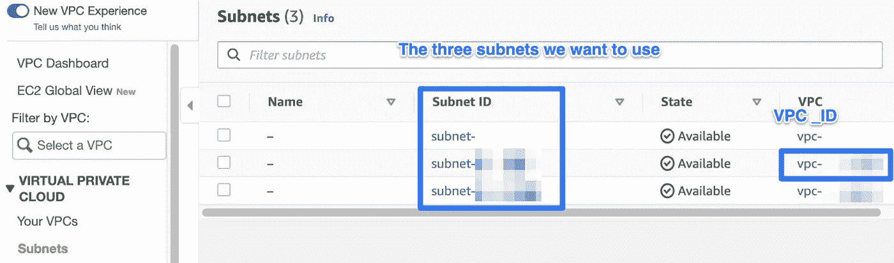

# 如何使用 Fargate Spot 和 Prefect 降低您的 AWS ECS 成本

> 原文：<https://towardsdatascience.com/how-to-cut-your-aws-ecs-costs-with-fargate-spot-and-prefect-1a1ba5d2e2df?source=collection_archive---------9----------------------->

## Python 中的无服务器数据工程管道


照片由 [Kampus 出品](https://www.pexels.com/@kampus?utm_content=attributionCopyText&utm_medium=referral&utm_source=pexels)来自 [Pexels](https://www.pexels.com/photo/people-in-the-office-using-a-desktop-computer-for-discussion-8636591/?utm_content=attributionCopyText&utm_medium=referral&utm_source=pexels)

P [refect](https://www.prefect.io/) 是一个灵活的工具，用于编排现代数据堆栈。与市场上的许多其他解决方案相比，它不会将您束缚于任何特定的执行框架或云提供商——无论您是想使用 GCP 上的[Kubernetes](https://cloud.google.com/kubernetes-engine)、 [AWS ECS](https://aws.amazon.com/ecs/) 、裸机服务器，还是诸如 [Coiled](https://coiled.io/) 的按需分布式 Dask 集群，Prefect 都能满足您的需求。与任何灵活的平台一样，您需要配置一些东西来让 Prefect 知道您的数据工作流应该在哪里运行。在本文中，我们将研究如何利用 AWS ECS Fargate 上的 spot 实例作为您的经济高效的执行层。

```
**Table of contents**· [Spot instances & Prefect](#2587)
  ∘ [Why spot instances?](#0e6b)
  ∘ [What value does Prefect provide in managing containers deployed to spot instances?](#5281)
· [Architecture](#a7fb)
· [Prefect Setup](#af91)
  ∘ [Sign up or sign in](#e80f)
  ∘ [Create an API Key](#55d2)
  ∘ [Install Prefect](#98be)
  ∘ [Create a service account for the ECSAgent](#f88c)
· [AWS Setup](#3338)
  ∘ [Store the ECSAgent’s API Key as an encrypted parameter](#7f59)
  ∘ [Configure the ECS cluster](#ad64)
  ∘ [Prepare the IAM roles](#4ba7)
  ∘ [Task execution role](#43f9)
  ∘ [Task role](#6f39)
  ∘ [Create a CloudWatch log group](#d836)
  ∘ [Register a task definition for the ECSAgent](#bb0c)
  ∘ [Look up your subnet IDs](#1fd5)
  ∘ [Start a continuously running ECS Service for the ECSAgent](#566f)
  ∘ [Validate the agent setup in the Prefect UI](#29bd)
· [Deploy an example Prefect flow](#5b72)
  ∘ [Build a custom Docker image for your Prefect flows](#1e8c)
· [Conclusion](#a041)
```

# Spot 实例和完美

## 为什么点实例？

首先，为什么首先要使用 spot 实例呢？原因很简单:节约成本。即时实例的成本比按需实例低 70%。

## Prefect 在管理部署到 spot 实例的容器方面提供了什么价值？

虽然 spot 实例可以节省大量成本，但它们有一个明显的缺点:它们可以在两分钟的通知后关闭。提督有助于克服这一缺点，因为:

*   它提供了**可见性**，其中作业由于 spot 实例关闭而失败，
*   由于名为 **Lazarus** 的服务，它可以自动**重启**此类失败的工作流。正如[提督文献](https://docs.prefect.io/orchestration/concepts/services.html#how-is-it-useful)所解释的:

> “Lazarus 流程旨在优雅地重试由 Prefect 无法控制的因素导致的故障。最常见的需要 Lazarus 干预的情况是**基础设施问题**，例如 Kubernetes pods 在能够完成一次运行之前无法运行或被删除。

*   提督**自动化**许多**繁琐的任务**，否则你将不得不做部署你的工作负载到 ECS，如创建和注册新的任务定义，注销旧的任务定义，等等。
*   提督也允许你直接从提督用户界面修改“运行 ECS 任务”的元数据。这样，您可以在特定的每次运行的基础上调整工作流所需的资源，如 **CPU** 和**内存**。

# 体系结构

在您的 AWS 帐户中，您创建了一个带有**perfect ECS agent**流程的 **ECS 服务**。这个过程不断地轮询 Prefect Cloud API 以获得新的流运行。然后，当注入您为每个特定运行(*例如，CPU、内存*)提供的元数据时，Prefect 会自动将计划的流运行部署为 ECS 任务。 **ECS 控制平面**负责提供基础设施并将集装箱放置在 **ECS 数据平面**上。


在本文中，我们将重点关注使用 Fargate 作为您的数据平面，ECS 允许您为每个 ECS 集群添加多达六个**容量提供者**。这样，您的 ECS 数据层可以同时使用`FARGATE_SPOT`、`FARGATE`、`EXTERNAL`本地服务器和自我管理的定制`EC2`实例，可能使用 GPU。容量提供程序允许您定制群集资源，以满足您期望的延迟、维护和容量需求。

# 完美设置

## 注册或登录

如果您还没有帐户，[注册](https://cloud.prefect.io/)一个“标准”的提督云帐户。虽然也有一个“入门”选项，但标准版有更多的功能。这两个计划都有一个非常慷慨的 10，000 次免费成功任务运行的等级。你可以在这里找到更多关于那个的信息。

## 创建 API 密钥

一旦登录，您就可以[创建一个 API 密匙](https://cloud.prefect.io/user/keys)来使用 Prefect Cloud 验证您的本地开发环境。


完美的云用户界面——作者图片

## 安装提督

要在本地计算机上安装带有 AWS 子模块的提督，请使用:

```
pip install "prefect[aws]"
```

然后，您可以切换到 Prefect Cloud 后端，并使用您之前生成的 API 密钥进行身份验证:

```
prefect backend cloud
prefect auth login --key **<**YOUR-API-KEY**>**
```

成功认证后，您现在可以注册新的流，启动新的代理，并在 Prefect Cloud UI 中查看它们。

> **注意:**旧版本的提督使用的 API 令牌对代理和用户有不同的作用域。从 0.15.0 开始，你应该使用 API 键。如果你想知道更多，这篇博文解释了这一变化的原因。

## 为 ECSAgent 创建服务帐户 API 密钥

虽然 API 密匙是为认证用户而设计的，但服务帐户 API 密匙是为机器而设计的，即自动化过程，如完美代理和 CI/CD 工具。要为 ECSAgent 创建新密钥，请转到[团队的服务帐户页面](https://cloud.prefect.io/team/service-accounts)。


# AWS 设置

下面演示的整个设置可以在 [this GitHub Gist](https://gist.github.com/anna-geller/45c99852c22cc44fa260156b47339c0f) 中找到，作为一个 bash 脚本，您可以调整并运行它:

```
bash prefect_ecs_agent_deploy_script.bash
```

> 在运行它之前，您需要用您的帐户 ID 替换`AWS_ACCOUNT_ID`,并设置其他变量，如代码注释中所述。

在接下来的小节中，我们将从要点开始逐步介绍所有步骤，以便您理解创建了哪些资源，以及如何根据您的用例调整这个脚本。

## 将 ECSAgent 的 API 密钥存储为加密参数

为了在我们的 AWS ECS 服务中安全地访问先前创建的服务帐户的 API 密钥，我们希望将它作为加密的秘密存储在 [AWS 系统管理器参数存储](https://docs.aws.amazon.com/systems-manager/latest/userguide/systems-manager-parameter-store.html)中。确保设置您的 AWS 区域、API 键，并调整其他变量:

```
*export* AWS_REGION=us-east-1
*export* ECS_CLUSTER_NAME=prefectEcsCluster
*export* ECS_LOG_GROUP_NAME=/ecs/prefectEcsAgent
*export* ECS_SERVICE_NAME=prefectECSAgent
*export* PREFECT_API_KEY=yourPrefectCloudAPIKey
*export* AWS_PAGER=""aws ssm put-parameter --type SecureString --name PREFECT__CLOUD__API_KEY --value $PREFECT_API_KEY --region $AWS_REGION
```

`AWS_PAGER`变量被设置为禁用 AWS CLI 的分页输出。

## 配置 ECS 群集

```
*aws* ecs create-cluster --cluster-name $ECS_CLUSTER_NAME \
--capacity-providers FARGATE_SPOT FARGATE \
--default-capacity-provider-strategy \
capacityProvider=FARGATE_SPOT,weight=3 \
capacityProvider=FARGATE,base=1,weight=2 \
--region $AWS_REGION
```

我们设置了`base=1`,因为至少 ECSAgent 进程的一个 ECS 任务将作为 ECS 服务全天候运行。由于该服务必须始终运行以实现健壮的调度，因此为该流程使用 spot 实例没有意义。

通过利用**权重**，我们指定了`FARGATE_SPOT`和`FARGATE`之间的比率，这意味着我们 60%的流量将被部署到`FARGATE_SPOT`，40%将在`FARGATE`容量提供商上运行。你应该根据你的需要调整这个比例。

请注意，`FARGATE_SPOT`应该仅用于可中断的工作负载，例如常规(*例如每小时*)批处理作业。如果您喜欢标准的 Fargate 集群，请使用:

```
*aws* ecs create-cluster --cluster-name $ECS_CLUSTER_NAME \
--region $AWS_REGION
```

## 准备 IAM 角色

AWS 区分了**任务执行角色**(授予启动任务中定义的**容器**的访问权限的一般角色)和**任务角色**，后者在容器启动后授予实际**应用程序**权限。您可以在本文的第 4 部分找到更详细的解释:

<https://aws.plainenglish.io/8-common-mistakes-when-using-aws-ecs-to-manage-containers-3943402e8e59>  

## 任务执行角色

#1.创建承担信任策略的角色:

```
*cat* <<EOF *>ecs_tasks_trust_policy.json* {
  "Version": "2012-10-17",
  "Statement": [
    {
      "Effect": "Allow",
      "Principal": {
        "Service": [
          "ecs-tasks.amazonaws.com"
        ]
      },
      "Action": "sts:AssumeRole"
    }
  ]
}
EOF

*aws* iam create-role --role-name prefectECSAgentTaskExecutionRole \
--assume-role-policy-document file://ecs_tasks_trust_policy.json --region $AWS_REGION
```

#2.附加一般服务角色策略`AmazonECSTaskExecutionRolePolicy`:

```
*aws* iam attach-role-policy --role-name prefectECSAgentTaskExecutionRole \
--policy-arn "arn:aws:iam::aws:policy/service-role/AmazonECSTaskExecutionRolePolicy"
```

#3.附加我们的自定义角色策略，因为 ECS 任务将需要从任务环境变量中的 [AWS 系统管理器参数存储](https://docs.aws.amazon.com/systems-manager/latest/userguide/systems-manager-parameter-store.html)中检索 API 密匙。

```
*cat* <<EOF *>ecs_tasks_execution_role.json* {
  "Version": "2012-10-17",
  "Statement": [
    {
      "Effect": "Allow",
      "Action": [
        "ssm:GetParameters"
      ],
      "Resource": "*"
    }
  ]
}
EOF

*aws* iam put-role-policy --role-name prefectECSAgentTaskExecutionRole \
--policy-name prefectECSAgentTaskExecutionRolePolicy \
--policy-document file://ecs_tasks_execution_role.json
```

请注意，您可以将范围缩小到我们需要的特定秘密，而不是`"Resource": “*"`:

```
"Resource": "arn:aws:ssm:YOUR_REGION:YOUR_AWS_ACCOUNT_ID:parameter/PREFECT__CLOUD__API_KEY"
```

## 任务角色

该角色需要**授予对 AWS 资源**的完全访问权限，如 CloudWatch、EC2、ECS、IAM、S3 等。对于每次流运行，Prefect 都会创建一个新的 ECS 任务定义。在这样做的时候，它需要为一个流检索关于您的 VPC、子网、安全组和 IAM 权限的信息。此外，必须授权 it 部门创建新的 CloudWatch 日志流，并为每次流运行放置日志。下面的策略描述了必要的权限:

```
*# permissions needed by Prefect to register new task definitions, deregister old ones, and create new flow runs as ECS tasks**cat* <<EOF *>ecs_task_role.json* {
    "Version": "2012-10-17",
    "Statement": [
        {
            "Effect": "Allow",
            "Action": [
                "ec2:AuthorizeSecurityGroupIngress",
                "ec2:CreateSecurityGroup",
                "ec2:CreateTags",
                "ec2:DescribeNetworkInterfaces",
                "ec2:DescribeSecurityGroups",
                "ec2:DescribeSubnets",
                "ec2:DescribeVpcs",
                "ec2:DeleteSecurityGroup",
                "ecs:CreateCluster",
                "ecs:DeleteCluster",
                "ecs:DeregisterTaskDefinition",
                "ecs:DescribeClusters",
                "ecs:DescribeTaskDefinition",
                "ecs:DescribeTasks",
                "ecs:ListAccountSettings",
                "ecs:ListClusters",
                "ecs:ListTaskDefinitions",
                "ecs:RegisterTaskDefinition",
                "ecs:RunTask",
                "ecs:StopTask",
                "iam:PassRole",
                "logs:CreateLogStream",
                "logs:PutLogEvents",
                "logs:DescribeLogGroups",
                "logs:GetLogEvents"
            ],
            "Resource": "*"
        }
    ]
}
EOF*aws* iam create-role --role-name prefectTaskRole --assume-role-policy-document file://ecs_tasks_trust_policy.json --region $AWS_REGION*aws* iam put-role-policy --role-name prefectTaskRole --policy-name prefectTaskRolePolicy --policy-document file://ecs_task_role.json
```

> **注意:**上面提到的一些权限被定义为允许在 ECS 上启动[临时 Dask 集群。如果你想把范围缩小到绝对必要的提督标准权限，](https://cloudprovider.dask.org/en/latest/aws.html#)[这个 Github 问题](https://github.com/PrefectHQ/prefect/pull/4302#issuecomment-814650079)可以帮到你。

当使用带有 AWS ECS 的提督时，您可能希望使用 S3 作为提督[存储](https://docs.prefect.io/orchestration/execution/storage_options.html#aws-s3)和[结果](https://docs.prefect.io/api/latest/engine/results.html#s3result)后端。因此，向任务角色添加 S3 权限是可行的。以下是如何创建允许对特定 S3 时段执行任何操作的任务角色。

```
*# adjust it to include permissions needed by your flows
cat* <<EOF *>ecs_task_role_s3.json* {
  "Version": "2012-10-17",
  "Statement": [
    {
      "Effect": "Allow",
      "Action": [
        "s3:*"
      ],
      "Resource": "arn:aws:s3:::*prefect*"
    }
  ]
}
EOF*aws* iam put-role-policy --role-name prefectTaskRole --policy-name prefectTaskRoleS3Policy --policy-document file://ecs_task_role_s3.json
```

> 上述策略授予对名称中包含单词“prefect”的 **S3 存储桶执行任何操作的访问权限** —为了提高安全性，您可以指定想要与 Prefect 一起使用的确切的 S3 存储桶名称。

## 创建云观察日志组

在执行期间，每个 ECS 任务将容器日志发送到 CloudWatch **日志流**。日志流被分成**日志组**。为了让 ECS 任务发送这些容器日志，我们需要创建日志组并在任务定义中指定它。

```
aws logs create-log-group --log-group-name $ECS_LOG_GROUP_NAME --region $AWS_REGION
```

## 为 ECSAgent 注册任务定义

我们最终可以为我们的总监的 ECSAgent 流程注册任务定义。

```
*# search-replace the AWS_ACCOUNT_ID below with your AWS account ID. Also, replace or add ECS Agent labels**cat* <<EOF *>prefect_ecs_agent_task_definition.json* {
    "family": "$ECS_SERVICE_NAME",
    "requiresCompatibilities": [
        "FARGATE"
    ],
    "networkMode": "awsvpc",
    "cpu": "512",
    "memory": "1024",
    "taskRoleArn": "arn:aws:iam::AWS_ACCOUNT_ID:role/prefectTaskRole",
    "executionRoleArn": "arn:aws:iam::AWS_ACCOUNT_ID:role/prefectECSAgentTaskExecutionRole",
    "containerDefinitions": [
        {
            "name": "$ECS_SERVICE_NAME",
            "image": "prefecthq/prefect:latest-python3.8",
            "essential": true,
            "command": [
                "prefect",
                "agent",
                "ecs",
                "start"
            ],
            "environment": [
                {
                    "name": "PREFECT__CLOUD__AGENT__LABELS",
                    "value": "['prod']"
                },
                {
                    "name": "PREFECT__CLOUD__AGENT__LEVEL",
                    "value": "INFO"
                },
                {
                    "name": "PREFECT__CLOUD__API",
                    "value": "https://api.prefect.io"
                }
            ],
            "logConfiguration": {
                "logDriver": "awslogs",
                "options": {
                    "awslogs-group": "$ECS_LOG_GROUP_NAME",
                    "awslogs-region": "$AWS_REGION",
                    "awslogs-stream-prefix": "ecs",
                    "awslogs-create-group": "true"
                }
            },
            "secrets": [
                {
                    "name": "PREFECT__CLOUD__API_KEY",
                    "valueFrom": "arn:aws:ssm:$AWS_REGION:AWS_ACCOUNT_ID:parameter/PREFECT__CLOUD__API_KEY"
                }
            ]
        }
    ]
}
EOF

*aws* ecs register-task-definition --cli-input-json file://prefect_ecs_agent_task_definition.json --region $AWS_REGION
```

## 查找您的子网 id

要将此 ECS 任务作为连续运行的服务运行，我们必须选择此任务应在其中运行的 VPC 和子网。在本演示中，我们将使用默认 VPC 及其对应的公共子网。每个地区都有默认的 VPC，所以除非需要，否则不必创建任何新的 VPC。

以下是您如何查找所选地区的 id:



或者，您可以从 AWS CLI 中查找这些 id:

```
aws ec2 describe-subnets --region $AWS_REGION
```

为了方便起见，下面是如何提取 id 并将它们导出为环境变量的方法——我们将在下一节中使用它们:

```
export VPC=$(aws ec2 describe-vpcs --filters Name=is-default,Values=true)export VPC_ID=$(echo $VPC | jq -r '.Vpcs | .[0].VpcId')SUBNETS=$*(aws* ec2 describe-subnets --filters Name=vpc-id,Values=$VPC_ID --region $AWS_REGION*)**export* SUBNET1=$*(echo* $SUBNETS | *jq* -r '.Subnets | .[0].SubnetId'*)
export* SUBNET2=$*(echo* $SUBNETS | *jq* -r '.Subnets | .[1].SubnetId'*)
export* SUBNET3=$*(echo* $SUBNETS | *jq* -r '.Subnets | .[2].SubnetId'*)*
```

## 为 ECSAgent 启动持续运行的 ECS 服务

此服务的好处是，ECS 控制面板将确保此过程始终运行。如果出现问题，ECS 将为我们的完美代理创建一个新的容器。

```
*aws* ecs create-service \
    --service-name $ECS_SERVICE_NAME\
    --task-definition $ECS_SERVICE_NAME:1 \
    --desired-count 1 \
    --launch-type FARGATE \
    --platform-version LATEST \
    --cluster $ECS_CLUSTER_NAME \
    --network-configuration awsvpcConfiguration="{subnets=[$SUBNET1, $SUBNET2, $SUBNET3],assignPublicIp=ENABLED}" --region $AWS_REGION
```

## 在完美用户界面中验证代理设置

如果一切按预期运行，我们应该看到一个新的 ECSAgent 准备好部署新的流运行。


完美代理页面-按作者分类的图片

# 部署一个示例完美流

如果您还没有任何完美的项目，您可以从 CLI 创建它:

```
prefect create project “ECS_Flows”
```

现在，您可以使用 [ECSRun](https://docs.prefect.io/orchestration/flow_config/run_configs.html#ecsrun) 部署一个示例流，它将为 ECS 任务提供元数据，例如:

*   自定义容器`image`，
*   ECS 代理`labels`，
*   为您的流定制 AWS 权限，以`task_role_arn`的形式提供，
*   还有`cpu`和`memory`。

注意，在这个流中，我们还指定了`S3`存储——这将把流文件上传到指定的 S3 存储桶。

确保用您的 AWS 帐户 ID 替换`123456`。

此外，如果您向您的`ECSRun`提供一个定制的 ECR 映像，请确保也显式地指定`execution_role_arn`，否则，您将得到一个 ClientException，告诉您 **Fargate 需要任务定义具有执行角色 ARN 来支持 ECR 映像**。您可以这样指定:

```
RUN_CONFIG = ECSRun(
    labels=["prod"],
    task_role_arn="arn:aws:iam::XXX:role/prefectTaskRole",
    execution_role_arn="arn:aws:iam::XXX:role/prefectECSAgentTaskExecutionRole",
    run_task_kwargs=dict(cluster="prefectEcsCluster", launchType="FARGATE",),
    image="XXX.dkr.ecr.us-east-1.amazonaws.com/prefect-custom-image:latest"
)
```

## 为您的完美流程构建一个定制的 Docker 映像

如果您的流需要定制的包依赖项，比如`pandas`或`scikit-learn`，那么创建一个已经包含这些依赖项的定制容器映像被认为是最佳实践。以下是你如何做到这一点。

```
cat <<EOF >Dockerfile
FROM prefecthq/prefect:latest-python3.9
RUN pip install --upgrade pip \\
&& pip install pandas scikit-learn boto3
EOF
```

然后，要构建 Docker 映像并将其推送到 ECR，请使用:

```
export AWS_REGION=us-east-1
export AWS_ACCOUNT_ID=123456789
export IMAGE_NAME=prefect-custom-image
export IMAGE_TAG=latest

docker build -t $IMAGE_NAME .aws ecr create-repository --repository-name $IMAGE_NAME --region $AWS_REGIONdocker tag "$IMAGE_NAME":"$IMAGE_TAG" "$AWS_ACCOUNT_ID.dkr.ecr.$AWS_REGION.amazonaws.com/$IMAGE_NAME":"$IMAGE_TAG"aws ecr get-login-password | docker login --username AWS --password-stdin $AWS_ACCOUNT_ID.dkr.ecr.$AWS_REGION.amazonaws.comdocker push "$AWS_ACCOUNT_ID.dkr.ecr.$AWS_REGION.amazonaws.com/$IMAGE_NAME":"$IMAGE_TAG"
```

现在您可以在您的`ECSRun` [运行配置](https://docs.prefect.io/api/latest/run_configs.html#ecsrun)中指定这个映像(流程要点中的第 14 行)。

# 结论

在本文中，我们研究了如何将 AWS ECS Fargate 设置为完美代理。我们调查了各种容量提供商配置以优化成本，并解释了根据您的需求定制此设置所需的所有步骤。

**资源:**

*   [https://AWS . Amazon . com/blogs/AWS/AWS-fargate-spot-now-generally-available/](https://aws.amazon.com/blogs/aws/aws-fargate-spot-now-generally-available/)
*   Fargate spot —成本节约演示:[https://Tom Gregory . com/AWS-fargate-spot-vs-fargate-price-comparison/](https://tomgregory.com/aws-fargate-spot-vs-fargate-price-comparison/)
*   深潜:[https://AWS . Amazon . com/blogs/compute/deep-dive-into-fargate-spot-to-run-your-ECS-tasks-for-up-to-70-less/](https://aws.amazon.com/blogs/compute/deep-dive-into-fargate-spot-to-run-your-ecs-tasks-for-up-to-70-less/)
*   [https://ecsworkshop.com/capacity_providers/fargate/](https://ecsworkshop.com/capacity_providers/fargate/)