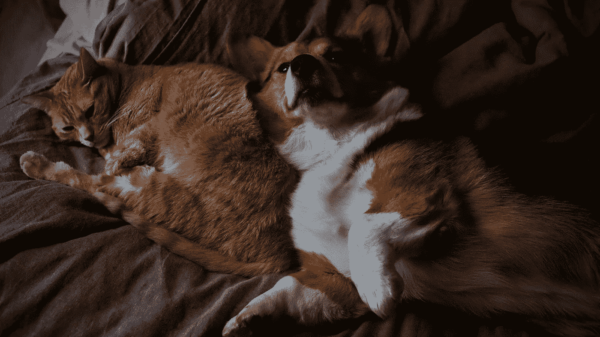

# 机器学习中如何处理不平衡数据集

> 原文：<https://towardsdatascience.com/how-to-deal-with-an-imbalanced-dataset-in-machine-learning-4f89a1967868?source=collection_archive---------24----------------------->

## 6 种不同的技术来解决你将面临的最常见的问题之一。

照片由[陈伶俐·桑特兰](https://unsplash.com/@brianna_santellan?utm_source=unsplash&utm_medium=referral&utm_content=creditCopyText)在 [Unsplash](https://unsplash.com/s/photos/dog-cat?utm_source=unsplash&utm_medium=referral&utm_content=creditCopyText) 上拍摄

不平衡的数据集是我们需要处理的一个常见问题，是每个机器学习面试问题集合中的一个主要部分。

让我们从一个例子开始:

假设你正在尝试建立一个分类模型，你有两个类:猫和狗。不幸的是，你的数据非常不准确:有 950 张猫图片和 50 张狗图片。

如果你的模型把每张图片都归类为猫(哑巴吧？)，你就 95%准确了！想一想。数据集中的分布很快成为一个大问题。

让我们试着解决这个问题。

## 1.确保您正确地描述了问题

在很多情况下，不均衡的班级可能会提供一个以不同的方式看待问题的机会。

制造缺陷、信用卡欺诈、垃圾邮件。这些问题属于同一类别:数据集中的绝大多数样本将代表正常类，只有少数异常代表不同类。

大多数时候，你最好将这些视为[异常检测](https://en.wikipedia.org/wiki/Anomaly_detection)问题，你的主要目标是识别数据集中的异常值。

*作为一个相关的提示，确保你使用正确的算法来解决你的问题。例如，基于决策树的模型在处理不平衡的类方面非常出色。当处理结构化数据时，这可能就是您所需要的。*

## 2.在这些问题上，准确性不是最好的性能指标

当数据集不平衡时，精确度不是一个好的性能指标。

相反，根据您的具体问题，您应该查看以下内容:

*   精确度、召回率、F 值
*   混淆矩阵
*   ROC 曲线

## 3.收集更多数据

我总是喜欢从这里开始。

在我们的例子中，我们也许能够找到更多的狗的图片添加到数据集中，并减少差异。

不幸的是，收集更多的数据并不总是一个选项。但有时确实如此，然而许多团队过早地诉诸合成增强。

## 4.用合成数据扩充数据集

只有当收集更多的数据不可行时，我才会去编造假样本。当处理非结构化数据(比如图像、视频、文本、音频)时，这是一个很好的方法。

例如，您可以通过转换现有的图片来创建新的狗图片:

*   改变图像的对比度
*   做水平翻转
*   向两个方向轻微旋转图片
*   添加一些噪声

结合这些技术可以产生许多看起来和原始图片一样真实的新样本。

对于结构化数据(想想表格数据)，扩充要困难得多，有时甚至不可能。

## 5.对数据集进行重新采样

有三种不同的方法可以对数据集进行重采样:

*   过采样:多次拍摄我们拥有的图片。
*   欠采样:取一些我们有的图片，丢弃其余的。
*   结合两种技术:对一个类进行过采样，同时对另一个类进行欠采样。

例如，我们可以通过以下方式对数据进行重新采样:

*   每张狗图片使用 4 次。这将以总共 400 张狗图片(50 张现有图片× 4)结束。)
*   使用每隔一张猫图片。这将导致总共 475 张猫图片(950 张现有图片÷ 2)。)

请记住，过采样和欠采样会给你的数据集带来偏差:你是在通过任意改变现有样本来改变数据分布。这可能会有后果，所以要仔细考虑。

## 6.适当调整每个类别的权重

您可以修改您的模型的损失函数，以不同的方式对每个类别进行加权，从而解决不平衡问题。查看 [*Kera's fit()*](https://tensorflow.google.cn/api_docs/python/tf/keras/Model#fit) 函数上的 *sample_weight* 属性作为示例:

> 训练样本的可选权重数组，用于加权损失函数(仅在训练期间)。)

成本敏感学习是另一种相关的技术，您也可以使用它根据每个类的权重来惩罚模型的结果。我写了一篇关于成本敏感学习的简短介绍，应该会有所帮助。

## 一锤定音

这些我一般都是按顺序想的。现在，系统地沿着这个清单往下走已经成了第二天性。

大多数情况下，需要不止一种技术来解决问题。每一次，实验都会告诉你正确的方法。