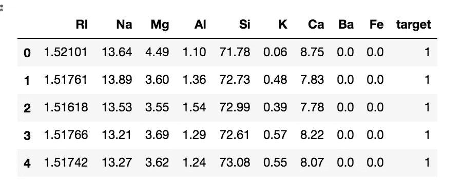
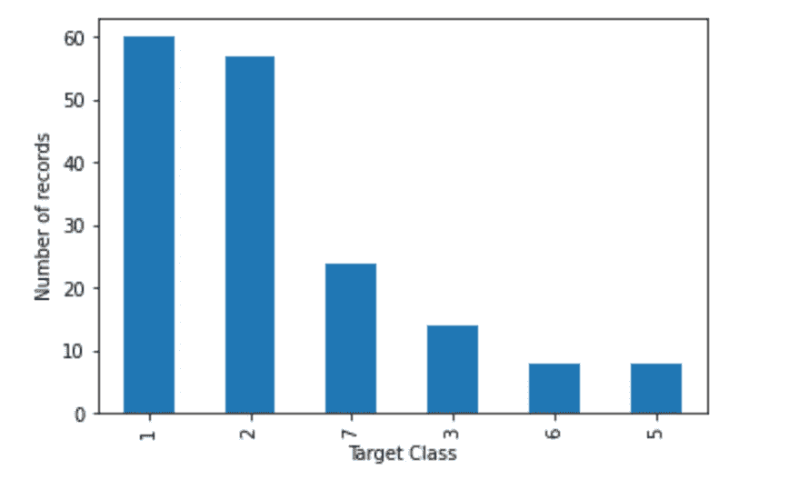
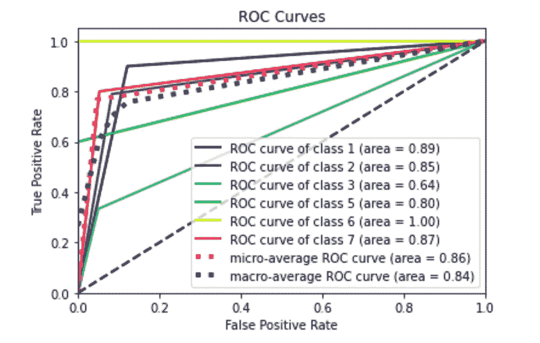
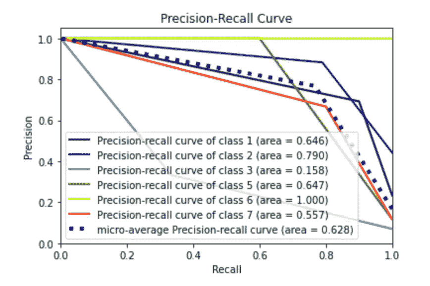
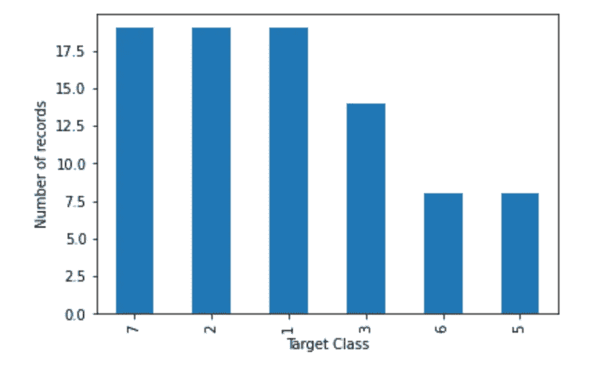
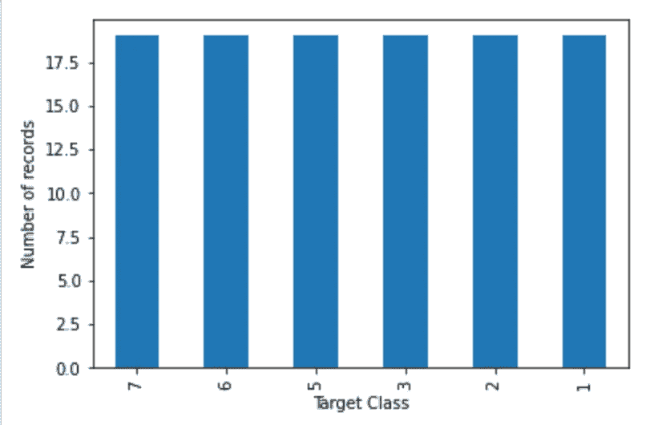
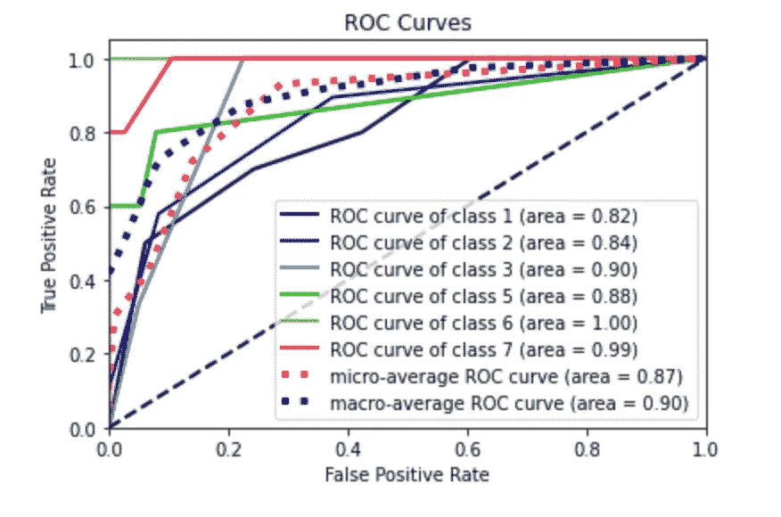
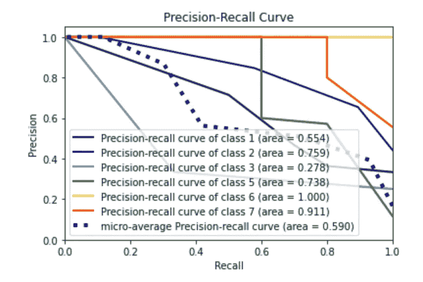
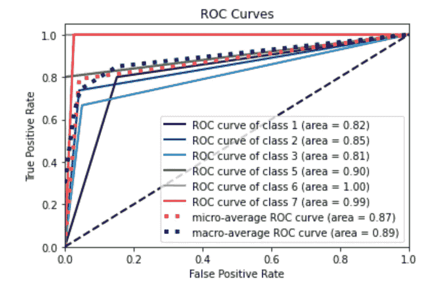
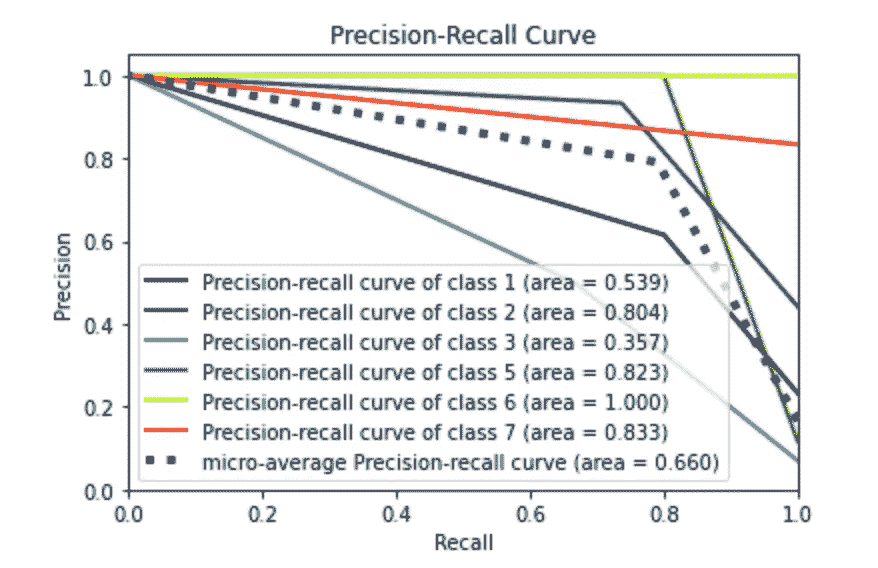

# 如何在 Python 中处理不平衡的多类数据集

> 原文：<https://towardsdatascience.com/how-to-deal-with-imbalanced-multiclass-datasets-in-python-fe0bb3f2b669?source=collection_archive---------7----------------------->

## 数据预处理

## 这是一个现成的教程，介绍了用 imblearn 和 scikit-learn 平衡多类数据集的一些技巧


图片由 [Gidon Pico](https://pixabay.com/users/gidonpico-850967/?utm_source=link-attribution&utm_medium=referral&utm_campaign=image&utm_content=1757593) 提供，来自 [Pixabay](https://pixabay.com/?utm_source=link-attribution&utm_medium=referral&utm_campaign=image&utm_content=1757593)

在运行机器学习模型时，不平衡的数据集通常会产生较差的性能，尽管在某些情况下，评估指标会产生良好的结果。这可能是因为该模型擅长预测多数阶级，但在预测少数阶级时性能较差。由于评估指标计算的是多数类和少数类之间的平均值，所以最终的性能看起来还可以。

多数类是指数据集中代表性最强的类，而少数类是指数据集中代表性较弱的类。换句话说，多数阶级比少数阶级有更多的样本。在这种情况下，数据集是不平衡的。

> 在大多数情况下，平衡可以提高模型的性能，尽管这并不总是正确的。

在本教程中，我处理多类数据集。多类数据集是指输出类的数量大于 2 的数据集。我提出两种策略来平衡多类数据集:

*   流水线欠采样和过采样
*   玩级重。

# 加载数据集

首先，我将数据集作为一个`pandas`数据帧加载。我利用了[玻璃数据集](https://raw.githubusercontent.com/jbrownlee/Datasets/master/glass.csv)和[它们的名字](https://raw.githubusercontent.com/jbrownlee/Datasets/master/glass.names)。这个数据集描述了玻璃的化学性质。更多详情请点击链接[。](https://machinelearningmastery.com/multi-class-imbalanced-classification/)

```
import pandas as pddf = pd.read_csv('glass.csv')
df.head()
```



作者图片

该数据集由 214 个样本和 7 个类别组成。

# 准备数据

我构建了两个变量，`X`和`y`，分别包含输入特征和输出类。为此，我计算输入特征，并将它们存储到一个名为`features`的变量中。

```
features = []
for feature in df.columns:
    if feature != 'target':
        features.append(feature)
X = df[features]
y = df['target']
```

通过利用由`sklearn`库提供的`train_test_split()`函数，将数据集分成两部分:训练集和测试集。我将测试集大小设置为`0.2`(即整个数据集的 20%)。

```
from sklearn.model_selection import train_test_splitX_train, X_test, y_train, y_test = train_test_split(X, y, test_size=0.2, random_state=100)
```

现在，我计算训练集中每个目标类的样本数。我利用了`value_counts()`函数。我注意到数据集是不平衡的。

> 平衡仅适用于训练集。

```
import matplotlib.pyplot as pltcount = y_train.value_counts()
count.plot.bar()
plt.ylabel('Number of records')
plt.xlabel('Target Class')
plt.show()
```



作者图片

# 建立不平衡模型

在平衡训练集之前，我计算了具有不平衡数据的模型的性能。我利用一个`KNeighborsClassifier`进行测试。我还从`scikitplot`库中导入了其他有用的函数，来绘制 ROC 和 precision recall 曲线。具体来说，首先我建立模型，然后我拟合训练集，最后我通过应用于测试集的`predict_proba()`函数计算模型的性能。

```
from sklearn.neighbors import KNeighborsClassifier
from scikitplot.metrics import plot_roc
from scikitplot.metrics import plot_precision_recallmodel = DecisionTreeClassifier()
model.fit(X_train, y_train)
y_score = model.predict_proba(X_test)
y_pred = model.predict(X_test)# Plot metrics 
plot_roc(y_test, y_score)
plt.show()

plot_precision_recall(y_test, y_score)
plt.show()
```



作者图片



作者图片

# 流水线欠采样和过采样

第一种策略涉及流水线的创建，该流水线对多数类进行欠采样，对少数类进行过采样。这里的要点是定义一个阈值，该阈值划分多数类和少数类，以及每个类所需的样本数。在这个特定示例中，我们将阈值设置为等于每个类别的期望样本数。

一种可能的解决方案是将阈值设置为类中样本数量的中值。因此，我可以将阈值设置为 19，并考虑样本数量大于阈值的多数 a 类。类似地，少数类是样本数量少于阈值的类。

我计算中间值，并将其转换为整数。

```
import numpy as np
n_samples = count.median().astype(np.int64)
```

现在我可以对最具代表性的类进行欠采样。首先，我禁止警告。

```
import warnings
warnings.filterwarnings('ignore')
```

然后，我定义一个效用函数，它接收数据集、阈值(`n_samples`)和相关类(`majority`或`minority`)作为输入。该函数返回一个`dict`,其中包含属于相关类的每个类的期望样本数。

```
def sampling_strategy(X,y,n_samples, t='majority'):
    target_classes = ''
    if t == 'majority':
        target_classes = y.value_counts() > n_samples
    elif t == 'minority':
        target_classes = y.value_counts() < n_samples
    tc = target_classes[target_classes == True].index
    #target_classes_all = y.value_counts().index
    sampling_strategy = {}
    for target in tc:
        sampling_strategy[target] = n_samples
    return sampling_strategy
```

现在我对大多数类进行欠采样。我利用了`imblearn`库。

```
from imblearn.under_sampling import ClusterCentroids
under_sampler = ClusterCentroids(sampling_strategy=sampling_strategy(X_train,y_train,n_samples,t='majority'))
X_under, y_under = under_sampler.fit_resample(X_train, y_train)
```

我注意到多数类中的记录数量被设置为`n_samples`。



作者图片

然后，我对较少表示的类进行过采样。我利用了`SMOTE`过采样策略。

```
from imblearn.over_sampling import SMOTE
over_sampler = SMOTE(sampling_strategy=sampling_strategy(X_under, y_under,n_samples, t='minority'),k_neighbors=2)
X_bal, y_bal = over_sampler.fit_resample(X_under, y_under)
```

最终我有了一个平衡的数据集。



作者图片

我在新的平衡数据集上训练模型，我注意到 ROC 曲线改善了，而精确召回曲线似乎降低了。然而，看看类别 3，在原始模型中的精确度和召回率低于平衡模型。这意味着该模型现在能够更好地预测少数民族阶层。

```
model = KNeighborsClassifier()
model.fit(X_bal, y_bal)
y_score = model.predict_proba(X_test)y_pred = model.predict(X_test)# Plot metrics 
plot_roc(y_test, y_score)
plt.show()

plot_precision_recall(y_test, y_score)
plt.show()
```



作者图片



作者图片

# 玩重量级游戏

平衡的替代方法是在构建模型时指定原始数据集中的类权重。这允许算法给予少数类更多的重要性。可以通过`sklearn.utils`库的 [class_weight()](https://scikit-learn.org/stable/modules/generated/sklearn.utils.class_weight.compute_class_weight.html) 函数计算类权重。

```
from sklearn.utils import class_weightclasses = np.unique(y_train)
cw = class_weight.compute_class_weight('balanced', classes, y_train)
weights = dict(zip(classes,cw))
```

现在我可以将类权重作为输入提供给一个分类器，比如一个`DecisionTreeClassifier`，并计算模型的性能。我没有像在教程的前一部分那样使用`KNeighborsClassifier`，因为它不支持类权重。

```
from sklearn.tree import DecisionTreeClassifier
model = DecisionTreeClassifier(class_weight=weights)
model.fit(X_train, y_train)
y_score = model.predict_proba(X_test)y_pred = model.predict(X_test)# Plot metrics 
plot_roc(y_test, y_score)
plt.show()

plot_precision_recall(y_test, y_score)
plt.show()
```



作者图片



作者图片

# 摘要

在本教程中，我已经说明了如何执行多类数据集的平衡。可以采用两种可能的策略:欠采样后跟随过采样，或者定义类权重。

如果你对数据预处理感兴趣，可以在[我的主页](https://medium.com/@angelica.loduca)找到其他文章。

如果你想了解我的研究和其他活动的最新情况，你可以在 [Twitter](https://twitter.com/alod83) 、 [Youtube](https://www.youtube.com/channel/UC4O8-FtQqGIsgDW_ytXIWOg?view_as=subscriber) 和 [Github](https://github.com/alod83) 上关注我。

感谢阅读！你可以从[我的 Github 库](https://github.com/alod83/data-science/blob/master/Preprocessing/Balancing/Multiclass%20Balancing.ipynb)下载完整代码。

# 相关文章

[](/how-to-balance-a-dataset-in-python-36dff9d12704) [## 如何在 Python 中平衡数据集

### 本教程属于如何提高机器学习算法的性能系列。在本教程中，我…

towardsdatascience.com](/how-to-balance-a-dataset-in-python-36dff9d12704) [](/a-complete-data-analysis-workflow-in-python-and-scikit-learn-9a77f7c283d3) [## Python 和 scikit 中的完整数据分析工作流程-学习

towardsdatascience.com](/a-complete-data-analysis-workflow-in-python-and-scikit-learn-9a77f7c283d3) 

# 新到中？您可以每月订阅几美元，并解锁无限的文章— [单击此处](https://alod83.medium.com/membership)。