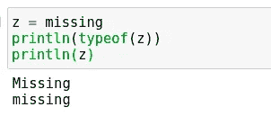
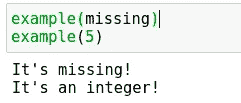
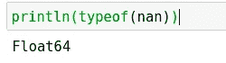
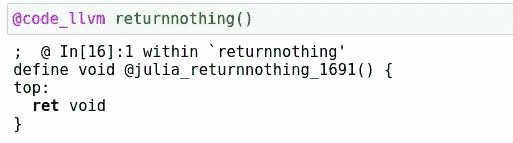
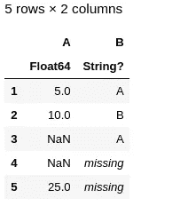
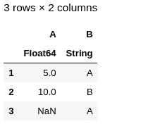

# 如何处理 Julia 中的缺失数据

> 原文：<https://towardsdatascience.com/how-to-deal-with-missing-data-in-julia-a6527bbac213?source=collection_archive---------28----------------------->

## Julia 如何处理缺失数据的概述。


(src =[https://pixabay.com/images/id-693865/](https://pixabay.com/images/id-693865/)

# 介绍

数据收集和观察的一个不幸的副产品是产生缺失值的趋势。虽然这有许多潜在的原因，但最终在分析和使用这些数据的生命周期时，我们需要去掉缺失的值。如果缺少值，很可能无法以任何方式分析、可视化、拟合模型或利用您的数据。也就是说，对于使用任何编程语言的任何数据科学家来说，能够检测并消除数据中的缺失值是绝对必要的。

Julia 语言是最近因其在数据科学领域的能力而受到关注的一种编程语言。Julia 有一种独特的处理值的方式，与其他语言中的大多数实现略有不同。也就是说，任何可能正在学习这门语言的人都可能想知道一些基本的数据处理技术来处理一些丢失的数据。今天我想谈谈这一点。如果您想看看本文中使用的代码的运行情况，您也可以查看这里的笔记本:

> [笔记本](https://github.com/emmettgb/Emmetts-DS-NoteBooks/blob/master/Julia/missing%20in%20Julia.ipynb)

# 失踪类型

在缺失值方面，Julia 与其他编程语言最大的不同可能是用于存储空值的不同类型。在 Julia 中，缺失值有三种不同的存储方式。第一种类型是缺失类型。缺失类型的独特之处在于它在 Julia 语言中有自己的类型。这意味着我们可以使用 typeof()来查看这个类型，并且我们还可以通过具有多个分派的函数来传递它。



作者图片

```
z = missing
println(typeof(z))
println(z)
```

将它与多个分派一起使用看起来像这样:

```
example(z::Int64) = println("It's an integer!")
example(z::Missing) = println("It's missing!")
```



作者图片

```
example(missing)
example(5)
```

下一种类型的缺失值是您可能已经习惯的值，即 NaN。虽然在 Python 中这可能是由 NumPy 库提供的，但在 Julia 中却不是这样。Julia 中的 NaN 值实际上不是一个类型，它的类型是 Float64。也就是说，它继承了 Number > Real > Float Float64 的所有调度。Julia 通常很擅长检测您正在处理的数据类型，并且在处理连续特征时通常用 NaN 代替 missing。当然，情况并不总是这样，但不管怎样，这肯定是关于 NaNs 的一件值得注意的事情。Julia 中的 nan 也用以下语法表示:

```
nan = NaN
```

如您所见，如果我们打印出 NaN 的类型，我们会看到返回 Float64:



作者图片

```
**println(typeof(nan))**
```

同样重要的是要注意到，朱莉娅有我所说的传染性 NaNs。这只是我的说法，任何与 NaNs 的操作都会返回 NaN。实际上，我认为这是一个可怕的数据，因为像这样的东西可能会丢失数据。例如，考虑下面的代码:

```
h = 5
h += NaN
```

这将使得 h == NaN，这不是最优的。比起这样的事情，我更喜欢扔一个。幸运的是，Float64 类型是用 Julia 本身编写的，所以如果我想的话，我可以发出一个 pull 请求来修改它……我正在考虑。

最后一种类型的缺失是一无所有。当然，这种类型在编程中很常见。然而，它通常与数据中的丢失值无关，虽然这肯定没有 NaNs 或 missings 常见，但我以前见过这种情况。记住这一点，这是一件很重要的事情，以防万一你碰巧遇到了这样的数据集。

```
h = nothing
```

你很可能熟悉这种类型。它通常用于初始化，不太用于数据操作。也就是说，在我们讨论缺少值或类型的话题时，这当然值得一提。由于 Julia 是动态类型的，这也意味着这个新类型是开放的，无需分配就可以重定义。换句话说，我们只注册别名，而不为与之对应的数据分配位，因为没有位。这当然证明了它用于初始化是正确的，我认为在这方面它没有被充分利用。我们可以做的最后一件有趣的事情是调用 code_llvm 宏，这对于优化 Julia 代码和更好地理解该语言非常方便。我真的很喜欢这个宏，以防你看不出来。

```
returnnothing() = nothing
```



作者图片

# 真实处理

现在我们已经了解了不同种类的错过，请允许我揭示一些实际处理它们的方法。关于 missings、NaNs 和 nothing，你应该知道的第一件事是，只有 nothing 可以在布尔上下文中使用。这意味着任何带有布尔值返回的按位运算符，例如==、

```
z = nothing
z == nothingtruez = NaN
z == NaNfalsez = missing
z == missingmissing
```

这里使用 typeof(z)也没有太大的区别。考虑到这一点，我们如何使用条件来检测我们丢失的值呢？在 Julia 中，我们实际上使用方法来做到这一点。这两个方法是 isnan()和 ismissing()。

```
z = NaN
b = missing
if isnan(z) & ismissing(b)
    println("This is true")
end
```

在大多数情况下，您可能不必降低到使用条件来处理数据的水平。然而，Julia 数据生态系统相对来说还不成熟，所以不要期望永远不必在循环中做这样的事情。记住，解决这些问题的典型方法是使用 DataFrames.jl 包。

```
using DataFrames
df= DataFrame(:A => [5, 10, NaN, NaN, 25], :B => ["A", "B", "A", missing, missing])
```



作者图片

对于 DataFrames，使用 dropmissing()方法删除这些丢失的值相对容易。和 Julia 中的很多函数一样，我们也可以使用 dropmissing！()变更类型而不是变更该类型的副本:

```
dropmissing!(df)
```



作者图片

好的，现在我们没有遗漏，但是我们还有 NaNs。正如我所说的，这些也会破坏连续值，以及用于分析的返回结果，所以去掉它们也很重要。下面是一个求和的示例，由于这个错误的观察结果，它将返回 NaN:

```
sum(df[!, :A])
```

不幸的是，这个有点不同，因为它比这个方法调用要困难得多。不管怎样，这并不困难。然而，我们将需要通过 filter()方法(或 filter！()方法)来获取这些数据。我们也可以对思念和虚无做同样的事情，以摆脱它们。我们甚至可以将它发送出去，这样我们打电话就方便多了！此外，您可以修改 DataFrames.jl 的本地版本来做到这一点(正如我所做的！)

```
dropbad!(df::DataFrame, col::Symbol) = filter(:A => x -> !any(f -> f(x), (ismissing, isnothing, isnan)), df)
```

现在让我们称这个新方法为:

```
dropbad!(df, :A)
```

# 结论

在 Julia 中处理数据有其独特的方式，但在许多方面都很有意义。也就是说，我认为这可能会给那些从 Python 等其他语言继承过来的人带来一些问题。虽然在 Julia 中缺少值并不一定会更难处理，但我会说这有点独特，可能不是大多数人所习惯的。关于 Julia 的一个很棒的事情是，大多数基于 Julia 的方法都被扩展到各种不同的包，这使得学习每个包以及它是如何工作的变得容易得多，不管你以前是否使用过它。感谢您的阅读，希望这篇文章对您有所帮助！