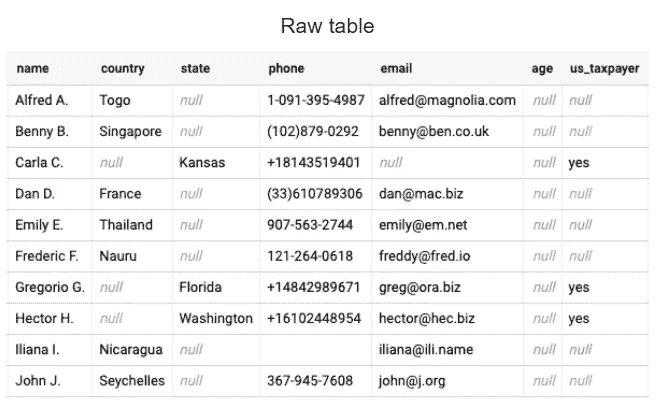
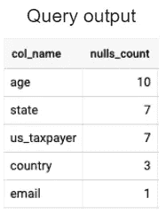
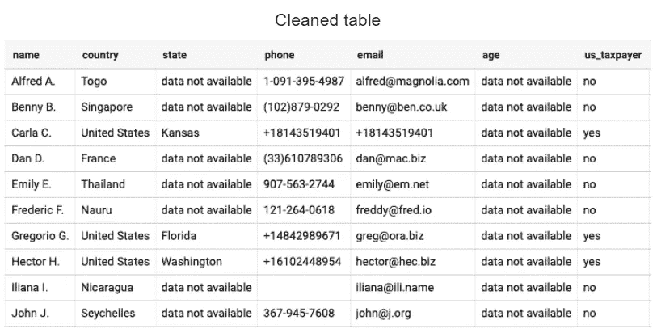

# 如何处理标准 SQL 中的空值

> 原文：<https://towardsdatascience.com/how-to-deal-with-null-values-in-standard-sql-1bffce0c55cd?source=collection_archive---------6----------------------->

## 1.识别— 2。理解— 3。行动

凯利·西克玛在 [Unsplash](https://unsplash.com/?utm_source=unsplash&utm_medium=referral&utm_content=creditCopyText) 上的照片

谁能声称每天都能处理质量和可靠性无可挑剔的数据库呢？我个人不能，老实说，这是我喜欢做数据分析师的部分原因。即使数据清理很少是数据科学中最好的部分，但能够操作数据并从中获得洞察力仍然是必不可少的。

[在上一篇关于数据科学的文章](/how-to-deal-with-duplicate-entries-using-sql-4b017465d6dc)中，我们仔细研究了如何使用 SQL 处理数据库中的重复数据。在这里，我们想要解决许多数据分析师每天都会遇到的另一个常见问题:处理数据库中的空值。**什么是空值？如何识别他们？如何处置他们？下面是我将尝试回答的一些问题。**

请注意，以下代码是用标准 SQL 编写的(例如，与 SQL Server 或 Transact-SQL 相反)，这是 Google BigQuery 中使用的 SQL 语言变体。根据您使用的数据库管理系统(RDBMS ),语法和使用的函数可能会有细微的变化。更多细节可以阅读 [Google BigQuery 文档](https://cloud.google.com/bigquery/docs/reference/standard-sql/conditional_expressions)。

# 简介:null 还是空白？

在深入探讨 SQL 中处理空值的技术细节之前，我们必须首先**定义空值的含义**。特别是，空值必须与空白值区分开来:

*   **空**数据库字段意味着对于给定记录没有**值**。它表示缺少值。
*   一个**空白的**数据库字段意味着对于一个给定的记录有一个**值**，这个值为空(对于一个字符串值)或 0(对于一个数值)。

这两种情况不能混淆，否则会导致错误解释数据并将空值作为 null 值处理。在本文中，我将使用一个名为“website _ CRM”(具有随机值)的**测试数据库，它包含 10 行 7 列:**

测试数据库 Marie Lefevre

我们假设这个数据库是一个电子商务网站的客户数据库。为了说明 null 值和空白值之间的区别，请仔细查看第 9 行。对于名为 Iliana I 的客户，字段“州”、“年龄”和“美国纳税人”为空值，而字段“电话”为空。这意味着他们没有填写前三个字段(空值)，而是填写了“电话”字段并输入了空值。

# 第一步:识别和想象

首先，我们希望**确定我们的数据集**中是否有空值。有两种方法可以在数据集中查找空值，这取决于您对所操作数据的先验知识。

**如果您已经知道在哪个字段(或列)中可能有您想要的空值**，您可以直接在感兴趣的字段上应用条件`WHERE IS NULL`。在我们的示例中，如果我们知道“国家/地区”不是必填字段，而我们希望按地理区域分析客户的划分，我们希望只调查这一列。这段代码可以实现这一点:

**如果您对正在调查的字段没有一个精确的概念** —或者如果您想要获得数据集中空值的完整概述，您必须首先清楚地了解每列中可能存在的空值以及空值的数量。为了获得这个概述，您可以使用下面的代码片段(从[堆栈溢出](https://stackoverflow.com/questions/58716640/bigquery-check-entire-table-for-null-values)中检索):

在我们的例子中，输出如下:

玛丽·勒费夫尔

# 第二步:理解和决定

既然您已经确定了数据库中存在空值的位置，那么您可以更进一步，调查是什么导致了这些空值。数据库包含空值有许多原因。让我们回答三个“背景调查”问题，以便更好地理解它们。

## 1.某些字段的所有行都为空吗？

在我们的示例中,“年龄”字段始终为空。其中一个原因可能是**字段对于网站的顾客来说不是强制性的**:在网上订购时，除了特定的商品，你不需要告知你的年龄。由于年龄是个人数据，客户在网上购物时可能不愿意分享这些信息。

这也可能表明网站上的**潜在 bug。在这两种情况下，对于任何企业来说，监控数据库中 null 值的出现次数以及它如何随着时间的推移而演变都是至关重要的，尤其是当所有条目都为 null 时。在这种情况下，这可能会导致产品团队更深刻的反思:如果没有人填写这些信息，继续向客户询问这些信息是否有意义？**

## 2.几个字段的行数都是空的吗？

有意或无意地，**一些字段可以相互关联**，其中一个字段填写的信息依赖于另一个字段。因此，更好地理解字段的相互依赖性可以帮助您解释为什么一些字段具有给定数量的空值。

在我们的例子中，这将对应于字段“state”和“us _ 纳税人”:这两列各有 7 个空值。当查看整个表时，我们在这里看到没有填写“州”字段的客户居住在美国以外的国家。如果“美国纳税人”字段不是必填的，这将解释这七个客户在网上订购“您是美国纳税人吗？”时不需要勾选最后一个框。

## 3.剩下的案例有哪些？

最终，你需要看看前面两步之后仍然无法解释的**边缘情况**。它们可以对应于数据输入中的**错误或简单地对应于异常情况**。在这两种情况下，调查是什么导致了这些剩余的空值对于改进您的产品或用户体验非常有指导意义。

在我们的电子商务示例中，有趣的是一位在线客户(Carla C .)没有提供他们的电子邮件地址。虽然通过电子邮件接收订单确认和采购账单是必要的，但是这个字段怎么可能不是强制的呢？无论如何，这种数据输入在未来必须成为不可能。这就是为什么**调查导致空值的原因对业务**至关重要:这可能是由于人为错误(例如，客户忘记提供电子邮件地址)或技术错误(例如，网站在保存表单时遇到错误，因此无法保存填写的值)。

照片由 [Hadija Saidi](https://unsplash.com/@hadijasaidi?utm_source=unsplash&utm_medium=referral&utm_content=creditCopyText) 在 [Unsplash](https://unsplash.com/?utm_source=unsplash&utm_medium=referral&utm_content=creditCopyText) 上拍摄

# 第三步:行动和修改

根据您从前面的步骤中得出的结论，现在是时候**对这些空值**产生影响了。他们应该保持现在的样子，还是应该不惜一切代价将他们移除？我确定了三种处理它们的方法:

*   用中性值替换空值，例如“不适用”或“-”
*   用有意义的值替换空值
*   让空值为空

对于决定替换空值的情况，让我们应用最合适的 SQL 函数。

## IFNULL:简单的一个

顾名思义，如果输入值为空，函数`IFNULL(expr, null_result)`将返回某个值。

在我们的例子中，我们希望使字段“state”中的空值更加明确，因此我们选择用中性词代替空值，如“data not available”。这同样适用于“年龄”字段。此外，我们希望从字段“us _ taobar”中删除所有空值。让我们假设所有没有回答“是”的顾客都没有在美国纳税。因此，**如果这个字段为空，我们要返回“否”**。结合前面的更改，将得到以下代码片段:

> *IFNULL(状态，'数据不可用')
> IFNULL(年龄，'数据不可用')
> IFNULL(美国 _ 纳税人，'否')*

## COALESCE:清单 1

函数`COALESCE(expr[, ...])`返回第一个非空表达式的值。要使用它，您需要预先定义要用来替换空值的术语的优先级顺序。

在我们的例子中，我们希望**确保字段‘email’没有空值**。原因可能是我们的支持团队将此字段用作客户的联系点。因此，我们希望该字段等于，优先级顺序如下:

1.  客户的电子邮件地址(如果有)
2.  否则，如果有的话，客户的电话号码
3.  否则，客户的名称

为此，我们不能使用 IFNULL 函数，因为它只能显示空值的一个替代值。所以我们使用下面这段代码:

> *联合(电子邮件、电话、姓名)*

## 案例:复杂的案例

最后，当需要处理几种情况时，可以使用`CASE expr WHEN expr_to_match THEN result [...] [ELSE else_result] END`函数，包括更复杂的情况，其中 IFNULL 或 COALESCE 不足以替换空值。

在我们的示例中，如果字段“国家”为空，我们希望**以特定顺序应用以下规则**:

1.  如果“国家”不为空，那么我们就取这个值
2.  否则，如果“state”不为空并且属于美国的一个州，我们希望在“country”字段中写入“United States”
3.  否则，如果“州”不为空，我们希望将这个“州”值复制到“国家”字段中
4.  否则，我们就写“没有国家”

在标准 SQL 中，这对应于下面这段代码:

> *事例
> 当国家不为空时，则国家
> 当州在('阿拉巴马'，'阿拉斯加'，'亚利桑那'，'…'，'佛罗里达州'，'堪萨斯州'，'华盛顿州')时，则国家
> 当州不为空时，则国家
> 否则‘没有国家’
> 结束*

# 最终产出和结论

总而言之，我们构建了下面这段代码:

在应用了上面所有的修改之后，我们最终得到了一个**干净的表**。不仅在视觉上更漂亮，而且**用有意义的值替换空值使得读者更容易理解表格**。作为一个数据分析师，这是弥足珍贵的。更重要的是，这将使非技术用户能够更好地利用您的数据库，同时降低误解某些不包含值的字段(相对于空值)的风险。

测试数据库 Marie Lefevre

现在它是你的了！**你如何处理空值？**识别空值真的比清除空值容易吗？请在下面分享您的技巧，并讨论您在 SQL 方面的最佳实践。

你喜欢阅读这篇文章吗？ [*成为*](https://marie-lefevre.medium.com/membership) *的一员，加入一个不断成长的充满好奇心的社区吧！*