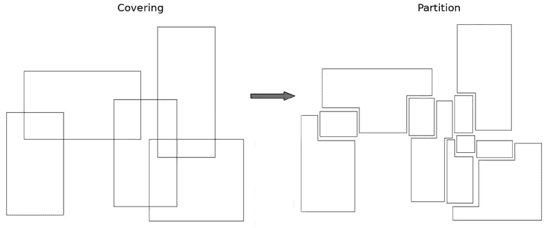
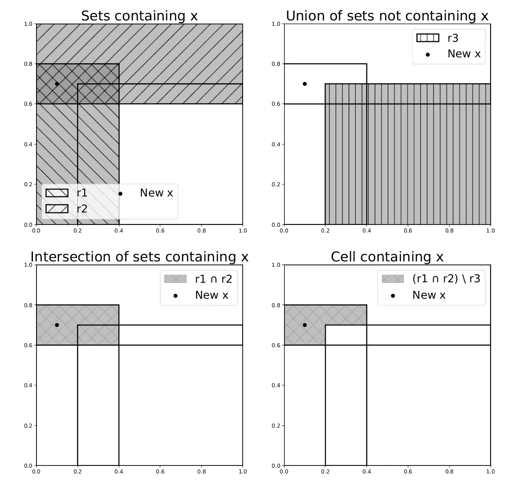

# 如何处理规则重叠？

> 原文：<https://towardsdatascience.com/how-to-deal-with-overlapping-rules-16bc0446af66?source=collection_archive---------33----------------------->

## [入门](https://towardsdatascience.com/tagged/getting-started)

## 尤其是当规则的预测相互矛盾时。

来自 [Pixabay](https://pixabay.com/) 的[塞普蒂米乌](https://pixabay.com/users/septimiu-3938551/)的图片。

当一个人想要建立一个可解释的模型时，他通常会在两个主要的内在可解释算法家族之间犹豫不决:基于树的算法和基于规则的算法。它们之间的主要区别之一是，基于树的算法生成具有不相交规则的树，这具有诸如复制子树问题的缺点[1]，而基于规则的算法生成规则集并允许重叠规则，这可能是一个问题。事实上，当两个(或更多)规则同时被激活时，您如何做出决定呢？当规则的预测相互矛盾时，这就更成问题了。

在这篇短文中，我介绍了从一组规则中获得单个预测的两种方法，这两种方法比平均预测更重要，但保留了预测的可解释性。

# 使用专家汇总方法

如果您不熟悉专家的聚合理论，我建议您阅读我以前的文章“[如何选择最佳模型？](/how-to-choose-the-best-model-cf74bf8015d8)”。这个想法很简单:把每一个规则看作是专门的专家，通过一个凸组合来聚集他们的预测。与规则相关的权重在每次预测后都会改变:如果专家的预测是好的，则权重会增加，否则会减少。因此，权重可以解释为我们在时间 *t* 对每个专家的信任度。

不幸的是，规则可能没有被激活。这意味着新的观察不满足他们的条件。他们被称为“睡眠专家”。问题是我如何评估一个没有被激活的规则的可信度？常见的方法有两种。首先是说“没有信息我不会做决定”。这样，休眠规则的权重保持不变，直到它再次激活。二是问“这个规则是睡觉好吗？”。以这种方式，通过考虑集合预测而不是规则的预测来评估休眠规则的新权重。如果聚集预测是好的，则意味着该规则一直是正确的，否则意味着该规则应该一直是活动的。这两种方法都有问题。但是已经证明它们提供了相似的结果。

# 使用分区技巧

划分是一个非常不同的想法，更“统计”。其思路是将规则集形成的覆盖变成分隔单元格的分割(如下图所示)。因此，预测将是单元中观察值的平均值，而解释将是规则的结合。

图片来自作者。

有人可能会反对建造这种隔墙非常费时。而且是正确的。所以，为了解决这个问题，有一个*分区技巧*。其思想是要理解，计算预测值不需要完全描述分区。诀窍是识别包含新观察值 ***x*** 的分区的唯一单元。通过创建二进制向量，如果新的观察值 ***x*** 满足规则的条件，则其值为 1，否则为 0，对包含 ***x*** 的单元的识别是简单的向量运算序列。因此，计算预测的复杂度是 *O(nR)* ，，其中 *n* 是训练集中的点数，而 *R* 是规则数。下图是这个过程的图解(更多细节我参考[2])。

图片来自作者。

这种方法的主要问题是我们无法控制细胞的大小。换句话说，如果包含新观察值的单元格太小，您可能会根据太少的过去观察值做出决定。如果训练集中的数据很少，就会出现此问题。可以解释为情况不明。

# **结论**

我已经介绍了两种方法，即使您的过程基于重叠的规则，也可以做出决定。这两种方法各有利弊。第一种基于专家聚集理论，在实践中运行良好，并为规则增加了一个置信度得分。第二种，基于划分技巧，理论上更好。如[3]中所述，这是生成回归函数的可解释一致估计量的好方法。

# 参考

[1] G.Bagallo 和 D.Haussler，[经验学习中的布尔特征发现](https://link.springer.com/article/10.1023/A:1022611825350) (1990)，载于《机器学习》，5(1):71–99。斯普林格。

[2] V.Margot，J-P. Baudry，F. Guilloux 和 O. Wintenberger，[规则归纳划分估计器](https://arxiv.org/pdf/1807.04602.pdf) (2018)，模式识别中的机器学习和数据挖掘国际会议 288–301。斯普林格。

[3] V.Margot，J-P. Baudry，F. Guilloux 和 O. Wintenberger，使用数据相关覆盖的一致回归(2021 年)，载于《电子统计杂志》。数理统计研究所和伯努利学会。

# 关于我们

[Advestis](https://www.advestis.com/) 是一家欧洲合同研究组织(CRO ),对统计学和可解释的机器学习技术有着深刻的理解和实践。Advestis 的专长包括复杂系统的建模和时间现象的预测分析。

*领英*:【https://www.linkedin.com/company/advestis/】T4