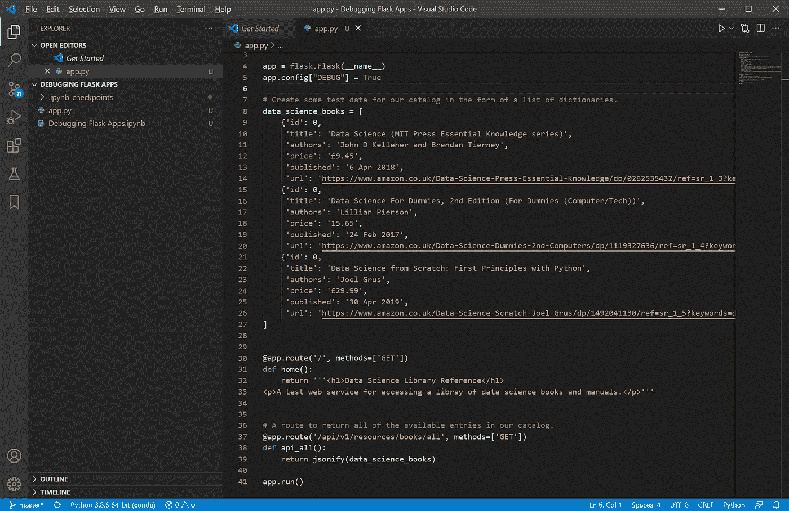
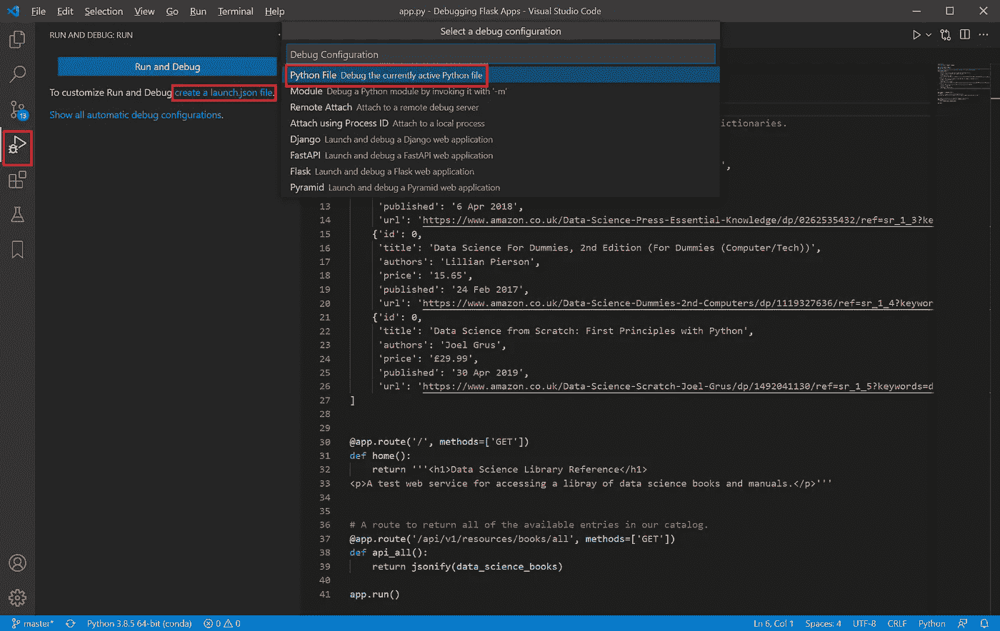
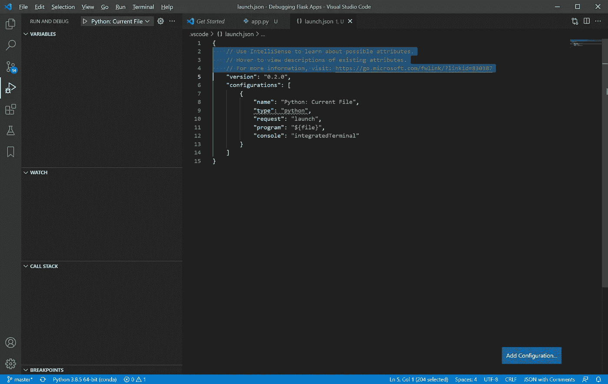
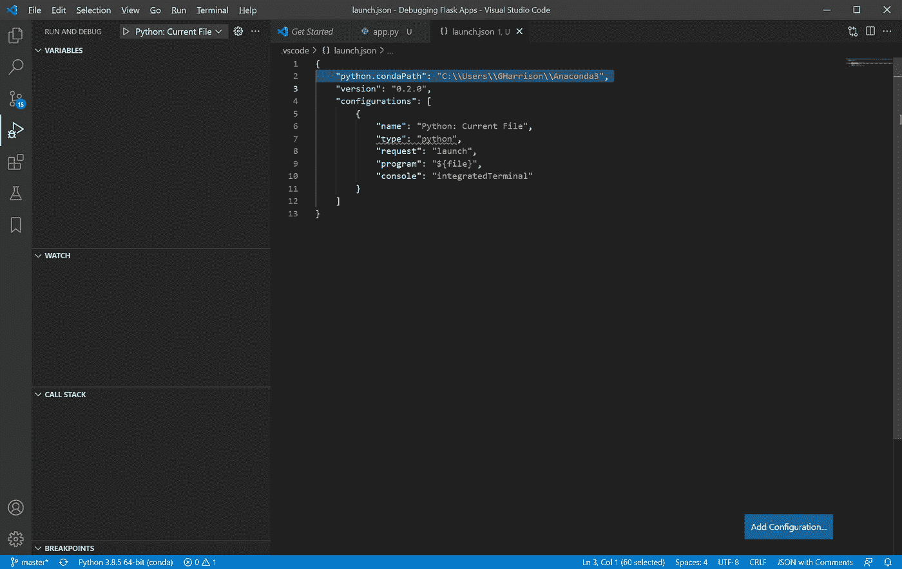
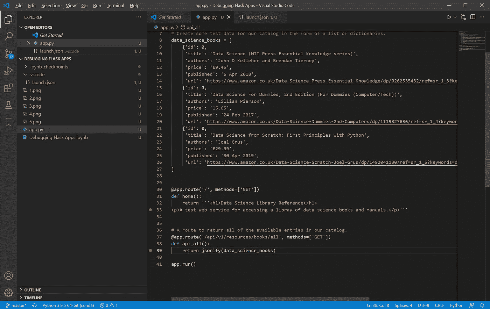
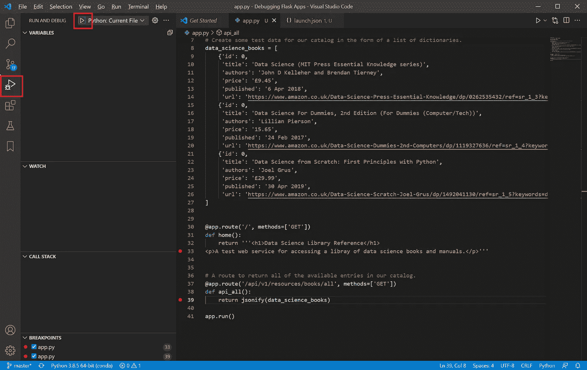
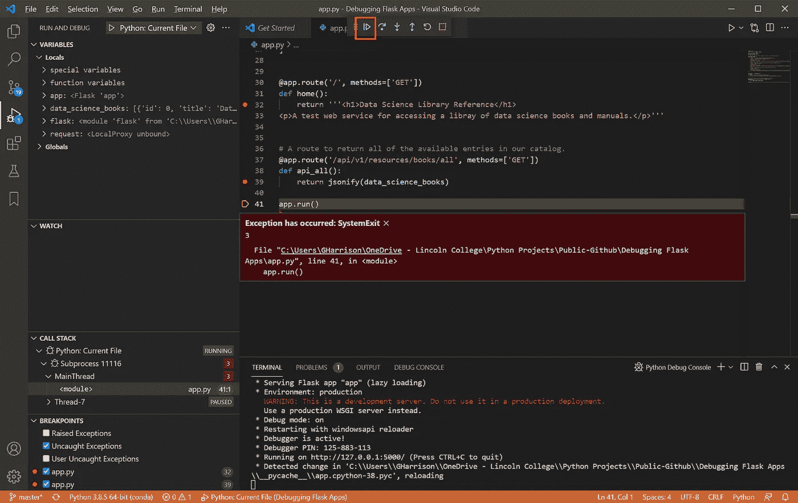
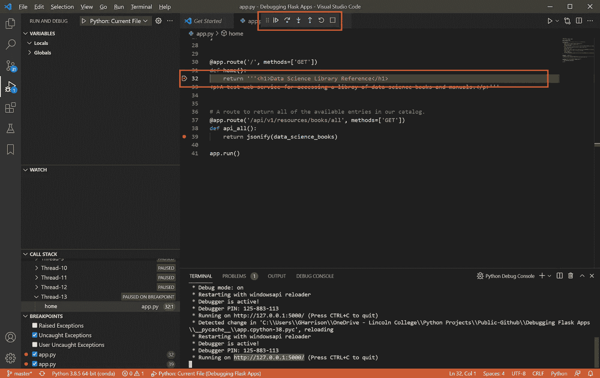
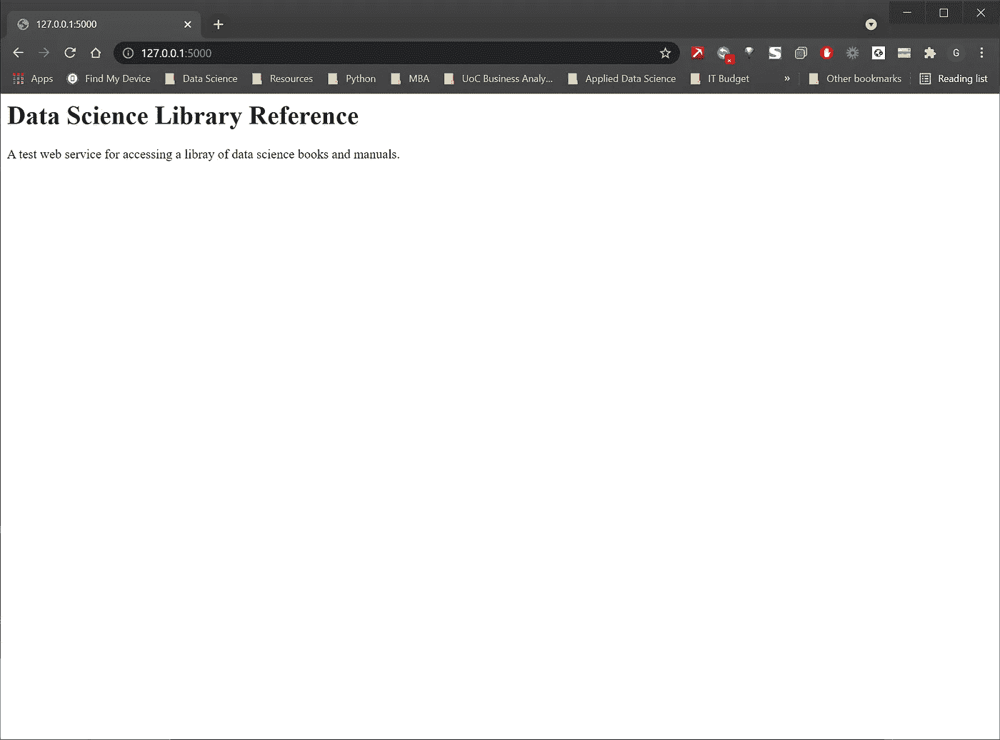
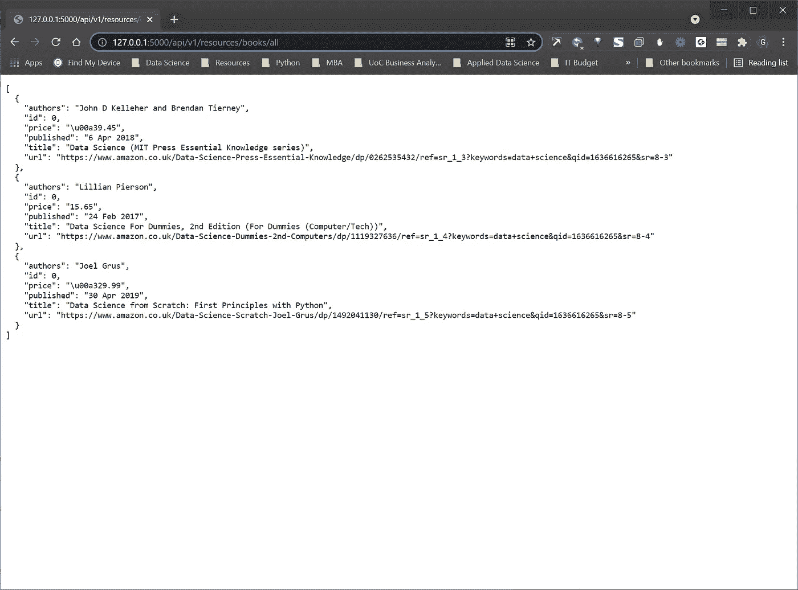

# 如何在 VS 代码中调试 Flask 应用程序

> 原文：<https://towardsdatascience.com/how-to-debug-flask-applications-in-vs-code-c65c9bdbef21?source=collection_archive---------1----------------------->

## 如何使用 flask 创建一个基本的 web 服务，然后在 VS 代码集成开发环境中单步调试并完全调试代码

由 [Unsplash](https://unsplash.com/s/photos/computer?utm_source=unsplash&utm_medium=referral&utm_content=creditCopyText) 上的 [Clément Hélardot](https://unsplash.com/@clemhlrdt?utm_source=unsplash&utm_medium=referral&utm_content=creditCopyText) 拍摄

## 介绍

Flask 应用是使用 flask 库用 Python 编程语言开发的 web 服务应用。

它们是快速开发任何编程语言(包括 Python、C#)都可以使用的 web 服务的好方法。NET、Java 等。但是直到最近，我还不知道如何在 VS 代码中调试，这样我就可以一步一步地调试 flask 应用程序代码。

本文展示了一个简单的分步指南，它将使您能够完成设置和配置，从而轻松调试 flask 应用程序。

## 步骤 1:开发一个基本的烧瓶应用程序

第一步是使用 flask 创建一个基本的 web 服务。有许多在线教程向您展示如何做到这一点，包括我发现特别有用的这个教程——[https://programminghistorian . org/en/lessons/creating-APIs-with-python-and-flask](https://programminghistorian.org/en/lessons/creating-apis-with-python-and-flask)。

出于本教程的目的，我们将使用基本应用程序来探索如何调试 flask 应用程序如下-

您应该在 VS 代码环境中创建 flask 应用程序，并且应该创建一个。py 文件，并将其命名为`app.py`。

有一些方法可以修改配置，为您的代码文件使用不同的名称`app.py`,但是因为您在 flask web app 中只允许使用一个 Python 文件(在 flask web app 中，您可以创建任意多的 web 服务),所以更改它似乎没有多大意义。

如果到目前为止您一直在学习，那么您的 VS 代码环境和 Python 代码应该是这样的

作者图片

## 步骤 2:创建并配置一个 launch.json 配置文件

如果您单击 ide 左侧的“运行和调试”图标，或者键入 Ctrl+Shift+D，您将看到“运行和调试”窗口。

现在点击“创建 launch.json 文件”链接，当提示“选择调试配置”时，选择“Python 文件调试当前活动的 Python 文件”。

作者图片

VS 代码现在会自动为您创建一个 launch.json 配置文件，该文件预先填充了一些基本设置。

首先要做的是删除注释，因为这些注释会在稍后执行 flask 应用程序时导致错误/警告-

作者图片

下一步是最关键的。当 VS 代码创建 launch.json 文件和相关的配置时，它不包括必要的配置来告诉环境和 web 服务器在哪里可以找到 conda 环境，这必须手动添加，否则调试将永远无法在 VS 代码中工作。

1.  在你的电脑上找一找你的 Anaconda 文件夹，其中包含一个名为`_conda.exe`的文件
2.  在 launch.json 中为名为`"python.condaPath"`的参数创建一个新的配置行，其值指向正确的路径

完成的 launch.json 文件应该如下所示

作者图片

注意:在 Windows 环境中有三种方式可以启动 VS 代码

1.  转到 Windows 开始菜单，启动 VS 代码
2.  启动 Anaconda 环境并点击 VS 代码下的“Launch”
3.  启动 Anaconda 命令提示符并键入“code”

只有在使用第一种方法时，才需要在 launch.json 中添加一行来设置`"python.condaPath"`。

如果您使用方法 2 或 3，这将指示 VS 代码环境使用基本 conda 环境，因此不需要额外的配置。

## 步骤 3:启动调试器

下一步是回到代码文件中，在编辑器的空白处单击，在代码中创建一些断点。在下面的例子中，我点击了第 33 行和第 39 行-

作者图片

现在回到“运行和调试”窗口，点击“Python: Current File”旁边的绿色箭头，开始调试会话

作者图片

当您启动调试器时，可能会收到“Exception has occure:system exit message ”,但这并不重要，不会阻止您调试代码。

只需点击调试工具栏中的蓝色“播放”按钮，调试会话将继续-

作者图片

如果一切正常，你在终端窗口得到的最后一条消息将是-

`* Running on http://127.0.0.1:5000/ (Press CTRL+C to quit)`

## 步骤 4:调用 Web 服务

您现在需要打开一个 web 浏览器，在 URL 中键入`http://127.0.0.1:5000/`,以调用正在调试器和 VS 代码 ide 中运行的 web 服务

作者图片

一旦按下`return`键，您将看到以下内容-

1.  浏览器调用已经调用了 web 服务
2.  在 VS 代码中，web 服务已被调用，并在调试器中您添加断点的地方暂停
3.  现在，您可以使用 VS 代码调试工具栏来调试代码

作者图片

当您单步执行代码并退出 web 服务函数时，web 服务的输出将返回给调用该服务的 web 浏览器

作者图片

如果您想要调用返回所有数据科学书籍的第二个服务，请返回到 web 浏览器并修改 URL，如下所示

`[http://127.0.0.1:5000/api/v1/resources/books/all](http://127.0.0.1:5000/api/v1/resources/books/all)`

现在将在调试器中调用和暂停第二个 web 服务。一旦你完成了代码并执行了函数，代表数据科学手册库的 json 将作为输出返回给浏览器

作者图片

# 结论

第一次用 VS 代码设置 flask web 应用程序的调试有点笨拙，尤其是当你不知道把最重要的`"python.condaPath": "C:\\Users\\GHarrison\\Anaconda3"`行添加到`launch.json`文件中的时候。

然而，对于 web 服务来说，一旦完成一次，它将只适用于所有后续会话，并且一旦这些 web 服务超出这里给出的基本示例的规模，成为真实世界的复杂 web 服务，能够单步调试 flask web 应用程序的能力就变得至关重要。

# 感谢您的阅读！

如果你喜欢读这篇文章，为什么不看看我在[https://grahamharrison-86487.medium.com/](https://grahamharrison-86487.medium.com/)的其他文章呢？此外，我很乐意听到您对这篇文章、我的任何其他文章或任何与数据科学和数据分析相关的内容的看法。

如果你想联系我讨论这些话题，请在 LinkedIn 上找我—[https://www.linkedin.com/in/grahamharrison1](https://www.linkedin.com/in/grahamharrison1)或者发邮件给我[ghar rison @ Lincoln college . AC . uk](mailto:GHarrison@lincolncollege.ac.uk)。

如果你想通过订阅来支持作者和全世界 1000 个为文章写作做出贡献的人，请使用这个链接——[https://grahamharrison-86487.medium.com/membership](https://grahamharrison-86487.medium.com/membership)(注意:如果你使用这个链接注册，作者将收到一定比例的费用)。