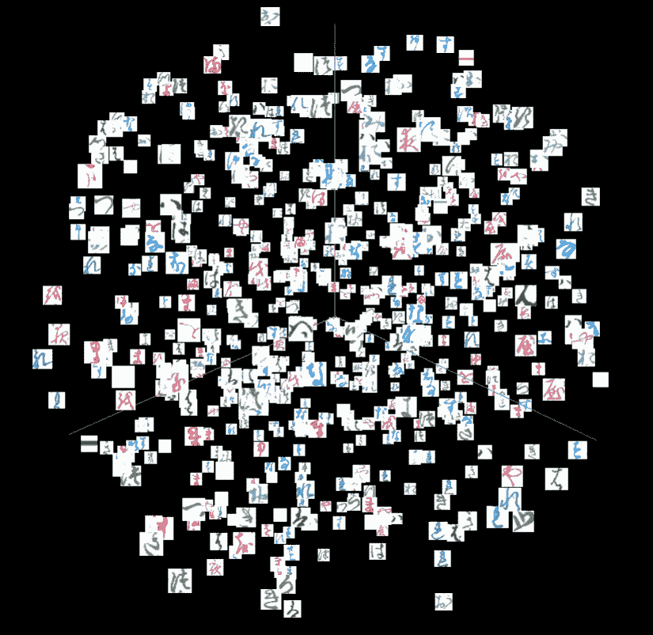
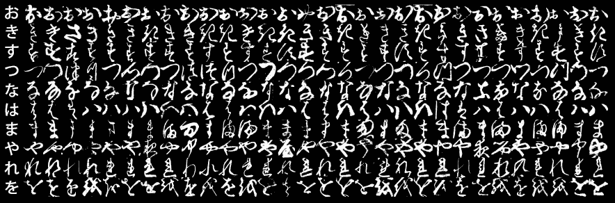

# 如何用 TensorBoard 调试你的深度学习管道

> 原文：<https://towardsdatascience.com/how-to-debug-your-deep-learning-pipeline-with-tensorboard-d27d3f8795e?source=collection_archive---------29----------------------->

## 关于如何提高深度学习实验吞吐量的互动示例。

使用 TensorBoard 对 10 个平假名字符类进行 UMAP 分割(图片由作者提供)

当我们开发深度学习模型时，我们经常会在管道中遇到各种各样的问题。这包括我们处理数据的方式的问题，将数据传递到我们的模型的方式的错误，甚至在评估阶段的错误。数据科学家面临的主要挑战之一是使这些数据(尽可能)透明，以确保使用工具箱中的正确工具(预处理策略、模型层、评估标准等)。).然而，为了实现这一点，我们经常不得不在**试错**的基础上做一系列实验，包括显示定制图和跟踪变量。这就是 **TensorBoard** 来提升我们工作流程的地方！

# **tensor board 到底是什么？**

**TensorBoard** 是一款专为深度学习管道打造的高级分析工具，可处理各种数据源(图像、视频、音频、结构化数据等)。).它允许我们通过自动化的可视化绘图来调试我们的管道。它还**跟踪**我们实验的历史，以便我们可以运行多个版本，并观察哪个模型配置对性能有最好的影响。这对于超参数调整特别有用。另一个我非常喜欢的功能是能够**将我们的模型嵌入到 2D/3D 空间中(通过聚类方法),并观察每个单独数据点之间的相关性。**

在本教程中，我将向您展示一个标准的**图像分类**示例，它使用了包含日本平假名字符集的**K-MNIST**(Kuzushiji-MNIST)数据集。我们将使用 **PyTorch** 来构建和评估我们的模型，并将其发送到 **TensorBoard** 进行分析，只需在我们的代码中添加简单的 2-3 行代码！

# 数据

km NIST-10 行平假名候选类(图片由 Clanuwat 等人提供，[古典建筑深度学习](https://arxiv.org/pdf/1812.01718.pdf)，2018)

**K-MNIST** 是一组日本 Kuzushiji 人物，基于经典 **MNIST** 。除了在这种情况下，目标不是数字，而是代表一组平假名字符(上例中的每一行)。每一行的第一个例子是汉字的现代平假名，而其余的是用 **Kuzushiji** - **风格**书写的，这是 150 多年前在旧日本手稿和书籍中使用的。这个数据集是如何创建的背后的故事真的很有趣，因为它通常允许以这种风格编写的旧日本文学作品被翻译成现代汉字并用于教育系统。你可以在这里阅读更多关于 Clanuwat 等人的工作。

我们将在中使用这个数据集来构建一个用于字符识别的基本 **PyTorch ConvNet** (别担心，你不需要真正懂日语，我也不需要)。那么，让我们开始吧:)。

## **依赖关系**

此示例是在 Python 3.7 环境中制作的，包括以下软件包的最新版本:

*   **火炬和火炬视觉——建模**
*   **标准绘图、计算包— matplotlib、seaborn、numpy(应已安装在 Conda 上)**
*   *注意:如果你已经在你的环境中安装了****tensor flow****，你可以使用这个工具清除任何与文件处理相关的 TensorBoard 错误。*

这里还有其他的进口货:

## 基本配置

让我们也添加几个默认变量，以便稍后使用。这些包括字符的类名、一些超参数、路径和图像的大小。

## 初始化张量板

这只需一个调用就可以完成，这个调用将生成一个 **runs/k-mnist** 目录，我们的数据将由 **TensorBoard API 在其中编码。**

## **读取数据**

我们可以使用 PyTorch DataLoader 类轻松加载我们的 K-MNIST 数据用于训练和验证。我们还可以指定加载后要执行的自定义转换。在这种情况下，我们将把图像转换成 PyTorch 张量，并归一化图像通道(使用与处理 **MNIST** 所用参数相同的参数)。

## 想象一些例子

在我们真正进入 **TensorBoard** 的自动化部分之前，让我们先来看看如何分析一些自定义图像。对于这个例子，我们将通过从 **ubyte** 格式加载它们作为 **numpy** 数组来查看原始字符。接下来，我们将创建两个简单的函数:

*   一个用于显示前 25 个字符及其类别索引的 5x5 网格
*   一个在单独的图像中显示 25 个字符中的每一个

我们将把这两个函数的输出记录到 **TensorBoard** 中。对于网格，我们将暂时将 matplotlib 图形保存到缓冲区，然后使用 PIL 将其转换为张量，然后将其传递给 **TensorBoard。**我们这样做是因为**张量板**只处理张量输入。为了绘制单个图像，我们可以简单地将 numpy 数组转换为张量，并以不同的全局步长传递每个图像。

现在，为了查看记录的输出，我们需要在一个单独的终端中启动 **TensorBoard API** ，并在本地运行时托管它。我们可以通过切换到我们的**项目文件夹**并运行下面的代码来实现。**张量板输出**将位于[**http://localhost:6006**](http://localhost:6006)**。**

`tensorboard --logdir=runs/k-mnist --samples_per_plugin "images=100, text=100"`

这里， **logdir** 是我们在初始化 **SummaryWriter** 时创建的目录。*注:* `*--samples_per_plugin*` *允许我们为特定的张量板模块增加可跳过的样本数量。在我们的例子中，在图像和文本方面，我们超过了这个限制，增加它给了我们完整的输出集。*

托管 **TensorBoard** 后，我们将看到以下页面:

TensorBoard 图片(注意:在此阶段，您将只能看到当前选项卡)—作者图片

在 **TensorBoard** 中可视化图像数据允许您交互式调整对比度和亮度，以及滚动多个示例，这对于观察您的数据非常有用。

## 创建数据加载器

为了使模型训练更加节省内存，我们需要使用批处理。这在 PyTorch 中通过**数据加载器很容易完成。**简单指定批量大小以及是否打乱训练/val 集合。

## **创建一个简单的 CNN 模型并记录模型摘要**

接下来，我们将创建一个基线 3 层 CNN 模型来对平假名字符进行分类(这将主要基于官方 K-MNIST [repo](https://github.com/rois-codh/kmnist) 上提议的网络)。这将由两个 **CONV 池辍学**组合和一个全连接层组成，以将输出减少到 10 维，逻辑代表每个类。像往常一样，我们将使用**交叉熵**函数计算损失，并设置一个标准优化器。为了将图形嵌入添加到 **TensorBoard** 中，我们需要抓取一批特征和标签，这样输入的形状也可以保存。

TensorBoard 图:跟踪模型结构(图片由作者提供)

这有助于我们交互式地追踪模型结构，从输入形状开始，一直到预测。每个箭头还描述了每个单元的形状，这对于识别模型中的形状不匹配非常有用。这是一个简单的例子，但是对于更大、更深层次的架构来说，这些图节省了大量的调试时间。

## 训练预测器

在我们开始训练之前，我们应该确保我们正在我们的 GPU 设备上训练(如果可用的话)。这可以通过设置活动 PyTorch 设备来实现:

为了使代码更具可读性和可复制性，让我们构建一个包含一些输入参数和辅助函数的**kmnistpoirder**类。我们将设置目标历元数、批量大小、损失函数和 **TensorBoard** writer 对象。 **loss_batch** 函数将允许我们计算**交叉熵**损失，反推并更新单个批次的权重。 **get_correct_examples 函数**是一个简单的一行程序，用于获取单个批次中正确样本的数量，这将帮助我们计算精确度**。**除了**，**我们还需要使用 Softmax 函数计算每个类别的概率，因此我们可以使用 **get_probs** 在一个步骤中提取预测的类别和概率。*注意:to(dev)确保我们将批处理发送到正确的设备，否则我们将得到内存分配错误。* 最后，我们的 **fit()** 函数将由两个阶段组成:

*   **训练模式:**遍历每一批，对历元中的批损失、正确和总样本进行求和。这将不断更新模型权重。之后，只需将它们打印出来，并将**列车损失和精度**记录为**张量板**标量。
*   **评估模式:**遍历每个验证批次，并对历元中的损失、正确和总实例进行求和(不要指定优化器，此步骤的权重应被冻结)。然后类似地，将**验证损失和精度**记录为**张量板**标量。

我们还将添加一个 **save()和 load()** 方法，以便保留模型状态供将来使用。现在，我们可以通过运行三行代码来训练和保存我们的模型:

现在，我们可以自动跟踪模型性能，而不必进行任何自定义绘图。我们跟踪的指标将记录在**标量**选项卡上，在这里我们可以观察每个时间步长的损失/准确性。这允许我们看到当前配置的潜在问题(例如，在什么点上我们的模型开始过拟合)。

张量板标量:在训练期间跟踪模型性能(图片由作者提供)

在这个例子中，我们可以看到我们的模型收敛得相当好，因为我们达到了 **95%的验证准确度**，并且我们的**验证损失曲线**变得平滑。但是，我们仍然可以做进一步的分析，以确保我们的模型是稳定的。

## **精确召回曲线**

为了可视化每个平假名字符的每类性能，我们可以很容易地使用 **TensorBoard 的** **精确召回**曲线模块。首先，我们加载验证数据，并提取每个批次的预测类别和概率。然后，我们将它们堆叠在一个列表中，并将输出记录到 TensorBoard。遍历每个类，我们需要传递一个**布尔数组**，指定哪个输出对应于相应的类和概率集(也是一个递增的全局步骤，这样我们就不会覆盖任何一个类)。

在 **prcurves** 选项卡中，我们可以观察到每个平假名字符的精度-召回权衡。您将看到，随着模型在所有类上都取得了良好的性能，所有的斜率都严重向右偏移。如果我们突出显示右上区域，我们可以放大并看到每个类的**真阳性/阴性**和**假阳性/阴性**的实际比率。

TensorBoard PR 曲线:获得每类性能(图片由作者提供)

## 地块分类错误

类似于我们之前显示的图像网格，我们也可以绘制一个自定义的错误网格，以便观察哪些字符被**错误分类**。我们只需要再次加载验证数据，获得预测的类并将它们附加到一个列表中，分别保存**真实/预测的**类(仅当它们不同时)，以及实际的图像。然后我们可以用第一个 **25** 错误分类的例子创建一个网格，和以前一样。同时，我们还可以添加一些文本数据来记录到 **TensorBoard** 中，比如每个示例的**预测与实际输出**。我们将添加图像索引，以便将该信息与显示的网格相关联。

TensorBoard:显示分类错误(图片由作者提供)

我们将在**图像**选项卡上看到我们的错误网格，并在**文本**选项卡上看到我们为每个示例记录的类。

## 超参数调谐

我们还可以使用 **hparams** 轻松利用 TensorBoard 来调整我们的 **K-MNIST** 预测器的超参数。首先，我们需要修改我们的培训类来支持这一点，增加几行代码:

我们将首先添加**学习率、优化器名称、批量大小**(调优目标)，以及 **TensorBoard** writer 对象。然后，在我们的 **fit()** 函数的末尾，我们将简单地添加这些用于监控的参数:

*   第一个参数:超参数字典(名称:值)
*   第二个参数:用于监控的性能指标字典(名称:值)

在这种情况下，我们将记录纪元**验证准确性/损失**。这将生成一个性能表，突出显示每个超参数组合的这些值的变化。现在，让我们定义一个搜索网格和一个整体的 **optimize()** 函数来装饰我们的训练管道。这将迭代每个**学习率/批量大小/优化器**组合，并生成总共 **27 个**模型组合(在 **3x3** 网格上)。这可能需要一些时间来计算(在我的例子中大约需要 30 分钟)，所以请随意减少参数的数量。*注意:由于批量大小和学习率的选择会导致不稳定的配置，某些模型组合的性能会非常差。对于较大的***学习率，模型更容易在* ***局部极小值*** *处初始化，由于步长过大，无法从训练数据中获得牵引力。这是一个例子，其中调整你的* ***学习率/批量*** *是必要的*。*

*TensorBoard hparams:交互式调整您的模型(图片由作者提供)*

*在**表**视图中，我们可以观察每个超参数配置的性能指标。在我们的例子中，获得的最佳性能是我们最初使用的(Adam，批量:32，学习率:0.001)，达到大约 **95%的验证准确性**。我们还可以在**平行坐标**视图中更好地可视化这一点，在这里我们可以更改指标的比例，并在超参数网格中跟踪每个模型的性能。*

## *特征检查/降维*

***TensorBoard** 支持的另一个非常酷的功能是 2D/3D 空间中的**特征投影**。这允许您应用聚类方法，如 PCA 或 T-SNE，以便可视化个体组之间的**相似性**和某些类别特征内的**识别模式**。最棒的是，它是互动的，所以你可以实时观察。*

*让我们看一个简单的例子。我们将从验证数据(图像和标签)中每批随机挑选 16 个示例，将它们在一个维度上堆叠在一起，并创建一个 TensorBoard 嵌入来可视化这组示例。图像将在两个维度上被挤压(批量维度和宽度*高度*通道)。这将构建计算相似性的特征向量。为了可视化，原始 PyTorch 图像张量将被传递到 **label_img** 并且**元数据**将是平假名字符**的真实类。***

***投影仪**选项卡最初将显示我们随机批次的 PCA。这是一种**降维**方法，将我们的输入特征压缩到 3 个可观察的维度中。然后，您可以按类别标签给图着色，以便区分每个字符类别。你也可以使用 T-SNE 和 UMAP 等方法来运行其他模拟。在这里，您可以随意尝试不同的方法、参数和采样策略，看看分布是如何变化的。*

*TensorBoard 投影仪:在 2D/3D 空间中可视化您的特征(图片由作者提供)*

**注意:如果投影仪选项卡没有出现，请尝试从命令行重新运行 TensorBoard 并刷新浏览器。**

*用 TensorBoard 完成工作后，也要经常用 **writer.close()** 关闭自己的 writer，从内存中释放**。***

## *最后的想法*

***TensorBoard** 通常是一个很好的分析工具，可以帮助调试你的深度学习管道，无论是在数据层面还是模型层面。我可以肯定地说，它节省了您自己创建定制图和跟踪性能指标的大量时间。因此，这是一个很好的工具，因为您可以生成和测试更多的实验/模型配置，并立即跟踪您的管道中哪些有效，哪些无效，以及哪些需要修复。*

*希望你喜欢这个教程:)。距离我上次写已经有一段时间了，但是我很想在将来写更多，所以如果你对代码或博客中提到的信息有任何建议/问题，请告诉我。*

*这个库(本质上只是一个 Jupyter 笔记本)可以在 GitHub 上本地克隆。*

## ***参考文献***

1.  *[**在 TensorBoard (Tensorflow)中显示图像摘要**](https://www.tensorflow.org/tensorboard/image_summaries)*
2.  *[**用张量板测井**](https://becominghuman.ai/logging-in-tensorboard-with-pytorch-or-any-other-library-c549163dee9e)*
3.  *[**另一个伟大的张量板概述(PyTorch)**](/a-complete-guide-to-using-tensorboard-with-pytorch-53cb2301e8c3)*
4.  *[**带 PyTorch 的官方张量板教程**](https://pytorch.org/tutorials/intermediate/tensorboard_tutorial.html)*
5.  *[**K-MNIST 数据集**](https://github.com/rois-codh/kmnist)*
6.  *[**Torchvision 数据集文档(用于创建数据加载器)**](https://pytorch.org/vision/0.8/datasets.html)*