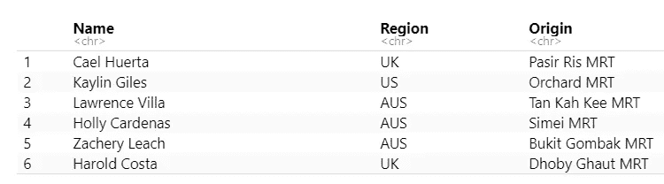
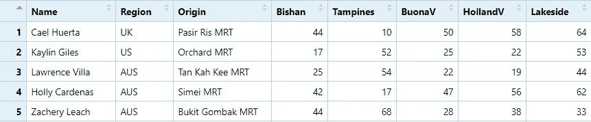
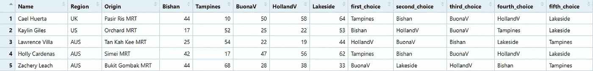
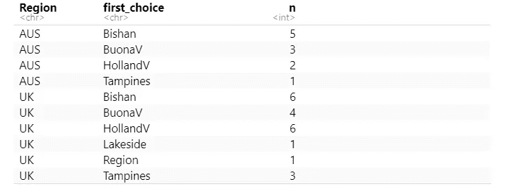

# 如何使用谷歌地图的 API 决定晚餐分组

> 原文：<https://towardsdatascience.com/how-to-decide-on-dinner-grouping-using-google-maps-api-75edaa78fc9d?source=collection_archive---------48----------------------->

随着新加坡从新冠肺炎疫情中恢复过来，新加坡政府已经开始允许人们八人小组聚会。我的教会团体(37 人)想一起吃晚饭。因此，我决定用 R 写一些代码，让我们尽可能以最好的方式组织晚餐！(*为保护隐私，使用了假名*)

# 分类要求

1.  人们呆在新加坡各地
2.  有 5 个晚餐地点
3.  人们在世界不同地区进行研究。
4.  我们需要先根据*地区*然后根据*晚餐地点*对人们进行分类。
5.  每组最多 5 人，每组必须至少有 2 人来自同一地区。

这看起来是一个有趣的挑战！

# 测量便利性

考虑到这些需求，我不得不开始考虑如何实现这一点。为了确保人们去最方便的地方，我们可以使用的最明显的度量标准是从他们的房子到晚餐地点的旅行时间。为了找到答案，我使用了`mapsapi`,它允许我们访问谷歌地图 API 套件中的方向 API。下面是我如何使用它的一个例子！(注:MRT 代表大众捷运是新加坡的地铁)

一旦我有了旅行时间，我所要做的就是按不同地点的旅行时间降序排列(同时按研究区域分组),这将允许我将它们归入不同的组。

# 查找旅行时间

以下是(假)数据的样子:

所以我们有了这些人的名字，他们的研究区域和离他们家最近的地铁站。我创建了 5 个额外的空列(用来存储到 5 个地点的旅行时间)，然后运行一个循环来使用`mp_directions`填充它。

问题是……它以字符串的形式返回旅行时间，返回类似“1 小时 15 分钟”和“55 分钟”的结果(正如你在上面的例子中看到的)。因此，我需要做些事情将它们转换成数值，这样我们就可以对它们进行排序。我使用 if/else 和`stringr`完成了这个任务

我对所有 4 个位置都这样做了，将它包装在一个更大的 for 循环中，以考虑所有不同的位置。完成后，这就是数据帧的样子！

# 排序和更多排序

有了旅行时间，我们现在要找到离一个人最近的位置所要做的就是找到最小值。为了做到这一点，我使用了`apply`，逐一检查每一行，并对它们进行排序，以找到最低值，然后是第二低的值等等。我还使用了`names()`,以便将它存储为地点的名称。

最后，我把它按地区分组，然后把它们从第一到第五选择排列起来。

# 组的分配

分类工作完成后，剩下要做的就是找出人与人之间的分配。我决定一次做一个地区，因为它们必须按地区分类。

首先，我决定使用`count`快速浏览一下分配情况。

从数据来看，璧山显然是大多数人最集中的地方。然而，只有一组人能到场。在整理过程中，我得到的指示是*尽我所能*让大多数人都方便。不幸的是，有限的地点意味着一些人将不得不去 T4 旅游。

我决定优先考虑旅行时间，但也要确保每个晚餐地点至少有两个人来自同一个地区。我根据最近的位置，第二个最近的位置进行过滤，然后从每个区域中切掉前三个名字。

我不会用剩下的排序来烦你，但我基本上检查了每个位置并把它们切片，确保每个人都被分配到一个组。

也就这样了！这不是一个非常困难的问题，但如果手动完成，可能会很乏味。使用 Google Maps API 可以让人们更容易找到地点之间的距离，然后相应地对它们进行排序。

*原载于***。**