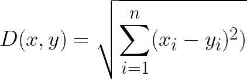
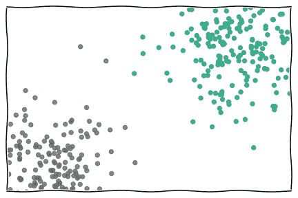
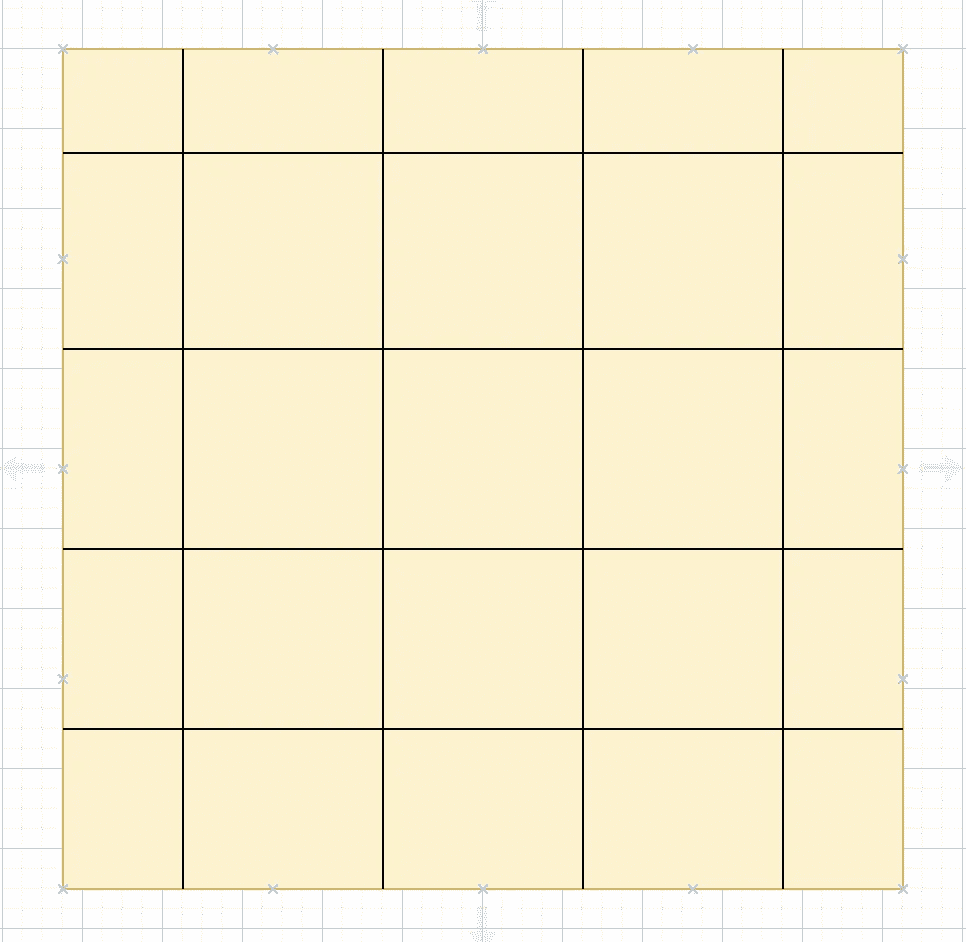
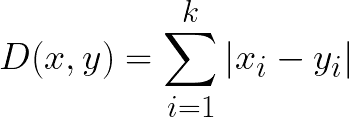
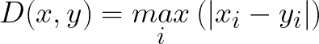
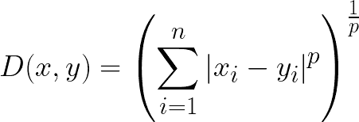
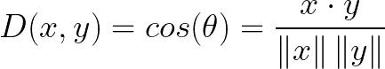
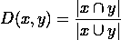
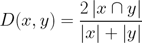

# 如何为您的机器学习模型确定完美的距离度量

> 原文：<https://towardsdatascience.com/how-to-decide-the-perfect-distance-metric-for-your-machine-learning-model-2fa6e5810f11?source=collection_archive---------8----------------------->

## 曾经怀疑过哪种距离度量对您的用例最有利吗？


塔内利·拉蒂宁在 [Unsplash](https://unsplash.com?utm_source=medium&utm_medium=referral) 上拍摄的照片

> 声明:你不需要每个 ML 模型都有一个距离度量，但是如果你需要的话，请继续读下去，选出最好的一个。

距离度量在机器学习和深度学习中起着重要的作用。像 k-NN，K 表示聚类，深度学习中使用的损失函数等机器学习算法都依赖于这些度量。

因此，了解不同类型的距离度量对于决定何时使用哪种度量非常重要。例如，k-NN 经常使用欧几里德距离进行学习。但是，如果数据是高维的呢？欧氏距离还会有价值吗？不，不会的，因为我们知道，欧几里德距离对于高维空间来说并不是一个好的度量(参见[这个](https://stats.stackexchange.com/questions/99171/why-is-euclidean-distance-not-a-good-metric-in-high-dimensions)链接了解更多信息)。所以我想你现在可以理解，知道你的距离度量可以帮助你从一个差的分类器到一个精确的模型。

在这篇博客中，我们将介绍一些最常用的距离度量及其用例和缺点，以及如何在 python 中实现它们。我们将讨论的问题如下:

*   欧几里得距离
*   曼哈顿距离
*   切比雪夫距离
*   闵可夫斯基距离
*   汉娩距
*   余弦相似性
*   雅克卡相似性
*   索伦森-戴斯指数

# 欧几里得距离

欧几里德距离是最常用的距离度量之一。从数学上来说，它是两个不同数据点之间的差异之和的平方根。下面是计算两个 k 维向量之间距离的公式。



作者图片

应用/优点:

*   高度直观、易于理解、易于使用的指标
*   它应该用在 KNN 或 K 均值等算法中，在这些算法中，我们有低维数据，数据点之间的直线距离足以衡量这些点的相似性。



[图像来源](https://milliams.com/courses/applied_data_analysis/Nearest%20Neighbours.html)

缺点:

*   它会受到输入要素比例的影响，这意味着根据每个要素的单位，计算的距离可能会有偏差。因此，标准化输入特征至关重要。
*   对高维数据无效/无用

python 中计算欧几里德距离的函数:

```
from math import sqrtdef euclidean_distance(a, b):
    return sqrt(sum((e1-e2)**2 for e1, e2 in zip(a,b)))#ORfrom scipy.spatial.distance import euclidean
dist = euclidean(row1, row2)
print(dist)
```

# 曼哈顿距离



作者图片

它通常被称为出租车距离或城市街区距离。想象你在一个城市街区，有两组平行的道路，水平的和垂直的，如图所示。所以，如果你想从一个点旅行到另一个点，你只能以直角移动。

然后计算两点之间的距离代表曼哈顿距离。



作者图片

应用/优点:

*   当数据集中存在离散/二进制属性时，曼哈顿距离度量更有效，因为它考虑了可从给定属性值中实际获取的路径。

缺点:

*   对于数据集中的浮动属性，它并不代表最佳距离。
*   对于高维数据，它比欧几里德距离更好，但在性能方面仍不是最佳选择。

python 中计算曼哈顿距离的函数:

```
def manhattan_distance(a, b):
    return sum(abs(e1-e2) for e1, e2 in zip(a,b))#ORfrom scipy.spatial.distance import cityblock
dist = cityblock(row1, row2)
print(dist)
```

# 切比雪夫距离

切比雪夫距离被定义为所有坐标维度中两个向量之间的最大差值。换句话说，它就是沿每个轴的最大距离



作者图片

应用/优点:

*   这一指标通常用于物流问题。例如，计算车辆从一个地方到另一个地方所需的最小步数，假设车辆在一个网格中运动，因此只有八个可能的方向(上、右上、右、右下、下、左下、左、左上)

缺点:

*   它只能用于特定的问题。它不能像欧几里得那样适用于任何通用问题。

python 中计算切比雪夫距离的函数:

```
def chebyshev_distance(a, b):
    return max(abs(e1-e2) for e1, e2 in zip(a,b))#ORfrom scipy.spatial.distance import chebyshev
dist = chebyshev(row1, row2)
print(dist)
```

# 闵可夫斯基距离

Minkowski 概括了上面讨论的所有距离度量，如欧几里德、曼哈顿和切比雪夫。它也被称为 p-范数向量，因为它添加了一个称为“p”的参数，允许计算不同的距离度量。公式是:



作者图片

对于 p=1 —曼哈顿距离

对于 p=2 —欧几里德距离

对于 p =无穷大—切比雪夫距离

由于这是一个更通用的距离度量，不同的 p 值将导致不同的利弊。我们已经在上面讨论了其中的一些。

python 中计算闵可夫斯基距离的函数:

```
def minkowski_distance(a, b, p):
    return sum(abs(e1-e2)**p for e1, e2 in zip(a,b))**(1/p)#ORfrom scipy.spatial import minkowski_distance
dist = minkowski_distance(row1, row2)
print(dist)
```

# 汉娩距

这是迄今为止最简单的一个。它等于两个数据点之间不同的值的数量。假设两个数据点 x 和 y 如下:

x = [1，2，3，0，2，4]

y = [1，3，3，0，1，4]

那么汉明距离= 2 至于 index(假设 index 从 0 开始)1 和 4 在 x 和 y 上的值是不同的，它通常用于计算两个二进制字符串之间的距离。

优势/优点:

*   当数据从一台计算机发送到另一台计算机时，它通常用于错误检测。

缺点:

*   因为它用于通过比较每个值来找出两个数据点之间的差异，所以它们必须具有相等的长度。
*   它不包含数据点的实际值/幅度。因此，当特征量起重要作用时，不建议使用。

python 中计算汉明距离的函数:

```
def hamming_distance(a, b):
    return sum(abs(e1 - e2) for e1, e2 in zip(a, b)) / len(a)#ORfrom scipy.spatial.distance import hamming
dist = hamming(row1, row2)
print(dist)
```

# 余弦相似性

它也是最常用的距离度量之一。它用于通过计算两个向量/数据点之间的余弦角来找出它们之间的相似性。



作者图片

为了更好地理解，如果两个向量重合或方向相同，那么它们之间的余弦相似度将为 1，如果它们完全相反，则为-1。

优势/优点:

*   适用于高维数据，应该在理想情况下用于这些数据。
*   它被用来寻找许多事物之间的相似性，如文本嵌入、图片嵌入或指纹嵌入。

缺点:

*   类似于汉明距离，在余弦相似性中不考虑向量的大小；只考虑他们的方向。

python 中计算余弦相似性的函数:

```
from numpy import dot
from numpy.linalg import normdef cosine_similarity(a,b):
    return dot(a, b)/(norm(a)*norm(b))#ORfrom scipy.spatial.distance import cosine
dist = 1 - cosine(row1, row2)
print(dist)
```

# 雅克卡相似性

Jaccard 相似度用于计算相似度，它强调两个有限样本集之间的相似性，而不是向量之间的相似性。它被定义为集合的交集的大小，除以这些集合的并集的大小。



作者图片

例如，如果两个集合有两个共同的实体，并且总共有 7 个唯一的实体，那么相似性将是 2/7。

优势/优点:

*   Jaccard 相似性被用作评估深度学习中的图像分割模型的度量，其中模型必须对图像的每个像素进行分类。它被用来计算与地面事实相比，我们分割所需实体的准确程度。它可以类似地用于其他应用。

缺点:

*   Jaccard 的相似性高度依赖于数据的大小。大型数据集会显著影响相似性，因为在这种情况下，当交集保持较低时，并集可能会大幅增加。

python 中计算 Jaccard 相似性的函数:

```
import numpy as npdef jaccard_similarity(x,y):
    intersection = np.logical_and(x, y)
    union = np.logical_or(x, y)
    similarity = intersection.sum() / float(union.sum())
    return similarity#ORfrom sklearn.metrics import jaccard_scoresimilarity = jaccard_score(a, b)
print(similarity)
```

# 索伦森-戴斯指数

索伦森-戴斯指数与雅克卡相似性非常相似。索伦森-戴斯指数更直观一些，因为它可以被视为两个集合之间的重叠百分比，该值介于 0 和 1 之间:



作者图片

s rensen-Dice 指数也用作图像分割的度量。

# 结论

在这篇博客中，我们讨论了实践中广泛使用的各种距离度量。每种度量在某些情况下是有利的，而在另一些情况下是不利的。希望这篇博客能帮助你决定哪种度量更适合你的用例。

关注我们的 [medium](https://medium.com/@AnveeNaik) 了解更多此类内容。

*成为* [*介质会员*](https://medium.com/@AnveeNaik/membership) *解锁并阅读介质上的许多其他故事。*