# 如何在 Altair 中整理条形图

> 原文：<https://towardsdatascience.com/how-to-declutter-a-bar-chart-in-altair-e721f5c0ad87?source=collection_archive---------20----------------------->

## 数据可视化

## 关于如何通过流行的 Python 数据库提高条形图可读性的一些技巧和提示


照片由[内森·杜姆劳](https://unsplash.com/@nate_dumlao?utm_source=medium&utm_medium=referral)在 [Unsplash](https://unsplash.com?utm_source=medium&utm_medium=referral) 上拍摄

最近我读了一本非常有趣的书，作者是 Jose Berengueres，书名为*数据可视化简介&讲故事:数据科学家指南。在本书中，作者描述了许多从数据集中提取一个非常有趣的故事的技术。受这本书的启发，在本文中，我描述了一个在 Altair 中整理条形图并从表示的数据中提取一个故事的策略。*

Altair 是一个流行的用于数据可视化的 Python 库。还有许多其他用于数据可视化的 Python 库，比如 Matplotlib 和 Seaborn。在本教程中，我将描述 Altair，留待将来分析其他数据 Viz 库时使用😃

在本教程中，我将演示如何在 Altair 中构建一个条形图，以及如何对其进行整理。

> 整理图表意味着删除所有不必要的东西，这些东西会分散读者获取正确信息的注意力。

作为一个用例，我利用了欧盟统计局提供的[活产和粗出生率](https://ec.europa.eu/eurostat/databrowser/view/tps00204/default/table?lang=en)数据集。该数据集包含从 2009 年到 2020 年每个欧洲国家的活产婴儿数量。

**目标是通过整理一个基本条形图，从数据中提取一些有意义的信息，重点是上一期(2019–2020)。**

目录:

*   加载并清理数据集
*   条形图基础
*   数据聚合
*   最终清理

# 1 加载并清理数据集

我下载了。XSLX 文件和我通过`read_excel()`函数加载的熊猫数据帧:

```
import pandas as pddf = pd.read_excel('../sources/eu_live_births.xlsx', header=7, sheet_name="Sheet 1", na_values=':')
df.head(10)
```

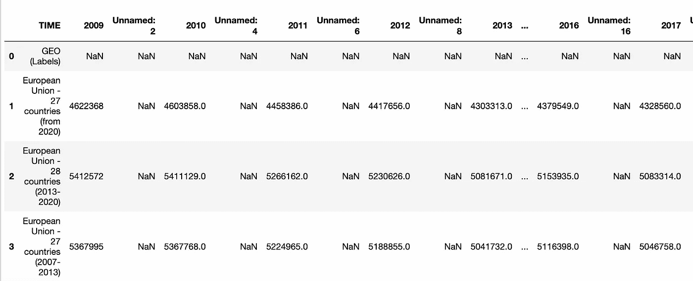

作者图片

数据集非常脏，因此我通过只选择感兴趣的列来清理它。

```
df = df[['TIME', '2019', '2020']]
df.head()
```

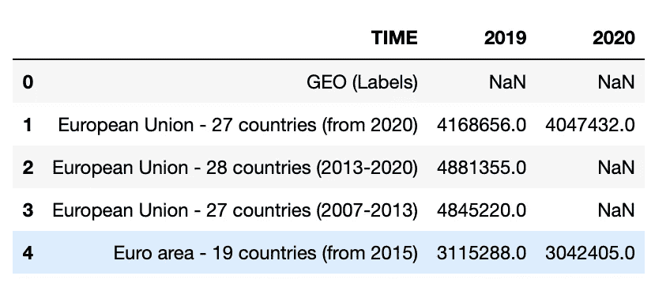

作者图片

我将`TIME`列重命名为`Country`

```
df.rename(columns={'TIME' : 'Country'}, inplace=True)
```

然后我删除列 2020 和 2019 的`NaN`值

```
df.dropna(subset=['2020'],inplace=True)
df.dropna(subset=['2019'],inplace=True)
```

我删除了前六行，它们是相对于整个欧洲的:

```
df = df.iloc[6:]
```

# 2 建立一个基本的条形图

现在我用 2020 年的数据构建了一个原始条形图:

```
import altair as alt
bars = alt.Chart(df).mark_bar().encode(
    x=alt.X('2020:Q'),
    y=alt.Y('Country:N'),
)
```

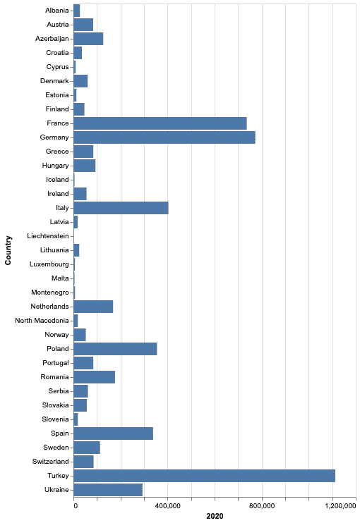

作者图片

条形图很难阅读，因此我通过`sort='-x'`参数订购 DESC 棒材(使用`x`订购 ASC)。

```
bars = alt.Chart(df).mark_bar().encode(
    x=alt.X('2020:Q'),
    y=alt.Y('Country:N', sort='-x'),
)
```

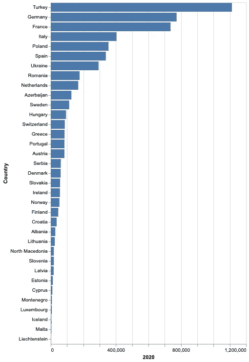

作者图片

截断到前 10 个国家是对该条形图的唯一改进。然而，**截断数据并不是理解现象**的最佳解决方案。因此，我遵循另一种策略，即把国家聚合到宏观区域(或地区)。

# 3 数据汇总

我的原始数据集不包含任何聚合信息，因此我应该增加一个新列，包含每个国家的宏观区域。

我利用了从这个[网站](https://www.schengenvisainfo.com/countries-in-europe/)中提取的另一个数据集，它包含了每个国家及其地区和人口。

我加载数据集:

```
df_regions = pd.read_csv('../sources/eu_regions.csv', sep=';')
```

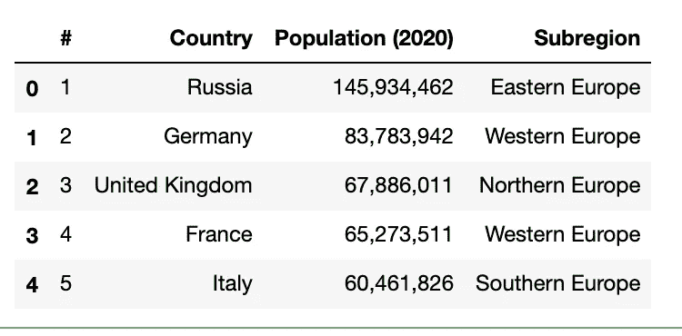

作者图片

我定义了一个函数，它接收一个国家作为输入，并返回它的子区域。该函数还管理异常。

```
def get_region(x):
    south_exceptions = ['Cyprus', 'Turkey']
    east_exceptions = ['Armenia', 'Azerbaijan']
    if x in south_exceptions:
        return 'Southern Europe'
    if x in east_exceptions:
        return 'Eastern Europe'
    row = df_regions[df_regions['Country'] == x]
    return row['Subregion'].iloc[0]
```

现在我丰富了我的原始数据集:

```
df['Region'] = df['Country'].apply(lambda x: get_region(x))
```

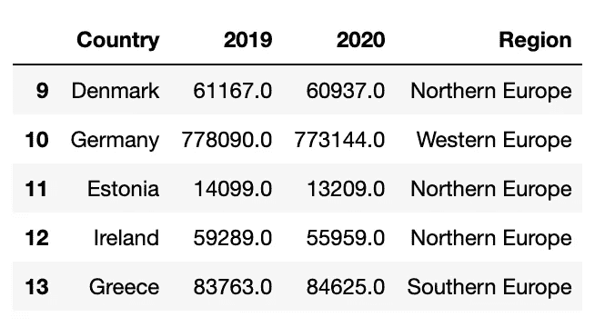

作者图片

现在，我构建聚合条形图。我利用`transform_aggregate()`函数来计算每个区域的平均值。我要感谢[Soner y ldr RM](https://medium.com/u/2cf6b549448?source=post_page-----e721f5c0ad87--------------------------------)，他让我在题为 [3 个例子来展示 Python Altair 不仅仅是一个数据可视化库](/3-examples-to-show-python-altair-is-more-than-a-data-visualization-library-700e37cbf95b)的文章中发现了`transform_aggregate()`函数。

```
bars = alt.Chart(df).mark_bar().encode(
    x=alt.X('avg_value:Q'),
    y=alt.Y('Region:N')
).**transform_aggregate**(
   avg_value = 'average(2020)', groupby = ['Region']
)
```

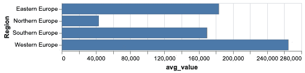

作者图片

在比较数量时，绝对值不是最佳解决方案。因此，我计算了 2020 年相对于 2019 年的活产减少/增加百分比:

```
import mathdf['2020_2019'] = -(df['2020'] - df['2019'])/df['2019']
```

我再次绘制条形图:

```
bars = alt.Chart(df).mark_bar().encode(
    x=alt.X('avg_value:Q'),
    y=alt.Y('Region:N')
).transform_aggregate(
   avg_value = 'average(2020_2019)', groupby = ['Region']
)
```

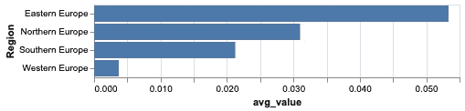

作者图片

图表很清楚:**东欧经历了最大的百分比下降**。这一方面可能是要讲的故事。

# 4 最终清理

现在，故事已经从数据中提取出来，我可以进一步整理图表。首先，我设置了图形标题:

```
bars = alt.Chart(df).mark_bar().encode(
    x=alt.X('avg_value:Q'),
    y=alt.Y('Region:N')
).transform_aggregate(
   avg_value = 'average(2020_2019)', groupby = ['Region']
)**.properties(
     height = 300
)**
```

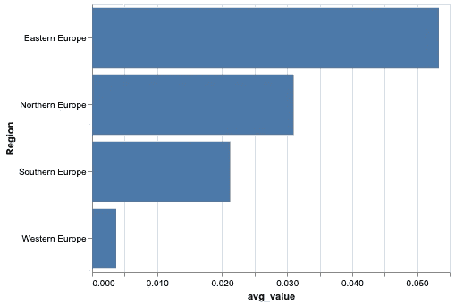

作者图片

然后，我把标签贴在栅栏附近:

```
bars = alt.Chart(df).mark_bar().encode(
    x=alt.X('avg_value:Q'),
    y=alt.Y('Region:N')
).transform_aggregate(
   avg_value = 'average(2020_2019)', groupby = ['Region']
)**text = bars.mark_text(
    align='left',
    baseline='middle',
    dx=3,
    fontStyle='bold',
    fontSize=20
).encode(
    text=alt.Text('avg_value:Q', format=",.3f")**
)final_bar = (bars + text).properties(
     height = 300
)
```

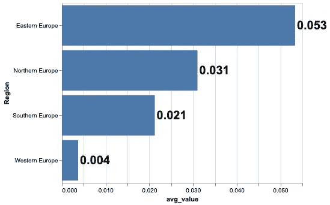

作者图片

我移除轴:

```
bars = alt.Chart(df).mark_bar().encode(
    x=alt.X('avg_value:Q', **axis=None**),
    y=alt.Y('Region:N', **title=''**)
).transform_aggregate(
   avg_value = 'average(2020_2019)', groupby = ['Region']
)text = bars.mark_text(
    align='left',
    baseline='middle',
    dx=3,
    fontStyle='bold',
    fontSize=20
).encode(
    text=alt.Text('avg_value:Q', format=",.3f")
)final_bar = (bars + text).properties(
     height = 300
)
final_bar
```

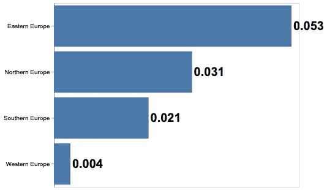

作者图片

我加上标题:

```
bars = alt.Chart(df).mark_bar().encode(
    x=alt.X('avg_value:Q', axis=None),
    y=alt.Y('Region:N', title='')
).transform_aggregate(
   avg_value = 'average(2020_2019)', groupby = ['Region']
)text = bars.mark_text(
    align='left',
    baseline='middle',
    dx=3,
    fontStyle='bold',
    fontSize=20
).encode(
    text=alt.Text('avg_value:Q', format=",.3f"),

)final_bar = (bars + text).properties(
    height = 300,
    **title = 'Percentage Decrease in Live Births (2020-2019)'**
).**configure_title(
    fontSize=24
)**
```

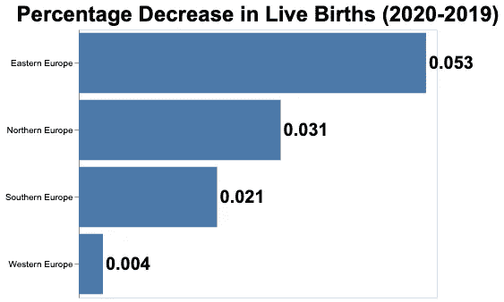

作者图片

最后，我将重点介绍一个地区(南欧)的情况:

```
bars = alt.Chart(df).mark_bar().encode(
    x=alt.X('avg_value:Q', axis=None),
    y=alt.Y('Region:N', title=''),
    **color=alt.condition(alt.datum.Region == 'Southern Europe', alt.value('#8B0000'), alt.value('grey'))**
).transform_aggregate(
   avg_value = 'average(2020_2019)', groupby = ['Region']
)text = bars.mark_text(
    align='left',
    baseline='middle',
    dx=3,
    fontStyle='bold',
    fontSize=20
).encode(
    text=alt.Text('avg_value:Q', format=",.3f"),

)final_bar = (bars + text).properties(
    height = 300,
    title = 'Percentage Decrease in Live Births (2020-2019)'
).configure_title(
    fontSize=24
)
```

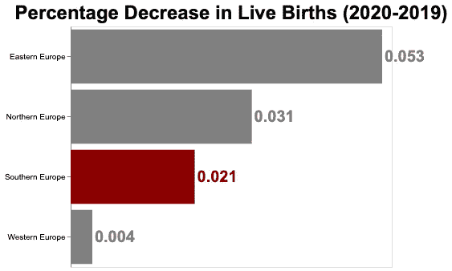

作者图片

# 摘要

在本文中，我举例说明了一个在 Altair 中整理条形图并使其可读性更好的实例。清理需要以下操作:

*   为初步数据探索构建一个基本条形图
*   聚合数据，如果聚合数据不可用，则搜索另一个数据集
*   绘制聚合数据并提取故事
*   通过删除轴、添加标题和突出显示文章，执行最终的整理。

如果你已经走到这一步来阅读，对我来说，今天已经有很多了。谢谢！你可以在本文中读到更多关于我的信息。

您可以从我的 [Github 资源库](https://github.com/alod83/data-science/blob/master/DataVisualization/Altair/Altair%20Decluttering.ipynb)下载本教程的完整代码。

# 相关文章

</how-to-run-animations-in-altair-and-streamlit-2a0624789ad>  </data-visualisation-principles-part-1-a-practical-example-in-altair-b6e16f665fc6>  </data-visualisation-principles-part-1-white-space-text-and-colour-13f520f90ce9> 