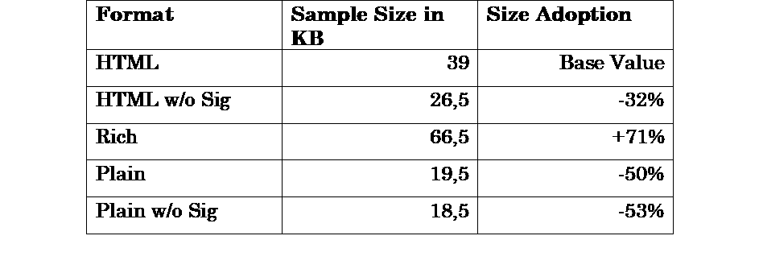
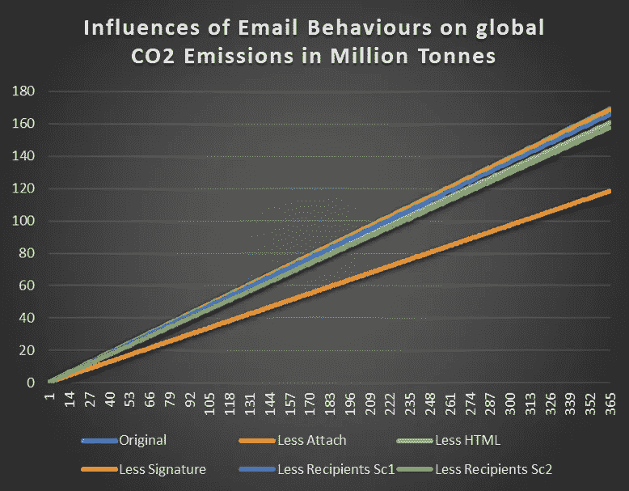

# 如何减少数字通信的碳足迹

> 原文：<https://towardsdatascience.com/how-to-decrease-the-carbon-footprint-of-digital-communication-f3186673818c?source=collection_archive---------14----------------------->

蜜琪拉·威登霍夫在 [Unsplash](https://unsplash.com?utm_source=medium&utm_medium=referral) 上拍摄的照片

## 利用系统动力学评估电子邮件行为对温室气体排放的影响

# 介绍

如今，通过数字工具交流是非常正常的。我们有与朋友聊天的社交媒体平台，进行工作面试的视频电话服务，当然，还有传统的电子邮件。有人会认为通过电子邮件发送信息是使用实体信件的“绿色替代方案”。当然，我们会考虑从 A 地到 B 地运输过程中的二氧化碳排放，我们也知道造纸所需的砍伐树木对环境的负面影响。那么，就气候中立信息共享而言，电子邮件是圣杯吗？本文将通过回顾电子邮件的碳足迹，讨论电子邮件数据结构的重要性，并对电子邮件行为如何影响二氧化碳排放进行实验，来发现这个问题。这篇文章的新颖之处在于，我们将量化电子邮件行为对碳足迹的影响。为此，我们将应用模拟技术系统动力学。

# 电子邮件的碳足迹

## 电子邮件背景

首先，让我们简单地还原一下一封邮件到底是什么，它来自哪里。基本上，电子邮件是一种从发送者向接收者传输文本和其他数字数据的互联网服务。电子邮件应用程序由邮件服务器和面向客户端的邮件程序组成，前者负责指导邮件的传递和归档，后者用于创建、发送和阅读邮件。此外，电子邮件应用程序需要网络访问，并使用 SMTP、IMAP 或 pop 3[【1】](#_ftn1)等传输协议。第一封电子邮件是在 1971 年发出的——比万维网的诞生早了将近 20 年。这种新信息技术的发明者是雷·汤姆林森，他当时在因特网的前身“阿帕网”上工作。在此之前，只能在最初发送电子邮件的同一台设备上阅读电子邮件。所以真正的成就是通过使用 FTP 协议经由网络的设备支配的消息传递。此外，他还引入了“@”符号来称呼信息接收者。

## 电子邮件导致的温室气体排放

已经有很多关于电子邮件中二氧化碳排放的文章，它们经常提到同一个来源:“香蕉有多糟糕？”:万物的碳足迹”，发表于 2010 年，作者是碳足迹研究者、万维网发明者蒂姆·伯纳斯·李的兄弟迈克·伯纳斯-李。该研究对电子邮件进行了分类，并对每封邮件的平均排放量进行了如下描述:

1)垃圾邮件:0.3 克二氧化碳

2)普通邮件:4g 二氧化碳

3)带附件的邮件:50g CO2

这些二氧化碳成本主要是由运行电子邮件设备所需的能源引起的，这些设备为网络基础设施供电，必须访问网络基础设施以传输电子邮件，以及存储内容的数据中心[【3】](#_ftn3)。根据 Berners-Lee 的数据，我们还可以推断电子邮件的大小会影响二氧化碳的排放量:电子邮件越大，排放的二氧化碳就越多。2021 年，我们在全球每天收发的电子邮件数量约为 3200 亿封，预计这一数字还会进一步增加[【4】](#_ftn4)。虽然垃圾邮件看起来不太受气候影响，但我们需要考虑与普通邮件相比垃圾邮件的数量。下面我们重点来揭晓几个国家**每日**发送邮件[【6】](#_ftn6)的比例:

1)美国:96 亿封邮件(总量)，86 亿封邮件(垃圾邮件)。

2)德国:90 亿封电子邮件(总量)，79 亿封电子邮件(垃圾邮件)

3)中国:87 亿封电子邮件(总量)，85 亿封电子邮件(垃圾邮件)

4)英国:86 亿封电子邮件(总量)，77 亿封电子邮件(垃圾邮件)

5)俄罗斯联邦:84 亿封电子邮件(总计)，81 亿封电子邮件(垃圾邮件)

由于这些国家和其他几个国家一样，是全球电子邮件统计的领导者，我们可以计算加权平均值来表示全球电子邮件流量中垃圾邮件的百分比:92%。进一步的研究得出的结果是，大约 24%的商务邮件有附件。

有了这些数据，让我们来推断一下全球电子邮件的年二氧化碳排放量(我们接受四舍五入):

*   每年发送的电子邮件数量= 3200 亿 x 365 天= 117.8 万亿
*   每年发送的垃圾邮件数量= 117.8 万亿* 0.92 = 108.4 万亿
*   每年发送的常规电子邮件数量= 117.8 万亿* 0.08 * 0.76 = 7.2 万亿
*   每年发送的带附件的电子邮件数量= 117.8 万亿* 0.08 * 0.24 = 2.3 万亿

使用这些结果，我们现在可以计算每种电子邮件类型的年度二氧化碳排放量，如下表所示:

每种电子邮件类型的电子邮件数量和二氧化碳排放量(图片由作者提供)

这导致二氧化碳总排放量约为 1.763 亿吨。相当庞大的数字——为了让它更有形，我们可以将其转化为 2120 万个家庭一年的能源消耗，甚至 21 万亿部智能手机充电；或者说得更具体一点:相当于汽车[【8】](#_ftn8)行驶了 4423 亿英里，这甚至比全德承认的所有汽车一年的行驶里程还要多(3767 亿英里[【9】](#_ftn9))。然而，如果我们将其与 2020 年全球化石燃料的二氧化碳排放量(近 350 亿吨[【10】](#_ftn10))相比较，我们的电子邮件仅占温室气体排放量的 0.5%。尽管如此，我们可以清楚地声明，电子邮件并不像许多人预期的那样对气候没有影响。

# 大型电子邮件的驱动因素

在我们评估减少二氧化碳排放的手段之前，我们希望了解电子邮件的数据结构以及它通常包含哪些类型的信息。基本上，一封电子邮件由三部分组成:信封、标题和正文。信封封装了消息，并包含发送电子邮件所需的所有信息。典型的信息是目的地地址、电子邮件优先级及其安全级别。标头由与消息传输相关的字段组成，如“收件人”、“抄送”或“发件人”。每个头字段指的是指定字段名、冒号和值的一行 ASCII 文本。消息的主体部分包含发送者感兴趣的实际内容。它通常由文本、签名和附件[【11】](#_ftn1)组成。考虑到这些因素，我们可以暗示正文是邮件大小的主要驱动因素。所以让我们仔细看看尸体。

## 电子邮件的数据格式

影响体型的不仅仅是纯粹的核心信息量。在专业邮件客户端应用程序中，您可以选择正文的格式，这也会影响大小，如下图所示(来自 MS Outlook 的截图)。

MS Outlook 中的格式选项(图片由作者提供)

为了评估数据格式对电子邮件大小的影响，我创建了一个样本邮件，其中包含称呼、问候、一些“lorem ipsum”内容和我当前公司的签名。然后，我改变了一些文字格式，例如粗体和彩色。最后，我将邮件作为文件保存到我的电脑上，但不是一次而是多次以不同的格式保存。首先，我使用了“HTML”格式，这需要 39 KB。然后，我使用了“富文本”格式，需要 66.5 KB。最后，我使用了“纯文本”格式，这需要 19.5 KB。因此，我们可以得出结论，我们有三种不同的消息大小，尽管正文内容完全相同(除了格式，纯文本丢失了)。此外，如果我删除我的签名，我可以进一步减少电子邮件的大小。当然，我们谈论的是大数据时代的千字节。但是当我们将这些结果放在一起时，我们可以看到格式(和签名使用)之间的百分比差异非常显著(见下表)。因此，即使我们不减少电子邮件的数量，我们也可以通过减少网络流量和存储消耗来影响全球二氧化碳排放量，同时保持共享相同的信息。当然，这种论证建立在电子邮件的成熟度是 HTML 格式的假设之上，这是我观察到的，尤其是在商业环境中，但在私人领域接收时事通讯或广告时也是如此。不幸的是，我找不到一个可靠的研究来量化使用电子邮件格式的百分比。

邮件格式对邮件大小的影响(图片由作者提供)

## 电子邮件附件

大邮件的另一个驱动因素是附件的使用。在早期，只需通过电子邮件发送文件副本，就可以与收件人共享文档，这非常有用。一方面，这是一种让公司以外的人访问该文件的简单方法。另一方面，简单地拖放副本也比发送指向内部文件共享的链接并验证此人是否有访问权限更方便(这通常需要管理文件共享的 it 专家的帮助)。如今，共享集中存储的文件变得更加容易，甚至与外部团体也是如此。主要基于云的专业办公软件套件，例如微软 365[【12】](#_ftn2)和谷歌工作空间[【13】](#_ftn3)，提供了自己轻松管理文件访问的功能，甚至将访问权限授予外部合作伙伴。有了这些功能，实际上不再需要将文件副本作为电子邮件附件发送。此外，如果发送的是副本而不是原始文件的链接，也会有一些缺点。例如，如果您在发送电子邮件后发现文档中有打字错误或更大的问题，您仍有机会更新原始文档，收件人将通过链接访问更新后的原始文件。但是，如果你发送了文件的副本，你就必须再次发送修改过的文件，并指出你的错误。共享链接而不是副本的另一个好处是能够协作处理同一个文件。此外，后台的文档管理系统通常关心版本控制。因此，如果任何贡献者犯了错误，您可以简单地恢复以前的版本。这种协作方式还消除了发送和存储同一文件的多个版本的需要，如 File_V1、File_V1.9、File_final_REALLY_2 等

# 电子邮件行为对碳足迹的影响

我们已经回顾了电子邮件的二氧化碳排放量，并讨论了导致大邮件的驱动因素。在本节中，我们想评估如果我们改变这些驱动因素，二氧化碳排放量会发生什么变化。为此，我们将应用系统动力学(SD)作为模拟技术，使用 AnyLogic 作为建模软件。这一选择的主要原因是，当在单代理活动不相关的更大规模上处理连续效果流时，SD 是非常强大的。SD 的数学基础是微积分。

## 实验描述

到目前为止，我们还没有弄清楚每 KB 电子邮件的二氧化碳排放量，因为 Berners-Lee 的研究只是定性地区分了电子邮件类型的排放量。一篇关于上网时二氧化碳排放的文章估计，一封大小为 1 MB 的电子邮件在其整个生命周期内会排放 20g 的二氧化碳[【14】](#_ftn1)。这位匿名作者指出，每个用户一年 20 封这样大小的电子邮件产生的二氧化碳排放量相当于一辆行驶 1000 公里的汽车。如果我把这个值校准到我之前的 HTML 电子邮件示例中，它将排放 0.6 克 CO2。一封基于伯纳斯-李的排放 4g 二氧化碳的“普通”电子邮件大小为 200 KB。此外，我们可以推断，一封普通的带有附件的电子邮件的大小为 2.5 MB，才能排放 50g CO2。这些数字不影响与格式相关的尺寸采用，但影响与签名相关的尺寸采用。因此，如果我们接受 200 KB 作为标准电子邮件大小，那么删除签名只会产生-6.25%的影响。在尺寸上。因此，我们将在模拟中使用这些数据。

让我们从基于每日发送邮件的基本费率开始，总结在下表中。

每日邮件费率(图片由作者提供)

下图展示了我为进行实验而开发的 SD 模型。它区分电子邮件类型(垃圾邮件、普通邮件、附件)以及普通电子邮件的格式。股票变量计算一段时间内电子邮件的数量，而黄色变量计算每种电子邮件(子)类型的二氧化碳排放量。红色变量将单个排放量相加，得出一年内电子邮件的总二氧化碳排放量。

系统动力学模型(图片由作者提供)

接下来，我们想进行一些实验，这些实验涉及以下问题:

1)如果我们经常从 HTML 邮件中删除我们的签名会怎么样？

2)如果我们少发带签名的 HTML 邮件，多发纯文本邮件会怎么样？

3)如果我们在电子邮件中发送更多的文件链接而不是附件，会怎么样？

4)如果我们减少我们发送的电子邮件的收件人数量会怎么样？

不幸的是，我找不到一份说明有多个收件人的电子邮件比例的研究。因此，我需要做一些假设。让我们假设，特别是在商业环境中，我们经常向多个收件人发送邮件。至少我经历过，人们经常把他们的经理或其他感兴趣的人放在 CC，而不期望他们有任何行动。所以，这样的邮件对他们来说是一种“零信息”。而且“收件人”的选择往往没有意义。取而代之的是，现有的邮件列表被重新用来传播只影响部分收件人的信息。所以我想构建的是下面的情况:

*   有一定比例的全球电子邮件流量是由同一封电子邮件发送给多个收件人造成的。
*   通过限制电子邮件收件人，有可能降低这一比例。

在我的实验中，我假设 30%的电子邮件流量是由这种效应引起的。此百分比适用于普通电子邮件以及带附件的电子邮件。然后，我将通过场景 1(节省 10%的电子邮件)和场景 2(仅通过减少不相关的电子邮件收件人来节省 30%的电子邮件)来研究电子邮件流量的减少。

## 结果

下图显示了单个实验的结果，并设置了它们之间的关系。蓝线指的是原始的电子邮件产品，当然，在图表的顶部。我们清楚地看到，附件的减少(橙色线)对二氧化碳排放的影响最大。

电子邮件行为对全球二氧化碳排放量的影响(百万吨)

现在，让我们关注我们的潜在杠杆对全球二氧化碳排放的特殊影响。我们需要考虑之前计算的年度 CO2 排放量(1.76 亿吨)与 SD 模拟(1.69 亿吨)不同。这是因为我估计“常规”邮件 80%是 HTML，20%是纯文本。由于纯文本邮件排放的二氧化碳较少，模拟的年总排放量低于之前简单计算的结果。表格显示，将带有附件的电子邮件数量减半，用带有链接的 HTML 电子邮件取而代之，可以减少 30%的二氧化碳排放量。电子邮件收件人减少 30%将节省 6.9%的二氧化碳成本，而减少 10%将节省 2%。使用纯文本而不是 HTML 可以减少 5%的温室气体排放。签名的去除具有最低的影响，至少减少 0.4%的 CO2 排放。

测试杠杆的结果比较(图片由作者提供)

幸运的是，我们还可以计算电子邮件导致的二氧化碳排放的绝对减少量，这也显示在表格中。同样，为了对这些数字有更好的感觉，让我们搜索一下日常生活中我们都知道的对应词:

*   减少带有附件的电子邮件将会减少相当于**1000 万辆汽车** **驾驶**一年的二氧化碳排放量。
*   当我们只减少 10%的接收者时，我们将节省相当于**4120 亿部智能手机充电**的温室气体排放量。
*   即使是最后一个杠杆，我们减少 50%的电子邮件签名，也会产生积极的环境影响，相当于 148 个风力涡轮机运行一整年。
*   如果我们采取所有这些措施，我们将减少二氧化碳排放量，相当于 100 万辆油罐车的汽油排放量。

正如我们之前指出的，全球电子邮件流量预计将进一步增加，百分比减少将在未来节省更多的绝对二氧化碳排放量。

# 结论

我们已经看到，电子邮件并不像预期的那样对气候没有影响。但相反，电子邮件数据结构中不必要的开销产生的数字垃圾会排放大量的二氧化碳。有许多杠杆可以显著影响排放，尤其是使用连杆代替附件。但其他一些更琐碎的行为，比如避免巨大的电子邮件签名，也会对温室气体排放产生显著影响。当然还有更多可能的手段，我们在本文中没有涉及，比如删除对商业或私人目的不再重要的旧邮件。关键信息是，不花钱就能节省二氧化碳排放相当容易——只要调整我们人类的电子邮件行为就能实现。可以进行进一步的研究，以评估应用我们在本文中分析的杠杆的系统措施的技术发展或组织。

[【1】](#_ftnref1)[https://wirtschaftslexikon . gabler . de/definition/e-mail-33576](https://wirtschaftslexikon.gabler.de/definition/e-mail-33576)

[【2】](#_ftnref2)[https://www . FAZ . net/aktuell/technik-motor/digital/ray-Tomlinson-der-er finder-der-email-ist-tot-14109850 . html](https://www.faz.net/aktuell/technik-motor/digital/ray-tomlinson-der-erfinder-der-e-mail-ist-tot-14109850.html)

[【3】](#_ftnref3)[https://www . BBC . com/future/article/2020 03 05-why-your-internet-habits-is-as-clean-as-you-think](https://www.bbc.com/future/article/20200305-why-your-internet-habits-are-not-as-clean-as-you-think)

[【4】](#_ftnref4)[https://de . statista . com/statistik/daten/studie/252278/umfrage/prognose-zur-zahl-der-tae glich-versendeter-emails-weltweit/](https://de.statista.com/statistik/daten/studie/252278/umfrage/prognose-zur-zahl-der-taeglich-versendeter-e-mails-weltweit/)

[【5】](#_ftnref5)[https://www . statista . com/statistics/1270488/spam-emails-sent-daily-by-country/](https://www.statista.com/statistics/1270488/spam-emails-sent-daily-by-country/)

[【6】](#_ftnref6)[https://www . statista . com/statistics/1270459/daily-emails-sent-by-country/](https://www.statista.com/statistics/1270459/daily-emails-sent-by-country/)

[【7】](#_ftnref7)[https://medium . datadriveninvestor . com/email-attachments-generate-near-6-000-needly-and-unsecure-files-per-employee-per-year-year-a 38385 bec 7 a 4](https://medium.datadriveninvestor.com/email-attachments-generate-nearly-6-000-unnecessary-and-unsecure-files-per-employee-per-year-a38385bec7a4)

[【8】](#_ftnref8)[https://www . EPA . gov/energy/green-gas-equivalences-calculator](https://www.epa.gov/energy/greenhouse-gas-equivalencies-calculator)

[【9】](#_ftnref9)[https://www . kba . DE/DE/Statistik/Kraftverkehr/verkehr 千米/vk _ inlaenderfahrleistung/vk _ inlaenderfahrleistung _ node . html；jsessionid = 3680 DFA 2 faf 0d 0754 d8e 522 Fe 14 cc1 e . live 21321](https://www.kba.de/DE/Statistik/Kraftverkehr/VerkehrKilometer/vk_inlaenderfahrleistung/vk_inlaenderfahrleistung_node.html;jsessionid=3680DFA2AFAF0D0754D8E522FE14CC1E.live21321)

[【10】](#_ftnref10)[https://ourworldindata.org/co2-emissions](https://ourworldindata.org/co2-emissions)

[【11】](#_ftnref1)[https://www.geeksforgeeks.org/e-mail-format/](https://www.geeksforgeeks.org/e-mail-format/)

[【12】](#_ftnref2)[https://365 tips . be/en/share-files-in-office-365-best-practice/](https://365tips.be/en/share-files-in-office-365-best-practise/)

[【13】](#_ftnref3)[https://support.google.com/a/users/answer/9296687?hl=en](https://support.google.com/a/users/answer/9296687?hl=en)

[【14】](#_ftnref1)[https://www . ener guide . be/en/questions-answers/do-I-emit-CO2-when-I-surf-the-internet/69/](https://www.energuide.be/en/questions-answers/do-i-emit-co2-when-i-surf-the-internet/69/)