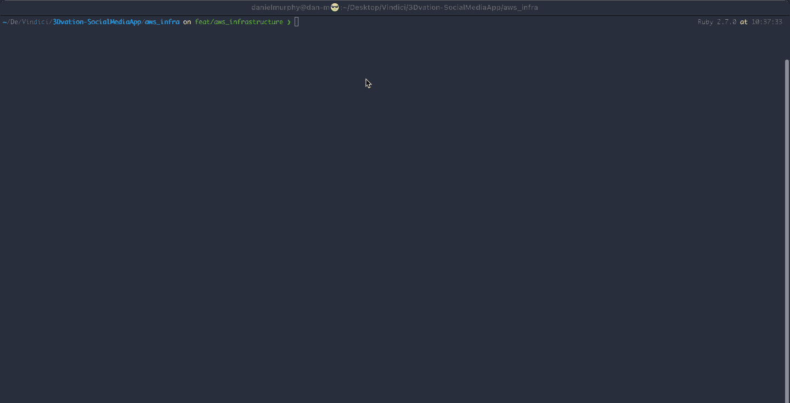
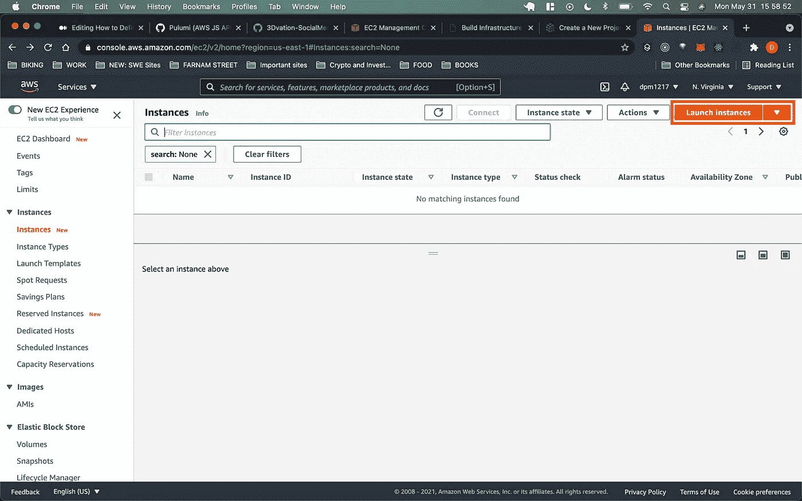
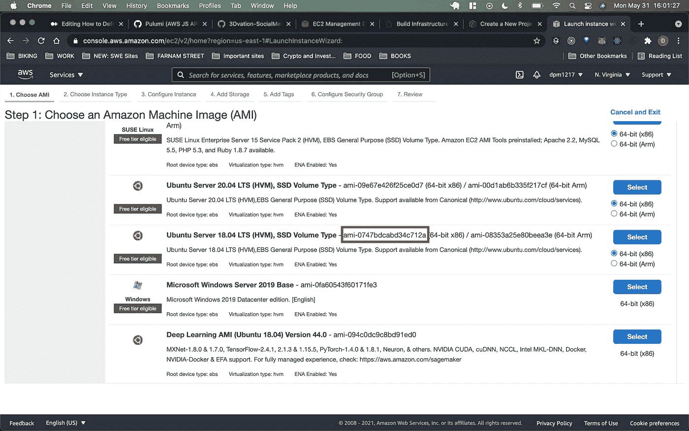
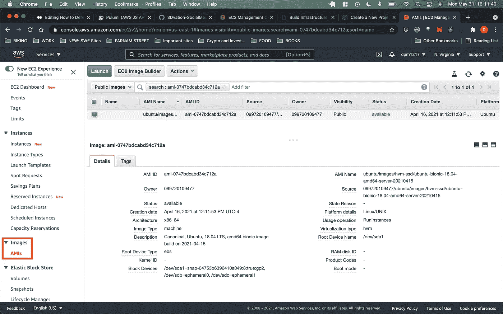
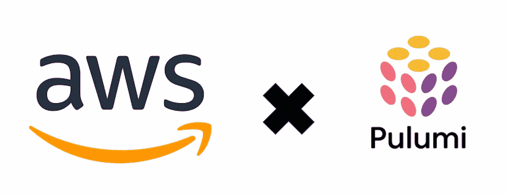

# 如何用代码定义和部署基础设施

> 原文：<https://towardsdatascience.com/how-to-define-and-deploy-infrastructure-with-code-c5af4bddc566?source=collection_archive---------37----------------------->

## Pulumi 是 Terraform 和 CloudFormation 的替代产品，它允许您使用自己喜欢的编码语言定义 AWS(以及其他服务，如 Azure 和 GCP)服务。



探索 Pulumi CLI

# 普鲁米简介

Pulumi 允许您通过结合 IaaS(基础设施即服务)的*安全性*和*可靠性*以及您所熟悉的编程语言的能力来构建云应用和基础设施。您可以使用自己选择的编程语言来定义基础设施，使用循环、条件和函数，并在不同的项目中重用这些设计模式，而不是使用 JSON、YAML 或定制的 IaaS 语言来定义基础设施。例如，下面是我们如何使用 Terraform HashiCorp 配置语言创建一个带有已分配安全组的 EC2 实例:

Terraform:使用分配的安全组创建 Ubuntu 18.04 实例

相比之下，下面是我们如何使用 Pulumi JavaScript AWS API 完成类似的任务:

Pulumi (AWS JS API):使用分配的安全组创建一个 Ubuntu 18.04 实例

如您所见，使用 Terraform 和 Pulumi 创建资源的总体逻辑是相似的。您可以过滤正确的 Amazon 机器映像，定义符合您的用例的定制安全组，将标记应用到您的资源，并基于这些 ami 和安全组定义服务器。主要区别在于创建资源的语言，对于您的用例来说，最好的工具可能取决于您对 **HashiCorp 配置语言**或 **JSON** (Terraform)以及更多通用编码语言的熟悉程度，如 **Python** 、 **JavaScript** 、 **Go** 和 **C#** (Pulumi)。

# 问题的介绍

作为一名软件工程顾问，很多时候我需要为公司部署一次性项目(供内部或外部使用)。在这些部署过程中，我通常会重复相同的过程:

1.  创建一个**临时**服务器，
2.  创建一个**生产**服务器，
3.  在两台服务器上安装必要的依赖项，
4.  允许**准备**和**生产**服务器相互连接，
5.  并为部署配置生产环境

以前，我会用 AWS 命令行或 AWS EC2 web 界面逐一完成这些步骤。但是，在我第二次手动完成这些任务后，我决定投入时间学习*云形成*、*地形*和*普鲁米*。在意识到 Pulumi 提供了最少的入门障碍(因为与 JSON 和 YAML 相比，我更熟悉 JavaScript 和 Python)之后，我决定使用它来自动化这些重复的部署过程。

# 我如何使用 Pulumi 来解决这些问题

在阅读了 pulumi 的 AWS 文档和一些教程之后，我安装了 Pulumi 命令行工具:

```
**brew install pulumi** # mac
```

然后为这个项目创建了一个目录，换成它，并运行:

```
**pulumi new aws-javascript** 
# aws tells pulumi we want to use the AWS Pulumi API
# javascript tells pulumi we want to use the JS AWS API
```

最后，编写代码前的最后一步是确保设置了正确的 AWS 概要文件。要配置 AWS 概要文件，请运行:

```
aws configure --profile "[name for profile]"
```

然后，输入正确的**访问密钥 ID** 和**秘密访问密钥**并运行:

```
aws use [name for profile]
```

为项目选择正确的 AWS 概要文件。从这里，打开 **index.js** 并开始定义您的基础设施。对于我的具体用例，我想创建两个服务器，一个用于*试运行*，另一个用于*生产*。我还希望它们存在于同一个 VPC 中，具有相同的安全组。为了实现这一愿景，我将代码分成了四个部分:

## 1.从 pulumi 访问配置变量

类似于为项目创建环境变量， *pulumi 配置变量*允许您定义可以在 pulumi 脚本中访问的特定于项目的值。对于我的具体用例，我想对 **PEM** 文件的名称保密，所以我使用以下命令创建了一个 **keyName** 配置变量:

```
**pulumi config set keyName [name_of_PEM_file]**
```

有了这个配置变量集，我就可以在我的 pulumi 脚本中访问分配给 **keyName** 的值，使用:

```
**const pulumi = require("@pulumi/pulumi");
const config = new pulumi.Config();
const keyName = config.get("keyName");**
```

## 2.过滤并检索正确的 AMI ID

在这之后，我需要过滤 Amazon 机器映像注册表，找到我想要创建的服务器的 **AMI 名称**和**所有者**。对于这个项目，鉴于我想使用 Ubuntu 18.04，我采取了以下步骤:

*   导航到 [AWS EC2 主页](https://console.aws.amazon.com/ec2/v2/)，点击**实例**，然后点击**启动实例**



AWS EC2 例程页

*   滚动到您想要创建的实例，复制 **AMI ID**



**Ubuntu 18.04 的 AMI ID**

*   导航回 EC2 仪表板主页面，点击左侧边栏**图片**部分下的 **AMIs** 。



*   在搜索栏中，粘贴您复制的 **AMI ID** ，并记下 **AMI Name** 和 **Owner** 的值。您将需要这两个值来过滤 pulumi 中的正确 AMI。

有了 **AMI 名称**和 **AMI 所有者**之后，您可以将这两个值输入到您的脚本中，如下所示:

过滤正确的 AMI: Ubuntu 18.04

## 3.定义服务器的安全组，包括入站和出站规则

在正确筛选出正确的 AMI ID 后，您可以为您的服务器定义安全组。以下脚本提供了一个简单的例子:

在第一行，我们将我们的安全组命名为 **3dvation-grp** 。然后，我们定义入站(*入口*)和出站(*出口*)规则。在第 3–9 行，我们提供了入站规则的描述，定义了其协议，提供了一系列端口，最后定义了允许该入站规则的 IP 地址。然后，在第 12–27 行，我们定义了两个出站规则:

1.  允许临时服务器 ssh 到生产服务器的出站规则(通过端口 22 ssh)
2.  允许克隆 GitHub 库的出站规则(端口 43 上的 HTTPS，CIDR 块基于来自[api.github.com/meta](https://api.github.com/meta)的 **git** 结果)。

总之，这些入站和出站规则为我们的两个实例提供了这个特定用例所需的所有功能。

## 4.定义和创建试运行和生产 EC2 实例

最后，在定义了安全组之后，我们使用以下代码创建了临时服务器和生产服务器:

在第 2 行和第 9 行，我们将**serverSize**("*T2 . micro "*)常量赋给 **instanceType** 键。在第 3 行和第 10 行，我们将新创建的安全组的 ID 分配给两台服务器(确保它们存在于同一个组中)。然后，在第 4 行和第 11 行，我们定义了可以用来访问每个服务器的 **PEM** 文件的名称，在第 5 行和第 12 行，我们分配了应该用来创建每个服务器的 AMI 的 ID。

完成这些步骤后，您可以运行:

```
pulumi up
```

部署更改并创建临时服务器和生产服务器。一旦这个过程成功完成，您就可以登录 AWS 并看到您的两个新服务器！

# 审查和成果



在本文中，我们了解了 Pulumi 及其相对于 AWS CloudFormation 和 Terraform 等其他 IaaS 提供商的一些优势。我们经历了一个实际的用例，在这个用例中，我们为两台服务器创建了一个 VPC，定义了安全组的入站和出站规则，然后创建了试运行和生产 EC2 实例。

对于更复杂的基础设施来说，Pulumi 变得更加强大，我鼓励您多阅读他们的[文档](https://www.pulumi.com/docs/)，如果您有任何问题，请联系我们！

电子邮件:danielmurph8@gmail.com

领英:【https://www.linkedin.com/in/dmurphy1217/ 