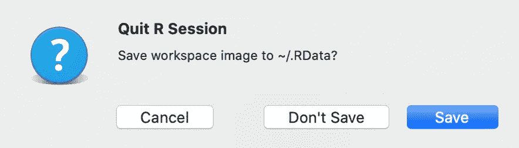
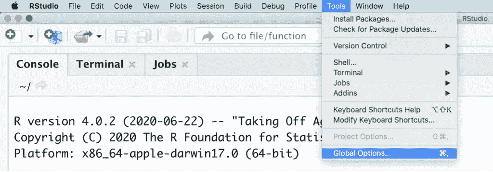

# 如何在 R 中删除你保存的工作空间

> 原文：<https://towardsdatascience.com/how-to-delete-your-saved-workspace-in-r-699c45c3304a?source=collection_archive---------27----------------------->

## 清理你无法摆脱的工作空间

当您退出 RStudio 时，您会看到一个弹出窗口，询问“将工作区图像保存到~/。RData？”如果你不确定，你可能会选择**保存**。毕竟，它*是*的默认。另外，储蓄是好事。对吗？

退出 R 会话弹出窗口。图片作者。

嗯……这要看情况。下次加载 RStudio 时，工作区(全局环境)中的所有内容都将保持原样。如果将数据加载到 R 中花费了很长时间，那么这就太棒了。不用再经历那个繁琐的过程了！*唷！*

但是如果，相反，你有一堆你不想再看到的无用的垃圾呢？你可能会想，*好吧，我就清空我的工作空间，继续工作。只是这一次，在我 R 会话结束的时候，我会点击* ***不保存*** *。没什么大不了的！*

下一次你加载 RStudio 时，那个你以为已经删除的讨厌的工作区将会恢复到以前的辉煌。你再试试——清除，退出，**不保存**，加载。*等等，什么？？？*这次- rm(list = ls())，退出，**不保存**，加载。但是……为什么？！

[JESHOOTS.COM](https://unsplash.com/@jeshoots?utm_source=unsplash&utm_medium=referral&utm_content=creditCopyText)在 [Unsplash](https://unsplash.com/s/photos/computer-frustrated?utm_source=unsplash&utm_medium=referral&utm_content=creditCopyText) 上拍照。

通过保存工作空间，R 将全局环境保存为。RData 文件。每次启动 R 时，这些文件都用来恢复您的工作区。删除您的工作环境实际上并不会删除。RData 文件-它们还在那里。这就是为什么你可以清空你的工作空间，以为它永远消失了，却发现它在你下次启动 r 时又弹出来了。

# 清理你无法摆脱的工作空间

如果你发现自己有这个问题，不要担心！这里有一个解决方案。事实上，不止一个！快速而肮脏的选择是清空你的工作空间，退出，然后选择**保存**。这一次，R 将保存一个空的工作区，下次重启 R 时将重新加载它。

第二个选项是运行:unlink(。RData”)。这实际上不会删除您的环境，但会删除保存的。RData 文件。如果没有保存的文件，启动时就没有任何东西可以加载。只要确保不要再点击**保存**，否则你就只能写新的了。RData 文件，您必须再次删除它们。

# 调整您的设置

如果您认为自己近期内不需要保存工作区，那么您可能希望 R 停止询问这个问题。这可以通过**全局选项**菜单的**常规**选项卡进行更改。要导航到**全局选项**菜单，从 RStudio 的菜单栏中选择**工具**(位于最顶端)。**全局选项**可以在**工具**菜单的最底部找到。

查找全局选项菜单。图片作者。

点击**全局选项**后，会出现一个*选项*框。在**常规**选项卡下，您应该会看到一个**工作区**部分。如果你有。RData 文件，但不希望每次启动 R 时都加载它们，可以取消选中“Restore”旁边的复选框。启动时将数据存入工作区。或者，如果您不想在关闭 RStudio 时保存您的工作空间，请从“保存工作空间至”旁边的下拉菜单中选择**从不**。出口处的 RData。既然 R 知道了你的偏好，它就不会再问你是否愿意保存了！

选项框。图片作者。

有了这些解决方案，希望您保存的工作空间将一去不复返。再见**永不**，工作区！👋

*原载于 2021 年 6 月 17 日*[*https://thatdarndata.com*](https://thatdarndata.com/how-to-delete-your-saved-workspace-in-r/)*。*