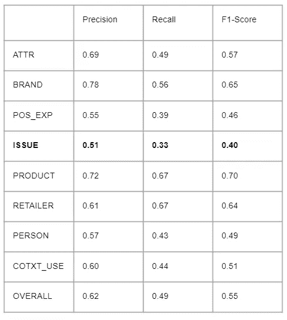

# 如何交付人工智能管道

> 原文：<https://towardsdatascience.com/how-to-deliver-an-ai-pipeline-9c6fbfc29d3b?source=collection_archive---------18----------------------->

## [实践教程](https://towardsdatascience.com/tagged/hands-on-tutorials)

## 一步一步，从想法到生产

通往完整数据管道的道路漫长而曲折。由[罗迪翁·库察耶夫](https://unsplash.com/@frostroomhead?utm_source=medium&utm_medium=referral)在 [Unsplash](https://unsplash.com?utm_source=medium&utm_medium=referral) 上拍摄的照片

人工智能市场正处于成长期。在[建模](https://www.oreilly.com/library/view/machine-learning-design/9781098115777/)和[工程](https://cloud.google.com/architecture/mlops-continuous-delivery-and-automation-pipelines-in-machine-learning)中，技术栈正在成熟，过程正在成形。这确实是一个成为数据科学家/工程师的美好时代:乘着早期的浪潮，帮助创建其他人将在未来几十年遵循的模式。每个人都提出了自己的解决方案来部署他们的 ML 特性。

本文旨在通过一个直接来自烤箱的真实示例，对我们的项目流程进行演练，重点关注数据科学/工程流程。我们希望你能挑选一些我们使用的技术，并将它们整合到你自己的队伍中！

# 蓝图

在进去之前，我们需要讨论一下过程本身。人工智能项目的实施涉及三个主要的能力层次:**数据科学**、**数据工程**和**前端**。

我们人工智能特征过程的蓝图。图片作者。

一切从一个**想法**开始。公司里的某个人有了灵感，这种火花被写进了一份文件，用通俗易懂的语言重新开始。数据科学团队将该文档编译成一个**摘要**，展示我们如何解决该问题并执行它。我们的前端团队可以开始创建**实体模型**，让我们的利益相关者体验一下这个抽象的特性会是什么样子。这种快捷方式使得证明特性的影响更加容易。

该摘要然后被用作**临时分析**的基础，自由式建模以测试和证明该抽象想法有价值。Jupyter 和 Excel 表格比比皆是。在这个阶段，没有什么是一成不变的，也没有什么是合理设计的，因为在处理 ML 时，自由是创新的关键。

如果临时分析成功，我们将继续进行**概念验证**阶段。这是将前一阶段找到的解决方案工程化的第一步:代码将尽可能接近具有适当封装和质量的产品代码。它可以被认为是我们管道内模型的试驾，调整后视镜和座椅角度。与此同时，我们的数据工程团队开始绘制它在我们当前架构中的样子，**计划 PoC 如何进入我们的管道。**

概念证明经过适当的测试和评估后，我们让数据科学团队去从事其他项目。现在，数据工程将开始将 PoC 的**集成到管道**，前端团队可以使用 PoC 的输出来创建**真实数据原型**。

两个团队都准备好了，是时候将所有东西整合到最终产品中了。我们用**生产原型**测试它，然后通过**淘汰旧版本**来确认它。*瞧。*

现在，让我们看看这个过程是如何在一个新的命名实体识别特性上工作的！

# 这个想法

我们仪表板的一个基本块是**方面分析**。我们从非结构化的用户生成的文本内容中提取代表产品或服务属性的实体，从句子中提取它们的相对情感，并使用我们的定制分类法对它们进行汇总。

方面术语“崩溃”和“视频”被提取为方面，然后被分类为负面的。与问题相关的术语通常是负面的。图片作者。

这种类型的分析是非常细粒度的:方面通常由 1-3 个标记组成。我们没有得到问题的全部背景:我们提取了问题的核心(**崩溃**)和根源(**视频**)。

所以，解决的办法是立刻识别和提取整个东西。

提取整个句子。图片作者。

有了这个想法，我们创建了一个**抽象**，它将列出我们可以选择的可能路径。我们当前的抽象写作策略使用 [RFC](https://en.wikipedia.org/wiki/Request_for_Comments) 结构作为指导我们开发过程的一种方式。如果你熟悉史诗/故事/任务抽象，你可以把它比作一部史诗，增加详细的描述和冗长的解释。

我们一个 RFC 的标题。摘要由多个队友审阅，人们在文本中进行评论，内容随着异步输入而不断发展。图片作者。

<https://github.com/rust-lang/rfcs>  <https://www.infoq.com/news/2017/12/react-rfc-process/>  

我们的 RFC 有一个特定的结构:

*   **待解决问题的背景**；
*   **问题**定义；
*   **提出的解决方案**以及架构/建模建议**；**
*   **所解决问题的成本和收益**；
*   **成功的定义**描述 RFC 实现结束时产生的工件。

这个特定想法的(非常)简短的 RFC 如下所示:

> **背景**:方面太细，不能识别关于特定问题的上下文短语。
> 
> **目标**:从句子中提取问题(代表用户在使用产品时遇到的问题的多标记字符串)。
> 
> **可能的解决方案**:自定义 NER，使用 spacy | Tensorflow | PyTorch、gensim Phraser，后跟分类器、语法分析，找到问题的根源。
> 
> **成本和收益:**一个月用于模型开发，另一个月用于管道集成和原型开发。两名数据科学家，一名工程师和一名前端开发人员。
> 
> **成功的定义**:将提取器集成到管道中，分析结果显示在最终产品中。

## 验证标准

有了目标，我们开始计划如何实现。在项目进行到一半时，我们如何知道我们“足够好”呢？或者“到达那里”实际上是否可行？像这样的探索性任务可能需要几个月的来回互动，测试新的想法，提出新的问题和新的解决方案…突然你陷入了一个循环，甚至忘记了项目的意义。

设定一个停止探索问题并继续前进的期限是必要的。在这个想法探索阶段之后，我们应该很好地掌握我们需要考虑的变量。我们需要有标签的数据吗？多少钱？有我们可以使用的实现模型吗？类似项目的绩效如何？

验证阶段是 RFC 创建过程的一部分:在进入 ML 模型的本质之前，作者必须考虑项目的**截止日期**和**完成的定义**。一个简单的时间盒将帮助团队相应地安排任务，交付的定义将指导您的工作。

我们在这里做的是以产品为中心的交付:我们对成功的定义是将*问题提取器集成到我们当前的管道中，并在最终产品*中显示分析结果。没有准确性，没有度量，没有绒毛。这意味着我们对架构本身的创建感兴趣，而不是增强一个模型。

下面有一个关于数据项目管理的有趣阅读链接。*最佳 Scrum 实践*部分有一些关于项目边界的信息。

<https://neptune.ai/blog/data-science-project-management-in-2021-the-new-guide-for-ml-teams>  

# 即席建模

自由式建模:只是一个(关键)板和一个梦想。照片由[雅各布·本辛格](https://unsplash.com/@jacobbentzinger?utm_source=medium&utm_medium=referral)在 [Unsplash](https://unsplash.com?utm_source=medium&utm_medium=referral) 上拍摄

RFC 获得批准，我们开始开发土地。第一站是*特别建模*:在我们通常的架构之外的建模工作，可以使用任何可用的工具来快速交付明显的结果。对于一些公司来说，这是通常的数据科学工作的范围，由软件和数据工程师来实现。

我们采用 OSEMN 框架来管理流程的这一步:**获取、清理、探索、建模、解释**。此即席分析的输出将是一个问题提取模型，其中包含一份关于提高其准确性和召回率的可能方法的报告。

</5-steps-of-a-data-science-project-lifecycle-26c50372b492>  

让我们在项目的背景下讨论这些阶段。

*   **获取:**我们的输入是用户生成的数据。由于我们已经有了一个电子商务用户评论的数据库，我们不需要原始信息来源…但我们需要手动标记句子以找到问题子串。为此，我们采用[**Prodigy**](https://prodi.gy/)**作为我们的标注工具，并定义一组评论，这些评论将被注释以生成我们的训练数据集。**

****

**Prodigy 命名实体注释器。注意实体之间的重叠:一个问题可能涉及一个产品特性。图片作者。**

*   ****擦洗**:因为我们的数据在注释之前已经被适当地擦洗了，所以我们不需要在这里做太多。我们可以将数据集一分为二，通过类型来分隔实体，或者使用某种相似性度量来丢弃过于相似的句子。**
*   ****探索**:我们正在钻研数据，手动分析带注释的句子以及自动化的 EDA。在我们的数据集中，最简单(也是最重要)的度量是实体类型的平均标记数:这个度量显示了实体的语义复杂性。这将是我们任务难度的代理标准。**

****

**我们选择的探索性指标。请注意，发行的令牌数很高，而零售商和个人实体的发生率很低。图片作者。**

*   ****模型**:我们需要**用一个命名实体识别器提取具有 5+令牌的发行实体**。为了做到这一点，我们使用了 [spaCy EntityRecognizer 模型](https://spacy.io/api/entityrecognizer),它是用我们之前注释的数据训练的。这个分类器的主干是 [en_core_web_trf](https://spacy.io/models/en#en_core_web_trf) 预训练模型，一个基于 RoBERTa 的转换器。**

****

**只需将您的数据输入训练脚本，并更改配置来训练自定义空间管道。[来源。](https://spacy.io/usage/training)**

**<https://www.machinelearningplus.com/nlp/training-custom-ner-model-in-spacy/>  

# 模型分析

咻。经过所有这些步骤，我们终于有了一个工作的 NER 模型。现在，让我们看看指标！

哦…有点低，不是吗？0.15 F1——分数只是让人心灰意冷。图片作者。

指标非常低。分数与每种类型的实体的平均令牌数负相关:问题和正面体验(POS_EXP)是具有最高令牌数和最低分数的实体。

但是我们从问题提取结果中看到了有趣的词云。很明显*某些东西*被提取出来了，但是我们的度量标准没有察觉到那个价值。

发布笔记本电脑评论词云。这里有很多有用的信息:重启、无响应、关机。

问题提取器的问题不在模型，而在评估:正常的评分方法依赖于**严格匹配**，其中提取的实体必须与注释的实体相同。这意味着以下提取将被视为完全失败:

> 句子:笔记本电脑开始不断重启。
> 注释:开始不断重启
> 提取:不断重启

粒子“*不断重启*”是问题的核心。即使我们没有实体的完整上下文，我们仍然可以挽救它！我们知道许多评论都引用了关键词“*重启*”，帮助生产特定笔记本电脑的品牌识别问题。

因此，我们需要将我们的度量从**严格**转移到**部分**，使部分匹配计入与注释实体外观成比例的总得分。

现在好多了，0.15 到 0.40。不是最好的，但是可以用！

这里的寓意是**指标讲故事**。有时候，一个指标向您描述的故事并不是数据想要讲述的故事！模型输出的临床分析总是很重要的，并且永远不应该被忽视。

有时，即使一个被认为*坏了*的模型也能给你的客户带来巨大的价值。

# 建筑规划

图片作者。

特别分析阶段的结论是，该功能有前途。这将以某种方式在最终产品中表现出来，并且由工程团队来组织将新创建的 ner 模型集成到我们当前架构中的方式。我们不会等待数据科学团队的另一次迭代来提高分数:讨论从基线建立的那一刻开始。没有概念的证明是有影响的，除非它是具体的！

一个新特性的架构应该遵循这三个原则:

*   首先，它必须足够模块化，这样升级就容易了。如果您以类似于微服务的方式集成数据丰富管道，并在数据实体之间保持合理的分离级别，就可以做到这一点。
*   第二，它应该**符合**先前的架构决策。只有在绝对需要的情况下，新特性才应该引入新的架构格式，我们的目标是降低复杂性和不确定性。
*   第三，它应该考虑一些基本的**可观察性**指标。在新部署生成的不断扩大的待办事项列表中，很容易忽略可观察性。在项目的早期阶段，准备适当的日志和度量要容易得多。

本质上，这就是 MLOps:一组良好的实践，引导模型从概念到产品。

</ml-ops-machine-learning-as-an-engineering-discipline-b86ca4874a3f>  <https://www.coursera.org/learn/mlops-fundamentals>  <https://thechief.io/c/editorial/top-10-open-source-mlops-tools/>  

所以，回到退出计划。在 [birdie.ai](https://medium.com/u/7774c8644bd4?source=post_page-----9c6fbfc29d3b--------------------------------) 这里，我们有一些预先存在的架构来运行我们的数据丰富过程，大量使用 AWS 基础设施。我们需要选择一个脚手架来执行新的模型。

AWS Lambda +阶跃函数数据处理流水线。图片作者。

第一种模式涉及 AWS Lambdas 和 Step 函数，通过不需要重型机器的浓缩函数来处理大量数据。点火函数从 Athena 数据库中检索数据，并将其发送到一个队列。这个队列由一个单独的 Step 函数或 Kubernetes 服务使用，通过一个带有拼花压缩和适当的 Hive 分区的 Firehose 流将结果发送给 S3。可以使用 Athena 表来研究结果。Lambda 通过 Cloudwatch 日志密切控制，cloud watch 日志是一种字典，其中包含关于每个 Lambda/Step 函数执行的格式化信息。

问题是，我们用的是变形金刚模型。我们将需要 GPU 驱动的机器，而 Lambda 不适合它。Kubernetes 服务将是云不可知的，并允许我们使用 GPU 机器，但我们需要更多的努力来实现这种方法的可观察性:也许可以将一名 Kubernetes 专家带到公司，或者花一些时间来开发一些基本的集群性能分析。

来自 S3 触发器管道的 AWS 批处理作业。图片作者。

我们的第二种模式依赖于由 S3 文件插入触发的 AWS 批处理作业。每当一个拼花文件进入 S3 存储桶时，就会触发一个批处理作业来读取该文件，并对其行进行某种类型的处理，然后将结果迭代地存放到一个 Firehose 流中。脚本的复杂性抵消了流水线的简单性:批处理作业必须经过适当的多重处理，才能使用机器的所有处理能力。

它非常符合我们的需求！AWS 批处理作业可以为我们的功能带来 GPU 的全部功能，而不会给我们当前的管道增加太多复杂性，我们的一个方面提取管道使用 SpaCy 命名实体识别模型从评论中提取产品属性。我们可以改变它的用途，以使用新的问题提取模型。

我们的游戏计划现在正致力于重组我们之前的一个管道来执行问题提取。这意味着如果数据科学团队交付一个经过测试的、可扩展的推理代码，开发时间将从几天缩短到*小时*。

<https://analyticsindiamag.com/why-data-scientists-should-follow-software-development-standards/>  <https://bigdata-madesimple.com/how-software-engineers-and-data-scientists-can-collaborate-together/>  

# 前端原型

现在，我们有了一个模型和一个架构，以一种可扩展的、可观察的方式交付那些推论…但是如何向我们的客户展示这个特性呢？

在这里的 [birdie.ai](https://medium.com/u/7774c8644bd4?source=post_page-----9c6fbfc29d3b--------------------------------) ，我们对用户生成内容的见解是通过网络仪表盘传达的。这些仪表板由不同的开发人员管理，这些开发人员由数据分析师和前端工程师组成，不受数据科学家和工程师的控制。

这并不是说数据和产品之间存在不可逾越的鸿沟，因为我们参与了产品发现、影响和价值讨论:我们脱离了后端和前端应用程序开发，专注于数据结构化。

数据科学团队的重点随着公司的目标而转移。图片作者。

一些产品和公司不需要前端，直接从数据分析师收集的报告中提供见解。在这些情况下，数据小组可能需要执行仪表板操作，并测量与用户相关的指标。你可以说这些公司是*前装*。相比之下，更关注数据获取、丰富和架构的公司是*后装*。

我们能够使用 [Tableau](https://www.tableau.com/) 快速制作一个连接到产品分析仪表板的工作原型。将 Tableau 仪表板连接到 HTML 页面真的很容易！

<https://www.zuar.com/blog/embedded-analytics-how-to-embed-tableau-dashboards-into-a-web-page/>  

使用 Tableau 的原型问题浏览器。我们建立了一个问题类型的层次结构，可以在多个级别进行分析:*图像质量组*包含艺术模式、亮度差和颜色组；亮度差包括所有涉及亮度或太暗的问题。图片作者。

这些是从特定品牌的电视评论中提取的问题，我们已经可以看到关于音频、亮度和内置应用程序商店的投诉。我们评论基数的一小部分，范围在几亿。我们希望这将是营销分析师的一个方便的温度计，给他们用户最关心的问题。

这个特性掌握在我们能干的前端工程师和他们的 HTML 魔法手中。数据科学团队正在升级我们的 NER 模型，工程团队则负责管道指标。我们正处于流水线的最后一步:完全集成特性的交付。很高兴看到一个想法从开始到结束被执行，并有客户的反馈和兴趣。

我们希望这次通过我们的方法的旅行能在您的数据之旅中帮助您！

*感谢*[*joo Augusto Leite*](https://medium.com/u/b746975c285f?source=post_page-----9c6fbfc29d3b--------------------------------)*共同撰写这篇文章，并在《贸发会议联系 2021》中作为数据专题讲座发表！***