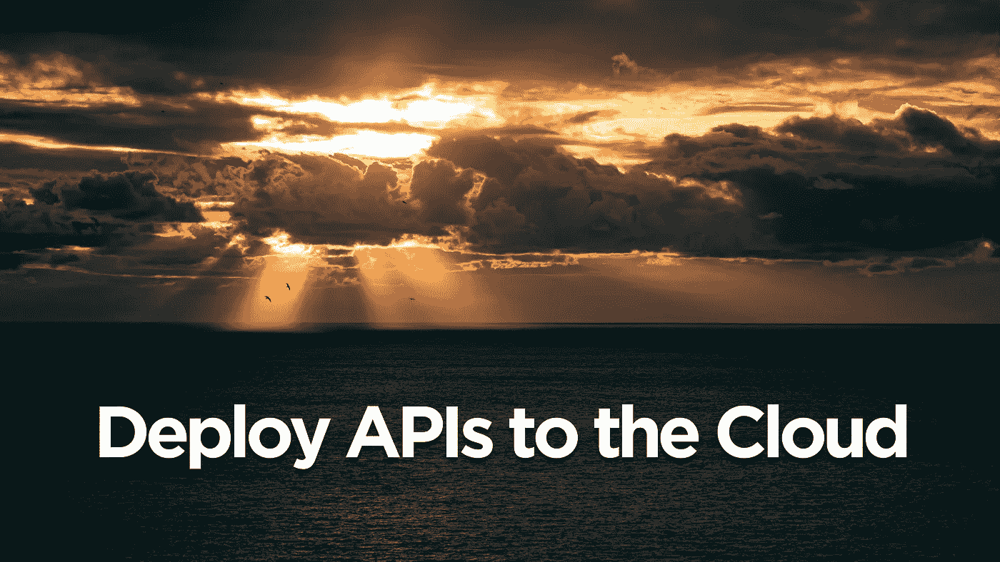
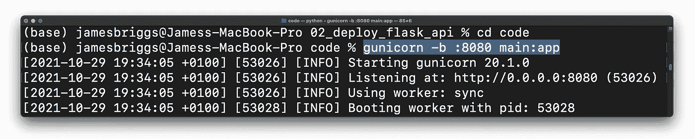
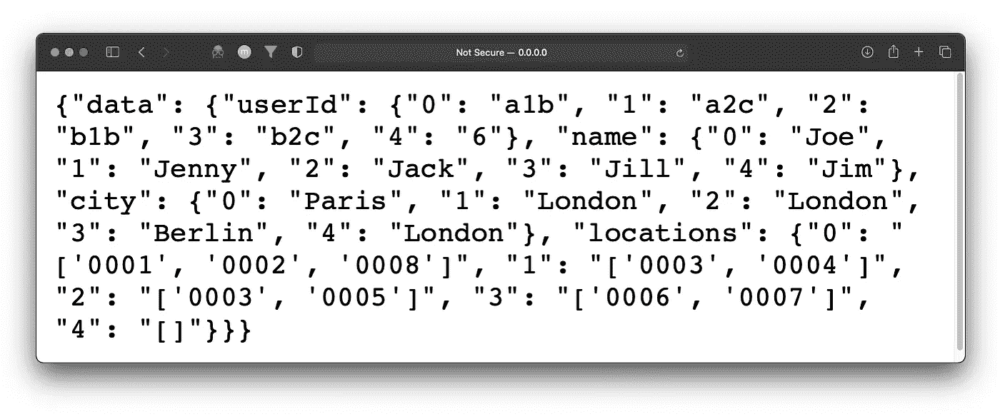
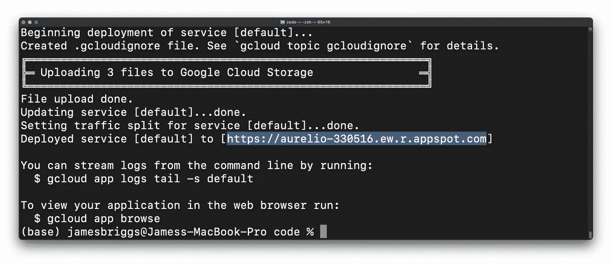
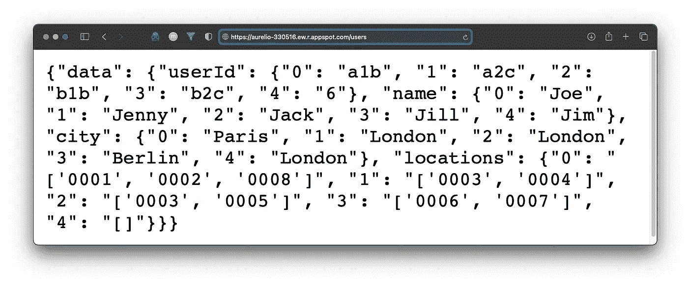

# 如何部署 Flask API

> 原文：<https://towardsdatascience.com/how-to-deploy-a-flask-api-8d54dd8d8b8a?source=collection_archive---------10----------------------->

## 将您的 API 部署到 Google 云平台



图片由[费德里科·布尔加拉西](https://unsplash.com/photos/wUpZ5Zz0j5U)在 [Unsplash](https://unsplash.com) 上拍摄

对我们许多人来说，构建第一个 API 是创建有影响力的工具的重要一步，这些工具有一天可能会被许多开发人员使用。但是这些 API 通常不能在我们的本地机器上使用。

幸运的是，部署 API 非常容易。假设你不知道你现在在做什么——你可能会在 10 分钟左右部署你的第一个 API。

我没开玩笑，超级简单。让我们开始吧。

# 在开始之前

有几个先决条件。这些可能会让你稍微超过 10 分钟，但我保证不会花很长时间！我们将使用谷歌的云服务来部署我们的 API，即**G**oogle**C**loud**P**platform(GCP)。

你将需要输入帐单细节，但如果这是你第一次上 GCP，你会得到几百💲免费学分的价值。如果你想避免任何账单，确保你在完成后删除了你的项目。

1.  注册 GCP 并[选择/创建一个项目](https://console.cloud.google.com/projectselector2/home/dashboard?_ga=2.9007292.829658442.1635520205-902753230.1635520205&_gac=1.162388558.1635526977.Cj0KCQjwt-6LBhDlARIsAIPRQcImvYqadd7aakkSFF0wgfo3517SegxkyULOMH9zO0QyWyjACCv9GXgaAuQ2EALw_wcB) —记下项目名称。
2.  启用计费
3.  启用[云构建 API](https://console.cloud.google.com/flows/enableapi?apiid=cloudbuild.googleapis.com&_ga=2.46560686.829658442.1635520205-902753230.1635520205&_gac=1.220724586.1635526977.Cj0KCQjwt-6LBhDlARIsAIPRQcImvYqadd7aakkSFF0wgfo3517SegxkyULOMH9zO0QyWyjACCv9GXgaAuQ2EALw_wcB) 。
4.  安装并初始化[云 SDK](https://cloud.google.com/sdk/docs/install) 。

*初始化后，您可能需要选择之前创建的项目。*

## 应用引擎初始化

我们将使用 GCP 应用引擎服务来部署我们的 Flask API。要使用它，我们需要将 App Engine 添加到我们选择的项目中，然后安装 Python 的 App Engine 扩展。

从您选择的提示窗口中，我们使用项目名称(使用*您的*项目名称)创建一个新的 App Engine 应用程序，并选择一个地区。

```
gcloud app create --project=*aurelio-330516*
```

然后，我们安装 Python 的 App Engine 扩展:

```
gcloud components install app-engine-python
```

现在，我们已经具备了将我们的 API 部署到 GCP 的应用引擎所需的所有先决条件。让我们继续讨论 Flask API 本身。

# 准备和部署

在盲目地将我们的 API python 脚本扔向 GCP 的应用引擎并抱最好的希望之前，我们应该确认它是可行的。我们可以通过模拟应用引擎环境来做到这一点，但首先，我们需要一个 API。

我将使用这个 API 脚本。它并没有做什么特别有趣的事情，但是它很简单，因此对我们的例子很有用。你可以在这里看到[我是如何构建它的](/the-right-way-to-build-an-api-with-python-cd08ab285f8f)。

除了 API 脚本`main.py` —您还需要包含一个`./data`目录，其中包含两个文件 [*users.csv*](https://gist.github.com/jamescalam/0664905a2fca217e525489f54e032b2b) 和[*locations . CSV*](https://gist.github.com/jamescalam/2f9d8fef39d49a3ae15d68005c5ecf59)。总之，这意味着我们有一个如下所示的单一目录:


API 目录结构— *作者的图像(和所有其他图像)。*

*回到模拟*。为了模拟 App Engine 环境，我们将使用`gunicorn`来运行一个本地**W**EB**S**server**G**ateway**I**interface(WSGI)服务器。在此之前，您可能需要`pip install gunicorn` —然后，在相同的环境中，我们运行 API:



API 服务器的初始化。

然后我们可以前往`http://0.0.0.0:8080/users`。如果 API 按预期运行，我们应该会看到一个小的 JSON 响应，如下所示:



浏览器中的 API 响应。

Gunicorn 正在使用*我们的 Python 环境*——所以我们在`main.py`脚本顶部导入的库已经安装好了。我们也知道我们正在使用(在我的例子中)Python 3.8。

当我们将 API 部署到 GCP 时，这是一个问题。App Engine 将*不知道*我们需要使用这些包，也不知道我们正在使用 Python 3.8。因此，我们必须在目录中再添加两个文件:

*   `requirements.txt`将包含一个 Python 包列表，供 App Engine 安装。
*   `app.yaml`将运行时设置为使用 Python 3.8。

这些文件将如下所示:

这就是我们所需要的。现在，我们通过在包含所有文件的目录中运行`gcloud app deploy`来进行部署。这需要一点时间来部署，之后我们应该会看到我们部署的 API 的 URL！



部署详细信息，突出显示的是 API 网址。

前往该 URL，后跟`/users`端点，将返回我们之前看到的相同的 JSON 对象:



来自云托管版本的 API 响应。

这意味着我们的 API 已经启动并正在运行，我们可以像对待任何其他 API 一样发出请求了！

这就是使用 GCP 的应用引擎部署 Flask APIs 的快速演练。

我希望你喜欢它！如果你有任何问题，请通过[推特](https://twitter.com/jamescalam)或在下面的评论中告诉我。如果你想要更多这样的内容，我也在 [YouTube](https://www.youtube.com/c/jamesbriggs) 上发布。

感谢阅读！

[🤖《变形金刚》NLP 课程 70%的折扣](https://bit.ly/nlp-transformers)

**除另有说明外，所有图片均出自作者之手*