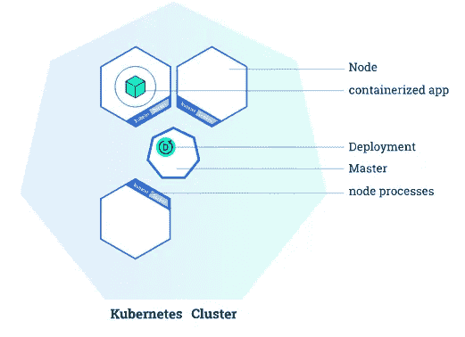
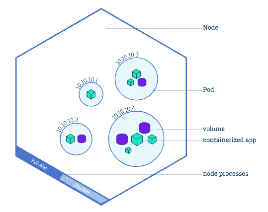
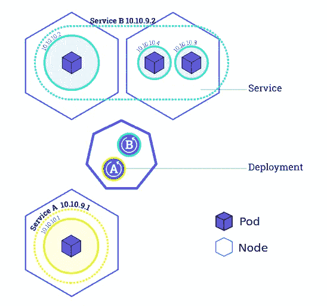
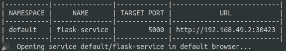

# 如何在 Kubernetes 中部署 Flask API 并将其与其他微服务连接

> 原文：<https://towardsdatascience.com/how-to-deploy-a-flask-api-in-kubernetes-and-connect-it-with-other-micro-services-af16965b67fe?source=collection_archive---------1----------------------->

## [实践教程](https://towardsdatascience.com/tagged/hands-on-tutorials)

## 关于如何使用强大的容器编排工具 Kubernetes 实现微服务架构的实践教程。

Kubernetes 是一个强大的容器编排工具，它自动化了[容器](https://www.docker.com/resources/what-container)的部署和管理。如果您有一个包含一种服务的简单轻量级应用程序，就不要使用 Kubernetes 了。如果您的应用程序有一个由几个组件协同工作的[微服务](https://microservices.io/)架构，那么 Kubernetes 的优势就会显现出来。它是一个用于自动化部署、扩展和管理容器化应用程序的“开源系统”,具有多种优势，包括:

*   基于需求的简单(自动)扩展
*   通过分配工作负载，使您的应用程序在部分故障的情况下仍能正常工作，从而使应用程序具有容错能力
*   自动化运行状况检查和自我修复流程
*   负责微服务之间的通信，并在所有资源上平衡传入流量

一开始从 Kubernetes 开始可能会令人望而生畏，但是如果你掌握了它的主要概念，并在官方网站上使用了优秀的教程，你会很容易上手。

在这篇博客中，我将:快速概述 Kubernetes
2 的主要概念。演示如何启动您自己的本地集群
3。在您的集群上部署 MySQL 数据库
4。设置一个 Flask 应用程序，作为 REST API 与数据库通信

网络。照片由 [Alina Grubnyak](https://unsplash.com/@alinnnaaaa?utm_source=unsplash&utm_medium=referral&utm_content=creditCopyText) 在 [Unsplash](https://unsplash.com/s/photos/network?utm_source=unsplash&utm_medium=referral&utm_content=creditCopyText) 上拍摄

# **Kubernetes 基础知识**

在这一节中，我将介绍 Kubernetes 的基础知识，但没有太多的细节；请阅读官方文档，深入了解。

Kubernetes 集群由一个**主节点**和一个或多个**工作节点组成。**这种建筑是 Kubernetes 的主要特色之一。正如您将看到的，您的微服务分布在不同的节点上，因此如果其中一个工作节点出现故障，它们将保持健康。**主机**负责管理集群，并公开 API，您可以通过该 API 与集群进行通信。默认情况下， **worker nodes** 带有一些组件，包括一些预安装的软件，这些软件支持运行流行容器服务的容器，如 *Docker* 和 *containerd。*

在 Kubernetes 集群上部署自己的应用程序有三个基本概念:*部署、Pods 和服务。*

*   一个*部署*是提供给**主**关于如何创建和更新你的应用的一组指令。有了这些指令，**主**将在各个**工作节点**上调度并运行你的应用。部署由**主**持续监控。如果您的应用程序的一个实例关闭(例如，如果一个**工作节点**关闭)，它将被一个新的实例自动替换。

带有部署的 Kubernetes 集群(来源:[https://kubernetes . io/docs/tutorials/kubernetes-basics/deploy-app/deploy-intro/](https://kubernetes.io/docs/tutorials/kubernetes-basics/deploy-app/deploy-intro/))

*   一个 *Pod* 是 Kubernetes 平台内的原子单位。它代表一组一个或多个容器以及这些容器的一些共享资源(共享存储、唯一的集群 IP 地址等。).如果您创建了一个*部署*，这个部署将创建*容器*，其中包含容器。每个 *pod* 绑定到一个**工作节点**。重要的是要理解一个**工作者节点**可以有多个*pod、*，如果当前**工作者节点**失败，所有这些 pod 将在不同的可用**工作者节点**上重建。

带有几个窗格的**工作节点**的概述(来源:[https://kubernetes . io/docs/tutorials/kubernetes-basics/explore/explore-intro/](https://kubernetes.io/docs/tutorials/kubernetes-basics/explore/explore-intro/))

*   一个*服务*基本上定义了一组*pod*的逻辑集合，并定义了如何访问它们的策略。这是必要的，因为*pod*可以关闭并重启(例如，如果**工作节点**被删除或崩溃)。一个*服务*在一组 pod 之间路由流量，并允许 pod 在不影响您的应用程序的情况下死亡和复制。定义服务时，您可以指定服务的类型。默认情况下，Kubernetes 创建一个 ClusterIP 服务，这使得您的*服务*只能从集群内部访问。你可能想向外界公开你的一些*服务*(例如前端)。在这种情况下，您可以创建一个*负载平衡器*服务，该服务创建一个外部负载平衡器并为其分配一个固定的外部 IP，因此可以从集群外部访问它(例如在您的浏览器中)。

一个集群有 3 个**工作节点**，几个 pods 和两个绑定在一起的服务(A & B)(来源:[https://kubernetes . io/docs/tutorials/kubernetes-basics/expose/expose-intro/](https://kubernetes.io/docs/tutorials/kubernetes-basics/expose/expose-intro/))

# **开始使用您自己的集群**

如果你想让你的集群快速工作:这个博客中的所有代码(和一个解释性的自述文件)都可以在这里找到。我们将要构建的应用程序由两个微服务组成。MySQL 数据库
2。一个 Flask 应用程序，它实现了一个 API 来访问和执行数据库上的 CRUD(创建、读取、更新和删除)操作。

> **先决条件** : *已经安装了*`*kubectl*`*`*minikube*`*(*[*【https://kubernetes.io/docs/tasks/tools/】*](https://kubernetes.io/docs/tasks/tools/)*)。并确保您的* Docker CLI *通过命令* `*eval $(minikube docker-env)*` *在您的集群中使用* Docker 守护程序*。不用担心:如果你重启你的终端，你会自动再次使用你自己的* Docker 守护进程*。最后通过命令* `*minikube start*` *启动您的本地集群。**

*首先:当建立一个 MySQL 数据库时，我们需要考虑两件事。1)要访问数据库，我们需要配置一些凭据；2)我们需要一个持久的数据库卷，以便在节点意外关闭时不会丢失所有数据。*

# ***创造秘密***

*Kubernetes 有自己的方法来处理你的敏感信息，通过配置 Kubernetes *的秘密。这可以用一个简单的 YAML 文件来完成。这些*秘密*可以由集群中的任何 *pod* 通过指定环境变量来访问(我们将在后面看到)。*机密*应该指定为 **base64 编码的**字符串。所以首先我们必须通过你的终端得到你的密码的编码版本:`echo -n <super-secret-passwod> | base64`。复制输出并将其嵌入到下面的`db_root_password` 字段的 *secrets.yml* 文件中。 *metadata.name* 字段很重要，因为我们必须在稍后的阶段指定它，所以一定要记住它**

*你现在可以通过你的终端`kubectl apply -f secrets.yml`将秘密添加到你的集群中。并通过`kubectl get secrets.`检查秘密，看看是否有效*

# ***持久卷***

*持久卷是一种生命周期独立于 *Pod* 的存储资源。这意味着如果一个*箱*关闭，存储将继续。由于 Kubernetes 拥有在任何时候重启 *pods* 的权限，所以将数据库存储设置为*持久卷*是一个很好的做法。*持久卷*可以是本地文件系统上的目录，也可以是云提供商的存储服务(例如 AWS 弹性块存储或 Azure 磁盘)。在创建*持久* *卷时，可以指定*持久卷*的类型。*在本教程中，您将使用一个 *hostPath* 类型，它将在您的 *minikube* 节点上创建一个卷。但是，请确保在生产环境中使用另一种类型([参见文档](https://kubernetes.io/docs/concepts/storage/persistent-volumes/#types-of-persistent-volumes))，因为如果在使用 *hostPath* 类型时删除 minikube 节点，您的数据将会丢失。*

*让您的应用程序使用由两部分组成的*持久卷*:
1。指定*卷*的实际存储类型、位置、大小和属性。
2。指定一个*永久卷声明*，为您的部署请求永久卷的特定大小和访问模式。*

*创建一个 *persistent-volume.yml* 文件，并指定文件的大小(在本例中为 2GB)、访问模式和存储路径。`spec.persistentVolumeReclaimPolicy`指定如果*持久卷声明* 被删除，应该做什么。对于像 *MySQL* 数据库这样的有状态应用程序，如果声明被删除，您希望保留数据，这样您就可以手动检索或备份数据。默认回收策略继承自*持久卷的类型*，因此最好总是在 yml 文件中指定它。*

*同样，您可以通过`kubectl apply -f persistent-volume.yml`添加存储。并通过`kubectl describe pv mysql-pv-volume`和`kubectl describe pvc mysql-pv-claim`查看您创建的资源的详细信息。由于您制作了一个主机路径类型*持久卷*，您可以通过登录 minikube 节点`minikube ssh` 找到数据，并导航到指定的路径(`/mnt/data`)。*

# ***部署 MySQL 服务器***

*有了我们的秘密和持久卷(claim ),我们就可以开始构建我们的应用程序了。首先我们将部署一个 *MySQL* 服务器。拉最新的 *mysql* 镜像`docker pull mysql`并创建 *mysql-deployment.yml* 文件。这个文件有几个值得一提的地方。我们指定只旋转一个 pod ( `spec.replicas: 1`)。部署将管理所有标签为由`spec.selector.matchLabels.app: db`指定的`db`的 pod。`template`字段及其所有子字段指定了 *pod 的特征。*它将运行镜像 *mysql，*也将被命名为 *mysql* ，并在`flaskapi-secrets` *secret* 中查找 db_root_password 字段，并将该值设置为`MYSQL_ROOT_PASSWORD`环境变量。此外，我们指定容器公开的端口，以及应该将哪个路径安装到持久卷`spec.selector.template.spec.containers.volumeMounts.mountPath: /var/lib/mysql`。在底部，我们还指定了一个名为 mysql 的`LoadBalancer`类型的服务，这样我们就可以通过这个服务访问我们的数据库。*

*现在可以用`kubectl apply -f mysql-deployment.yml`部署 MySQL 服务器了。并通过`kubectl get pods`查看 pod 是否正在运行。*

# *创建数据库和表*

*在实现 API 之前，我们必须做的最后一件事是在 MySQL 服务器上初始化数据库和模式。我们可以使用多种方法做到这一点，但是为了简单起见，让我们通过新创建的*服务来访问 MySQL 服务器。*由于运行 MySQL *服务*的 pod 只能从集群内部访问，因此您将启动一个临时 pod 作为`mysql-client` :
1。通过终端`kubectl run -it --rm --image=mysql --restart=Never mysql-client -- mysql --host mysql --password=<your_password>`设置`mysql-client`。填写您在 *secrets.yml* 文件中指定的(解码)密码。
2。创建数据库、表和模式。你可以做任何你想做的事情，但是为了确保样品瓶应用程序能够正常工作，请做如下操作:
`CREATE DATABASE flaskapi;
USE flaskapi;`
`CREATE TABLE users(user_id INT PRIMARY KEY AUTO_INCREMENT, user_name VARCHAR(255), user_email VARCHAR(255), user_password VARCHAR(255));`*

# *部署 API*

*最后，是时候部署 REST API 了。以下要点演示了一个 Flask 应用程序的示例，该应用程序仅使用两个端点来实现 API。一个用于检查 API 是否正常工作，另一个用于在数据库中创建用户。在 GitHub [repo](https://github.com/RikKraanVantage/kubernetes-flask-mysql) 中，您可以找到 python 文件，该文件具有读取、更新和删除数据库中条目的端点。连接到数据库 API 的密码是从通过创建*秘密而设置的环境变量中获取的。*其余的环境变量(例如`MYSQL_DATABASE_HOST`)是从之前实现的 MySQL *服务*中获取的(稍后我将解释如何确保 Flask 应用程序可以访问这些信息)。*

*要在您的 Kubernetes 集群中部署这个应用程序，您必须通过创建一个简单的 docker 文件来制作这个 Flask 应用程序的映像。没什么特别的，准备你的容器，安装需求，复制文件夹内容，运行 Flask app。转到 [GitHub repo](https://github.com/RikKraanVantage/kubernetes-flask-mysql) 找到构建映像所需的 Dockerfile 和 requirements.txt 文件。在 Kubernetes 集群中部署 Flask 应用程序之前，首先必须构建映像，并通过`docker build . -t flask-api`将其命名为 *flask-api* 。*

*现在是时候为实现 RESTful API 的 Flask 应用程序定义*部署*和*服务*了。部署将启动 3 个 pod(在*flask app-deployment . yml*的`spec.replicas: 3` 字段中指定),在这些*pod*中的每一个内，从您刚刚构建的 *flask-api* 映像创建一个容器。为了确保 Kubernetes 使用本地构建的映像(而不是从 Dockerhub 之类的外部 repo 下载映像)，请确保将`imagePullPolicy`设置为`never`。为了确保 Flask 应用程序可以与数据库通信，应该设置一些环境变量。`db_root_password`是从你创建的*秘密*中获取的。每个启动的容器继承环境变量和所有运行的服务的信息，包括 T4 和 T5 地址。所以你不用担心必须指定 MySQL 数据库的`host`和`port`给 Flask 应用。最后，您将定义一个`LoadBalancer` 类型的*服务*来在三个 pod 之间划分传入的流量。*

# *向 API 发出请求*

*您现在已经准备好使用我们的 API 并与您的数据库进行交互了。最后一步是通过你的终端`minikube service flask-service`向外界公开 API *服务*。您现在将看到类似这样的内容*

**

*转到提供的 URL，你会看到 **Hello World** 消息，以确保你的 API 正确运行。现在，您可以在您的终端中使用您喜欢的请求服务(如 **Postman** 或 **curl** )与 API 进行交互。要创建用户，提供一个带有名称、电子邮件和 pwd 字段的 **json** 文件。比如:`curl -H "Content-Type: application/json" -d '{"name": "<user_name>", "email": "<user_email>", "pwd": "<user_password>"}' <flask-service_URL>/create`。如果您也实现了 API 的其他方法(如 [GitHub repo](https://github.com/RikKraanVantage/kubernetes-flask-mysql) 中所定义的)，那么您现在可以通过`curl <flask-service_URL>/users`查询数据库中的所有用户。*

# *结论*

***卷曲**在你的终端。要创建一个用户，提供一个带有名称、电子邮件和密码字段的 **json** 文件。比如:`curl -H "Content-Type: application/json" -d '{"name": "<user_name>", "email": "<user_email>", "pwd": "<user_password>"}' <flask-service_URL>/create`。如果您也实现了 API 的其他方法(如 [GitHub repo](https://github.com/RikKraanVantage/kubernetes-flask-mysql) 中所定义的)，那么您现在可以通过`curl <flask-service_URL>/users`查询数据库中的所有用户。*

# *结论*

*在本实践教程中，您将设置*部署*、*服务*和*pod，*通过部署 Flask 应用程序并将其与其他微服务(本例中为 MySQL 数据库)连接来实现 RESTful API。您可以继续在本地运行它，或者在远程服务器(例如云中)上实现它，并将其投入生产。随意克隆 [repo](https://github.com/RikKraanVantage/kubernetes-flask-mysql) 并随意调整 API，或者添加额外的微服务。*

> *如果您有任何其他问题、意见或建议，请随时联系我！*

# *关于作者*

*[Rik Kraan](https://www.linkedin.com/in/rikkraan/) 是一名放射学博士，在荷兰数据科学咨询公司 **Vantage AI** 担任数据科学家。通过[rik.kraan@vantage-ai.com](mailto:rik.kraan@vantage-ai.com)联系*