# 如何在 AWS ECS 上部署 Flask API(第 3 部分)

> 原文：<https://towardsdatascience.com/how-to-deploy-a-flask-api-on-aws-ecs-part-3-c1ca552e65d?source=collection_archive---------6----------------------->

如何在 AWS ECS 上对接和部署 Flask API 的分步指南


照片由[达拉斯里德](https://unsplash.com/@dallasreedy?utm_source=medium&utm_medium=referral)在 [Unsplash](https://unsplash.com?utm_source=medium&utm_medium=referral) 上拍摄

数据科学领域的一个重要方面是你永远不会停止学习。一旦你对数据争论和机器学习感到舒适，下一步通常是学习如何让你的 ML 模型进入“生产”以供他人使用。下一步不仅需要你知道如何使用 Flask、Django 或 FastAPI 等工具构建 API，还需要你了解 Docker & Cloud (AWS、Azure、GCP)栈。这篇文章旨在帮助你解决最后两个问题:Docker & Cloud。

如果您一直在关注我的电影推荐引擎组合项目 4 部分系列，到目前为止，我们已经介绍了协作过滤的理论(第 1 部分)以及如何创建 Flask API(第 2 部分):

*   [通过简单的例子解释用户对用户与项目对项目的协同过滤(第一部分)](/user-to-user-vs-item-to-item-collaborative-filtering-explained-through-simple-examples-part-1-f133bec23a58)
*   [在 5 分钟内构建一个电影推荐引擎后端 API(第二部分)](/build-a-movie-recommendation-engine-backend-api-in-5-minutes-part-2-851b840bc26d)

在这里，我们将介绍如何在 AWS 上部署我们在第 2 部分中构建的 Flask API。

**教程结构**

1.  AWS 上最流行的 API 部署选项的快速概述
2.  克隆包含必要 API 文件的 GitHub repo
3.  将 API 归档
4.  将 Docker 图像推送到 Amazon ECR
5.  在 AWS ECS 上创建一个任务来运行 API，并使用分配的公共 url 对其进行测试。

1.  **AWS 上最流行的 API 部署选项的快速概述**

在决定如何在 AWS 上部署后端 API 时，我发现了两种主要方法:

I)带有 API 网关的 AWS Lambda 功能

或者

ii)基于 Docker 映像在 ECS 上创建任务。

即使配置任务、负载平衡器、安全组等。与使用 AWS Elastic Beanstalk 相比，在 AWS ECS 上手动安装可能会更复杂，它使您能够更好地理解并根据您的项目需求正确设置每个组件。

我之所以选择 Docker Containers 和 ECS 而不是 Lambda 函数来部署这个 API，是因为 Lambda 函数要求您添加额外的层来配置库(如 pandas ),以便与 python 运行时兼容，如果您不是严格在 Linux 操作系统上构建 Docker 映像，这可能会很麻烦。

让我们开始吧。

**2。克隆包含必要 API 文件的 GitHub repo**

**a)** 克隆以下回购:

```
[https://github.com/kuzmicni/movie-rec-engine-backend](https://github.com/kuzmicni/movie-rec-engine-backend)
```

**b)** 从&下面的 google drive 下载我们在上一篇文章中创建的 **movie_similarity.csv** 文件( [**Part 2**](/build-a-movie-recommendation-engine-backend-api-in-5-minutes-part-2-851b840bc26d) )粘贴到克隆回购的根目录下。

```
[https://drive.google.com/drive/folders/1FH6bWCcw1OoRf4QJaFaf4gIegIGSEx9r](https://drive.google.com/drive/folders/1FH6bWCcw1OoRf4QJaFaf4gIegIGSEx9r?usp=sharing)
```

您的代码结构应该如下所示:

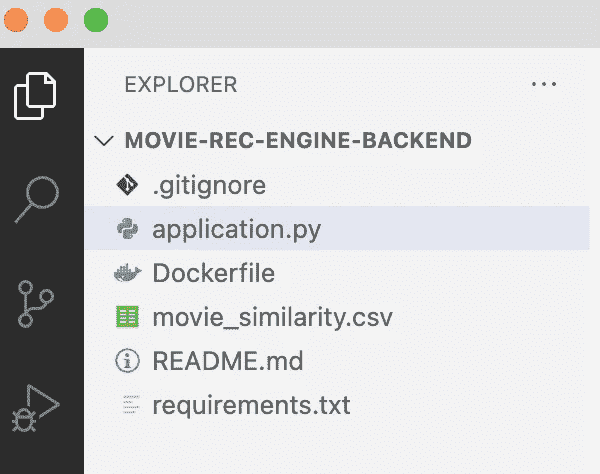

**c)** 创建虚拟环境&安装**必需的库**

```
conda create --name py37_tut python=3.7
conda activate py37_tut
pip install Flask Flask-Cors pandas
```

运行应用编程接口

```
python application.py
```

**e)** 在一个单独的终端中运行测试 API

```
curl -X POST http://0.0.0.0:80/recms -H 'Content-Type: application/json' -d '{"movie_title":"Heat (1995)"}'
```

应该从 API 获得以下输出:

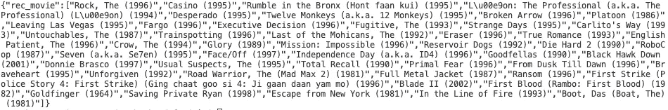

**3。将 API 归档**

我假设您已经安装了 docker，并且熟悉创建 docker 映像。让我们确保您安装了 docker:

```
docker version
```

应该得到类似的东西:

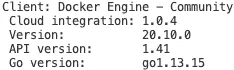

我们对 API 进行 Docker 化的方式实质上是基于名为 **Dockerfile** 的模板构建 Docker 镜像，该模板包含关于哪些文件需要复制以及如何运行 API 的指令。

Dockerfile:

```
FROM python:3.7COPY ./* ./app/WORKDIR /app/RUN pip install -r requirements.txtEXPOSE 80CMD ["python", "application.py"]
```

本质上，这个 Docker 文件(即蓝图)指示的是将我们当前目录中的所有文件复制到 Docker image **/app/** 文件夹中，安装 **requirements.txt** 文件中指定的库，暴露**端口 80** 并将 Flask API 作为服务器运行。

要构建名为 **flask-api** 的 Docker 映像，请确保您与 Docker 文件在同一个目录中(即/movie-rec-engine-backed ),并在您的终端中执行:

```
docker build -t flask-api .
```

应该得到:


现在我们准备把它推送到 AWS 弹性容器注册中心(ECR)。

**4。将 Docker 图像推送到亚马逊 ECR**

我假设您已经安装了 aws-cli，并且已经通过 **aws configure** 命令输入了您的访问密钥和密钥。

在 ECR 中创建一个存储库:

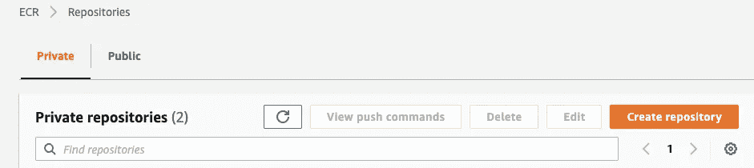

单击“创建存储库”，保留默认的私有选项，并将您的存储库命名为“flask-api-repo”

**b)** 将 Docker 图像推送到 ECR

点击创建的“flask-api-repo”并选择“查看推送命令”

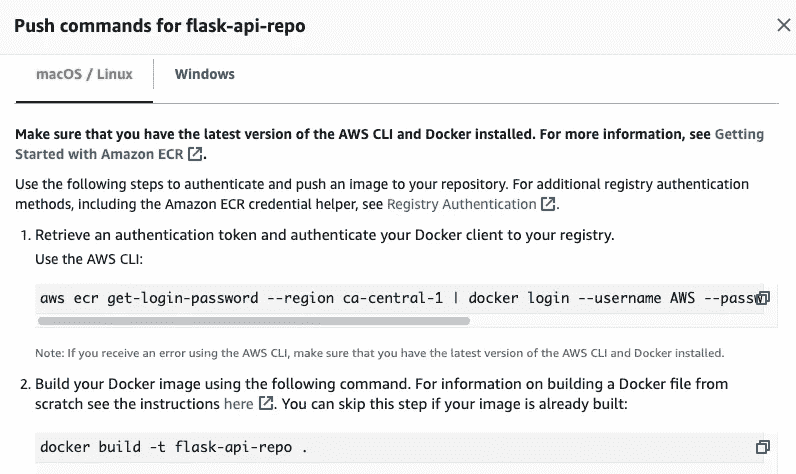

在您的终端中运行所提供的说明，但步骤 2 除外，因为我们已经构建了映像:

```
aws ecr get-login-password --region **<your-region>** | docker login --username AWS --password-stdin **<your-account-alias>**.dkr.ecr.**<your-region>**.amazonaws.comdocker tag flask-api **<your-account-alias>**.dkr.ecr.**<your-region>**.amazonaws.com/flask-api-repo:latestdocker push **<your-account-alias>**.dkr.ecr.**<your-region>**.amazonaws.com/flask-api-repo:latest
```

推送映像后，您可以刷新 repo，应该会看到以下内容:

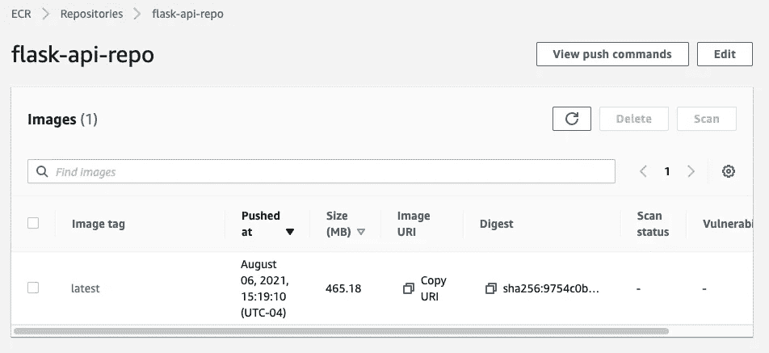

**5。在 AWS ECS 上创建一个任务来运行 API，并使用分配的公共 url 对其进行测试**

是时候创建一个运行该图像的任务了！

转到 ECS。

**a)创建一个集群**

选择:“仅网络”选项

集群名:flask-api-cluster

选择:创建 VPC 并保留默认选项

点击“创建”。

**b)定义任务**

在 ECS 中，单击任务定义

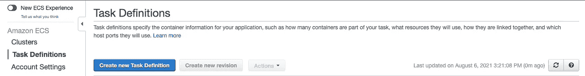

单击“创建新任务定义”按钮

选择“FARGATE”

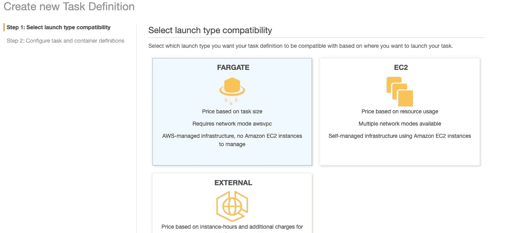

选择“下一步”

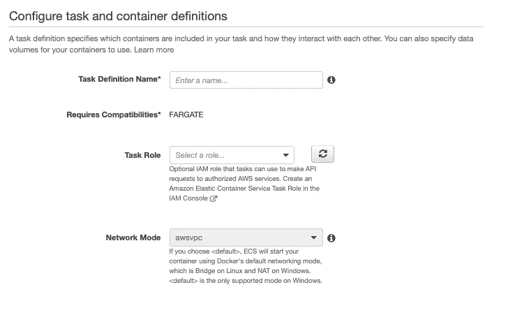

输入任务定义名称:flask-api-task

选择默认的“ecsTaskExecRole ”,或者您也可以在 IAM 中创建一个具有更多访问权限的新角色。

c)指定任务大小

任务内存(GB): 1GB

任务 CPU: 0.5 vCPU

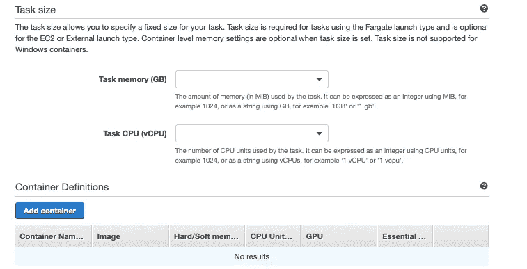

**d)添加容器**

选择“添加容器”

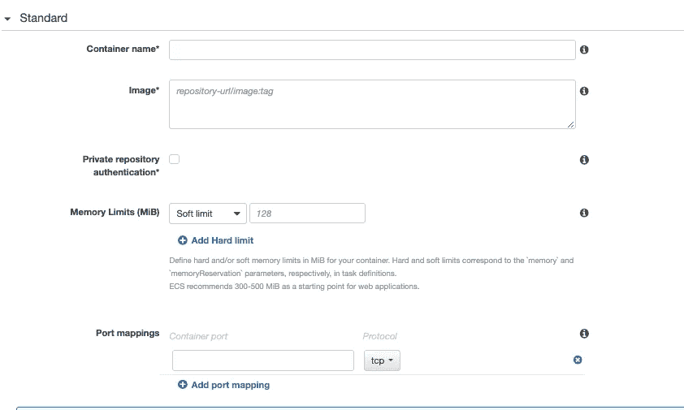

容器名称:烧瓶-API-容器

对于 URI 形象，我们需要抓住我们的 URI 形象。只需在新标签中重新打开 aws 控制台，导航到 ECR flask-api-repo 并复制图像 URI:

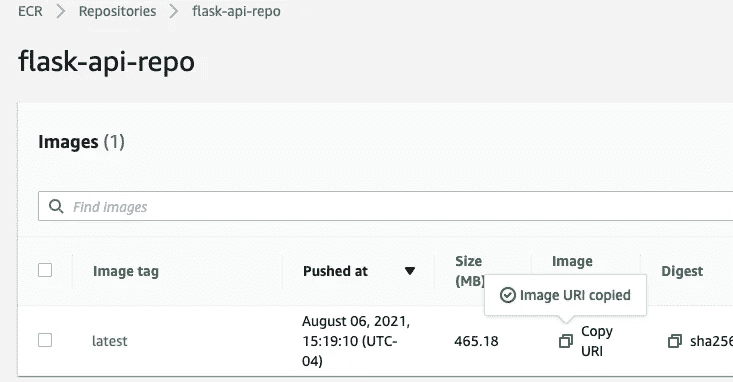

返回并将 URI 粘贴到图像*字段中

输入:

软限制:128

端口映射:80

将其余部分保留为默认值，然后单击页面底部的“添加”按钮

向下滚动并点击“创建”

你应该看看

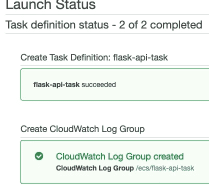

单击“查看任务定义”

**e)运行任务**

现在，在“操作”中选择“运行任务”

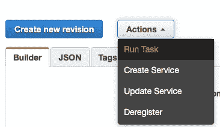

选择“FARGATE”

任务数量:1

对于子网:选择两个选项(我选择 a 和 b)

除了安全组*点击编辑

选择“创建新的安全组”

安全组名*: flask-api-sg

点击“保存”

现在，我们应该看到我们的新任务处于“PROVISIONING”状态。等一会儿，直到它变成“运行”

点击“任务”并向下滚动找到公共 IP。现在将 IP 粘贴到您的浏览器中，您应该会看到:

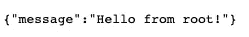

测试部署的 API

让我们通过终端测试一下。

假设你得到的**公共 IP** 是**1.2.3.4**，那么在终端中，你可以运行:

```
curl -X POST **1.2.3.4**/recms -H 'Content-Type: application/json' -d '{"movie_title":"Heat (1995)"}'
```

并且应该得到:

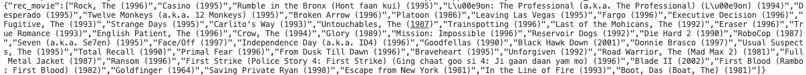

这意味着您的 API 已成功部署！

**结束语**

需要注意的事项:

您可能需要试验您的 EcsTaskRole，并确保安全组具有允许流量访问 API 的规则。

将 Docker 映像推送到 ECR 并在 ECS 中创建任务**会在您的 AWS 帐户上产生费用**，因此请确保**停止任务并删除所有相关资源**。

现在我们准备使用**第四部分**中的 **Vue.js** 构建电影推荐引擎前端！