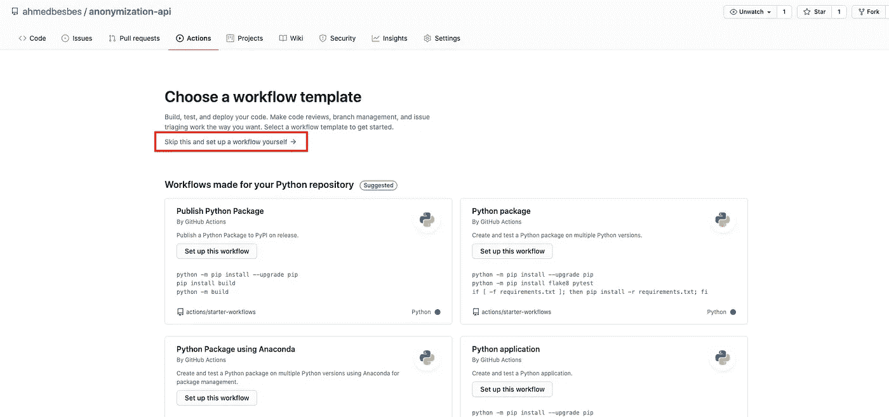
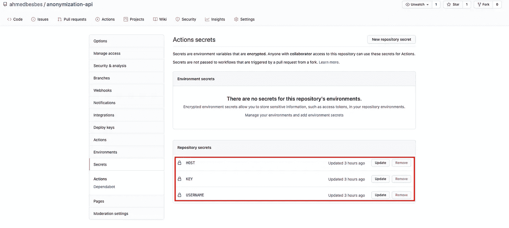
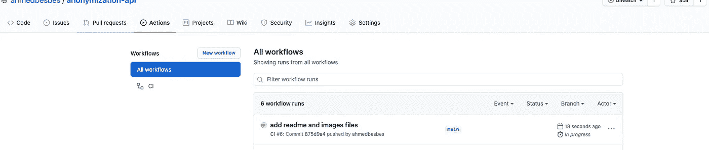

# 如何用 FastAPI、Docker 和 Github 动作部署机器学习模型

> 原文：<https://towardsdatascience.com/how-to-deploy-a-machine-learning-model-with-fastapi-docker-and-github-actions-13374cbd638a?source=collection_archive---------0----------------------->

## 具有 CI/CD 的端到端管道


照片由[西格蒙德](https://unsplash.com/@sigmund?utm_source=medium&utm_medium=referral)在 [Unsplash](https://unsplash.com?utm_source=medium&utm_medium=referral) 上拍摄

你是一名数据科学家，在一家软件公司工作。

您刚刚训练了一个模型，您对它很满意，因为它在您的本地交叉验证中表现很好。

现在是将该模型投入生产的时候了，以便您组织中的其他团队可以使用它并将其嵌入到他们的应用程序中。

这是数据科学家面临的非常普遍的情况。管理起来既麻烦又痛苦，但是使用正确的工具，这个过程可以顺利进行。

> **在本教程中，我将展示一个端到端的用例来解释将模型投入生产的工作流程。这是一篇相对较长的文章，所以请随意跳到你感兴趣的部分。**

以下是我们将要介绍的内容:

1.  **生产机器学习和 API 简介**
2.  **FastAPI 特性的快速概述**
3.  **使用 FastAPI 和 SpaCy 构建推理 API**
4.  **用 Docker 和 docker-compose 封装 API**
5.  **将 API 部署到 AWS EC2，并使用 Github Actions CI/CD 自动化流程**

我希望你准备好了。事不宜迟，让我们直接开始吧🚀。

*PS:所有代码在*[*Github*](https://github.com/ahmedbesbes/anonymization-api)*上都有。*

> 新到中？你可以每月订阅 5 美元，解锁我写的不限数量的关于编程、MLOps 和系统设计的文章，以帮助数据科学家(或 ML 工程师)编写更好的代码。

<https://medium.com/membership/@ahmedbesbes>  

# 将模型投入生产意味着什么？

在我们更进一步之前，让我们从一个共同点开始。

从广义上来说，不涉及很多细节，将模型投入生产是一个过程，在这个过程中，模型被集成到现有的 IT 环境中，并可供其他团队使用和消费。

为了使这个过程尽可能高效，应该仔细管理许多步骤:数据存储、服务、工件记录、资源管理等等。


作者制作和修改的图像

如果你的模型从未离开过你的本地电脑，而你所有的实验都在 jupyter 笔记本上，那么你很可能还没有准备好投入生产。

不过不用担心。本教程旨在帮助您开始使用 API 将模型投入生产。

# API 到底是什么？

是 **A** 应用程序 **P** 编程 **I** 接口的简称。它只是两个相互通信的独立应用程序之间的中介。

如果您是一名开发人员，并且希望您的应用程序可供其他开发人员使用和集成，您可以构建一个 API 作为您的应用程序的入口点。因此，开发人员必须通过 HTTP 请求与该 API 进行通信，以使用您的服务并与之交互。


作者图片

将 API 视为应用程序的抽象(用户看不到你的代码，也不安装任何东西，他们只是调用 API)和与第三方(开发者、应用程序、其他 API 等)集成的简化。)

API 无处不在。数据科学世界也不例外。

# 什么是 FastAPI，为什么它适合生产机器学习？

FastAPI 目前是构建可在生产环境中伸缩的健壮的高性能 API 的首选框架。


截图—[https://fastapi.tiangolo.com](https://fastapi.tiangolo.com)

FastAPI 最近越来越受欢迎，用户在 web 开发人员、数据科学家和 ML 工程师中的采用率大幅上升。

让我通过展示我能想到的最有趣的特性来解释围绕这个框架的所有宣传。

然后，我们将转到在特定用例中使用 FastAPI 的部分。

*PS:这个列表并不详尽，如果你想有一个全局的概述，你可以参考* [*官方*](https://fastapi.tiangolo.com/features/) *文档。*

## 1)简单的语法

FastAPI 的语法很简单，这使得它使用起来很快。它实际上类似于 Flask 的语法:因此，如果您正在考虑从 Flask 迁移到 FastAPI，迁移应该很容易。

实例化 Flask 和 FastAPI 应用程序是一样的。然而，与 Flask 不同，FastAPI 没有集成 web 服务器。FastAPI 是专门为构建 API 而设计的。它没有责任为他们服务。

FastAPI 做一件事，而且做得很好。

服务 API 是 uvicorn 的责任，这是一个很好的选择，因为 uvicorn 是一个使用 [uvloop](https://github.com/MagicStack/uvloop) 和 [httptools](https://github.com/MagicStack/httptools) 的闪电般快速的 ASGI 服务器实现。

**烧瓶:**

**FastAPI:**

**在两个库中，为 HTTP** 请求定义路由和附加处理程序遵循相同的语法。你用[装修工](https://realpython.com/primer-on-python-decorators/)。

FastAPI 的语法甚至更简单:每个特定的 HTTP 请求都有一个装饰器，不像 Flask 将请求类型作为参数传递给 route 装饰器。

**烧瓶:**

**FastAPI:**

在 Flask 和 FastAPI 中，path **参数都是从我们传递给 route** 的路径中解析出来的。对于 FastAPI，我们将这些参数作为参数添加到函数中。我个人认为 FastAPI 在这种特殊情况下的语法更容易阅读和理解。

**烧瓶:**

**FastAPI:**

在 FastAPI 中提取查询参数要容易得多:您只需将它们作为处理程序的参数，FastAPI 会处理剩下的事情:它从 route 中解析它们，并将它们转换成您指定的类型。

当使用 Flask 时，您必须调用`request`类，单独获取每个参数并应用一些最终的后处理。

**烧瓶:**

**FastAPI:**

要快速了解 FastAPI 的语法，请看这个[链接](https://fastapi.tiangolo.com/)。

## 2)一个超快的*框架*

根据独立网站 techempower 的说法，FastAPI+uvicon 是最快的网络服务器之一。

这是一个执行基本任务的性能比较，比如 JSON 序列化、数据库访问和服务器端模板合成。每个框架都在现实的生产配置中运行。


来源:[https://techempower.com](https://techempower.com)

## 3)异步请求

FastAPI 带来了以前的 web 框架如 Flask 和 Django 所缺乏的新特性:**异步请求。**

异步编程是一种编程模式，它使代码能够独立于主应用程序线程运行。异步编程在许多用例中使用，例如事件驱动的系统、高度可伸缩的应用程序以及 I/O 绑定的任务，例如通过网络读写文件。

如果在处理程序中使用异步函数，那么在调用该函数之前，必须将`async`添加到处理程序中，并添加`await`参数。

你可以在这里了解更多关于异步编程的知识。

## **4)使用 Pydantic 的现代 python 类型**

FastAPI 与 Pydantic 集成在一起，用标准的 python 类型对请求和响应主体进行类型化。

这在运行时强制验证，并通过允许您的 IDE 正确地自动完成并检测与类型相关的错误来提高您的编码效率。

在下面的例子中，我们设计了一个小的 API 来发布工作申请并接收随机的决定。请求体遵循 Application 类中定义的模式。它仅仅意味着它必须具有:

*   类型为**字符串**的`first_name`键
*   类型为**字符串**的`last_name`键
*   一个类型为 **int** 的`age`键
*   类型为**字符串**的`degree`键
*   一个**可选的**类型的`interest`键**字符串**

类似地，您可以使用决策类中定义的模式键入 API 响应。

这有什么用呢？

假设您不小心向 first_name 字段传递了一个整数。FastAPI 将检测类型不匹配，并相应地引发错误。

你可以在这里了解更多关于 Pydantic [的信息。](https://fastapi.tiangolo.com/tutorial/body/)

## 5)字符串查询参数的验证

FastAPI 允许通过在字符串查询参数上添加约束来验证用户输入。例如，您可以设置最大或最小长度，或者设置查询必须匹配的正则表达式。

你可以在这里了解更多关于字符串验证[的信息。](https://fastapi.tiangolo.com/tutorial/query-params-str-validations/)

## 6)数值参数的验证

同样，当使用数字参数时，您可以通过使用`gt`(大于)和`le`(小于或等于)来设置一个范围作为约束。

你可以在这里了解更多关于数字验证的信息。

## 7)更好的错误处理和自定义消息

使用 FastAPI，您可以用特定的消息和状态代码来定义和引发自定义错误。这有助于其他开发人员在使用您的 API 时轻松理解错误并进行调试。

你可以在这里了解更多关于错误处理[的信息。](https://fastapi.tiangolo.com/tutorial/handling-errors/)

## 8)遵循 OpenAPI 标准的自动文档生成

一旦您开始使用 FastAPI，就会自动为您生成交互式 API 文档和探索。

在本地启动 API 后，您可以通过此链接`[http://localhost:8000/docs](http://localhost:8000/docs)`访问它。

您将看到您创建的每条路由的文档，以及一个交互式界面，您可以直接从浏览器测试每个端点。


作者提供的图片

## 9)世界一流的文档，学习并开始使用框架

我很少见过如此完整且易于理解的文档。由[塞巴斯蒂安·拉米雷斯](https://medium.com/u/963974981597?source=post_page-----13374cbd638a--------------------------------)领导的 FastAPI 团队已经完成了记录每一段代码的惊人工作。

你可以在这里开始学习如何使用 FastAPI，坦白地说，没有更好的选择了。


作者图片

# 使用 FastAPI 和 Spacy 创建匿名化 API

让我们进入有趣的部分。

在我之前的一篇[帖子](/how-to-build-and-deploy-a-text-anonymizer-with-spacy-and-streamlit-70ed9607823)中，我构建了一个 Streamlit 应用程序，它通过检测带有空间模型的命名实体来匿名化文本。要使用这个应用程序，你必须打开一个浏览器并与用户界面互动。

但是，

> **如果我们可以创建一个 API 端点来做同样的事情，这样开发人员就可以在不使用 UI 的情况下轻松地与这个程序进行交互，会怎么样？**

这看起来像是 FastAPI 的完美工作。

下面的图表代表了我们将要构建的 API 的模式:


作者图片

我们将只定义一个路由，它将接受路径`/entities`上的 POST 请求，并且它将期望一个包含三个字段的请求体:


作者图片

*   **文本**:要匿名的文本
*   **model _ size**:NER 模型的尺寸(默认为“sm”)
*   **model _ language**:NER 车型的语言(默认为“en”)

作为输出，API 将返回一个包含两个键的 JSON 对象:


作者图片

*   **实体:**提取的实体列表。每个实体是一个 JSON，包含四个键( **start** :文本中实体的起始索引， **end** :结束索引， **type** :实体的类型， **text** :实体的值)
*   **匿名化 _ 文本:**将实体匿名化的原始输入文本

为了设置请求和响应体的类型，我们将使用 **Pydantic。**

*   对于请求的主体，我们将`UserRequestIn`定义为 BaseModel 类的子类。它会有三个属性:`text,` `model_language`和`model_size`。
    我本可以将`model_language`和`model_size`的类型设置为 string，但是，为了本教程，我为它们定义了两个类:ModelLanguage 和 ModelSize。这两个类继承自`str`和`Enum`。使用 Enum 的想法是限制每个字段的可能值。对于语言，我们只需要英语(“en”)和法语(“fr”)，对于大小，我们需要三个可能的值(“sm”表示小，“md”表示中，“lg”表示大)。
*   至于响应的主体，我们定义了`EntitiesOut`类，再次作为 BaseModel 的子类。如前面的响应主体截图所示，它将有两个键:**实体**和**anonymous ized _ text。**
    **anonymous _ text**是一个字符串，而 **entities** 是一列 **EntityOut** 对象。EntityOut 只是一个 BaseModel 类，表示每个实体的模式:它有四个字段:start (int)、end (int)、type (str)和 text (str)。

如您所见，使用 Pydantic 为您的请求和响应构建定制类型非常直观。通过组合其他复杂类型，你可以变得更有创造力。

既然已经创建了数据模型，我们就可以开始构建 API 了:首先，我们用 Spacy 加载语言模型。这些模型将保存在`ml/models/`文件夹中。

然后，我们将定义 API 路由和处理程序。

这里发生了一些事情:

*   在装饰器`@app.post`中，我们将路径设置为`entities/`，并将`response_model`参数设置为`EntitiesOut`。在这里，FastAPI 强制响应体遵循在`EntitiesOut`类中用 Pydantic 声明的模式。
*   处理程序的第一个参数是请求体:我们将其类型设置为`UserRequestIn`以强制输入验证。
*   剩下的就是纯 python 代码:我们提取数据，调用模型，并匿名化检测到的实体。
*   最后返回一个字典，有两个键:**实体**和**anonymouzed _ text。**

现在一切都应该可以在本地运行了。进入项目的根目录，运行`uvicorn api.main:app --reload`


作者提供的图片

要检查 API 是否在工作，您可以打开[http://localhost:8000/docs](http://localhost:8000/docs)来查看交互界面，在这里您可以从浏览器尝试 API。


作者图片

# 用 Docker 打包 API

既然 API 在本地工作，我们可以构建一个 Docker 映像来打包它的依赖项，并在一个隔离的执行环境中运行它，也就是一个*容器*。

您可以将容器视为虚拟机，尽管它们不像虚拟机那样提供严格的隔离。

Docker 映像由`Dockerfile`定义，它基本上是 Docker 构建映像的一组指令。

图像通常建立在其他基础图像之上。这些图像可以从 Docker [Hub](https://hub.docker.com,) 中提取，这是 Github 的一个等价物，但是是针对 Docker 图像的。

这是我们 API 的 docker 文件。它包含在项目的根目录中。

让我们一行一行地详细说明发生了什么:

1.  我们指出我们从`python:3.7`开始的基本图像。Docker 在构建映像时从中央存储库中取出它。
2.  Python 依赖项(fastapi、uvicorn 和 spacy)在镜像中使用`pip`安装。
3.  我们将`api/`文件夹的内容(从主机)复制到`/api/api/`文件夹(在镜像上)
    PS:这个文件夹是在镜像中自动创建的
4.  我们将 PYTHONPATH 变量设置为`/api`
5.  我们为后续的 CMD 命令设置工作目录。这仅仅意味着 Dockerfile 文件的最后一行将从工作目录中执行。
6.  我们向 Docker 表明，容器将在运行时监听端口 8000。
7.  `ENTRYPOINT`允许配置作为可执行文件运行的容器。
8.  我们设置要执行的命令(我们将省略`uvicorn`命令，因为它已被声明为入口点。

现在我们将定义一个 docker-compose，它将为我们的 API 创建一个服务。
我本可以只使用 Dockerfile，因为 docker-compose 是一个定义多容器应用程序的工具，而且我们目前只有一个容器。

但是为了本教程，让我们来看看它是如何完成的:一般来说，您可能希望在单独的容器中运行多个服务，docker-compose 是将它们组合在一起的一个很好的工具。

我们在同一位置再次创建一个`docker-compose.yaml`文件。


作者提供的图片

在这个文件中，我们将 docker-compose 的版本设置为 3(最新的)。我们为服务命名(`anonymization-api`)，为构建步骤设置 Dockerfile 的路径，并将端口 8000(在容器上)映射到端口 8000(在主机上)。

最后，我们运行这个命令，它将为容器内部的 API 提供服务，并使它可以从主机访问。

```
**docker-compose up --build**
```

# 在 AWS 上启动并配置 EC2 实例

让我们创建一个 EC2 实例，我们将在其中用 Docker 部署 API。

*   首先，连接到您的 AWS 帐户，转到 EC2 部分并选择一个发行版。这个教程我推荐 Ubuntu 20.04 LTS。


作者截图

*   举个例子:我们不会在这里发疯。我们就挑一个比较小的:a `t2.medium`。


作者截图

*   现在启动实例。
*   创建一个弹性 IP 地址，并将其关联到正在运行的实例。这样，每次我们重新启动实例时，这个 IP 都不会改变。


作者截图

*   添加一个新的安全组(我将其命名为 fastapi)以允许端口 8000 上的入站流量。


作者截图

*   然后，将其添加到实例安全组:


作者截图

现在，实例已经准备好接受端口 8000 上的请求。

*   使用您的终端 SSH 到它。
*   按照 ubuntu 的官方文档[安装`docker`和`docker-compose`](https://docs.docker.com/engine/install/ubuntu/)
*   生成一个 ssh 密钥，并将其添加到您的 Github 帐户，这样它就可以无缝地执行 git 克隆(我们将在下一节中使用它)

# 在 Github 操作上创建部署工作流

Github Actions 是 Github 的 CI/CD 服务。它允许您基于 git 提交、合并或拉取请求等事件自动测试、构建和部署应用程序。

*要了解更多关于 Github 动作的信息，请看一下这个* [*链接*](https://docs.github.com/en/actions) *。*

要在 repo 中添加工作流程，请点击**操作**选项卡。


作者截图

然后，点击**自行设置工作流程。**



作者截图

一个 YAML 文件将被自动创建在一个`workflows`文件夹中，该文件夹将被创建在回购根目录下的一个`.github`文件夹中。

在我们的例子中，我们将工作流设置为仅在**主**分支上的**推送**请求时触发。


作者截图

将被触发的作业将在一个远程服务器上运行，GitHub Actions 将通过 **SSH Remote 命令连接到该服务器。**在其他情况下，该作业可能在 Github 运行程序上运行，例如 Github 提供的实例。

[SSH Remote Commands](https://github.com/appleboy/ssh-action) 是一个定制的 GitHub 动作，你可以在市场上找到。它是免费使用的，你只需要在`uses`部分之后调用它。

将使用以下参数调用 SSH 远程命令 Github 操作

*   **主机**:服务器的主机名(即其公共 IP)
*   **用户名**:ssh 用户名
*   **key**:ssh 私钥的内容
*   **脚本**:ssh 连接建立后将执行的脚本

该脚本将列出 SSH 连接建立后将在服务器上运行的命令:

*   克隆回购
*   光盘放进去
*   运行 docker-compose build 和 up 命令。

```
git clone git@github.com:ahmedbesbes/anonymization-api.git
cd anonymization-api
sudo docker-compose up --build -d
```

前面的参数`host`、`username`和`key`不会硬编码到 YAML 文件中。他们永远不会。这个信息很敏感。

它们将被存储为 **Github Secrets** 并用$符号引用，就像你调用环境变量一样。

要创建 Github secrets，请转到存储库的设置，然后单击左侧选项卡上的 secrets。Github 机密总是在 Github repo 的范围内定义。


作者截图

然后通过设置它们的名称(用大写字母)和它们的值来定义你的秘密。



作者截图

下面是你如何设置`USERNAME`秘密的例子。


作者截图

**现在你可以提交、推动并期待奇迹的发生！**

一旦你推送你的代码(在测试本地一切正常之后)，你会注意到，在点击**动作**标签之后，一个新的运行正在排队等待开始。



通过点击它，您可以看到构建的不同步骤。


作者截图

一旦 API 成功地部署在您的远程服务器上，启动 Postman 并在 API 端点上执行一些请求来检查它是否正常工作。


作者截图

有后！🎊现在 API 已经部署好了，可以工作了，并准备好接受请求。

# 结论和后续步骤

到目前为止，已经涵盖了很多内容。

我们了解了 FastAPI 提出的有趣特性。然后，我们用这个框架构建了一个 API，最后用 Docker 部署在 AWS 上。

为了使部署过程尽可能顺利，我们还使用了 GitHub Actions 工作流，该工作流在每次推送时被触发，并使用自定义操作。

现在，为了使这个 API 更适合生产，我们可以考虑这些特性(我可能会在未来的博客文章中涉及它们)

*   为 API 设置域名
*   通过添加 HTTPS 来保护 API
*   使用`gunicorn`代替`unicorn`进行部署
*   添加数据库服务(例如 PostgreSQL)来存储输入和预测:这是应用异步请求的好机会。

# 资源:

这里是我在学习 FastAPI 和部署时浏览的一些高质量资料。

<https://fastapi.tiangolo.com/>    <https://www.starlette.io/>  <https://medium.com/@calebkaiser/why-we-switched-from-flask-to-fastapi-for-production-machine-learning-765aab9b3679>  </how-to-properly-ship-and-deploy-your-machine-learning-model-8a8664b763c4>  </machine-learning-service-for-real-time-prediction-9f18d585a5e0>  </build-an-async-python-service-with-fastapi-sqlalchemy-196d8792fa08>  <https://testdriven.io/blog/moving-from-flask-to-fastapi/>  

# 感谢阅读！🙏

我希望这篇文章对你有用。如果你对改进我建立的工作流程有任何建议，请不要犹豫，在 [Github](https://github.com/ahmedbesbes/anonymization-api/issues) 或评论中提出。

同样，代码可以在我的[回购](https://github.com/ahmedbesbes/anonymization-api)上获得:请随意在你的项目上试用。

我就讲到这里，下次见！


照片由[卡斯滕·怀恩吉尔特](https://unsplash.com/@karsten116?utm_source=medium&utm_medium=referral)在 [Unsplash](https://unsplash.com?utm_source=medium&utm_medium=referral) 上拍摄

# 新到中？您可以每月订阅 5 美元，并解锁无限的文章— [单击此处。](https://ahmedbesbes.medium.com/membership)