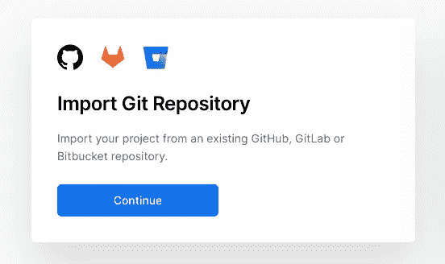
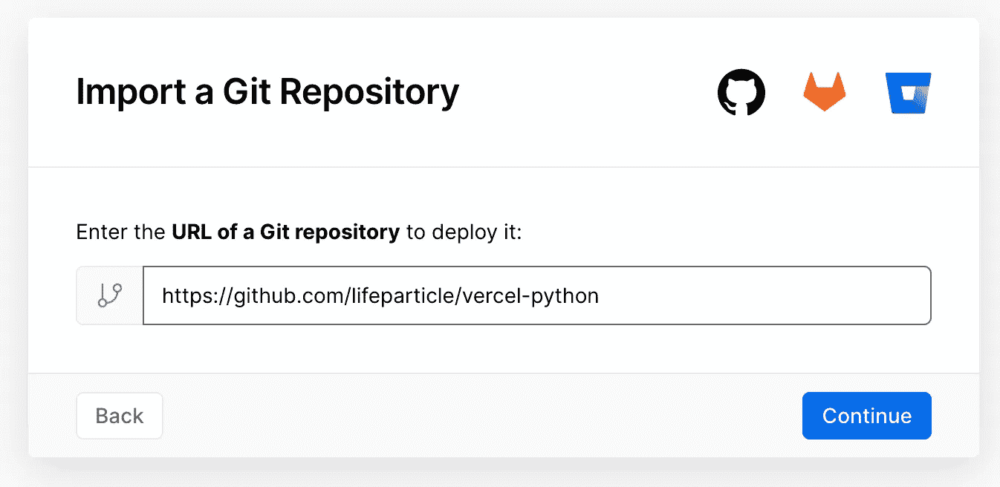
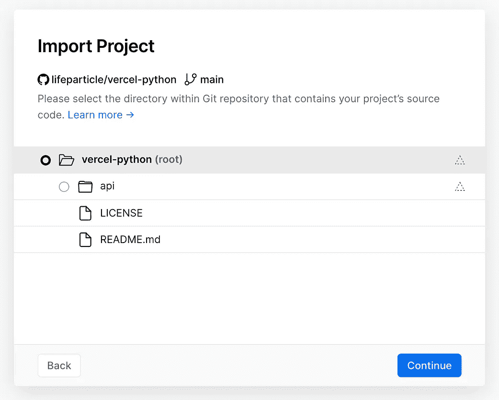
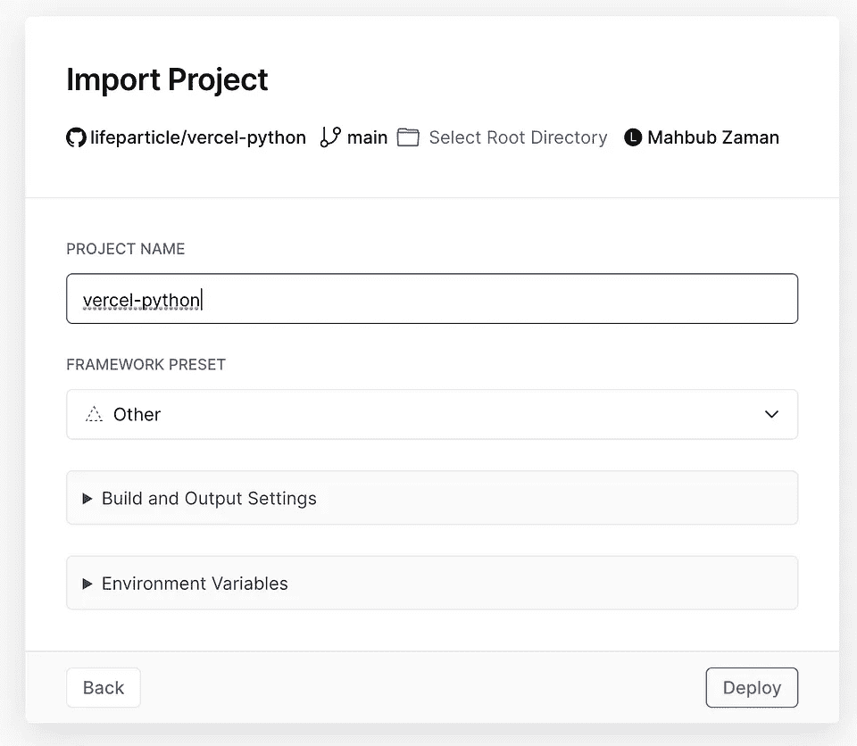
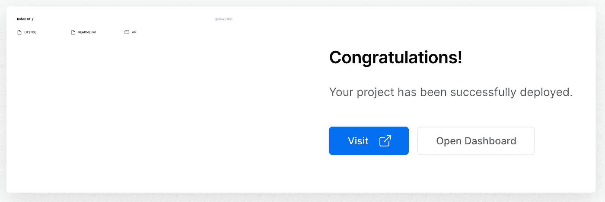
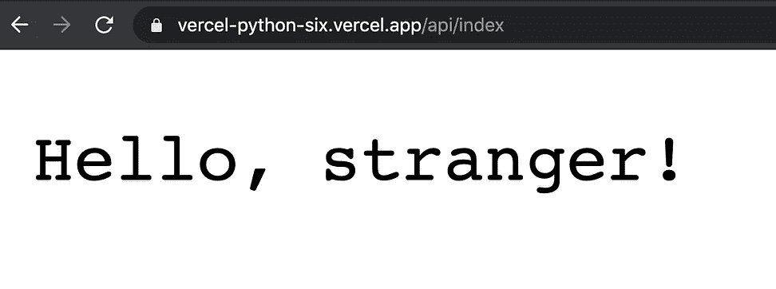
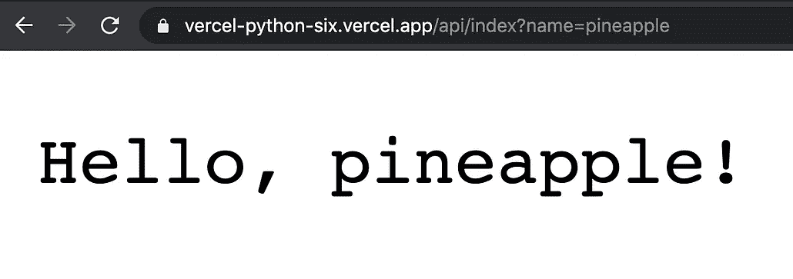

# 如何将 Python 无服务器功能部署到 Vercel

> 原文：<https://towardsdatascience.com/how-to-deploy-a-python-serverless-function-to-vercel-f43c8ca393a0?source=collection_archive---------9----------------------->

## 让基础设施来承担重担。


照片由[克里斯蒂娜·莫里路](https://www.pexels.com/@divinetechygirl?utm_content=attributionCopyText&utm_medium=referral&utm_source=pexels)从[派克斯](https://www.pexels.com/photo/woman-programming-on-a-notebook-1181359/?utm_content=attributionCopyText&utm_medium=referral&utm_source=pexels)拍摄

ercel 是一个提供无服务器运行时的平台，也称为功能即服务(FaaS)。但是，为什么我需要去无服务器？好吧，如果你需要去无服务器或没有直接的答案。通常，无服务器功能无需维护即可扩展。此外，您只在需要时才运行该函数。

我一直使用无服务器函数作为 API 端点。我对无服务器功能的特点很感兴趣。比如我不用担心基础设施；相反，我可以专注于问题。这篇文章教你如何在 Vercel 上部署一个 python 无服务器函数。我们开始吧！

# 设置

在这篇文章中，我将使用 [GitHub](https://github.com/) 和 [Vercel](https://vercel.com/) 。首先，我们将创建一个 git 存储库，这样我们就可以用 Vercel 连接它。

这是我创建的库的链接。将代码下载到本地机器后，可以在 api 文件夹中看到一个名为`index.py`的 python 文件。根据 Vercel 针对 Python 的[文档](https://vercel.com/docs/runtimes#official-runtimes/python)，如果一个 Python 文件有一个单一的 HTTP handler 变量，继承自 api 目录内的 BaseHTTPRequestHandler 类处理程序，Vercel 会将其作为一个无服务器函数。

让我们来分解一下`index.py`文件的各个成分。

```
from http.server import BaseHTTPRequestHandler
from urllib import parse
class handler(BaseHTTPRequestHandler):
    def do_GET(self):
        s = self.path
        dic = dict(parse.parse_qsl(parse.urlsplit(s).query))
        self.send_response(200)
        self.send_header('Content-type','text/plain')
        self.end_headers()
        if "name" in dic:
            message = "Hello, " + dic["name"] + "!"
        else:
            message = "Hello, stranger!"
        self.wfile.write(message.encode())
        return
```

对于这个例子，我们想要处理查询字符串。如果查看[文档](https://docs.python.org/3/library/http.server.html#http.server.BaseHTTPRequestHandler.path),`path`实例变量包含请求路径。为了方便起见，现在让我们将`path`变量解析到一个字典中。此外，我已经将 HTTP 状态代码设置为 200，并将内容类型设置为纯文本。

以下代码行在字典中查找一个名为`name`的键。如果密钥存在，变量`message`将包含`Hello,`，后跟`name!`，否则为`Hello, stranger!`。你可以在这里阅读更多关于高级 Python 用法[的内容。最后，我将返回`message`的编码内容，默认情况下](https://vercel.com/docs/runtimes#advanced-usage/advanced-python-usage)[是 utf-8。](https://docs.python.org/3/library/stdtypes.html?highlight=encode#str.encode)

现在，让我们转到 [Vercel](https://vercel.com/) 以便能够[导入](https://vercel.com/import)我们的项目。



单击继续

单击 Continue 后，您应该会看到下面的对话框。



把你的 git 库链接

在我的例子中，我将使用我的 git 存储库链接，它是[https://github.com/lifeparticle/vercel-python](https://github.com/lifeparticle/vercel-python)。现在点击继续，最后点击部署。



对于这篇文章，我们将不配置构建和输出设置

现在，您应该会在浏览器上看到如下所示的对话框。点击“访问”按钮，访问您的无服务器功能。在本例中，我的无服务器函数的地址是由 Vercel 生成的[https://vercel-python.lifeparticle.vercel.app/](https://vercel-python.lifeparticle.vercel.app/api/index)。我们需要在基本 URL 的末尾添加 api/file_name 来访问该函数。添加之后，我们有了一个看起来像 https://vercel-python.lifeparticle.vercel.app/api/index 的 URL。



点击访问

现在，如果你访问[链接](https://vercel-python.lifeparticle.vercel.app/api/index) …



无查询字符串与查询字符串

对于第一个函数调用，我们没有提供任何查询字符串。因此它显示你好，陌生人！在第二个[调用](https://vercel-python.lifeparticle.vercel.app/api/index?name=pineapple)中，提供了名称菠萝。

由于我们已经将 GitHub 项目与 Vercel 链接起来，对主分支的任何更改都将触发生产部署。如果您想选择一个不同的分支作为生产分支，请遵循这个[文档](https://vercel.com/docs/git#production-branch)。

# 包裹

现在您知道了如何将 python 无服务器函数部署到 Vercel！欢迎来到充满新可能性的世界。如果您想将 Ruby 无服务器功能部署到 Vercel，请访问下面的链接。编码快乐！

[](/how-to-deploy-a-ruby-serverless-function-to-vercel-da8c3581f7c2) [## 如何将 Ruby 无服务器功能部署到 Vercel

### 关注你的代码，而不是基础设施

towardsdatascience.com](/how-to-deploy-a-ruby-serverless-function-to-vercel-da8c3581f7c2)