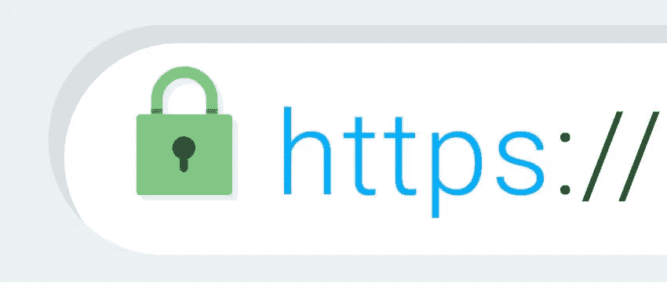
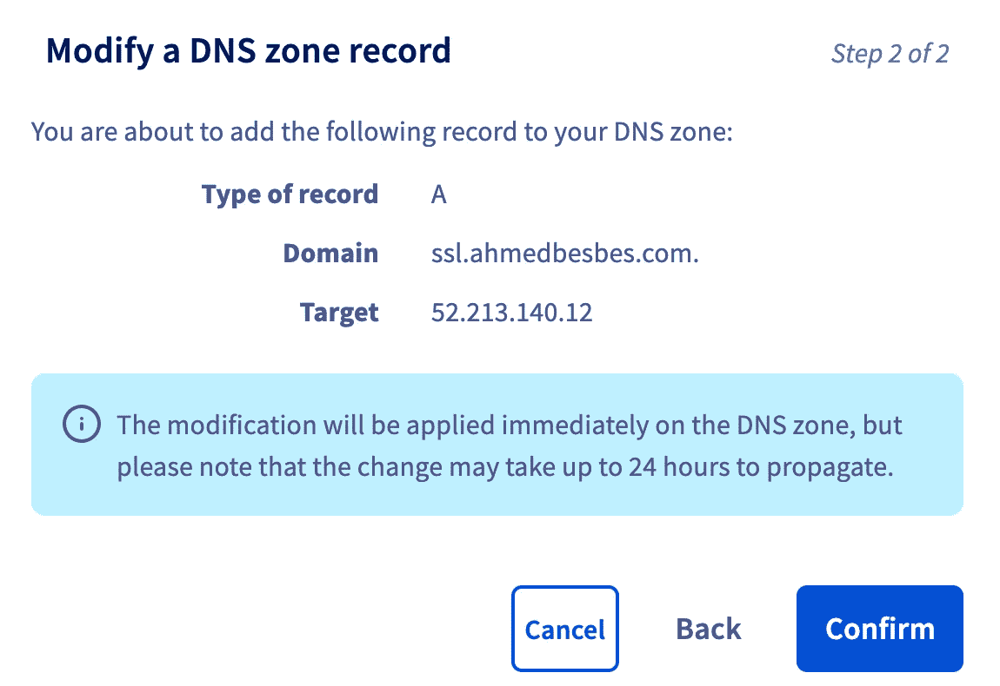
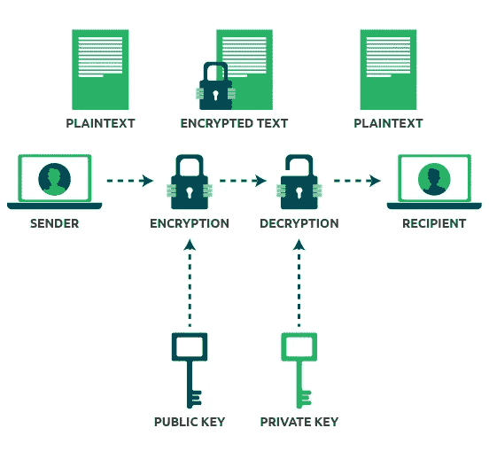

# 如何用 FastAPI、Docker 和 Traefik 部署安全 API

> 原文：<https://towardsdatascience.com/how-to-deploy-a-secure-api-with-fastapi-docker-and-traefik-b1ca065b100f?source=collection_archive---------2----------------------->

## 配置 HTTP **S** 的指南


照片由[飞:D](https://unsplash.com/@flyd2069?utm_source=medium&utm_medium=referral) 在 [Unsplash](https://unsplash.com?utm_source=medium&utm_medium=referral)

当我们部署一个 API 来服务一个机器学习模型时，我们很少关心那个绿色的挂锁，它使得 HTTP 连接被认为是安全的，浏览器是快乐的。



作者图片

我们通常认为 HTTPS 是理所当然的，我们可能认为它只是通过一些简单的配置就可以打开*。*

*事实是，添加 HTTPS 需要几个步骤。*

> *这就是这篇文章的目的:解释为什么 HTTPS 很重要，以及当你用 Python 构建 web 应用和 API 时，如何将它添加到你的部署中。*

*以下是我们将在本帖中介绍的内容:*

1.  ***HTTPS 简介:它是如何运作的，为什么你应该关注它？***
2.  ***用 FastAPI 构建 API***
3.  ***介绍 Traefik 及其如何处理 HTTPS***
4.  ***通过 Docker 集成 FastAPI 和 Traefik***
5.  ***在 AWS 上部署***

*这个指南将最终帮助您添加 HTTPS 到您的项目。您可以重用以下代码来构建安全的项目。*

*事不宜迟，让我们直接开始吧🚀*

**PS*:此代码在*[*Github*](https://github.com/ahmedbesbes/fastapi-ssl)*上有。**

**PS**:如果你想了解更多关于 FastAPI、Docker 和 Github 的动作，一定要看看我之前的* [*帖子*](/how-to-deploy-a-machine-learning-model-with-fastapi-docker-and-github-actions-13374cbd638a) *。**

*[](/how-to-deploy-a-machine-learning-model-with-fastapi-docker-and-github-actions-13374cbd638a) [## 如何用 FastAPI、Docker 和 Github 动作部署机器学习模型

### 具有 CI/CD 的端到端管道

towardsdatascience.com](/how-to-deploy-a-machine-learning-model-with-fastapi-docker-and-github-actions-13374cbd638a)* 

# *复制本教程需要什么*

*   *注册的域名。你可以花几块钱在 T42 买到一个*
*   *安装在本地机器上的 Docker 和 docker-compose:你可以遵循官方的[文档](https://docs.docker.com/engine/install/ubuntu/)*
*   *部署 API 的远程服务器:我在 AWS EC2 上使用了一个`t2-medium`实例。任何同等的东西都应该是好的。
    确保这个实例有**固定的 IP 地址**。*
*   *在您的域提供者上，创建一个指向实例 IP 地址的 A 记录。我目前拥有 ahmedbesbes.com，为了这个教程，我创造了以下记录:**ssl.ahmedbesbes.com。**你可以通过选择任何你想要的子域来对你的域做同样的事情。
    OVH 的界面看起来是这样的( [OVH](https://www.ovh.com/) 是我的域名提供商)*

**

*作者截图*

# *什么是 HTTPS，你为什么要关心它？*

*HTTPS 是基于加密协议的 HTTP。这个协议被称为传输层安全性( **TLS** )，它以前被称为安全套接字层( **SSL** )。*

*换句话说，HTTPS 是加密的，以增加数据传输的安全性。*

## *它是如何工作的？*

*HTTPS 背后的协议 TLS 使用不对称的[公钥基础设施](https://en.wikipedia.org/wiki/Public-key_cryptography)。该系统使用两种不同的密钥来加密双方之间的通信:*

1.  *私人钥匙🔐:此密钥由网站所有者控制，它是私有的，位于远程 web 服务器上。它用于**解密由公钥加密的信息***
2.  *公钥🔑:任何希望以安全方式与服务器交互的人都可以使用此密钥。这个密钥的作用是**加密数据**,私钥稍后会解密这些数据。*

**

*图片由作者修改*

## *我们为什么需要 HTTPS？*

*HTTPS 是一个非常有用的协议。您需要它有三个主要原因:*

*   ***隐私**:这样就没人能拦截或偷听你的消息(消息可以是你发布给朋友的文字，你填写表格的信用卡信息，图像，视频，或者你通过网络上传的任何东西)。当通过 HTTPS 发送时，该数据被**加密，**即变成一个长的字母数字串。*
*   *完整性:这样你发送的信息在到达目的地的途中不会被任何形式的操纵。*
*   ***认证**:这样你请求的远程服务器就能确定你就是你声称的那个人*

*除了给你的应用增加一个安全层，HTTPS 还是高质量软件实践的保证。这对于建立可信的用户群非常重要。*

*主要的互联网公司都非常重视 HTTPS。事实上，谷歌[在 2014 年宣布](https://seo-hacker.com/google-adopt-https/)拥有 HTTPS 将提高你在搜索结果中的排名。谷歌还让 Chrome 将所有没有 HTTPS 的网站标记为不安全。*

**

*看完这个谁还想访问你的网站？(图片由作者提供)*

*是时候将 HTTPS 添加到您的应用程序中了！*

# *用 FastAPI 构建最小 API*

*在这一节中，我们将在一个非常简单的例子上安装并运行 FastAPI。接下来我们将看到如何保护它。*

*在进入代码之前，下面是项目结构的样子:*

**

*作者截图*

*让我们从创建虚拟环境开始:*

```
***mkdir fastapi-ssl && cd _
pipenv install fastapi***
```

*没什么特别的，我们将创建一个有两条路线的 API:*

*   *一个处理 **GET 请求**并在浏览器上显示以下 JSON 响应*

```
***{"message": "Hello FastAPI + SSL"}***
```

*   *另一个处理 **POST 请求。**这个路由需要一个包含两个键:`text`和`author`的主体，并发回一个 JSON 对象作为响应，其中包含已经发送的相同的`text`和`author`以及一个附加的`status`消息。*

```
***{"status": "message received", "text": "Hello", "author": "Ahmed"}***
```

*下面的代码定义了这两条路线。*

*一个非常简单的 API，有两条路径*

*查看这篇[文章](https://fastapi.tiangolo.com/)，了解更多关于用 FastAPI 构建 API 的信息。*

# *什么是 Traefik？它如何帮助 HTTPS？*

*在用 Docker 打包 app 之前，我们先介绍一下 Traefik。*

> *Traefik 是一个开源的反向代理和负载平衡器，适用于基于 HTTP 和 TCP 的应用程序，它简单、动态、自动、快速、功能全面、经过生产验证，提供指标，并与每一种主要的集群技术集成…*

*Traefik 的目标是拦截来自互联网的传入 HTTP 请求，并将它们路由到 Docker 运行的专用容器。它可以将任何 DNS 记录附加到正在运行的服务上。*

**

*特拉菲克在中间*

*Traefik 是云原生的。这意味着它可以轻松地与 Docker 和 Kubernetes 等云技术集成。在本教程中，我们将 Traefik 链接到 Docker。*

*上面的樱桃:Traefik 自动支持**让我们加密**证书。这意味着它会自动为您处理这些文件的创建和更新，以确保 HTTPS 配置正确。*

# ***让我们加密什么？***

> *Let's Encrypt 是一个免费的、自动化的、开放的认证机构(CA)，为公众的利益而运行。这是由[互联网安全研究小组(ISRG)](https://www.abetterinternet.org/) 提供的服务。*

*Let's Encrypt 是一个会为我们颁发免费 SSL 证书的组织。*

## ***什么是 SSL 证书？***

*SSL 证书允许网站拥有 HTTPS。*

*它是一个保存在部署应用程序的远程服务器上的文件。它使 SSL/TLS 加密成为可能，并保存诸如公钥和网站身份等信息。*

*当客户端(例如您的浏览器)尝试连接到安全网站时，它首先会获得此证书的副本。这允许客户端检查远程服务器的身份并获得公钥，以便启动加密会话。*

# *为 HTTPS 设置 Traefik*

*让我们从配置 Traefik 开始。这可以使用下面的 TOML 文件来完成。该文件将位于`services/traefik`中*

*Traefik 配置文件*

*让我们详细介绍一下每一部分都发生了什么:*

*`**[entrypoints]**`*

*此部分指定 Traefik 将侦听的端口。这些端口是 **80** 和 **443** 。80 是默认的 HTTP 端口，443 是 HTTPS 端口。我们将分别称它们为`web`和`websecure`。*

*然后，我们告诉 Traefik 将 HTTP 重定向到 HTTPS。*

*`**[accessLog]**`*

*这个部分告诉 Traefik 将日志打印到`stdout`以了解谁给谁打了电话。*

*`**[providers]**`*

*在本节中，我们将配置所谓的提供者。*

> **提供商*是基础设施组件，无论是编排器、容器引擎、云提供商还是键值存储。其思想是，Traefik 查询提供者 API，以便找到有关路由的相关信息，当 Traefik 检测到变化时，它会动态更新路由。*

***我们希望 Traefik 在 Docker 容器前充当代理，所以我们将选择 Docker 作为提供者之一。***

*将`exposedByDefault`设置为`false`仅仅意味着 Traefik 不会在所有容器前充当代理。它只会在那些有 docker-compose 中描述的特定标签的人面前这样做。(我们将在下面的 Docker 部分介绍这些标签)*

*`**[certificatesResolvers.letsencrypt.name]**`*

*本节配置证书解析器。换句话说，Traefik 将通过 [ACME](https://github.com/ietf-wg-acme/acme/) 协议与 Let's Encrypt 通信:要做到这一点，您必须设置一个有效的电子邮件地址和文件名，Traefik 将把它从 Let's Encrypt 接收的信息保存在这里。当 Traefik 与 Let's Encrypt 通信时，可以成功生成和更新证书。*

# *使用 Docker 准备部署*

*在本节中，我们在 docker-compose 文件中定义了两个容器:一个用于 FastAPI web 服务，另一个用于启动 Traefik。*

****注意，您可以有多个运行不同服务的容器，Traefik 会将流量路由到这些容器。****

*让我们详细说明每个容器中发生了什么:*

***—** `**api**`*

*我们首先通过引用以下 Dockerfile 文件的路径来构建映像:*

*然后，我们定义将被 Traefik 读取的 docker 标签*

*   *`traefik.enable=true`确保 Traefik 看到该容器并将流量路由到该容器*
*   *其他标签定义了指向容器的 DNS 记录(ssl.ahmedbesbes.com，也就是我为这个 API 设置的域)。他们还告诉 Traefik 使用 TLS 并使用 Let's Encrypt 来解析证书。*

***——**——`**traefik**`*

*我们首先从官方注册中提取图像。*

*我们将容器上的端口 80 和 443 映射到主机上的端口 80 和 443。*

*我们定义了三个卷:*

1.  *第一个卷使 Traefik 知道其他容器*
2.  *第二个卷将 Traefik 配置文件传递给容器*
3.  *第三个卷将生成的证书保存在主机上，这样就不会在每次容器重新启动时重新生成它们。这很重要，因为 Let's Encrypt 对您可以获得的证书数量有限制*

# *在 AWS 上部署*

*确保本地一切正常，连接到虚拟机，克隆存储库，并在根目录下运行以下命令:*

```
***docker-compose up --build -d***
```

*为了让 Github 动作的部署更顺利，看看我之前的[帖子](/how-to-deploy-a-machine-learning-model-with-fastapi-docker-and-github-actions-13374cbd638a)。*

# *资源*

*下面是我用来学习 HTTPS、Traefik 和用 Docker 部署 FastAPI 应用程序的资源的汇编列表。*

*不要犹豫，让我知道你在这方面找到的其他有用的资源😉*

*[](https://howhttps.works/) [## HTTPS 是如何运作的

### 你有没有想过为什么你的浏览器地址栏会出现一个绿色的锁图标？为什么它很重要？我们也是，而且…

howhttps。作品](https://howhttps.works/) [](https://www.valentinog.com/blog/traefik/) [## 使用 Docker、Traefik 和 Let's Encrypt 部署 FastAPI 应用程序

### 当用 Docker 和 Let's Encrypt 把所有的部分组合起来配置 Traefik 时，我用了 15 个…

www.valentinog.com](https://www.valentinog.com/blog/traefik/) [](https://fastapi.tiangolo.com/tr/deployment/docker/) [## 使用 Docker - FastAPI 部署

### 警告当前页面仍然没有该语言的翻译。但是你可以帮忙翻译一下…

fastapi.tiangolo.com](https://fastapi.tiangolo.com/tr/deployment/docker/) [](https://www.digitalocean.com/community/tutorials/how-to-use-traefik-v2-as-a-reverse-proxy-for-docker-containers-on-ubuntu-20-04) [## 如何在 Ubuntu 20.04 | DigitalOcean 上使用 Traefik v2 作为 Docker 容器的反向代理

### Docker 可能是在生产环境中运行 web 应用程序的一种有效方式，但是您可能希望在…

www.digitalocean.com](https://www.digitalocean.com/community/tutorials/how-to-use-traefik-v2-as-a-reverse-proxy-for-docker-containers-on-ubuntu-20-04) [](https://traefik.io/blog/traefik-2-tls-101-23b4fbee81f1/) [## 如何用 TLS - Traefik 2 & TLS 101 配置 Traefik 2

### 每个人的 HTTPS (& TCP over TLS)！我喜欢成为一名开发人员有成百上千的原因(除了对…

traefik.io](https://traefik.io/blog/traefik-2-tls-101-23b4fbee81f1/) [](https://www.digitalocean.com/community/tutorials/how-to-use-traefik-v2-as-a-reverse-proxy-for-docker-containers-on-ubuntu-20-04) [## 如何在 Ubuntu 20.04 | DigitalOcean 上使用 Traefik v2 作为 Docker 容器的反向代理

### Docker 可能是在生产环境中运行 web 应用程序的一种有效方式，但是您可能希望在…

www.digitalocean.com](https://www.digitalocean.com/community/tutorials/how-to-use-traefik-v2-as-a-reverse-proxy-for-docker-containers-on-ubuntu-20-04) 

[https://www . cloud flare . com/fr-fr/learning/SSL/what-is-https/](https://www.cloudflare.com/fr-fr/learning/ssl/what-is-https/)

# 感谢阅读🙏

让我们结束它。这篇文章提供了一个机会:

*   了解 HTTPS 及其带来的好处
*   了解关于 Traefik 以及如何使用它作为反向代理来创建 HTTPS 连接的更多信息
*   使用 Docker 通过 Traefik 部署和管理 FastAPI

我希望这是在您的项目中实施 HTTPS 的良好开端。

同样，代码可以在 [Github](https://github.com/ahmedbesbes/fastapi-ssl) 上获得:你可以随意使用它或者为你的项目修改它。

我就讲到这里，下次见！


照片由[卡斯滕·怀恩吉尔特](https://unsplash.com/@karsten116?utm_source=medium&utm_medium=referral)在 [Unsplash](https://unsplash.com?utm_source=medium&utm_medium=referral) 上拍摄

# 新到中？您可以每月订阅 5 美元，并解锁无限的文章— [单击此处。](https://ahmedbesbes.medium.com/membership)*