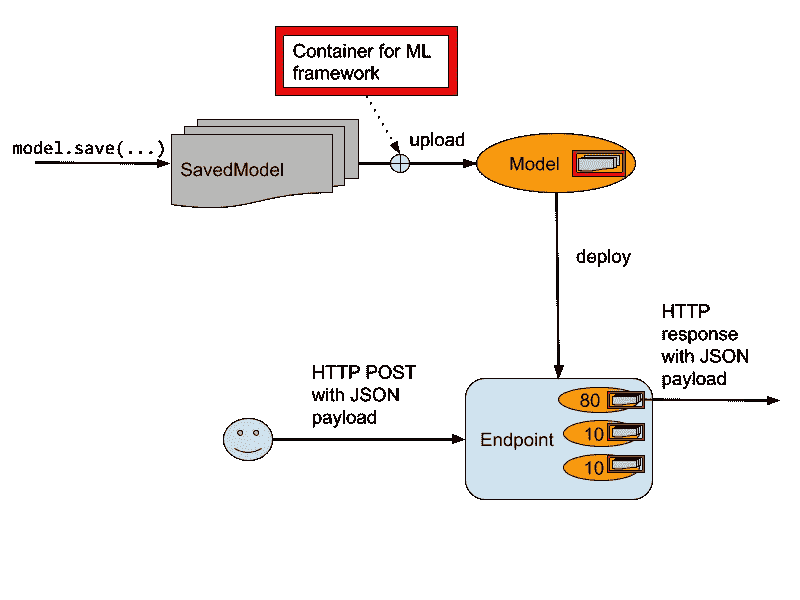
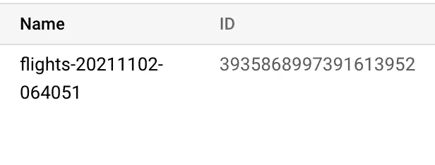

# 如何将张量流模型部署到 Vertex AI

> 原文：<https://towardsdatascience.com/how-to-deploy-a-tensorflow-model-to-vertex-ai-87d9ae1df56?source=collection_archive---------11----------------------->

## 在 Vertex AI 中使用保存的模型和端点

在本文中，我将带您了解如何将 TensorFlow/Keras 模型部署到 Vertex AI 中，并从中获得预测。

## 概念

这里有几个重要的概念，所以我们进行的时候可以参考这个图表。代码片段来自 GitHub 中的这个[笔记本。](https://github.com/GoogleCloudPlatform/data-science-on-gcp/blob/edition2/09_vertexai/flights_model_tf2.ipynb)



向 Vertex AI 部署模型的步骤。由我图解。

基本思想是客户端访问端点。每个端点都与一个 URL 相关联。客户端发送一个带有 JSON 有效负载的 HTTP Post 请求，其中包含预测方法的输入。

端点包含许多顶点 AI 模型对象，它在这些对象之间划分流量。在上图中，80%的流量流向模型 1，10%流向模型 2，其余流向模型 3。

顶点 AI 模型是一个对象，它引用了在各种框架(TensorFlow、PyTorch、XGBoost 等)中构建的模型。).每个框架都有预构建的容器映像。如果你使用的是不被 Vertex AI 直接支持的 ML 框架，你也可以引入你的容器。

TensorFlow 容器图像会查找已保存的 Model 文件，当您从训练代码中调用 model.save(…)时，默认情况下 Keras/TensorFlow 2.0 模型会导出为这种格式。

## 第一步。在 Keras 中保存训练模型

在 TensorFlow 2.0 中编写机器学习模型的推荐方法是使用 Keras API。简而言之，它包括以下步骤:

```
# 1\. Create a tf.data Dataset
train_dataset = read_dataset(training_data_uri, train_batch_size)
eval_dataset = read_dataset(validation_data_uri, eval_batch_size)# 2\. Create a Keras Model
inputs = tf.keras.layers.Input(...)
layer_1 = tf.keras.layers.... (inputs) 
...
outputs = tf.keras.layers.Dense(...)(layer_n)
model = tf.keras.Model(inputs, output)
model.compile(optimizer='adam',
              loss='binary_crossentropy',
               metrics=['accuracy'])# 3\. Train
model.fit(train_dataset, validation_data=eval_dataset, ...)# 4\. Save model
EXPORT_PATH = 'gs://{}/export/flights_{}'.format(bucket,
                                     time.strftime("%Y%m%d-%H%M%S"))
model.save(EXPORT_PATH)
```

上面的关键步骤是，你的训练程序将训练好的模型保存到谷歌云存储的一个目录中。

## 第二步。上传模型

我建议您为每个模型使用一个唯一的显示名称(Vertex AI 确实分配了一个唯一的模型 id，但它是一个不透明的数字，不可读)。



给模型分配一个唯一的名称，因为顶点 AI 分配的唯一 ID 不是人类可以理解的

一种简单的方法是在您想要使用的名称后面附加一个时间戳，这样每次您上传一个模型时，您就有了一个新的名称:

```
TIMESTAMP=$(date +%Y%m%d-%H%M%S)
MODEL_NAME=flights-${TIMESTAMP}
```

然后，将保存的模型文件上传到上面的模型，为您的 ML 框架指定[预建顶点容器](https://cloud.google.com/vertex-ai/docs/training/pre-built-containers):

```
gcloud beta ai models upload --region=$REGION \
     --display-name=$MODEL_NAME \
     --container-image-uri=us-docker.pkg.dev/vertex-ai/prediction/tf2-cpu.2-6:latest \
     --artifact-uri=$EXPORT_PATH
```

## 第三步。创建端点

您还希望端点有一个唯一的名称，但是您不会创建多个端点。只有一个。因此，不需要时间戳。在创建端点之前，只需验证它不存在:

```
ENDPOINT_NAME=flights
if [[ $(gcloud ai endpoints list --region=$REGION \
        --format='value(DISPLAY_NAME)' --filter=display_name=${ENDPOINT_NAME}) ]]; then
    echo "Endpoint $ENDPOINT_NAME already exists"
else
    # create model
    echo "Creating Endpoint $ENDPOINT_NAME for $MODEL_NAME"
    gcloud ai endpoints create --region=${REGION} --display-name=${ENDPOINT_NAME}
fi
```

## 第四步。将模型部署到端点

将模型部署到端点，确保指定您需要的机器类型(包括 GPU 等。)和流量分流:

```
gcloud ai endpoints deploy-model $ENDPOINT_ID \
  --region=$REGION \
  --model=$MODEL_ID \
  --display-name=$MODEL_NAME \
  --machine-type=n1-standard-2 \
  --min-replica-count=1 \
  --max-replica-count=1 \
  --traffic-split=0=100
```

因为这是第一个模型，我们发送 100%的流量到这个模型

```
— traffic-split=0=100
```

如果我们有一个旧的模型，我们将指定两个模型之间的相对分割。要将 10%的流量发送到新型号，将 90%的流量发送到旧型号，我们需要:

```
--traffic-split=0=10,OLD_DEPLOYED_MODEL_ID=90
```

请注意，所有这些命令都需要模型 ID 和端点 ID(而不是模型名称和端点名称)。要从名称中获取 ID(假设您使用了我推荐的唯一名称):

```
MODEL_ID=$(gcloud ai models list --region=$REGION \
           --format='value(MODEL_ID)' \
           --filter=display_name=${MODEL_NAME})ENDPOINT_ID=$(gcloud ai endpoints list --region=$REGION \
              --format='value(ENDPOINT_ID)' \
              --filter=display_name=${ENDPOINT_NAME})
```

如果你没有使用唯一的名字(坏主意！)，您可以获得最近部署的模型或端点的 id:

```
ENDPOINT_ID=$(gcloud ai endpoints list --region=$REGION \
              --format='value(ENDPOINT_ID)'\
              --filter=display_name=${ENDPOINT_NAME} \
              **--sort-by=creationTimeStamp | tail -1**)
```

## 把这些放在一起。

下面是上面的所有代码片段，便于复制粘贴:

```
## CHANGE
EXPORT_PATH=gs://some-bucket/some-model-dir
TF_VERSION=2-6
ENDPOINT_NAME=flights
REGION=us-central1##TIMESTAMP=$(date +%Y%m%d-%H%M%S)
MODEL_NAME=${ENDPOINT_NAME}-${TIMESTAMP}
EXPORT_PATH=$(gsutil ls ${OUTDIR}/export | tail -1)
echo $EXPORT_PATHif [[ $(gcloud ai endpoints list --region=$REGION \
        --format='value(DISPLAY_NAME)' --filter=display_name=${ENDPOINT_NAME}) ]]; then
    echo "Endpoint for $MODEL_NAME already exists"
else
    # create model
    echo "Creating Endpoint for $MODEL_NAME"
    gcloud ai endpoints create --region=${REGION} --display-name=${ENDPOINT_NAME}
fiENDPOINT_ID=$(gcloud ai endpoints list --region=$REGION \
              --format='value(ENDPOINT_ID)' --filter=display_name=${ENDPOINT_NAME})
echo "ENDPOINT_ID=$ENDPOINT_ID"# delete any existing models with this name
for MODEL_ID in $(gcloud ai models list --region=$REGION --format='value(MODEL_ID)' --filter=display_name=${MODEL_NAME}); do
    echo "Deleting existing $MODEL_NAME ... $MODEL_ID "
    gcloud ai models delete --region=$REGION $MODEL_ID
done# upload model
gcloud beta ai models upload --region=$REGION --display-name=$MODEL_NAME \
     --container-image-uri=us-docker.pkg.dev/vertex-ai/prediction/tf2-cpu.${TF_VERSION}:latest \
     --artifact-uri=$EXPORT_PATH
MODEL_ID=$(gcloud ai models list --region=$REGION --format='value(MODEL_ID)' --filter=display_name=${MODEL_NAME})
echo "MODEL_ID=$MODEL_ID"# deploy model to endpoint
gcloud ai endpoints deploy-model $ENDPOINT_ID \
  --region=$REGION \
  --model=$MODEL_ID \
  --display-name=$MODEL_NAME \
  --machine-type=n1-standard-2 \
  --min-replica-count=1 \
  --max-replica-count=1 \
  --traffic-split=0=100
```

## 第五步。调用模型

下面是客户端如何调用您已经部署的模型。假设他们在一个名为 example_input.json 的 JSON 文件中有输入数据:

```
{"instances": [
  {"dep_hour": 2, "is_weekday": 1, "dep_delay": 40, "taxi_out": 17, "distance": 41, "carrier": "AS", "dep_airport_lat": 58.42527778, "dep_airport_lon": -135.7075, "arr_airport_lat": 58.35472222, "arr_airport_lon": -134.57472222, "origin": "GST", "dest": "JNU"},
  {"dep_hour": 22, "is_weekday": 0, "dep_delay": -7, "taxi_out": 7, "distance": 201, "carrier": "HA", "dep_airport_lat": 21.97611111, "dep_airport_lon": -159.33888889, "arr_airport_lat": 20.89861111, "arr_airport_lon": -156.43055556, "origin": "LIH", "dest": "OGG"}
]}
```

他们可以发送 HTTP 帖子:

```
PROJECT=$(gcloud config get-value project)
ENDPOINT_ID=$(gcloud ai endpoints list --region=$REGION \
              --format='value(ENDPOINT_ID)' --filter=display_name=${ENDPOINT_NAME})curl -X POST \
  -H "Authorization: Bearer "$(gcloud auth application-default print-access-token) \
  -H "Content-Type: application/json; charset=utf-8" \
  -d [@example_input](http://twitter.com/example_input).json \
  "[https://${REGION}-aiplatform.googleapis.com/v1/projects/${PROJECT}/locations/${REGION}/endpoints/${ENDPOINT_ID}:predict](https://${REGION}-aiplatform.googleapis.com/v1/projects/${PROJECT}/locations/${REGION}/endpoints/${ENDPOINT_ID}:predict)"
```

他们将得到 JSON 格式的结果:

```
{
  "predictions": [
    [
      0.228779882
    ],
    [
      0.766132474
    ]
  ],
  "deployedModelId": "2339101036930662400",
  "model": "projects/379218021631/locations/us-central1/models/3935868997391613952",
  "modelDisplayName": "flights-20211102-064051"
}
```

当然，它是一个 REST API，所以您可以从几乎任何语言中调用它。也有可用的客户端 API 库。

## 利益

在本文中，我向您展示了如何在 Vertex AI 上部署一个经过训练的 TensorFlow 模型。

Vertex AI 为机器学习模型提供了一个完全管理的、自动缩放的、无服务器的环境。只有在您使用 GPU 时，您才能享受到为其付费的好处。因为模型是容器化的，所以依赖关系管理得到了关注。端点负责流量分流，允许您以方便的方式进行 A/B 测试。

好处不仅仅是不必管理基础架构。一旦你的模型被部署到 Vertex AI，你无需任何额外的代码就可以获得许多简洁的功能——可解释性、漂移检测、监控等等。

尽情享受吧！

# 更多关于 Vertex AI 的阅读:

1.  [给谷歌云上的新统一 ML 平台 Vertex AI 一个旋转](/giving-vertex-ai-the-new-unified-ml-platform-on-google-cloud-a-spin-35e0f3852f25) :
    我们为什么需要它，无代码 ML 培训到底有多好，所有这些对数据科学工作意味着什么？
2.  [如何将 TensorFlow 模型部署到 Vertex AI](/how-to-deploy-a-tensorflow-model-to-vertex-ai-87d9ae1df56) :在 Vertex AI 中使用保存的模型和端点
3.  [使用 Python 在 Vertex AI 上开发和部署机器学习模型](https://medium.com/@lakshmanok/developing-and-deploying-a-machine-learning-model-on-vertex-ai-using-python-865b535814f8):编写让你的 MLOps 团队满意的训练管道
4.  [如何在 Vertex AI 中为超参数调整构建 MLOps 管道](https://lakshmanok.medium.com/how-to-build-an-mlops-pipeline-for-hyperparameter-tuning-in-vertex-ai-45cc2faf4ff5) :
    为超参数调整设置模型和协调器的最佳实践