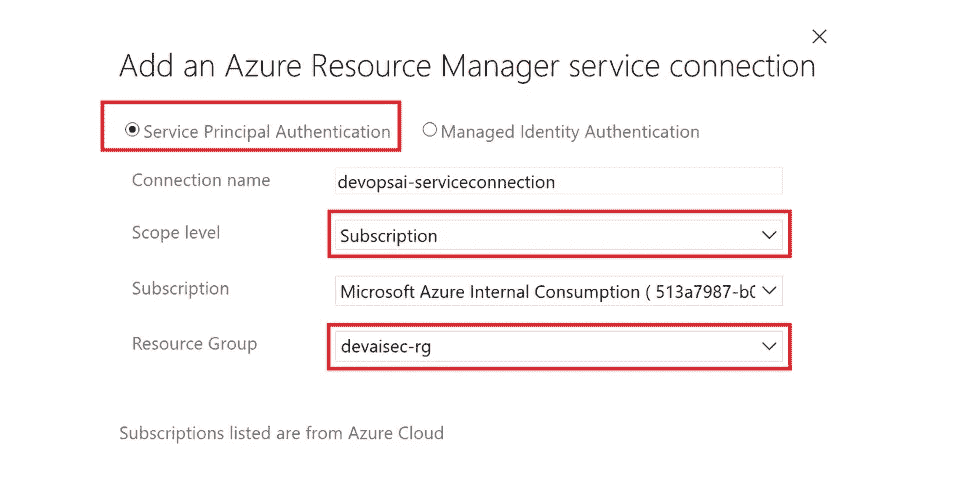

# 如何将 Azure 机器学习模型部署为安全端点

> 原文：<https://towardsdatascience.com/how-to-deploy-azure-machine-learning-models-as-a-secure-endpoint-704382bc71fd?source=collection_archive---------12----------------------->

## 了解如何使用 Azure API 管理构建 MLOps 管道，以将模型部署为安全端点。

# 1.介绍

机器学习运营( [MLOps](https://en.wikipedia.org/wiki/MLOps) )的目标是在生产中部署和维护机器学习模型。MLOps 管道的一个常见工件是最终用户应用程序可以使用的实时评分端点。关键是使用网络隔离和身份验证来保护此端点。在这篇 blogpost 和 git repo `[blog-mlopsapim-git](https://github.com/rebremer/blog-mlopsapim-git)`中，讨论了 Azure 中的 MLOps 管道，它执行以下操作:

*   1.创建 Azure DevOps 项目并创建 Azure ML、AKS 和 API 管理基础架构
*   2.在 Azure ML 中训练和创建模型
*   3a。将模型作为 docker 映像部署在隔离的 Azure Kubernetes 集群上
*   3b。使用 [Azure API 管理](https://docs.microsoft.com/en-us/azure/api-management/api-management-key-concepts)和 Azure AD 公开安全端点

另请参见下图:


1.架构概述，图片由作者提供

这个项目是基于[克莱门斯·西布勒](https://www.linkedin.com/in/csiebler/)所做的伟大工作，可以在这里[找到](https://github.com/csiebler/mlops-demo)。在这篇博文的剩余部分，将会更详细地解释这个项目。在下一章中，将描述如何设置 MLOps 项目。

# 2.设置 MLOps 项目

在本章中，将创建一个 MLOps 项目。在这方面，需要做以下工作:

*   2.1 先决条件
*   2.2 创建 Azure DevOps 项目
*   2.3 创建服务连接
*   2.4 替代变量

## 2.1 先决条件

本教程需要以下资源:

*   [Azure 账号](https://azure.microsoft.com/en-us/free/)
*   [天蓝色 DevOps](https://azure.microsoft.com/en-us/services/devops/)
*   [Azure CLI](https://docs.microsoft.com/en-us/cli/azure/install-azure-cli?view=azure-cli-latest) (推荐，也用于故障排除)

随后，转到 Azure 门户并创建一个资源组，所有 Azure 资源都将部署在该资源组中。这也可以使用以下 Azure CLI 命令来完成:

```
az group create -n <<your resource group>> -l <<your location>>
```

## 2.2 创建 Azure DevOps 项目

Azure DevOps 是一个工具，可以持续地构建、测试和部署你的代码到任何平台和云。创建新项目后，单击存储库文件夹并选择导入以下存储库:

*   【https://github.com/rebremer/blog-mlopsapim-git 

也见下图。


2.2 将存储库添加到您的 Azure DevOps 项目中，图片由作者提供

## 2.3 创建服务连接

从 Azure DevOps 访问资源组中的资源需要服务连接。转到项目设置，服务连接，然后选择 Azure 资源管理器，另见下图。


2.3.1 将存储库添加到您的 Azure DevOps 项目，image by author

选择服务主体身份验证，并将范围限制到您之前创建的资源组，另请参见下图。



2.3.2 按作者将范围限制到资源组、图像

## 2.4 替代变量

转到您的 repo，找到`[pipelines/german-credit-config.yml](https://github.com/rebremer/blog-mlopsapim-git/blob/master/pipelines/german-credit-config.yml)`并修改值以指向您的工作区，也见下文

```
variables: 
  #
  ml_workspace_connection: '<<service connection created in 2.3>>'  
  ...
  # subscription 
  ml_subscription_id: '<<your subscription>>'
  ...
  # apim
  ml_apim_name: '<<your apim name'
  ml_apim_email: '<<your email address>>'
  ml_location: 'westeurope'
  ml_tenant_id: '<<your tenant id>>'
```

所有其他变量都可以替换，但这不是成功构建所必需的。MLOps 项目现在可以运行了。

# 3.使用 Azure API 管理部署 MLOps 管道

在这一章中，项目开始运行，MLOps 管道将被部署，生成安全端点作为主要工件。在这方面，需要做以下工作:

*   3.1 MLOps 管道描述
*   3.2 运行管道
*   3.3 测试安全端点

## 3.1 MLOps 管道描述

在这个 git repo 中，创建了四个管道，它们将在下一章中运行。管道可以描述如下:

*   `[pipelines/1-german-credit-infrastructure.yml](https://github.com/rebremer/blog-mlopsapim-git/blob/master/pipelines/1-german-credit-infrastructure.yml)` -部署带有数据集的 Azure ML 工作区、VNET 的私有 AKS 集群和 Azure Api 管理
*   `[pipelines/2-german-credit-train-and-register.yml](https://github.com/rebremer/blog-mlopsapim-git/blob/master/pipelines/2-german-credit-train-and-register.yml)` -自动训练和注册模型
*   `[pipelines/3a-german-credit-deploy.yml](https://github.com/rebremer/blog-mlopsapim-git/blob/master/pipelines/3a-german-credit-deploy.yml)` -将训练好的模型部署到 AKS 集群，创建私有端点和密钥认证。密钥更新是部署过程的一部分。
*   `[pipelines/3b-german-credit-apimoperation.yml](https://github.com/rebremer/blog-mlopsapim-git/blob/master/pipelines/3b-german-credit-apimoperation.yml)` -部署暴露私有 AKS 端点的 APIM 端点。APIM 的用户身份验证基于 Azure AD。反过来，APIM 后端是 AKS 私有端点的一部分，密钥身份验证用于向 AKS 端点进行身份验证。密钥更新是部署过程的一部分。

在下一章中，将描述如何部署管道 1。对于其他三个管道，可以遵循类似的过程。

## 3.2 运行管道

转到您的 Azure DevOps 项目，选择管道，然后单击“新建管道”。转到向导，选择您之前创建的 Azure Repos Git 和 git repo。在“配置”选项卡中，选择“现有的 Azure Pipelines YAML 文件”,然后选择可以在 git repo 中找到的`[pipelines/1-german-credit-infrastructure.yml](https://github.com/rebremer/blog-mlopsapim-git/blob/master/pipelines/1-german-credit-infrastructure.yml)`,也见下文。


3.2.1 在管道配置向导中，选择现有的 Azure 管道 YAML 文件，按作者排序的图像

一旦创建了管道，它就会立即运行，如下所示。


3.2.2 Azure DevOps 部署现代数据管道，图片由作者提供

作业运行后，部署所有资源并执行测试。随后，运行属于管道文件夹的所有其他管道，如 3.1 中所述。

如果所有管道都运行成功，那么在 API 管理中会创建一个 API，指向私有 AKS 集群的 URL


3.3 在 API 中成功部署，图像由作者提供

随后，score 操作使用 JWT 令牌验证来验证传入的 Azure AD 请求，并使用带密钥的命名值向 AKS 私有端点进行身份验证，另请参见`[api_policy_template.xml](https://github.com/rebremer/blog-mlopsapim-git/blob/master/pipelines/scripts/api_policy_template.xml)`。

## 3.3.测试安全端点

在所有管道运行之后，部署一个由 API 管理器公开的端点。身份验证需要 Azure 承载令牌。通常，托管身份或服务主体用于创建承载令牌。在 [github](https://github.com/rebremer/blog-mlopsapim-git/blob/master/README.md#testing) 中，可以找到一个用服务主体生成的承载令牌进行测试的例子。

作为一个快速测试，也可以决定使用以下 CLI 命令从已经登录的用户创建一个承载令牌。

```
az account get-access-token --query accessToken --output tsv
```

然后，令牌可以被复制并在下面的脚本(或 Postman)中使用

```
token = resp.json()['access_token']
#
url = 'https://<<your apim>>.azure-api.net/testprivv2/score'
#
test_data = {
  'data': [{
    "Age": 20,
    "Sex": "male",
    "Job": 0,
    "Housing": "own",
    "Saving accounts": "little",
    "Checking account": "little",
    "Credit amount": 100,
    "Duration": 48,
    "Purpose": "radio/TV"
  }]
}

headers = {'Content-Type':'application/json', 'Authorization': 'bearer ' + token}
resp = requests.post(url, json=test_data, headers=headers)

print("Prediction (good, bad):", resp.text)
```

# 4.结论

机器学习操作( [MLOps](https://en.wikipedia.org/wiki/MLOps) )旨在部署和维护生产中的机器学习模型。MLOps 管道的一个常见工件是由最终用户应用程序使用的 REST 端点。在 blogpost 和 git repo `[blog-mlopsapim-git](https://github.com/rebremer/blog-mlopsapim-git),`中，讨论了一个项目，该项目 1)所有的基础设施，2)构建和训练一个模型，3a)部署模型作为端点，3b)保护端点，参见下面的体系结构。


4.架构概述，按作者列出的图像