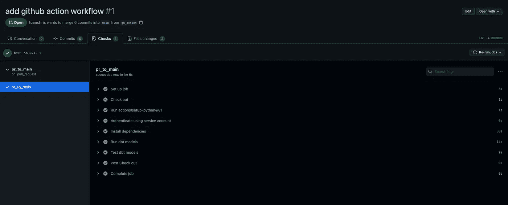

# 如何使用 GitHub 操作将 dbt 部署到生产环境中

> 原文：<https://towardsdatascience.com/how-to-deploy-dbt-to-production-using-github-action-778bf6a1dff6?source=collection_archive---------2----------------------->

## 如何将 dbt 部署到生产环境中。


由[萨姆·劳埃德](https://unsplash.com/@samloyd?utm_source=medium&utm_medium=referral)在 [Unsplash](https://unsplash.com?utm_source=medium&utm_medium=referral) 上拍摄的照片

随着现代数据栈的兴起，越来越多的人使用 dbt 作为数据转换的主要工具，也就是数据建模。Fishtown 的员工创造了一个令人惊叹的 dbt 云产品，能够满足大大小小的数据团队的需求。借助 dbt Cloud，任何分析师，无论是经验丰富的还是新手，都可以轻松地开始建模并将数据转换管道部署到生产中。

我强烈推荐看看 dbt Cloud，因为该产品不仅仅是帮助您部署 dbt。首先，让我们看看如何不应该将 dbt 部署到生产环境中。

# 不要做什么

有许多方法可以将 dbt 部署到生产环境中。然而，并不是所有的方法都是好的。以下是一些不太好的方法:

## 启动一个计算实例？


洛伦佐·埃雷拉在 [Unsplash](https://unsplash.com?utm_source=medium&utm_medium=referral) 上的照片

一种常见的方法是启动计算实例并安装所需的包。从这里，人们可以运行一个 cron 作业来按计划执行`git pull`和`dbt run`。

这是一个经典的过度解决方案，因为 dbt 不需要大量的资源来运行。dbt 实际做的是编译查询，并将它们发送到您的数据仓库并等待响应。如果您想要管道故障通知，您通常也必须自己实现。

此外，大多数时候，您的实例将会闲置浪费您的资金，因为 dbt 通常一天只运行几分钟到不到一个小时。使用此选项也没有简单的解决方案来实现 CI/CD。

## 好的，气流呢？


照片由 [Michal Matlon](https://unsplash.com/@michalmatlon?utm_source=medium&utm_medium=referral) 在 [Unsplash](https://unsplash.com?utm_source=medium&utm_medium=referral) 上拍摄

嗯，看情况。如果生产中还没有气流运行，现在可能就不需要了。还有比这更简单/优雅的解决方案(dbt Cloud，GitHub Actions，GitLab CI)。此外，这种方法与使用计算实例有许多共同的缺点，例如浪费资源，并且没有 CI/CD 的简单方法。

但是，如果您的团队使用 Airflow 或任何其他管道编排器，您可以考虑编写一个 dag 来触发 dbt。特别是当你在不同的时间间隔有不同的摄入，需要触发 dbt 或随后的任务时。

# 使用 dbt 云在生产中部署 dbt

在我看来，这是首选。借助 dbt Cloud，您拥有一个永远免费的开发人员席位，一个人的数据团队绝对可以利用这个席位。如果您的团队规模较大，您可以每人每月支付少量费用，并获得以下所有功能:

*   基于浏览器的 [IDE](https://docs.getdbt.com/docs/the-dbt-ide)
*   作业调度
*   每日不限跑步次数
*   记录和警报
*   数据文档
*   GitHub 和 GitLab 集成
*   源新鲜度报告
*   根据拉取请求构建

# 使用 GitHub 动作在生产中部署 dbt

因为 dbt 总是使用 git 部署，所以利用您选择的 git 提供者的 CI/CD 功能是将 dbt 部署到生产环境的最佳方式。使用这种方法，您将获得很大的灵活性。

让我们看看如何使用 [GitHub Action](https://github.com/features/actions) s 来做到这一点。免费配额对您和您的团队来说可能足够了，但是如果您有一个大型团队或者在其他项目中使用 GitHub Action，您可能会达到配额并需要升级。

## 为 GitHub 操作设置 dbt 配置文件

在您的存储库的根目录下创建一个`profiles.yml`文件。每次运行时，dbt 都会在 settings 中查找这个文件进行读取。

如果使用不同于 BigQuery 的数据仓库，请确保相应地更改参数。按照这里的[指令](https://docs.github.com/en/actions/reference/encrypted-secrets)，环境变量可以被定义为 GitHub 中的存储库机密。

注意，我们对不同的环境有两个不同的目标:dev 和 prod。运行 dbt run 将默认为 dev(由 target 键配置)。如果您想在 prod 目标上运行，请使用`dbt run --target prod`。

## 设置凭据

在使用 GitHub 操作运行任何东西之前，您需要一个服务凭证来验证对您的数据仓库的访问。强烈建议您为此创建一个专用凭据，而不是使用您自己的帐户。这样，如果您由于某种原因无法访问您的帐户，该服务仍将运行。

请务必授予您的帐户必要的权限。在上面的例子中，我们使用 BigQuery，这意味着创建一个`github-action`服务帐户，授予它对数据源的读权限和对数据目的地的写权限。

如果您使用文件凭证(服务帐户而不是用户名和密码)，您仍然可以像上面一样使用 GitHub secret，并使用`echo`命令将其写入文件。

## dbt 按计划运行

您可以使用下面的模板来添加在 cron 时间表上运行的 GitHub Actions 作业。将此文件添加到您的 repo 中的`.github/workflows/`文件夹。如果文件夹不存在，请创建它们。

这个脚本将为大多数 dbt 工作流执行必要的步骤。如果您有另一个特殊命令，如 snapshot 命令，您可以在中添加另一个步骤。

使用 [cron 调度](https://crontab.guru/)触发该工作流。上面配置的计划意味着每天在 UTC 时间上午 5 点和下午 5 点运行工作流。所有时间都采用 UTC，因此您可能希望将时间表转换为您的本地时间。

就是这样，作业每天会被触发两次，如果作业失败会通知你。

## 合并时运行 dbt

许多开发团队的一个常见工作流程是，每当代码库发生变化时，就创建`pull requests`。对上面的`yml`文件进行简单的修改就可以实现这一点。

```
push:
    branches:
      - main
```

根据所需的行为，您可以为此创建一个新的工作流或将其与上面的工作流合并。将两者分开的一个常见用例是只运行在合并到 main 时发生变化的模型。这可以通过使用 dbt [slim CI](https://docs.getdbt.com/docs/dbt-cloud/using-dbt-cloud/cloud-enabling-continuous-integration-with-github) 特性来实现，这是另一篇文章的主题。

## 使用拉取请求进行测试

此事件的工作流脚本与上面的非常相似。一个主要的区别是，这个工作流将在开发环境而不是生产环境中运行。这确保了任何更改在部署到生产环境之前都经过验证、审查和测试。

您可以看到我们不需要指定目标，因为 dev 是我们的`profiles.yml`文件中的默认目标。每次有一个`pull request`到 main，这个工作流就会运行。



一次成功的工作流运行—作者提供的图片

在较小的型号上，GitHub Actions 只需要 1 分钟就可以完成所有工作。还不错！如果你有太多的模型或者太多的数据，那么每次都运行是没有意义的。我将在以后的文章中解决这个问题。

## 林挺与 sqlfluff

在编写 SQL 模型时，我错过的一件事是一个好的 linter。遵循一致同意的约定是很重要的，这样你的代码库就不会随着时间的推移而失去控制。使用 dbt 的林挺有点复杂，因为它实际上是使用不同方言的 Jinja SQL。

我们最终能够采用的一个好方法是 [sqlfluff](https://github.com/sqlfluff/sqlfluff) 。然而，它并不是 100%没有错误，所以要小心。您只需要运行`pull request`到`main`工作流的 linter。为此，请将以下步骤添加到您的工作流程中:

我也在这里分享我们的 sqlfluff 配置[，供你参考。](https://gist.github.com/tuanchris/c0624f63a95ea1e6b18c0092ac1608c7)

# 结论

这星期就这些了。我们涵盖了:

*   为 GitHub 操作设置 dbt 和凭证
*   在 cron 调度上运行 dbt
*   对 main 的 pull 请求运行 dbt
*   使用 sqlfluff 的林挺 dbt 代码

✌️