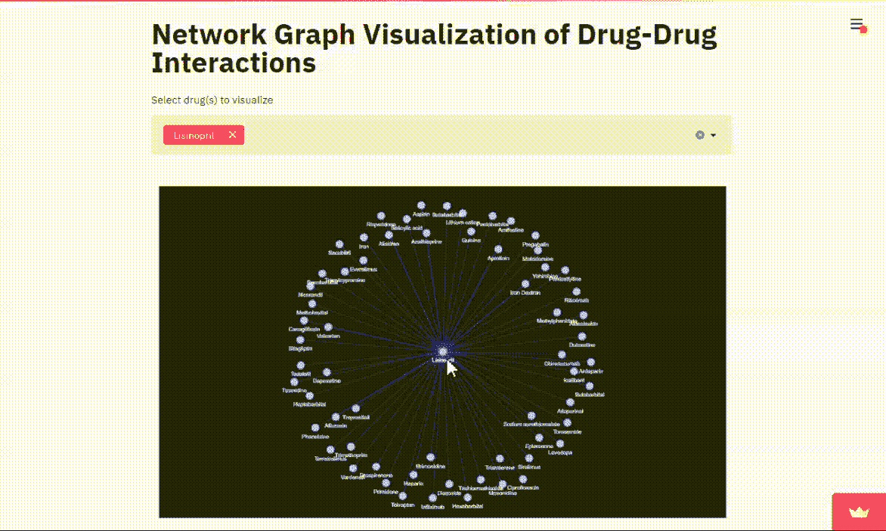
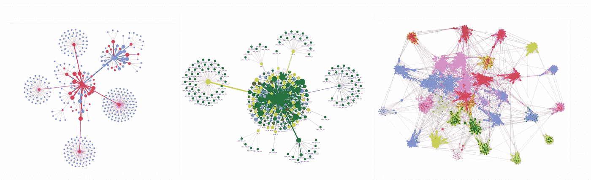
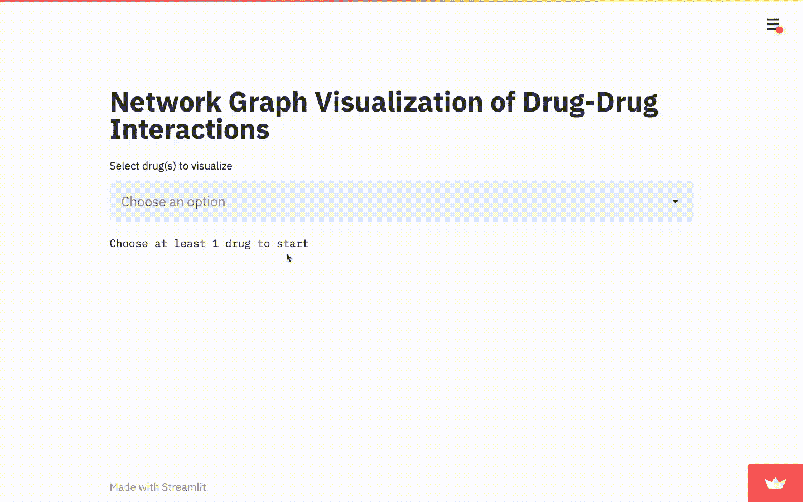
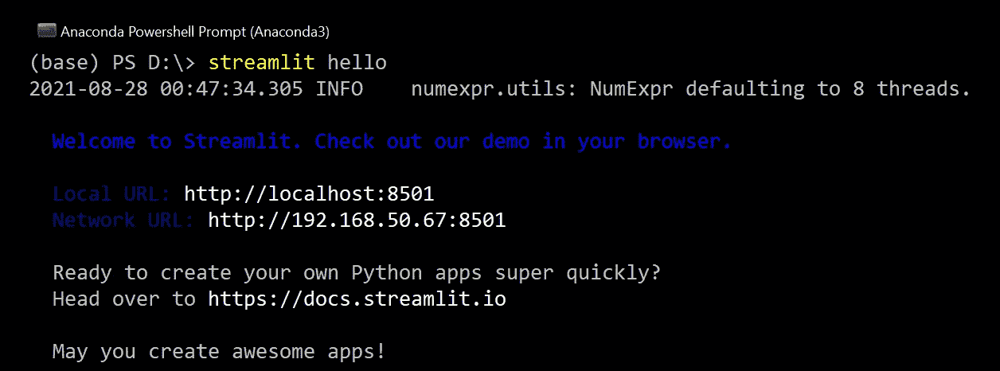
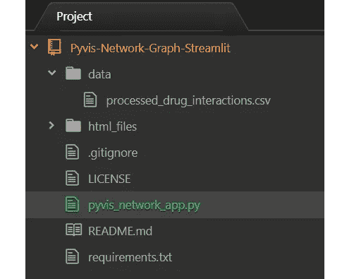
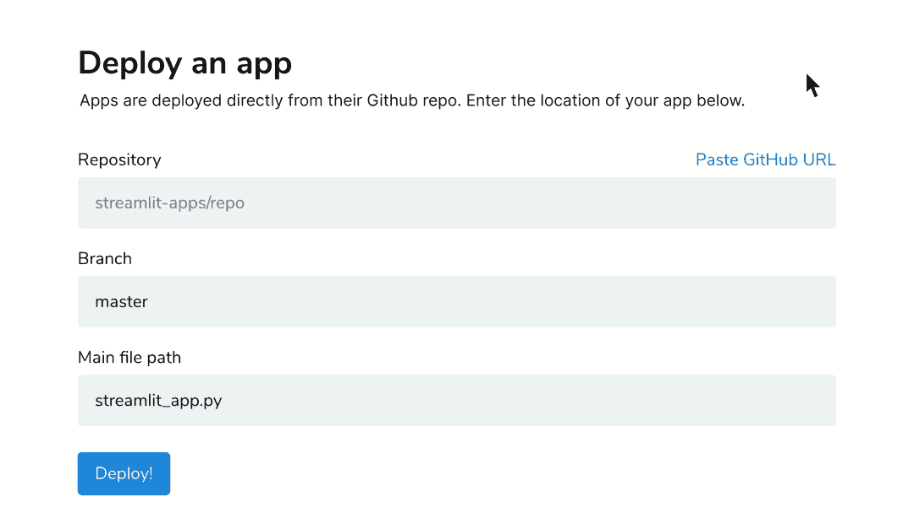

# 如何在 Streamlit 上部署交互式 Pyvis 网络图

> 原文：<https://towardsdatascience.com/how-to-deploy-interactive-pyvis-network-graphs-on-streamlit-6c401d4c99db?source=collection_archive---------12----------------------->

## 使用 Python 在线发布您美丽的网络图，并简化它，让全世界都能看到并与之互动



作者图片

网络图的可视化有助于我们更好地理解多个实体之间的复杂关系。

除了静态图像，Python 库如[Pyvis](https://pyvis.readthedocs.io/en/latest/index.html)**允许我们为网络可视化构建**高度交互**图形。与其让这些图表闲置在您本地的 Jupyter 笔记本和文件中，不如将它们部署到网上供其他人使用。**

在本文中，我们将了解到**将** Pyvis 交互式网络图部署为 Streamlit web 应用程序，并让您的用户**手动选择**要可视化的节点。



在 [pyvis BSD 许可下使用的网络|图像示例](https://github.com/WestHealth/pyvis/blob/master/LICENSE_BSD.txt)

# 内容

> ***【1】****[*目标*](#f34c)***【2】****[*分步指南*](#a1d4)***(3)***[*总结*](#ac03)**

# **(1)目标**

**[Streamlit](https://streamlit.io/) 是一个开源的 Python 库，可以轻松创建和共享用于数据科学的定制 web 应用。所有这些只需要几行代码就可以在几分钟内完成。**

**这个项目的**目标**是在线发布 Pyvis 网络图，以便用户可以访问 web app 并直接与图形进行交互。**

**本文基于 [**网络分析和药物-药物相互作用的可视化**](/network-analysis-and-visualization-of-drug-drug-interactions-1e0b41d0d3df) 项目。因此，我们将再次使用来自斯坦福网络分析项目<http://snap.stanford.edu/biodata/datasets/10001/10001-ChCh-Miner.html>**的公开药物相互作用数据集。****

****</network-analysis-and-visualization-of-drug-drug-interactions-1e0b41d0d3df>  

要查看最终完成的网络图 web 应用程序，您将很快学会如何创建，请单击 [**此处**](https://share.streamlit.io/kennethleungty/pyvis-network-graph-streamlit/main/pyvis_network_app.py) 或观看下面的 **gif** 。



药物相互作用网络图应用程序演示|作者图片**** 

# ****(2)分步指南****

## ****步骤 1 —初始设置****

****我们首先安装 Streamlit 和其他必要的 Python 网络库:****

```
****pip install **streamlit** **pyvis** **networkx******
```

****要确认 Streamlit 已经成功安装，您可以在命令提示符下执行`streamlit hello`:****

********

****作者图片****

## ****步骤 2-文件夹结构和 Python 脚本****

****我们通过创建如下所示的项目文件夹来设置项目的组件:****

********

****空荡荡的*。py* 文件( **pyvis_network_app.py** )构成了后续步骤中所有 Python 代码的主文件。****

## ****步骤 3-导入依赖关系和数据****

****我们填充空白的*。py* 文件，方法是导入必要的依赖项和数据集。****

```
******# Import dependencies**
import streamlit as st
import streamlit.components.v1 as components
import pandas as pd
import networkx as nx
from pyvis.network import Network**# Read dataset**
df_interact = pd.read_csv('data/processed_drug_interactions.csv')****
```

## ****步骤 4—定义布局****

****由于 Streamlit 应用程序本质上是一个网站，我们需要计划如何组织网站布局。例如，我们可以首先通过用`st.title`定义一个 **title** 元素来创建一个标题头:****

```
******# Set header title**
st.title('Network Graph Visualization of Drug-Drug Interactions')****
```

****我们还想让用户选择他们希望在网络图中可视化的项目(又名节点)。我们可以通过用`st.multiselect`定义一个**多选下拉菜单** **菜单**来做到这一点。****

****这样，用户现在可以选择他们想要的节点。因为药品节点太多，我通过预选几个药品缩小了物品清单。****

```
******# Define selection options and sort alphabetically**
drug_list = ['Metformin', 'Glipizide', 'Lisinopril', 'Simvastatin',
            'Warfarin', 'Aspirin', 'Losartan', 'Ibuprofen']
drug_list.sort()**# Implement multiselect dropdown menu for option selection**
selected_drugs = st.multiselect('Select drug(s) to visualize', drug_list)****
```

****还有许多其他的网站元素供你使用(侧边栏，用户文本输入等。)，所以查看 [API 参考](https://docs.streamlit.io/en/stable/api.html)以获取更多信息。****

## ******步骤 5 —流量控制******

****`st.multiselect`返回用户从下拉菜单中选择的条目的 **Python 列表**。基于这些选择的项目，我们可以构建用户希望可视化的定制网络图。****

****我们实现了流控制，以便在初始站点加载时显示欢迎消息(当用户还没有选择任何项目时),并在用户选择了至少一个项目时生成网络图。****

```
******# Set info message on initial site load**
if len(selected_drugs) == 0:
   st.text('Please choose at least 1 drug to get started')**# Create network graph when user selects >= 1 item**
else:
   # *Code for filtering dataframe and generating network*****
```

****Streamlit 从上到下运行，因此当选择发生变化(例如，添加或删除项目)时，将基于新项目集生成新的网络图。****

****为了使本文简洁，上面省略了创建网络图的代码(在 *else* 语句中)。您可以在步骤 6 中的要点中查看完整的代码。****

## ****步骤 6 —在本地和 Streamlit 云上显示 HTML****

****生成的 Pyvis 网络图被导出为一个 **HTML 文件**，在读入 Streamlit 应用程序进行显示之前，我们会先将其保存到一个文件夹中。****

****在本地运行**app**时，我们可以创建一个指定的目标文件夹(如 ***/html_files*** )来保存网络图 html 文件。****

****然而，当部署在[**Streamlit Cloud**](https://streamlit.io/cloud)**(步骤 7 中有更多信息)上时，使用相同的目标文件夹<https://discuss.streamlit.io/t/file-permisson-error-on-streamlit-sharing/8291>****不起作用，因为目标路径**而**不存在于 web 服务器上。**********

******为了解决这个问题，我们可以使用 Streamlit webserver 默认的**临时文件夹** ( **/tmp** )来保存 HTML 文件。从那里，我们可以在加载 HTML 文件进行显示之前读取它。******

******为了考虑本地和在线运行的场景，我们可以在我们的脚本中实现一个 try-except 块:******

```
********# Save and read graph as HTML file (on Streamlit Sharing)**
try:
   path = '/tmp'
   drug_net.save_graph(f'{path}/pyvis_graph.html')
   HtmlFile = open(f'{path}/pyvis_graph.html','r',encoding='utf-8')**# Save and read graph as HTML file (locally)**
except:
    path = '/html_files'
    drug_net.save_graph(f'{path}/pyvis_graph.html')
    HtmlFile = open(f'{path}/pyvis_graph.html','r',encoding='utf-8')******
```

******然后我们创建一个 [**Streamlit 组件**](https://docs.streamlit.io/en/stable/develop_streamlit_components.html) 来显示 HTML 代码。******

```
********# Load HTML into HTML component for display on Streamlit**
components.html(HtmlFile.read())******
```

******要在本地查看应用程序，您可以在您的**命令提示符**中执行以下命令(从项目目录中):******

```
******streamlit **run** pyvis_network_app.py******
```

## ******完整的 Python 脚本:******

## ******第 7 步—在 Streamlit 云上部署******

******现在我们的 Python 脚本已经完成，我们可以在 [**Streamlit 共享**](https://share.streamlit.io/) 上部署我们的网络图。除了脚本，我们还需要在文件夹中包含一个[*requirements . txt*](https://github.com/kennethleungty/Pyvis-Network-Graph-Streamlit/blob/main/requirements.txt)文件。******

******在[注册并收到邀请](https://streamlit.io/cloud-sign-up)后，您可以登录并选择您的网络图 app 的 GitHub repo，然后点击**部署**按钮。******

************

******Streamlit 实际分享|在 [Apache 许可证 2.0](https://github.com/streamlit/streamlit/blob/develop/LICENSE) 下使用的图片******

******您的应用程序的网络链接基于您的 GitHub 帐户、回购和分行。比如这个 app 的链接是:【https://share.streamlit.io/】T2**肯尼特伦蒂**/**pyvis-network-graph-streamlit**/**main/pyvis _ network _ app . py********

******一旦部署**完成**，您就可以与全世界分享您的应用了！随后，每次您执行 Git 推送来更新 Python 脚本时，应用程序都会自动刷新以反映这些更改。******

************

******Fernand De Canne 在 [Unsplash](https://unsplash.com?utm_source=medium&utm_medium=referral) 上拍摄的照片******

# ******(3)总结******

******在本文中，我们看到了如何在 Streamlit 的帮助下轻松地在线部署交互式 Pyvis 网络图。你可以在这里查看最终产品。******

******还有更多的功能可以增强用户的 Streamlit web 应用体验，所以请查看[文档](https://docs.streamlit.io/en/stable/)。您也可以在此 [**GitHub repo**](https://github.com/kennethleungty/Pyvis-Network-Graph-Streamlit) 中访问该项目的代码。******

## ******在你走之前******

******欢迎您加入我们的数据科学学习之旅！点击此[媒体](https://kennethleungty.medium.com/)页面，查看我的 [GitHub](https://github.com/kennethleungty) ，了解更多精彩的数据科学内容。享受在 Streamlit 上部署网络图的乐趣！******

******</how-to-easily-draw-neural-network-architecture-diagrams-a6b6138ed875>  </the-most-starred-forked-github-repos-for-python-and-data-science-f8bb3de47e96>  </key-learning-points-from-mlops-specialization-course-deeplearning-ai-andrew-ng-5d0746605752>  

## 参考

*   [*马林卡·齐特尼克，&朱尔·莱斯科维奇。(2018).生物快照数据集:斯坦福生物医学网络数据集集合*](http://snap.stanford.edu/biodata.)
*   [*使用 Streamlit*](/turn-excel-into-a-beautiful-web-application-using-streamlit-7a18516ca01a) 将 Excel 变成漂亮的 Web 应用程序******