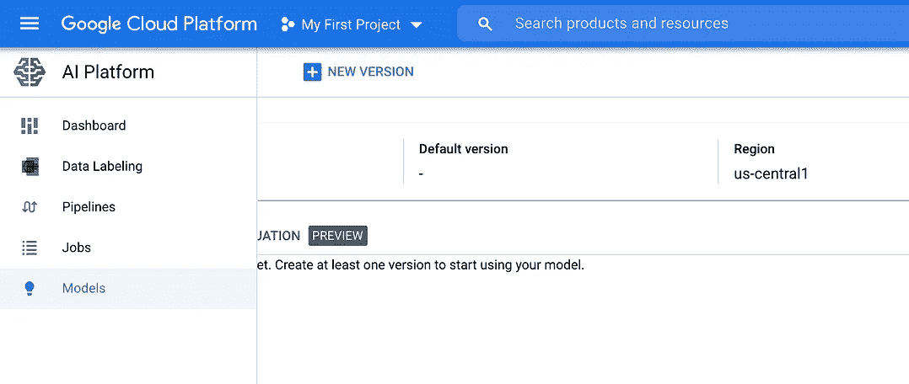
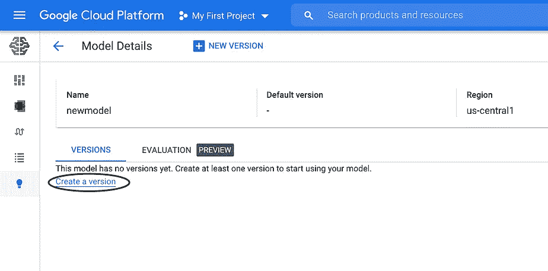
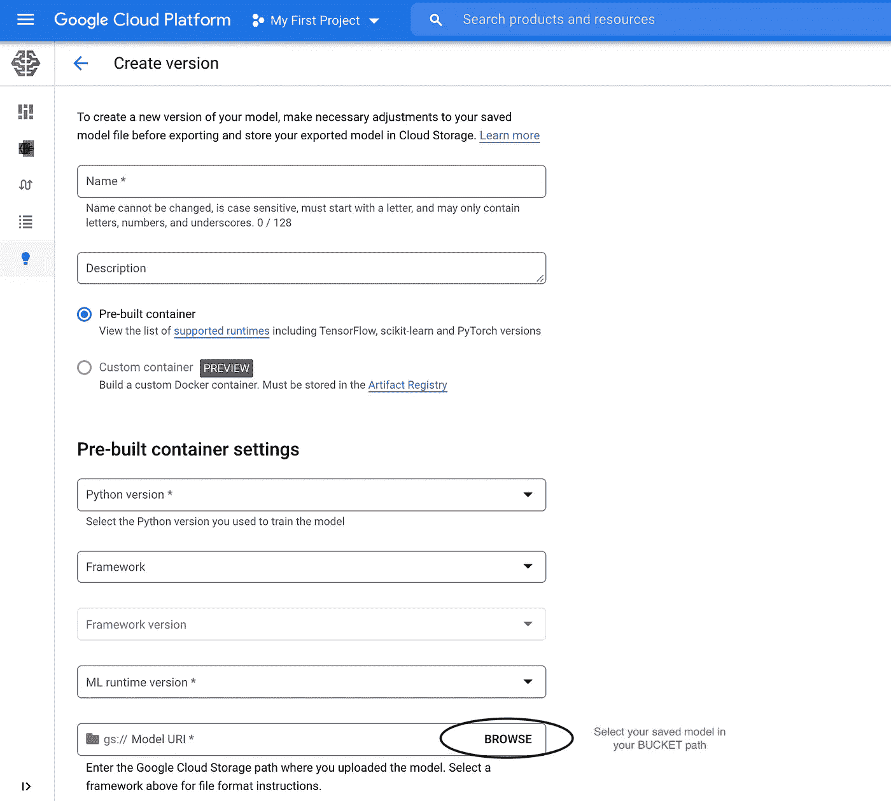
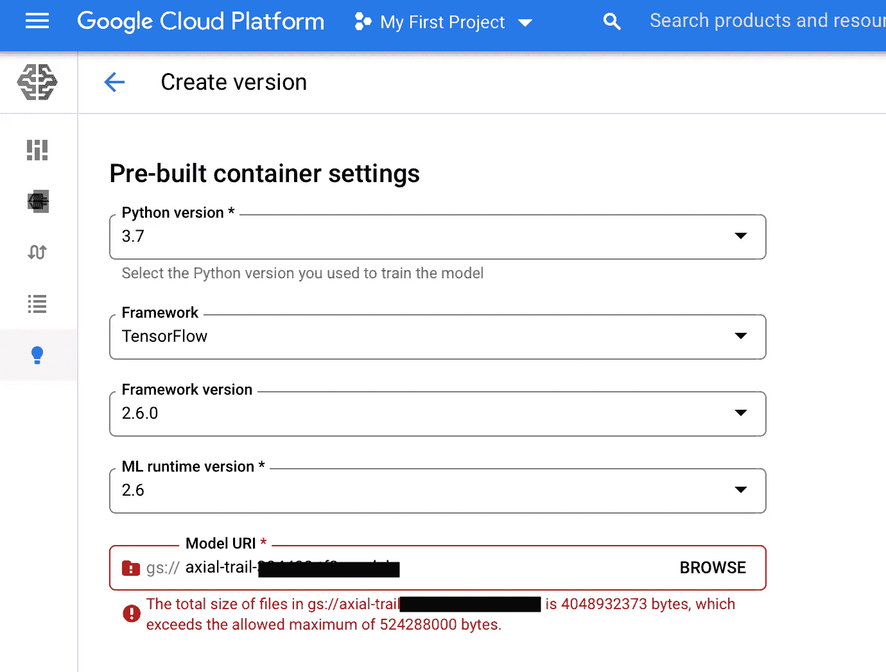

# 如何将大规模深度学习模型部署到生产中

> 原文：<https://towardsdatascience.com/how-to-deploy-large-size-deep-learning-models-into-production-66b851d17f33?source=collection_archive---------4----------------------->

## 部署具有 GB 规模的培训的深度学习模型，并将它们作为商业产品在线托管


部署大型深度学习模型——图片来自 [Pexels](https://www.pexels.com/photo/high-angle-photo-of-robot-2599244/?utm_content=attributionCopyText&utm_medium=referral&utm_source=pexels) 的[亚历山大·奈特](https://www.pexels.com/@agk42?utm_content=attributionCopyText&utm_medium=referral&utm_source=pexels)

学习如何将深度学习模型从本地机器作为离线产品部署到在线产品是非常重要的，但主要挑战之一是训练模型的大规模。这篇文章将展示在部署更大规模的深度学习模型时，不同的解决方案和方法。

# 训练后的深度学习模型

在选择了具有最佳调整和预测时间的最佳算法之后，您最终完成了模型的训练。
是时候告诉你的朋友你的成功并庆祝一下了，对吗？如果您希望在线部署模型，并快速预测响应和管理大规模的训练负载，则情况并非如此！

另一方面，Web 服务更便宜，可以提供免费空间来部署 ML 模型，但在规模方面有限制，如 [Heroku Platform](https://www.heroku.com/free) 和 [Streamlit Cloud](https://streamlit.io/) 或者，你必须为部署深度学习模型支付昂贵的服务。但同样，当涉及到需要 GPU 或 TPU 高计算能力的千兆字节训练模型时，大小将是一个巨大的挑战。

如果模型是在 GPU 或 TPU 云服务中训练的，则 CPU 性能可用性是一个问题。深度学习模型可能会遇到缓慢的在线处理，或者可供其他应用程序使用，例如通过 API 调用。并且由于深度学习模型的巨大规模和其他问题，例如在 TPU 上运行和训练模型以及在 CPU 上部署，因此很难部署深度学习模型。因此，选择如何部署具有与本地机器或 Colab 笔记本培训相同性能的云服务是硬件考虑的关键。

# 在深度学习中部署模型

通过使用像 Streamlit、 [Flask](https://flask.palletsprojects.com/en/2.0.x/installation/) 和 [Django](https://www.djangoproject.com/) 这样的 Python 框架，有许多不同的方式将深度学习模型部署为 web 应用。然后，使用 [Flask RESTful](https://flask-restful.readthedocs.io/en/latest/) 为模型服务构建一个 REST API，以便与其他在线应用程序进行交互，并使您的模型在被调用时及时动作。(这里有一篇[构建 API](/how-to-build-a-machine-learning-api-using-flask-2fb345518801) 的好文章)。

在构建了 web 应用程序接口之后，是时候将大尺寸的 [TensorFlow](https://www.tensorflow.org/install) 、 [Keras](https://keras.io/) 或 [PyTorch](https://pytorch.org/) 模型部署到真实环境中了。下面的例子使用 Streamlit 加载张量模型，但是通过阅读带下划线的特定库的文档，确保如何保存和加载您自己的模型。

***大型训练模型存储在哪里，如何存储？***

有许多方法，但让我们展示最常用和最容易使用的免费方法，但有基于您消费多少和存储数据的区域的限制(继续提供免费服务，然后您可以在免费订阅的基础上以更低的价格扩展它)。亚马逊 S3 和谷歌云存储可以归类为**【云存储】**工具。找到更多关于[亚马逊 S3](https://aws.amazon.com/s3/) 和[谷歌云存储](https://cloud.google.com/storage)的信息，创建一个存储桶(保存数据的容器)来存储你的 Gb 大小的模型。

*   **下面是一个使用** [**AWS S3 云存储**](https://docs.aws.amazon.com/AmazonS3/latest/userguide/setting-up-s3.html) 的例子
*   在 GCP (Google 云平台)创建[云存储的代码示例如下所示:](https://cloud.google.com/storage/docs/creating-buckets#storage-create-bucket-console)

```
# Colab Notebook! Run code in each cell
from google.colab import auth
auth.authenticate_user()  # Authenticate your cloud account# your project ID in GCP ( from google console my project ) 
CLOUD_PROJECT = 'axial-trail-334'# storage name
BUCKET = 'gs://' + 'axial-trail-334' + '-tf2-safarji-model' 
print(BUCKET)# with $ or !gcloud config set project 'axial-trail-334'
!gcloud config set project $CLOUD_PROJECT # with $  (create the BUCKET)
!gsutil mb $BUCKET# Revoked credentia
ls!gcloud auth revoke --all## with $  (check BUCKET) 
!gsutil ls -r $BUCKET 
```

这样，您就可以将模型部署到 AI 平台上了。在人工智能平台中，模型资源包含不同版本的模型。模型名称在项目中必须是唯一的。首先，让我们创建一个模型。

```
# Create model in Google Cloud (GCP) after following above steps 
MODEL = 'newmodel-T5'!gcloud ai-platform models create $MODEL --regions=us-central1# check google
```

*   在人工智能平台云平台，你会看到你的模型如下:



GCP 控制台——来自作者

*   基于您的模型类型 TensorFlow 或其他创建您的模型部署版本。



GCP 控制台——来自作者

> ***重要提示:如果保存模型的桶大小以 Gb 为单位非常大，由于大小超出限制，您将无法获得如下所示的 AI 平台服务。***



GCP 控制台——来自作者

> ***遗憾的是，此限制目前不可调整，但未来可能会调整。与此同时，您需要调整 vocab 和嵌入大小，或者减少模型的整体大小。此外，请联系谷歌云，根据您的项目名称调整每个项目的配额***[***【cloudml-feedback@google.com】***](http://cloudml-feedback@google.com)***。***
> 
> *问题是他们的人工智能平台规模的大多数云提供商接受大型模型。

***还有别的解决方法吗？***

是的，您可以选择一个[定制深度学习云实例](https://cloud.google.com/deep-learning-vm/docs/cloud-marketplace) (VM)和大小来部署您的模型在 GPU 和 [TPUs](https://cloud.google.com/tpu) 方面所需的最佳要求。然而，存储模型的桶将是相同的，并通过 GCP 将它加载到新服务器的新实例中，或 AWS 实例中。

***最重要的是:***AWS 中还有另外一个服务，可以部署大型变形金刚:

<https://aws.amazon.com/sagemaker/>  

# 云服务中的存储桶

在云服务中创建存储桶之后，是时候存储和加载模型了。下面是加载的一个片段:

**注意:确保使用缓存和其他策略来优化基于您使用的框架的 web 应用程序中的模型加载，因为这将有助于避免每次使用或预测时再次调用模型所耗费的时间和带宽。**

# 结论:

训练大规模的深度学习模型只是数据科学项目的一个方面，该项目投入大量精力使其在生产中(在线)可用。在这篇文章中，我们展示了在部署更大规模的深度学习模型时可以遵循的不同解决方案和方法。

根据您的应用程序，您可能需要选择一个可用选项，哪些云服务和哪些自定义实例支持模型部署和基础架构。然而，这篇文章只是我在部署大型深度学习模型时所经历的一个例子。但是我认为它为云服务和云存储工具方面的另一个概述提供了一个起点。生产中的深度学习模型还有很多其他后续动作，包括在 GPU 和 TPU 上的训练评测；然而，这些是为下一篇文章准备的。

# 参考资料:

<https://cloud.google.com/ai-platform/prediction/docs/deploying-models>  <https://aws.amazon.com/getting-started/hands-on/build-train-deploy-machine-learning-model-sagemaker/>  <https://www.tensorflow.org/tutorials/keras/save_and_load>  <https://acloudguru.com/videos/cloud-provider-comparisons/cloud-provider-comparisons-aws-vs-azure-vs-gcp-storage?utm_campaign=11244863417&utm_source=google&utm_medium=cpc&utm_content=469352928666&utm_term=_&adgroupid=115625160932&gclid=Cj0KCQiA2NaNBhDvARIsAEw55hjHEBCHxdry4t-gA2qgkNZll1W-yT1ELlVPnKOkzP1e_0UgutXWVvMaAk9iEALw_wcB>  

这篇文章中的所有源代码以及更多内容可以在我的 GitHub 上找到:[https://gist.github.com/A-safarji](https://gist.github.com/A-safarji)