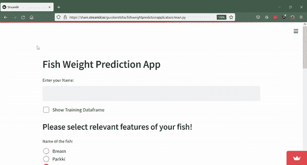
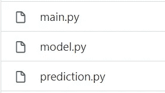
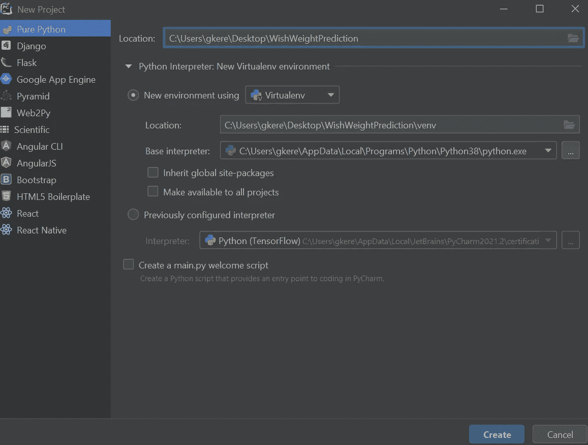
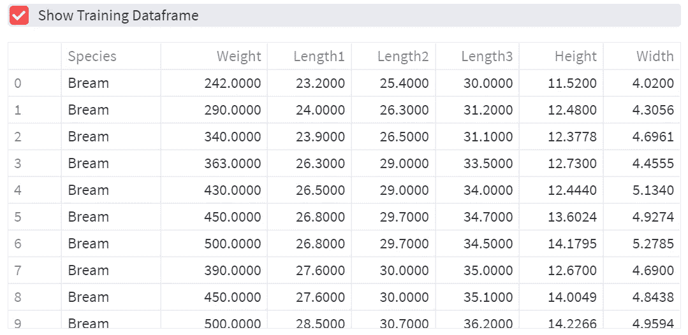
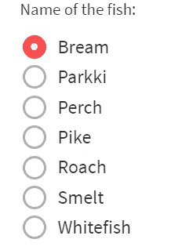
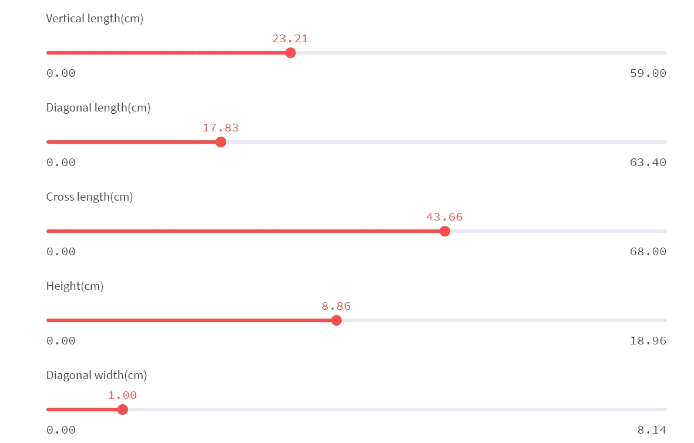
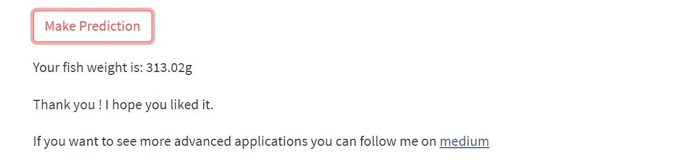
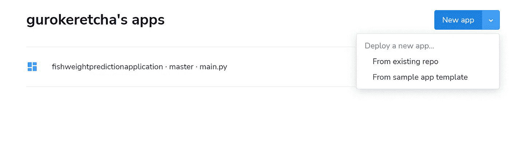

# 如何部署机器学习模型

> 原文：<https://towardsdatascience.com/how-to-deploy-machine-learning-models-601f8c13ff45?source=collection_archive---------2----------------------->

## 在网络上部署机器学习模型的最简单方法

## 介绍

我将介绍在 web 上部署机器学习应用程序的最简单的方法。在之前的笔记本中，我已经使用[线性](/fish-weight-prediction-regression-analysis-for-beginners-part-1-8e43b0cb07e)和[基于树的](/regression-analysis-for-beginners-using-tree-based-methods-2b65bd193a7)模型建立了机器学习模型。事实证明，经过超调优的 XGboost 模型表现最佳。这就是为什么今天我们将使用 XGboost 构建一个鱼体重预测 web 应用程序。一般来说，部署 ML 模型有不同的选项，比如 Flask、Django、Streamlit 等。今天我将使用 Streamlit，因为这是最简单快捷的方法，而且不需要任何 web 开发知识。



ML 模型部署演示(作者供图)

∘ [简介](#5799)
∘ [鱼重预测应用](#03c7)
∘ [是怎么做到的？](#aaab)∘[结论:](#e217)

## 鱼体重预测应用

你可以在这里看到演示。

这里可以看到 GitHub 代码[。](https://github.com/gurokeretcha/FishWeightPredictionApplication)

## 怎么做到的？

有三个主要的 python 文件来构建应用程序。



作者照片

1.  [model.py](https://github.com/gurokeretcha/FishWeightPredictionApplication/blob/master/model.py) —构建 ML 模型并保存。

[2。prediction.py](https://github.com/gurokeretcha/FishWeightPredictionApplication/blob/master/prediction.py) —测试保存的 ML 模型。

[3。main.py](https://github.com/gurokeretcha/FishWeightPredictionApplication/blob/master/main.py) —运行 web 应用程序的主文件。

为了自己构建和部署 ML 项目，需要遵循以下 7 个步骤。

第一步:使用 Pycharm IDE 创建一个新的虚拟环境。



Pycharm IDE，作者照片

第二步:安装必要的库。

在这里的 [requirements.txt](https://github.com/gurokeretcha/FishWeightPredictionApplication/blob/master/requirements.txt) 中，我创建了所有需要安装的库。您可以使用以下方式下载并安装该文件:

```
pip install -r /path/to/requirements.txt
```

或者您可以使用 pip 逐个安装每个库。

**第三步:建立最佳机器学习模型并保存。**

[model.py](https://github.com/gurokeretcha/FishWeightPredictionApplication/blob/master/model.py) 在这个文件中，我创建了一个机器学习模型，并保存为 JSON 文件 [best_model.json](https://github.com/gurokeretcha/FishWeightPredictionApplication/blob/master/best_model.json) 。

```
best_xgboost_model.save_model("best_model.json")
```

你可以在我的[上一篇文章中看到 ML 模型是如何构建的详细解释。](/regression-analysis-for-beginners-using-tree-based-methods-2b65bd193a7)

**第四步:测试加载的模型。**

[prediction.py](https://github.com/gurokeretcha/FishWeightPredictionApplication/blob/master/prediction.py) 在这个文件中，我测试了加载的模型，并使用。

```
np.save('classes.npy', label_encoder.classes_)
```

**第五步:创建 main.py 文件**

*   **步骤 5.1 导入库和数据集**

```
import streamlit as st
import pandas as pd
from sklearn.preprocessing import  LabelEncoder
import xgboost as xgb
import numpy as npst.header("Fish Weight Prediction App")
st.text_input("Enter your Name: ", key="name")
data = pd.read_csv("fish.csv")
```

*   **步骤 5.2:加载保存的标签编码器类**

```
encoder = LabelEncoder()
encoder.classes_ = np.load('classes.npy',allow_pickle=True)
```

*   **步骤 5.3:加载保存的最佳模型**

```
# load model
best_xgboost_model = xgb.XGBRegressor()
best_xgboost_model.load_model("best_model.json")
```

*   **步骤 5.4:在网页上显示数据帧**

如果复选框被选中，显示训练数据

```
if st.checkbox('Show dataframe'):
    data
```



作者照片

*   **步骤 5.5:选择鱼种**

从所有鱼的独特值中选择鱼的名称。

```
st.subheader("Please select relevant features of your fish!")
left_column, right_column = st.columns(2)
with left_column:
    inp_species = st.radio(
        'Name of the fish:',
        np.unique(data['Species']))
```



作者照片

*   **步骤 5.6:使用滑动窗口选择每个特征值**

```
input_Length1 = st.slider('Vertical length(cm)', 0.0, max(data["Length1"]), 1.0)
input_Length2 = st.slider('Diagonal length(cm)', 0.0, max(data["Length2"]), 1.0)
input_Length3 = st.slider('Cross length(cm)', 0.0, max(data["Length3"]), 1.0)
input_Height = st.slider('Height(cm)', 0.0, max(data["Height"]), 1.0)
input_Width = st.slider('Diagonal width(cm)', 0.0, max(data["Width"]), 1.0)
```



作者照片

*   **步骤 5.7:制作预测按钮**

一旦用户点击该按钮，物种输入将从文本转换为相关的数字，然后所有输入的特征与特定的形状连接起来，模型预测就完成了！

```
if st.button('Make Prediction'):
    input_species = encoder.transform(np.expand_dims(inp_species, -1))
    inputs = np.expand_dims(
        [int(input_species), input_Length1, input_Length2, input_Length3, input_Height, input_Width], 0)
    prediction = best_xgboost_model.predict(inputs)
    print("final pred", np.squeeze(prediction, -1))
    st.write(f"Your fish weight is: {np.squeeze(prediction, -1)} Gram")
```



作者照片

**第六步:上传本地项目到 Github**

您可以使用 [git](https://git-scm.com/) 上传您的本地项目，或者您可以将文件夹拖放到 [GitHub](https://github.com/) 上的一个空存储库中。

**第七步:在** [**细流**](https://streamlit.io/) 上创建账户

最后一步是创建一个账户，点击“从现有的 repo”连接到你的 GitHub 库



Streamlit，作者照片

## 结论:

没错，就是洒脱。在一般建筑中，机器学习应用主要由两部分组成。第一步是构建模型，第二步是部署和监控模型。今天，我们已经使用 Streamlit 完成了部署部分。这个简单的应用程序只是说明了该模型是如何部署的，它可以作为其他大型项目的样本。在下一篇文章中，我还将尝试使用另一种方法来部署 ML 模型。

如果你想了解更多关于**应用数据科学**的信息，这里是**我的新 YouTube 频道**——[AI 学院与朋友](https://www.youtube.com/channel/UCvlF0PPaQ2GAuqYKJT4UpJQ)

[](https://www.youtube.com/channel/UCvlF0PPaQ2GAuqYKJT4UpJQ) [## 和朋友一起的 AI 学院

### 与朋友、家人和全世界分享您的视频

www.youtube.com](https://www.youtube.com/channel/UCvlF0PPaQ2GAuqYKJT4UpJQ) 

> 我希望你喜欢它，现在可以开始自己创建漂亮的应用程序。
> 
> 如果你喜欢我的文章，想看即将到来的故事，请在 [medium](https://medium.com/@gkeretchashvili) 上关注我。

[](https://medium.com/@gkeretchashvili) [## gurami keretcashvili-培养基

### 一个数据科学家不是懂 python，Sklearn，TensorFlow 等的人。但是谁知道如何玩…

medium.com](https://medium.com/@gkeretchashvili)