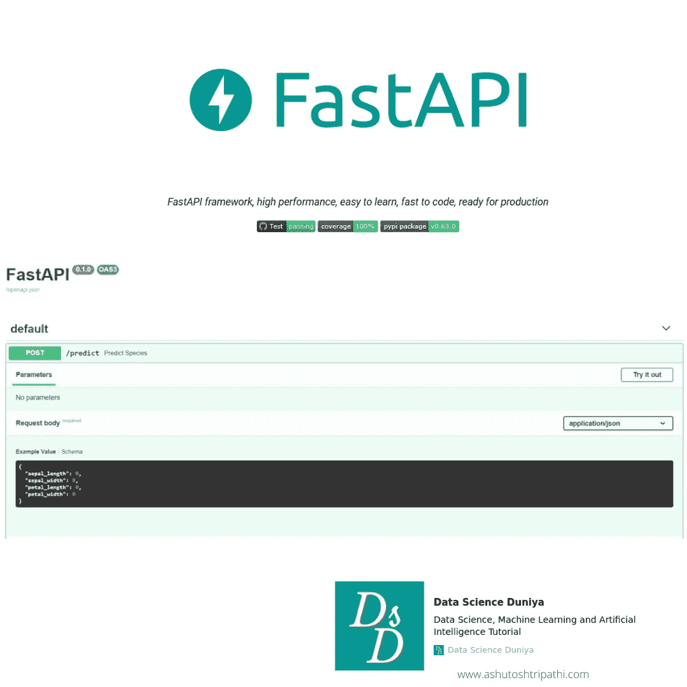
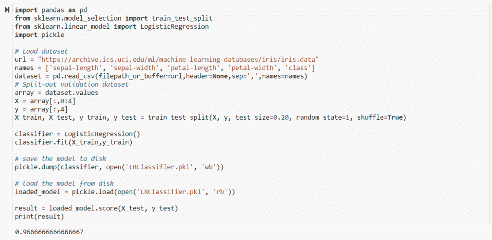
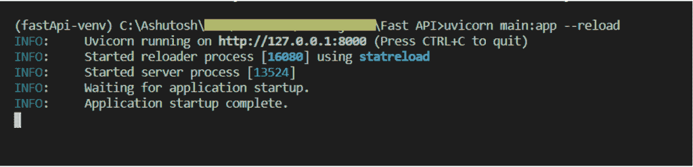
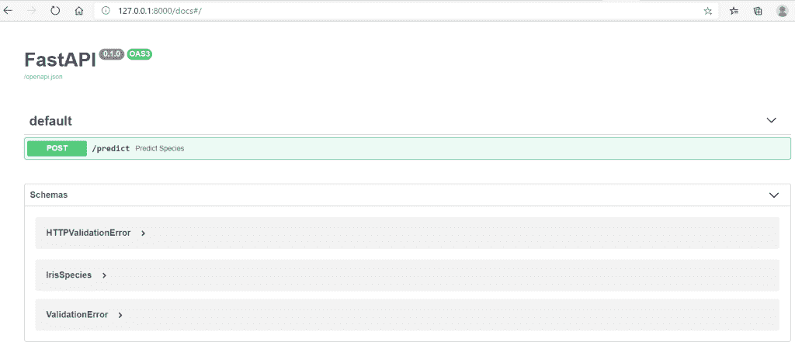
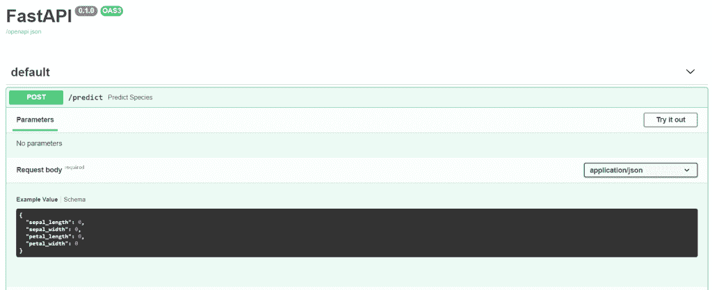
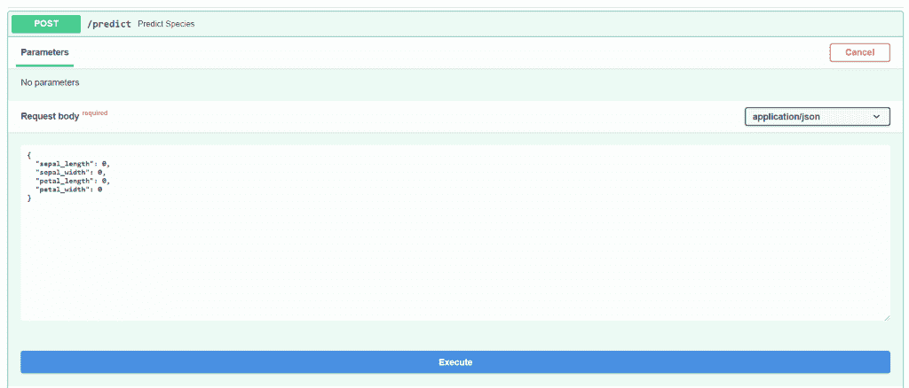
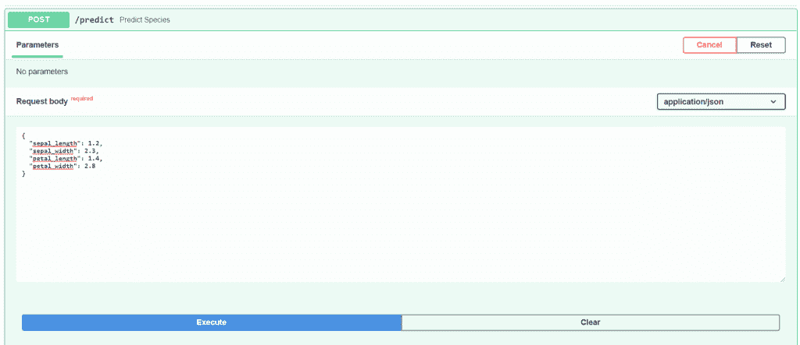
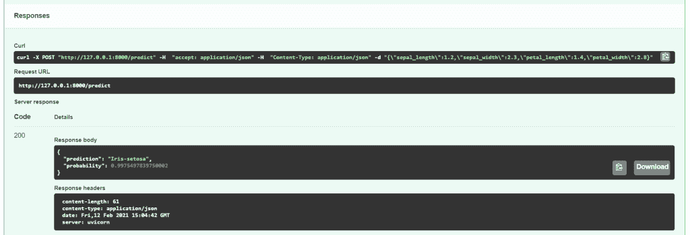
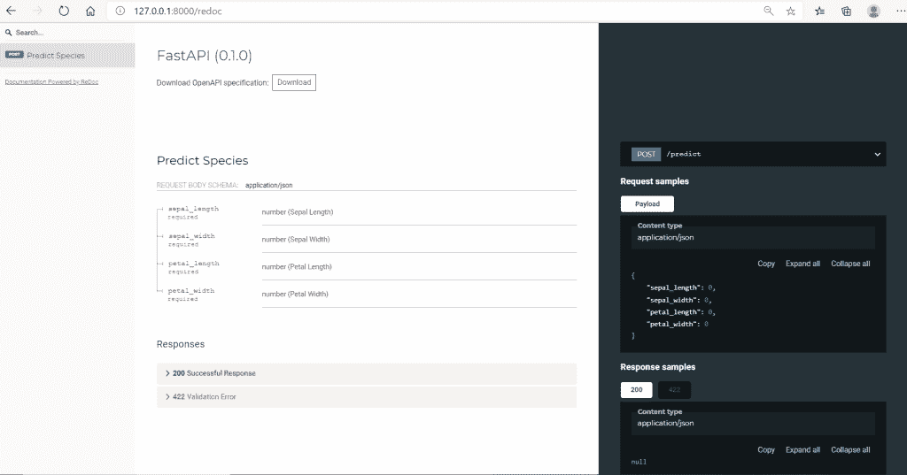

# 如何使用 FastAPI 将机器学习模型部署为微服务

> 原文：<https://towardsdatascience.com/how-to-deploy-machine-learning-models-as-a-microservice-using-fastapi-b3a6002768af?source=collection_archive---------8----------------------->



使用 FastAPI 实施微服务| Ashutosh Tripathi | Data Science Duniya

截至目前，FastAPI 是使用 python 3.6+版本构建微服务的最流行的 web 框架。通过将机器学习模型部署为基于微服务的架构，我们使代码组件可重用、高度维护、易于测试，当然还有快速响应时间。FastAPI 是基于 ASGI(异步服务器网关接口)而不是 flask 的 WSGI (Web 服务器网关接口)构建的。这就是它比基于 flask 的 API 更快的原因。

它有一个数据验证系统，可以在运行时检测到任何无效的数据类型，并以 JSON 格式向用户返回错误输入的原因，这使得开发人员不必显式地管理这个异常。

在这篇文章中，我们的目标是在 FastAPI 的帮助下，将机器学习模型部署为微服务。所以我们会把重点放在那部分，而不是放在模型训练上。

github repository 中也提供了完整的源代码。你会在文章的末尾看到资源库的链接。

# 第一步。准备好您想要为其创建 API 的模型

为了创建用于预测的 API，我们需要准备好模型，因此我编写了几行代码来训练模型，并将其作为 LRClassifier.pkl 文件保存在本地磁盘中。我没有关注探索性的数据分析、预处理或特性工程部分，因为这超出了本文的范围。

```
import pandas as pd
from sklearn.model_selection import train_test_split
from sklearn.linear_model import LogisticRegression
import pickle# Load dataseturl = "[https://archive.ics.uci.edu/ml/machine-learning-databases/iris/iris.data](https://archive.ics.uci.edu/ml/machine-learning-databases/iris/iris.data)"names = ['sepal-length', 'sepal-width', 'petal-length', 'petal-width', 'class']dataset = pd.read_csv(filepath_or_buffer=url,header=None,sep=',',names=names)# Split-out validation datasetarray = dataset.valuesX = array[:,0:4]y = array[:,4]X_train, X_test, y_train, y_test = train_test_split(X, y, test_size=0.20, random_state=1, shuffle=True)classifier = LogisticRegression()classifier.fit(X_train,y_train)save the model to diskpickle.dump(classifier, open('LRClassifier.pkl', 'wb'))load the model from diskloaded_model = pickle.load(open('LRClassifier.pkl', 'rb'))result = loaded_model.score(X_test, y_test)print(result)
```

Jupyter 上面的代码片段:



逻辑回归 python 代码片段

# 第二步。使用 FastAPI 框架创建 API

从头开始，这样就不会出现任何错误:

*   打开 VS 代码或者你选择的其他编辑器。我使用 VS 代码
*   使用文件菜单可以打开您想要工作的目录
*   打开终端并创建虚拟环境，如下所示:
*   python -m venv venv 名称
*   使用 venv-name\Scripts\activate 激活 venv

**安装库:**

*   pip 安装熊猫
*   pip 安装数量
*   pip 安装 sklearn
*   pip 安装 pick
*   pip 安装 FastAPI

导入库，如下面的代码所示。

*   创建一个`FastAPI`“实例”并将其分配给 app
*   这里的`app`变量将是`FastAPI`类的一个“实例”。
*   这将是创建所有 API 的主要交互点。
*   这个`app`就是下面命令中`uvicorn`所指的那个:


*   这里 main 是你写代码的文件的名字。您可以给出任何名称，但必须是在命令中代替 main 执行时使用的名称。
*   当您需要从客户端(比如说浏览器)向您的 API 发送数据时，您将它作为**请求体**发送。
*   一个**请求**主体是客户端发送给你的 API 的数据。一个**响应**体是你的 API 发送给客户端的数据。
*   您的 API 几乎总是要发送一个**响应**主体。但是客户端不一定需要一直发送**请求**体。
*   为了声明一个**请求**体，你使用 [Pydantic](https://pydantic-docs.helpmanual.io/) 模型及其所有的能力和好处。
*   然后将数据模型声明为从`BaseModel`继承的类。
*   对所有属性使用标准 Python 类型。
*   在我们的例子中，我们希望预测鸢尾物种，因此将创建一个数据模型作为具有四个参数的类，这四个参数是物种的维度。
*   现在创建一个端点，也称为名为“预测”的路由
*   添加一个我们创建的数据模型类型参数“IrisSpecies”。
*   现在，我们可以将数据作为 json 发布，它将在 iris 变量中被接受。
*   接下来，我们将在变量 loaded_model 中加载已经保存的模型。
*   现在，按照我们在机器学习中的方式执行预测，并返回结果。
*   现在你可以运行这个应用程序，并看到 FastAPI 创建的漂亮的用户界面(UI ),它使用现在称为 openAPI 的 Swagger 作为后端来设计文档和 UI。
*   下面给出了完整的代码，你可以简单地复制和粘贴，它将工作，如果你遵循上述步骤正确。

```
from fastapi import FastAPI
from pydantic import BaseModel
import pickle
import numpy as np
import pandas as pdapp = FastAPI()class IrisSpecies(BaseModel):sepal_length: floatsepal_width: floatpetal_length: floatpetal_width: float@app.post('/predict')async def predict_species(iris: IrisSpecies):data = iris.dict()loaded_model = pickle.load(open('LRClassifier.pkl', 'rb'))data_in = [[data['sepal_length'], data['sepal_width'], data['petal_length'], data['petal_width']]]prediction = loaded_model.predict(data_in)probability = loaded_model.predict_proba(data_in).max()return {'prediction': prediction[0],'probability': probability}
```

VS-API 创建的代码片段:


执行应用程序:



现在，如果您可以看到通过输入 url 创建的漂亮的 UI:[127 . 0 . 0 . 0:8000/docs](http://127.0.0.0:8000/docs)

下面您会看到 API 端点是作为 POST 请求创建的。



点击终点，它将展开如下。



现在点击尝试一下，粘贴尺寸得到预测。



我粘贴了一些虚拟尺寸，然后点击执行。



现在你可以看到它已经以 99%的准确率预测出它是鸢尾花。



您可以从任何地方直接调用这个 api，如下所示:

```
import requestsnew_measurement = {"sepal_length": 1.2,"sepal_width": 2.3,"petal_length": 1.4,"petal_width": 2.8}response = requests.post('[http://127.0.0.1:8000/predict](http://127.0.0.1:8000/predict)', json=new_measurement)print(response.content)>>> b'{"prediction":"Iris-setosa","probability":0.99}'
```

所以这就是使用 FastAPI 创建 API 的全部内容。

FastAPI 还提供了自动创建的精美文档。只需在浏览器中输入 [127.0.0.0:8000/redoc](http://127.0.0.0:8000/redoc)



[Github 资源库包含完整的源代码，请点击此处。](https://github.com/TripathiAshutosh/FastAPI)

本文到此为止。希望你喜欢阅读。分享您对 FastAPI 体验的想法。此外，您可以使用注释来询问在实施过程中是否有任何问题。

由于您已经到达这里，这表明您对机器学习模型部署感兴趣，因此为什么不也阅读这篇文章呢:

## [可能让你损失惨重的 5 个模型部署错误](https://neptune.ai/blog/model-deployment-mistakes)

推荐文章:

*   [使用 Python |机器学习构建逻辑回归模型的分步指南](https://ashutoshtripathi.com/2020/09/26/a-step-by-step-guide-to-logistic-regression-model-building-using-python-machine-learning/)
*   [主成分分析完全指南——机器学习中的 PCA](https://ashutoshtripathi.com/2019/07/11/a-complete-guide-to-principal-component-analysis-pca-in-machine-learning/)
*   [K-最近邻算法完全指南——使用 Python 实现 KNN](https://ashutoshtripathi.com/2019/08/05/a-complete-guide-to-k-nearest-neighbors-algorithm-knn-using-python/)
*   [参考 Python 笔记本，了解适合初学者的重要 ML 算法](https://ashutoshtripathi.com/reference-python-notebook-for-important-ml-algorithms-for-the-beginners/)

*原载于 2021 年 2 月 15 日 http://ashutoshtripathi.com*[](https://ashutoshtripathi.com/2021/02/15/how-to-deploy-machine-learning-models-as-a-microservice-using-fastapi/)**。**