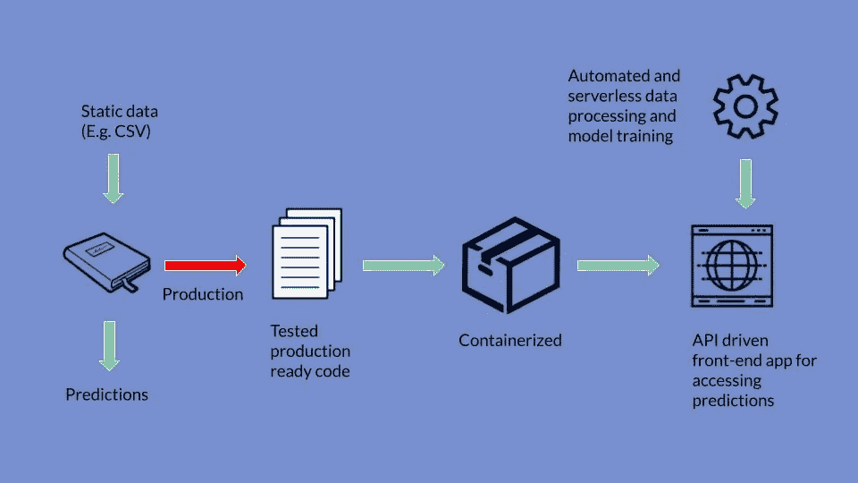
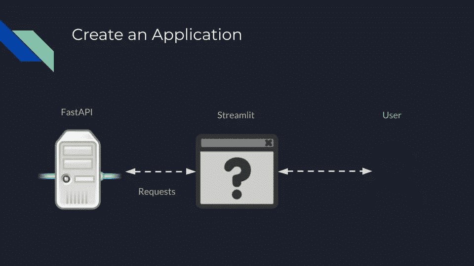

# 如何部署机器学习模型

> 原文：<https://towardsdatascience.com/how-to-deploy-machine-learning-models-ec50d3daf365?source=collection_archive---------5----------------------->

## 逐步概述

作者创建的图像

Jupyter 笔记本是机器学习模型死亡的地方。

等等——什么？

与你可能在大学里学到的不同，在 Jupyter 笔记本或 R Studio 脚本中构建模型只是这个过程的开始。如果你的流程以笔记本中的模型结束，那么这些模型几乎肯定不会为你的公司创造价值(有些例外可能是它只用于分析或者你在网飞工作)。

这并不意味着你的模型不优秀。我肯定他们是。但这可能确实意味着付钱给你的人对结果并不超级兴奋。

一般来说，公司不关心最先进的模型，他们关心的是真正为客户创造价值的机器学习模型。

从笔记本中的优秀模型到可以集成到产品的一部分或由非技术用户访问的模型的过程是我在这篇文章中想要谈论的。

所以，如果你想让你的模型不再死在笔记本上，并真正创造价值，请继续读下去。

# 模型是代码，代码需要被信任

您的第一步将是让您的代码达到一个您可以放心投入生产的质量水平。我想强调这一步中应该发生的 3 件重要的事情:有一个好的自述文件，编写干净的函数，测试你的代码。

好的读物非常重要。他们应该允许任何人(包括你自己)容易地看到为什么写这个代码，做了什么假设，存在什么约束，以及如何使用代码。对于机器学习代码，你还应该描述和/或链接到已经运行的实验，这样人们就可以查看创建你的模型的过程。不要害怕在你的阅读材料中加入图片、gif 和视频。它们有助于更容易理解。

这篇文章不会教你写干净的函数所需要知道的一切。但是需要记住一些重要事项:

*   使用易于理解的函数和变量名
*   函数应该只做一件事
*   包括文档和使用类型
*   使用 PEP8 等风格指南

最后，但同样重要的是，您需要测试您的代码！测试可以让你确信你的代码如预期的那样运行，并且当你进行修改时，你实际上没有破坏任何东西。最简单的起点是单元测试。对于 Python，查看 pytest 和 unittest 库来管理您的测试。

# **将你的代码容器化**

你可能听说过 Docker。Docker 是迄今为止开发人员最流行的封装代码的方式。但是 Docker 是什么？Docker 在其网站上声明:

> 容器是一个标准化的软件单元，它允许开发人员将他们的应用程序从环境中隔离出来，解决了“它在我的机器上工作”的头痛问题。对于今天数百万的开发者来说，Docker 是构建和共享容器化应用的事实标准。

Docker 是一种容器化你的应用程序的方式，容器化将你的应用程序从它的环境中隔离出来。简单地说，这意味着如果你能让你的代码在本地机器上的 Docker 中运行，那么它应该能在任何地方运行。这一点变得越来越重要，因为许多人转向 AWS 等云提供商来部署他们的应用程序。

首先，下载 Docker，创建一个 Docker 文件，告诉 Docker 如何为您的应用程序构建环境，从您的 Docker 文件构建您的 Docker 映像，最后运行您的 Docker 映像。

每一个步骤都有些复杂，但是只要看看 Docker 网站上的入门教程，你就能很好地将代码装入 Docker。

# 使您的模型易于访问

作者创建的图像

你现在有了干净的、容器化的代码，但是没有简单的方法让你的用户与你的机器学习模型交互。

解决这个问题最简单的方法是将你的模型放在一个 API 后面，并通过一个网页公开它。

应用程序接口(API)是一种允许应用程序与您的代码(在我们的例子中是模型)进行交互的方式。例如，如果您为一个分类模型创建一个 API，那么您的 API 将接收必要的数据来进行预测(通常是 JSON 格式的)，然后返回基于这些数据的预测。API 有用的原因有很多，但最重要的一个原因是它在代码和用户界面之间建立了分离。您通常通过 web 请求与 API 进行交互。

Python 有两个很棒的库，让这个过程变得非常简单。首先，FastAPI 使得为您的模型创建 API 变得非常简单。其次，Python 中的请求库使得与 API 的通信变得容易。

一旦有了模型的 API，就需要为用户创建一个前端应用程序。许多数据科学家害怕这一步，因为他们对如何创建网站知之甚少或一无所知。还好有解决的办法！Streamlit Python 库。Streamlit 是一个库，允许您在不了解任何网站创建知识的情况下用 Python 创建 web 应用程序。他们也有很棒的文档，所以去看看，开始为你的模型构建你的 web 应用程序。

至此，您已经有了后端 API 代码、前端 web 应用程序和连接两者的 web 请求。将这些作为单独的应用程序，使用 Docker 进行容器化。

# 部署到云

到目前为止，您的所有工作都是在本地机器上完成的。如果事情进展顺利，您的机器上运行着一个前端 web 应用程序，允许您访问您的机器学习模型预测。

但问题是，只有*你*可以访问这个网络应用！

为了解决这个问题，我们将把你的应用程序部署到云中，因为你已经把你的代码容器化了，这个过程实际上非常简单。

三个主要的云提供商是 AWS、谷歌云和微软 Azure。它们都提供了非常相似的功能，对于学习来说，你不会真的挑错。我建议你选择目前免费额度最多的云。

无论您选择哪种云，我都会首先关注他们的平台即服务产品。谷歌有谷歌应用引擎，亚马逊有弹性豆茎，微软有 Azure 应用服务。所有这些服务都让您可以轻松地将 Docker 容器部署到云上。

一旦您的 web 应用程序和 API 容器部署到这些平台，您将拥有一个公共 URL，您或任何人都可以访问它来与您的机器学习模型进行交互。恭喜你！

# 如何了解更多

我希望这篇关于如何部署机器学习模型的概述能够帮助您理解部署模型的基本步骤。当谈到这个过程时，几乎有无限的复杂性，如果你想获得更深入的概述，请查看这个[免费课程](https://bit.ly/3ltZA4s)。